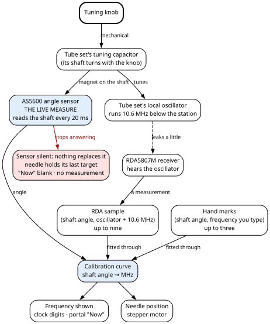
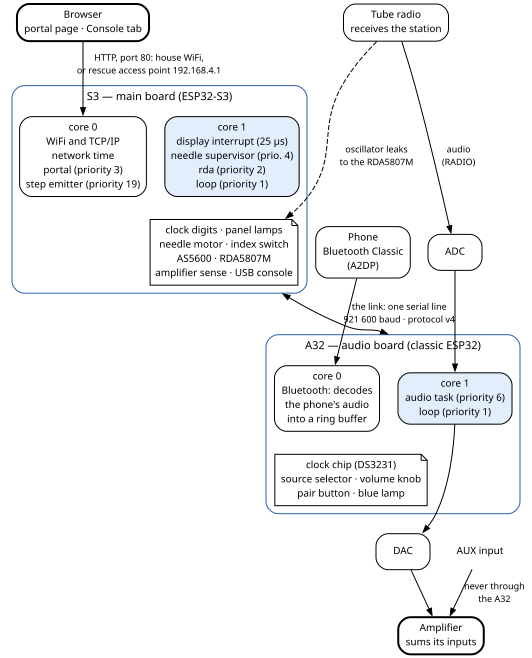
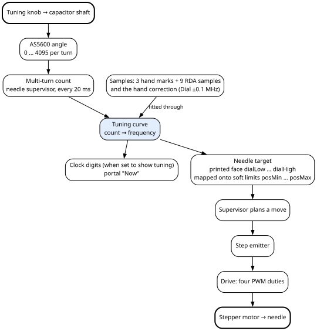
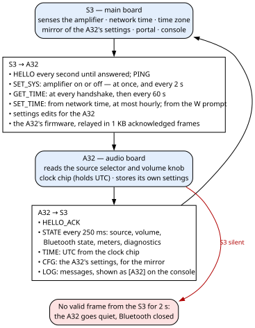

# 2. The machine at a glance

This chapter is the map. It names the parts, shows where each piece of firmware runs and how
information moves between them, lists every source file, and tells you which chapter to open for
what. Read it once before the chapters that follow. Everything here is explained in full later; each
section says where.

## 2.1 What the machine is

Ambersong is a cabinet radio built around a tube radio, the LLOYDS TM-838N, which still does the
receiving. Its original tuning knob still turns the tube set's own tuning capacitor. Around it, two
small computers add what the old set never had:

- a four-digit amber clock behind the dial glass, called the **Leditron**;
- a dial needle moved by a stepper motor instead of a cord;
- panel lamps that follow what the listener does;
- Bluetooth music from a phone;
- a battery-backed clock;
- a password-protected web page, the **portal**, that shows and changes everything.

The radio has no configuration buttons. Once the cabinet is closed, the portal is the only way in.
What is physically fitted and wired is the subject of the Hardware Bible.

What a listener meets, from the front:

| Control | What it does | Chapter |
|---|---|---|
| **Front switch** | Turns the amplifier on and off. It does not start the computers: they run whenever the set is plugged in. | 4 |
| **Source selector** | Picks **RADIO** (the tube set, digitised and played back), **BT** (a phone) or **AUX** (an input that never passes through the audio board; the amplifier sums its inputs). | 10 |
| **Tuning knob** | Tunes the tube set. The needle follows it electrically (section 2.2). | 5, 6 |
| **Volume knob** | Read as a position sensor; it sets the digital volume. | 10 |
| **Pair button and blue lamp** | Open, and show, the Bluetooth pairing window. | 10 |

## 2.2 How the needle follows the knob

**Nothing mechanical joins the tuning knob to the needle.** The knob turns the tube set's ganged
tuning capacitor; a stepper motor moves the needle. The needle follows the firmware, and the firmware
is the only link between the two. Two sensors on the main board play two different parts:

- **The AS5600 is the live measure.** This magnetic angle sensor reads the angle of the tuning
  capacitor's shaft every 20 ms. It tells the firmware that the tuning changed, and where the shaft
  is. Through the **calibration curve**, that angle gives every frequency the machine shows, on the
  clock digits and on the portal. It also gives every position the needle takes while it follows the
  tuning.
- **The RDA5807M calibrates the curve.** This small FM receiver chip listens to the tube set's **local
  oscillator**, the signal the set mixes with the station to receive it. The oscillator runs below
  the station, by the set's **intermediate frequency** (IF) of 10.6 MHz. So the firmware adds 10.6 MHz
  to the oscillator's frequency to get the station, and stores the pair (shaft angle, station) as a
  calibration sample. The curve is fitted through these samples and the hand marks you type. A
  measurement changes the curve. It is never shown as the frequency, and it never moves the needle by
  itself.
- **If the AS5600 stops answering, nothing takes its place.** The shaft count freezes. The needle
  stops following the knob and holds its last target. The portal's **Now** frequency goes blank, a
  clock set to show the tuning all the time keeps the last value, and no measurement is started or
  stored. When the sensor answers again, the angle is placed back on the right turn and everything
  follows again.

Chapter 5 covers the needle. Chapter 6 covers the curve and how the RDA5807M measures.

## 2.3 Two boards, and why two

| | **The S3** (main board) | **The A32** (audio board) |
|---|---|---|
| Chip | ESP32-S3 | classic ESP32 (an ESP32-WROOM-32) |
| Looks after | the Leditron, the panel lamps, the needle and its motor, the tuning-angle sensor (AS5600), the RDA5807M used as a dial instrument, amplifier sensing, WiFi, the portal, network time, firmware updates for both boards | all the audio: the tube set's audio in (ADC), the audio out (DAC), Bluetooth, the source selector, the volume knob, the pair button and blue lamp, the DS3231 clock chip |
| Source folder | `src/s3/` | `src/a32/` |
| Keeps in its flash | settings for the display, lamps, needle and tuning; the WiFi network; the portal accounts | settings for the audio and Bluetooth; the volume knob's calibration |

**Why two.** Music from a phone needs **Bluetooth Classic** (the A2DP profile), and the ESP32-S3 does
not have it. So the audio runs on a classic ESP32, and everything else on the S3. The split also keeps
two strict timings apart. On the A32, Bluetooth audio runs through the classic ESP32's legacy I2S
audio driver. On the S3, the needle's step emitter, the task that sends the motor its steps, runs at
priority 19 and must not be starved (section 2.4 explains tasks and priorities). Neither tolerates
the other's timing.

**What follows from the split.** The A32 has no road to the outside except through the S3. It has no
web portal of its own, and there is no reset wire from the S3 to it. Its firmware updates are relayed
by the S3 over the **link**, the serial line between the two boards. The clock chip sits on the A32,
so the time of day crosses the link too.

> **For firmware changes**
>
>
> **One project, two programs.** A single PlatformIO project builds both. The pin map and the protocol
> between the boards are one set of files compiled into both programs, so the two cannot disagree
> about them by accident.
>

**Each board looks after itself.**

- Both run a 15-second **task watchdog**, which turns a hang into a restart.
- Both run a program freshly updated over the air **on trial**, and go back to the previous program
  by themselves if it resets before it has proved itself (chapter 3).
- Each has its own rule for the other's silence. The A32 goes quiet — no sound, Bluetooth closed —
  within 2 seconds of hearing nothing from the S3. The S3 keeps its clock and needle running, and
  keeps calling.

Chapter 4 covers the S3's start-up and watchdog; chapter 9 the A32 and the link.

## 2.4 What runs where

A **task** is one thread of the firmware, scheduled by the chip's real-time system. Each ESP32 has two
**cores**, 0 and 1. A task with a higher **priority** runs first on its core. The **task watchdog**
restarts the board when a watched task stops reporting in for 15 seconds.

> **For firmware changes**
>
>
> The table lists every task on both boards: its core, its priority, how often it runs, and whether the
> watchdog watches it.
>
> | Board | Task | Core | Priority | Runs | What it does | Watched |
> |---|---|---|---|---|---|---|
> | S3 | display interrupt | 1 | interrupt | every 25 µs | Multiplexes the four clock digits. Register writes only; it must never block. | — |
> | S3 | `loopTask` (the main loop) | 1 | 1 | pass after pass, with no pause between them | The link to the A32, amplifier sense, what the digits show, brightness, panel lamps, time, the network state machine, the console, the RDA and re-index triggers. | yes |
> | S3 | `needle` (supervisor) | 1 | 4 | every 5 ms | Plans the needle's moves. Reads the AS5600 angle every 20 ms, and its status every 500 ms. | yes |
> | S3 | `rda` | 1 | 2 | every 100 ms when idle; at least 300 ms per point during a sweep | Runs the RDA5807M measurements. | no |
> | S3 | `nstep` (step emitter) | 0 | 19 | 1 kHz control tick | Emits the motor's steps. Spins between steps while the needle moves; sleeps when idle. | no |
> | S3 | `portal` | 0 | 3 | one pass, then sleeps 1 ms | The web server: accounts, every page request, firmware uploads, the web console, the portal's buttons. | no |
> | S3 | WiFi, TCP/IP, system timers | 0 (WiFi) | system | — | The network stack. Network time arrives here. | no |
> | A32 | audio task | 1 | 6 | no pause: paced by the audio hardware, one block of 256 frames (about 5.8 ms) per pass | Reads or fetches one block, applies gain, fade and volume, writes it to the DAC. | no |
> | A32 | Bluetooth | 0 | its own | as the phone's audio arrives, in bursts | Decodes the phone's audio and puts the samples in a ring buffer. | no |
> | A32 | `loop` (the main loop) | 1 | 1 | pass after pass | The link to the S3, sleep and wake, the selector and volume knob every 50 ms, the Bluetooth states and blue lamp, the STATE message every 250 ms, receiving firmware updates, the USB console. | yes |
>
> Stacks: S3 main loop 8192 bytes, `needle` 4096, `nstep` 4096, `portal` 8192, `rda` 3072; A32 audio
> task 4096. On the A32 the watchdog also watches the idle task of core 0.
>
> **On the S3**, the timing-critical work lives on core 1: the display interrupt, the main loop and the
> needle supervisor. WiFi, the portal and the needle's step emitter share core 0. The step emitter spins
> at priority 19 while the needle moves, so the portal is slow during a move. That is known and accepted:
> a needle stutter while the portal is in use is more forgivable than a stalled link or a glitched
> clock. The rules a modifier must keep are in chapter 4.
>
> **On the A32**, Bluetooth owns core 0, and the audio task runs on core 1 at priority 6, above the main
> loop, with no delay of its own. The audio path is set up once at start-up and never reinstalled. The
> Bluetooth library hands the decoded samples to the firmware instead of driving the audio output
> itself. Chapter 10 explains why.
>

**The one radio signal that matters to the firmware** is the tube set's local oscillator, because the
RDA5807M listens for it. The oscillator leaks a little from the tube set to the RDA5807M. The
station is the oscillator's frequency plus the IF, 10.6 MHz; the firmware's IF setting defaults to
10.60 MHz (chapter 6).

## 2.5 How information moves

**Tuning: from the knob to the needle and to megahertz.**

The needle has no end switches. One **index switch**, part-way along the travel, is its only
reference. The needle **homes** on it once at power-up, and corrects its step count every time it
crosses it. The tuning curve is fitted to up to twelve samples: three hand marks and nine RDA samples.
The radio takes an RDA sample by itself at most every five minutes, while you listen to the radio and
the knob is still. Once the nine are full, a new measurement replaces the most crowded automatic one,
so the samples stay spread across the dial; hand marks are never replaced. A hand correction (the
portal's **Dial ±0.1 MHz**) slides the whole curve and is never erased automatically. Chapters 5 and 6.

**Between the two boards.**

- **The front switch.** The S3 reads the amplifier's state, debounced over 50 ms. A change sets the
  clock's brightness (full or standby), the panel lamps, and the needle's job. The needle follows the
  knob while the radio is **live** — amplifier on and source RADIO — and otherwise falls to the low end
  of the dial and parks. The S3 tells the A32 at once, and again every 2 seconds. The A32 is **awake**
  only while the amplifier is on **and** the S3 is talking to it (chapters 4 and 9).
- **The source.** Only the A32 reads the selector, every 50 ms. On a change it fades the old source out
  (150 ms) and the new one in (1 second), and opens or closes Bluetooth. It reports the source to the
  S3 in its STATE message, its status report, four times a second. The S3 uses that report for the needle, the lamps and the
  tuning readout. While the link is down, the S3 takes the source as AUX (chapters 4 and 10).
- **Time.** The DS3231 clock chip on the A32 holds UTC. The S3 asks for it at every handshake and every
  60 seconds, and keeps its own software clock between answers, so a slow link never makes the display
  stutter. When the S3 is on a network, network time corrects the S3 and, once an hour, the DS3231. The
  time zone is applied only for display, on the S3. If the DS3231 answers with no valid time, or does
  not answer, a portal pill says so (chapters 4 and 9).
- **Settings.** Each board stores its own in flash. The S3 keeps a read-only copy, a **mirror**, of the
  A32's settings, so the portal can show them. It drops that copy when the A32 goes silent, and refuses
  edits to the A32's settings until the next handshake. A change on the portal applies at once and is
  written about two seconds later, once the needle is still. A change to an A32 setting travels over
  the link, and the A32 saves it. Neither board writes its settings while a freshly updated program is
  on trial (chapter 3). On both boards, only a write that reached flash counts as saved. The whole set
  can be downloaded and uploaded as one text file, which is the backup. The WiFi network and the portal
  accounts are stored apart, and are not in that file (chapter 7).
- **Updates.** The browser uploads a program to the S3. For itself, the S3 writes it into its other
  program slot and restarts; meanwhile the needle stops and the clock goes dark, while the sound
  carries on. For the A32, the S3 relays the file over the link in 1 KB acknowledged frames, and the
  sound stops while the A32 writes. Either board then runs the new program on trial until it confirms
  it, about a minute later. The two programs must share one protocol version. If they do not, a portal
  pill says so, and the main board must be updated first (chapter 3, section 3.13; chapter 9).
- **The console.** Everything the S3 prints goes both to its USB port and into a 16 KB ring that the
  portal's **Console** tab reads. Keys typed there are fed back as if typed on USB. The A32's messages
  reach the same console through the link, prefixed `[A32]` (chapter 8).

## 2.6 The source tree

> **For firmware changes**
>
>
> The firmware lives in the folder `firmware/`. Besides a README, a `.gitignore` and the Firmware Gospel itself, these are all its
> files. `src/s3/` builds into the S3's program and `src/a32/` into the A32's, while `include/` is
> compiled into both.
>
> | File | What it holds | Chapter |
> |---|---|---|
> | `platformio.ini` | The two build environments, `s3` and `a32`; the pinned platform and the pinned Bluetooth library. | 3 |
> | `include/pins.h` | Every pin number either program uses. | App. I |
> | `include/proto.h` | The protocol between the boards: `PROTO_VERSION`, the message types, the payload structures, the frame encoder and decoder. | 9, App. F |
> | `include/link.h` | The link over the serial line, the 2-second silence rule, and the protocol self-test. | 9 |
> | `src/s3/main.cpp` | The S3's start-up and main loop: the settings and their storage, the tuning-curve fit, the handling of the A32's messages, the A32 update relay, the portal's live state, the RDA and re-index triggers, the trial and the watchdog, the console keys and prompts. | 4 |
> | `src/s3/needle.cpp`, `needle.h` | The needle's two tasks: homing, tracking, parking, sweeps, index sensing, the index calibration, the AS5600 reads, and the memory kept across a software restart. | 5 |
> | `src/s3/drive.cpp`, `drive.h` | Turns a needle position into four PWM duties. | 5 |
> | `src/s3/display.cpp`, `display.h` | The Leditron's multiplexing interrupt. | 4 |
> | `src/s3/panel.cpp`, `panel.h` | The panel lamps' PWM and fades. | 4 |
> | `src/s3/rda.cpp`, `rda.h` | The RDA5807M as a dial instrument, and its task. | 6 |
> | `src/s3/net.cpp`, `net.h` | The WiFi state machine, the rescue access point and its captive-portal name server, the transmit-power ladder, network time, the `ambersong.local` name. | 8 |
> | `src/s3/portal.cpp`, `portal.h` | The web server task: accounts, sessions, every endpoint, firmware uploads. | 8 |
> | `src/s3/console.cpp`, `console.h` | The console's copy of every printed line, to USB and to the ring the portal reads. | 8 |
> | `src/s3/settings_api.h` | The settings-table row type and the calls the portal uses, so the portal never touches the settings directly. | 7 |
> | `src/s3/settings_table.h` | The table of every setting, the portal's actions, the settings-file export and import. | 7, 8 |
> | `src/s3/page_gz.h` | The portal page, compressed. It is made from `data/portal.html` at every S3 build (rewritten only when the page changed) and kept in git. Never edit it by hand. | 8 |
> | `src/a32/main.cpp` | The A32's start-up and main loop: the link, sleep and wake, the selector and volume knob, the Bluetooth policy and states, its settings, the update receiver, the trial and the watchdog, the boot report. | 9, 10 |
> | `src/a32/audio.cpp`, `audio.h` | The audio engine: I2S set up once, the audio task, gains, volume, fades, mute, the Bluetooth ring buffer. | 10 |
> | `src/a32/btled.cpp`, `btled.h` | The blue lamp's patterns. | 10 |
> | `src/a32/rtc.h` | Reading and writing the DS3231 clock chip. | 9 |
> | `data/portal.html` | The portal page's source: one file, with its style and script inline. | 8 |
> | `scripts/version.py` | Stamps each build with `FW_VERSION` and `FW_COMMIT`. | 3 |
> | `scripts/page.py` | Checks the page's script, compresses the page, and writes `page_gz.h`. | 8 |
>

## 2.7 Words used everywhere

| Word | Meaning |
|---|---|
| **S3**, **A32** | The main board (ESP32-S3) and the audio board (classic ESP32). |
| **the link** | The serial line between the two boards (chapter 9). |
| **portal** | The S3's web page. Its **Console** tab is a copy of the S3's console (chapter 8). |
| **pill** | A small status label in the portal's header (chapter 1, section 1.13). |
| **console** | The S3's text console: every key is one command (Appendix D). |
| **rescue access point** | The S3's own WiFi network, `Ambersong`, raised when it cannot reach the house network. It is open, with no password, and most phones open its sign-in page by themselves (chapter 8). |
| **amp on**, **radio live** | The amplifier is powered; the amplifier is on and the source is RADIO (chapter 4). |
| **homing**, **index**, **re-index** | Finding the needle's reference switch; that switch; homing again to repair lost steps (chapter 5). |
| **hs** | A half-step of the needle's motor, the unit of needle position (chapter 5). |
| **soft limits** | `posMin` and `posMax`, the ends of the needle's working travel, set by hand (chapter 5). |
| **local oscillator**, **IF** | The tube set's own oscillator, which runs below the station; the intermediate frequency, 10.6 MHz, the gap between them (chapter 6). |
| **hand mark**, **RDA sample** | A typed (angle, frequency) pair; a measured one (chapter 6). |
| **asleep**, **awake** | The A32's two states: silent and closed to phones, or playing (chapter 9). |
| **on trial**, **confirmed**, **rolled back** | A new program not yet proved; proved and permanent; thrown away by the bootloader for the previous one (chapter 3). |
| **NVS** | The ESP32's key-value store in flash, where settings live (chapter 7). |

## 2.8 Where to read what

| If you want to... | Read |
|---|---|
| Fix a misbehaving radio tonight | Chapter 1 |
| Build both programs, flash them, update them over the air (the A32 through the S3's relay), read the versions; trial and rollback | Chapter 3 |
| Understand the S3's start-up, its tasks, the clock display, the panel lamps, time keeping and the watchdog | Chapter 4 |
| Change how the needle moves, homes or recovers | Chapter 5 |
| Find the physical values of this machine that the firmware holds: needle travel, index, motor speed limits, tuner travel, the printed dial | Chapter 5 |
| Understand how the knob's angle becomes a frequency, and how the dial calibrates itself | Chapter 6 |
| Add or change a setting, or understand the settings file | Chapter 7, Appendix A |
| Work on WiFi, the portal, its security, or the console | Chapter 8, Appendices B to E |
| Understand the A32's start-up and the link protocol | Chapter 9, Appendix F |
| Work on the sound, the sources or Bluetooth, or read the story of the pops | Chapter 10, Appendices G and H |
| Know what the test tools proved, and how the firmware came to be | Chapter 11 |
| Find the known issues left as they are, and starting points for new work | Chapter 12 |
| Know what is soldered, wired or fitted | The Hardware Bible |
