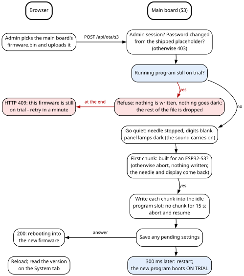
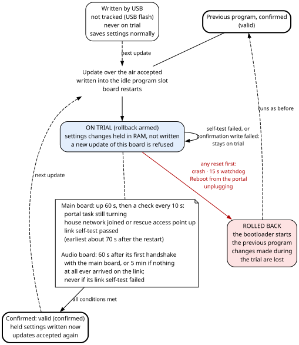

# 3. Building, flashing and updating

The firmware is one PlatformIO project that builds two programs: one for the S3, the main board, and
one for the A32, the audio board. This chapter tells you how to build both on a clean PC. It shows how
to put them on the boards the first time over a USB cable, and how to update them afterwards without a
cable, through the portal. It explains the version numbers each program carries, so that you can always tell
which program runs on which board and which source it was built from. And it is the one place in this
book that explains how a freshly updated program is put **on trial**, then **confirmed** or **rolled
back**; every other chapter points here.

## 3.1 Five things to remember

1. **The toolchain is pinned, and stays pinned.** The PlatformIO platform is `espressif32@7.0.1`.
2. **The only library, the Bluetooth library, is pinned to one exact commit** (section 3.3).
3. **Identify a board by its MAC address before you write anything to it.**
4. **Judge a build or an update by what the machine reports afterwards**, never by what a tool printed
   on the way.
5. **A program sent over the air runs on trial for its first minute or so.** If it hangs or resets
   before it has proved itself, the board goes back by itself to the program it had before. Neither
   board saves its settings during the trial; they are written once the new program is confirmed. A
   reboot from the portal during the trial is the way to take the new program back out.

## 3.2 The project and its two environments

The firmware lives in the folder `firmware/` (chapter 2, section 2.6 lists its files). Its
`platformio.ini` defines two build **environments**. An environment is PlatformIO's name for one
complete build recipe: target board, compiler flags, libraries and sources.

> **For firmware changes**
>
>
> The two environments differ as follows:
>
> | | `s3` | `a32` |
> |---|---|---|
> | Board definition | `esp32-s3-devkitc-1` | `esp32dev` |
> | Sources compiled | `src/s3/` | `src/a32/` |
> | Shared headers | `include/pins.h`, `include/proto.h`, `include/link.h` | the same three files |
> | Identity define | `-DAMB_S3=1` | `-DAMB_A32=1` |
> | Other defines | `-DBOARD_HAS_PSRAM`, `-DARDUINO_USB_CDC_ON_BOOT=1` | none |
> | Partition table | `default_16MB.csv` | `min_spiffs.csv` |
> | Libraries | none beyond the Arduino core | ESP32-A2DP, pinned to one commit |
> | Pre-build scripts | `scripts/version.py`, `scripts/page.py` | `scripts/version.py` |
>
> Both environments also get `-DCORE_DEBUG_LEVEL=3` (the Arduino core's warning-level logging), a serial
> monitor at 115 200 baud, and two monitor filters: `esp32_exception_decoder`, which turns a crash
> address into a function name, and `time`, which timestamps each line. No source file tests the two
> identity defines; each program is selected by its own source folder.
>
> The `build_src_filter` line decides which folder of sources goes into which program. The `include/`
> folder goes into both. That is the point of the single project. The pin map and the protocol between
> the boards are one set of files compiled into both programs, so the two boards cannot disagree about
> them by accident.
>
> **The S3's memory settings.** Four lines tell the Arduino core how the S3 module's flash and its
> external RAM (**PSRAM**) are connected: `board_build.arduino.memory_type = qio_opi`, `flash_mode = qio`,
> `psram_type = opi` and `flash_size = 16MB`. The module has 16 MB of quad-SPI flash and 8 MB of octal
> PSRAM (Hardware Bible, chapter 4). **Getting `memory_type` wrong fails silently:** the board boots normally and reports 0 MB
> of PSRAM. `ARDUINO_USB_CDC_ON_BOOT=1` sends the S3's console to the chip's own USB port, which is
> where the S3's back-panel USB-C socket leads (Hardware Bible, chapter 4). If that ever changes, the
> define must become 0, or the console goes nowhere visible.
>

The `s3` environment builds for Espressif's ESP32-S3-DevKitC-1 with those memory overrides. The board
fitted here runs it: it is compatible with the DevKitC-1 in firmware, and pin-compatible for every pin
the machine uses (Hardware Bible, chapter 4). The firmware relies only on the pins in `include/pins.h`
and on the memory type above. The A32 build is laid out for a 4 MB flash chip, because
`min_spiffs.csv` lays out 4 MB.

## 3.3 The two pins: the platform and the library

**The platform.** `platform = espressif32@7.0.1`. This PlatformIO platform release brings Arduino core
2.0.17, built on ESP-IDF 4.4.7, Espressif's own framework underneath Arduino. The next major Arduino
core, 3.x on ESP-IDF 5, retires the "legacy" I2S driver; I2S is the serial audio bus between the A32
and its converters. Without that driver, the Bluetooth library routes its audio through a second
library, AudioTools, instead of driving I2S directly.

The A32 runs three things at once on one chip: a Bluetooth audio receiver, audio capture from the
radio, and audio output. Its whole audio design rests on the legacy driver. One full-duplex I2S driver
is installed once and never reconfigured. The Bluetooth library is given an output that has no route
to I2S at all (chapter 10 explains why). Core 2.0.17 is the most-travelled road for that combination.
Official PlatformIO support for Espressif stopped at 7.0.1 (May 2024), so the pin costs nothing in
practice.

> **For firmware changes**
>
>
> If core 3.x is ever truly needed, the escape hatch is one line: point `platform` at the community fork
> `https://github.com/pioarduino/platform-espressif32`, and then expect to redo the A32's audio engine.
>

**The library.** The A32 depends on exactly one library, ESP32-A2DP by Phil Schatzmann, which turns the
classic ESP32 into a Bluetooth A2DP audio receiver (a "sink"). It is not in the PlatformIO registry
under a short name, so it is fetched from source with git, pinned to one commit (library version
1.8.11):

```
lib_deps = https://github.com/pschatzmann/ESP32-A2DP.git#3245602afc494f9e62160a0cfb2af864af45a37f
```

The pin matters because the A32 overrides one of the library's internal hooks. With it, only the A32's
own code decides whether the radio is visible to Bluetooth scans (chapter 10). An override of
internals is exactly what a silent library update breaks. Unpinned, a fresh clone or a deleted `.pio`
folder fetches whatever the library's main branch holds that day.

## 3.4 Version stamps and the build scripts

Two scripts run before every build. `scripts/version.py` stamps the version on both boards;
`scripts/page.py`, on the S3 only, packs the portal's web page into the program.

> **For firmware changes**
>
>
> Both scripts run before compilation (`pre:` in `extra_scripts`). The `s3` environment lists
> `version.py` a second time, because an environment's own `extra_scripts` replaces the common list
> instead of adding to it.
>

**`scripts/version.py` (both boards)** gives the compiler two strings:

- **`FW_VERSION`, the version stamp:** `v.<MAJOR>.<YYYYMMDDTHHMMSS>`, taken from the build PC's clock
  (local time, with no time zone in the string). Example: `v.1.20260926T101500`. MAJOR is a number
  typed into the script by hand (`MAJOR = 1`); it is `1` from the v.1.0 release on.
- **`FW_COMMIT`, the source stamp:** the 7-character short git hash of the commit checked out,
  followed by `-dirty` if any file that git tracks had uncommitted changes at build time. Files git does
  not track do not count. If git is not available, or the folder is not a repository, the value is
  `nogit`.

The script prints both at build time: `Ambersong firmware version: v.1.<stamp> (<hash>)`.

**Why two stamps.** The stamp is taken at build time, not from a file, because the question that
matters in the field is "which binary is this?". Two builds of the same source get different stamps
on purpose. The S3 updates the A32, so the two boards *will* run builds from different moments, and
the start-up handshake between them must be able to tell them apart. The commit hash answers the second
question, "which source?", and `-dirty` warns you when the hash alone would name code that is not what
was built.

**Why they are kept apart.** The version string travels between the boards inside the link's
handshake message, in a fixed 24-byte field. `v.1.` plus a 15-character timestamp is 19 characters and
fits. The version and the hash together would not fit, and widening the field would be a protocol
change. So `FW_COMMIT` is shown next to the version wherever a person reads it, and never travels on
the link as part of the version. The A32's commit reaches the S3 only inside the text of its boot
report (section 3.11.7).

If `version.py` did not run at all, both programs fall back to `FW_VERSION "v.0.unstamped"` and
`FW_COMMIT "nogit"`. Seeing `unstamped` on a running board means it was built outside PlatformIO's
normal flow.

> **For firmware changes**
>
>
> **`scripts/page.py` (S3 only)** turns the portal's single web page into C data:
>
> 1. It reads `data/portal.html`.
> 2. It checks that the page's one `<script>` block parses as JavaScript, with the Python package
>    `esprima`. If the script does not parse, **the build fails**. If `esprima` is not installed, it
>    prints `[WARN] esprima not installed - the portal's script was NOT checked.` and the build carries
>    on.
> 3. It compresses the page with gzip at level 9, with the gzip timestamp forced to zero (`mtime=0`).
> 4. It computes an **ETag**, a cache identifier that browsers send back to ask "has this changed?": the
>    first 16 hexadecimal digits of the SHA-256 of the compressed bytes.
> 5. It writes `src/s3/page_gz.h`, holding `PAGE_GZ[]` (the compressed page, in program memory),
>    `PAGE_GZ_LEN` and `PAGE_ETAG`. It rewrites the file only when its text changed, so an untouched page
>    does not force a rebuild.
>
> `src/s3/page_gz.h` is generated, but it is kept in git so that the source tree is always complete.
> **Never edit it by hand:** edit `data/portal.html` and rebuild. At v.1.0.3 the page was 35 886 bytes of
> HTML and 13 322 bytes compressed (37 %). The portal never reads a filesystem: the page lives inside the
> program. So there is nothing to upload separately, and nothing that can fall out of step with the
> firmware serving it. Section 3.16 gives the reason for each step; chapter 8 explains how the page is
> served.
>

## 3.5 Flash layout, and what survives a reflash

A **partition table** divides the flash chip into named regions. Both tables are stock files from the
Arduino core; the firmware does not ship its own.

> **For firmware changes**
>
>
> **S3, `default_16MB.csv` (16 MB flash)**
>
> | Name | Type / subtype | Offset | Size | Used for |
> |---|---|---|---|---|
> | nvs | data / nvs | 0x9000 | 0x5000 (20 KB) | settings, calibrations, network, accounts |
> | otadata | data / ota | 0xE000 | 0x2000 | which program slot boots |
> | app0 | app / ota_0 | 0x10000 | 0x640000 (6.25 MiB) | program slot 0 |
> | app1 | app / ota_1 | 0x650000 | 0x640000 (6.25 MiB) | program slot 1 |
> | spiffs | data / spiffs | 0xC90000 | 0x360000 | unused |
> | coredump | data / coredump | 0xFF0000 | 0x10000 | crash dump area |
>
> **A32, `min_spiffs.csv` (4 MB flash)**
>
> | Name | Type / subtype | Offset | Size | Used for |
> |---|---|---|---|---|
> | nvs | data / nvs | 0x9000 | 0x5000 | audio and Bluetooth settings |
> | otadata | data / ota | 0xE000 | 0x2000 | which program slot boots |
> | app0 | app / ota_0 | 0x10000 | 0x1E0000 (1.875 MiB) | program slot 0 |
> | app1 | app / ota_1 | 0x1F0000 | 0x1E0000 (1.875 MiB) | program slot 1 |
> | spiffs | data / spiffs | 0x3D0000 | 0x20000 | unused |
> | coredump | data / coredump | 0x3F0000 | 0x10000 | crash dump area |
>
> The `spiffs` partitions exist only because the stock tables contain them; this firmware never mounts
> them.
>

**Two program slots make an update over the air possible.** The running program writes the new
program into the slot it is not running from. It then tells the bootloader to start the other slot
next time. At v.1.0.5 the S3's program is 999 568 bytes, about 15 % of its slot; at v.1.0.4 the A32's is
1 218 608 bytes, about 62 % of its slot.

**NVS** ("non-volatile storage") is the ESP-IDF key-value store in flash.

> **For firmware changes**
>
>
> The firmware uses these NVS namespaces:
>
> | Board | Namespace | Holds |
> |---|---|---|
> | S3 | `amb3` | The settings: one versioned, append-only structure (magic `0xA838`, settings version 7; chapter 7). Also the learned WiFi transmit power (`wifiTxQ`), which is not in the settings file. |
> | S3 | `net` | WiFi network name and password, network time server, time zone. |
> | S3 | `auth` | Portal accounts, stored as salted SHA-256 hashes. |
> | A32 | `amb` | Audio and Bluetooth settings. |
>

The needle's remembered position is not in NVS. It lives in RAM that a software restart does not
clear, and a power cycle does (chapter 5).

**What survives what.** This table shows which ways of writing a board keep your settings.

| What you do | What it writes | Settings, calibrations, accounts, WiFi network |
|---|---|---|
| A normal PlatformIO upload over USB | The bootloader, the partition table, a fresh `otadata` (so the board starts slot 0), and the program into slot 0. | **Kept**: NVS is not touched. |
| A full chip erase (`pio run -t erase`, or `esptool.py erase_flash`) | Everything. | **Wiped.** |
| An update over the air | The new program into the idle slot; then the bootloader is told to start that slot next time. | **Kept**, and not written during the trial (section 3.11). |
| A change of partition table | Possible only over USB: the running program cannot rewrite the table it runs under. | Kept as long as NVS stays at 0x9000. |

## 3.6 Building from a clean PC

These steps were written on Windows. They work the same on Linux or macOS, with the obvious path
changes.

1. **Install git.** PlatformIO uses it to fetch the pinned library, and `version.py` uses it to read
   the commit hash.
2. **Install PlatformIO:** either VS Code with the PlatformIO IDE extension, or PlatformIO Core on its
   own. The `pio` command may not be on your `PATH`; on Windows it lives at
   `%USERPROFILE%\.platformio\penv\Scripts\pio.exe`.
3. **Install `esprima` into PlatformIO's own Python** (recommended). PlatformIO runs its own Python, so
   install the package there: `%USERPROFILE%\.platformio\penv\Scripts\pip install esprima`. Without it
   the portal's JavaScript is not checked (section 3.4).
4. **Get the `firmware/` folder**, ideally as a git clone, so that the commit stamp works. Nothing
   outside `firmware/` is needed to build.
5. **Build both programs**, from inside `firmware/`:

   ```
   pio run -e s3        # the main board
   pio run -e a32       # the audio board
   ```

   The first build downloads the pinned platform, Arduino core 2.0.17, the Xtensa compilers and the
   pinned library commit. That takes a while and needs internet access. Later builds work offline.
6. **Check the exit code, not the output.** `0` means built; anything else means not built, whatever
   the last lines on the screen say. In PowerShell read `$LASTEXITCODE`; in a POSIX shell, `$?`. A
   filter that searched the output for `SUCCESS` once hid a linker failure, and a pre-build script can
   fail before printing anything at all.
7. **Never let two builds use the same `.pio` folder at once.** Two builds compiling into one `.pio`
   produced that linker failure.
8. **Find the outputs** in `.pio/build/s3/` and `.pio/build/a32/`. `firmware.bin` is the program, the
   file you upload through the portal. `bootloader.bin` and `partitions.bin` go onto a board only in a
   USB upload.

## 3.7 Identify the board first

> **Warning — never write to a board you have not identified by its MAC address.** Every ESP32 has a
> factory-burned MAC address, unique to the chip. Keep a written list of your own boards' MAC
> addresses, and compare the target against that list before every write.

**Why.** A workbench often has several ESP32 boards plugged in, and boards of the same kind share the
same USB vendor and product numbers. PlatformIO's automatic port detection will happily pick the wrong
one. So never let PlatformIO choose the port: pass `--upload-port` every time.

**How to read a board's MAC address:**

- **A board on the chip's own USB port** (the S3 here). `pio device list` shows the MAC address directly
  as the serial number, `SER=xx:xx:xx:xx:xx:xx`.
- **A board behind a USB-to-serial bridge chip** (the A32 here, behind a CP210x bridge). The serial
  number that `pio device list` shows belongs to the bridge, not to the ESP32. Ask the chip itself:

  ```
  esptool.py --port COMx read_mac
  ```

  (`flash_id` also prints the MAC address, together with the flash size.) `esptool.py` ships with
  PlatformIO as the package `tool-esptoolpy`. Reading the MAC address resets the board into its ROM
  bootloader and back; it writes nothing.

**The same rule applies to updates over the air.** The portal is reached by a network address, and an
address is not an identity. Before an update, find the board's MAC address in the PC's ARP table
(`arp -a`), against the address the browser is about to use.

**A second rule travels with the first: never flash a machine while someone is listening to it or
looking at it.** A new program pushed into a machine under observation spoils the observation. The
person may not know why the behaviour changed.

## 3.8 The first flash, by USB

A blank board needs one USB flash. After that, both boards can be updated over the air through the
portal.

> **Danger — read the Hardware Bible's safety chapter before you connect a cable** (chapter 2, and the
> earth and grounds in chapter 5). The tube radio in this machine is tied to the mains. Read those
> chapters before you connect any cable from the machine to a mains-powered PC. The portal's console and
> its updates exist partly so that no cable is needed after the first flash.

```
pio device list                                     # find your S3 by SER=<its MAC>
pio run -e s3  -t upload --upload-port COMx         # the port you found, never automatic
esptool.py --port COMy read_mac                     # confirm the A32 is the board you mean
pio run -e a32 -t upload --upload-port COMy
pio device monitor -p COMx -b 115200                # the S3's console
```

Practical notes:

- On this machine both boards entered their download mode by themselves; no button presses were
  needed.
- The S3's console runs on its native USB port, which does not reset the chip when a monitor opens. You
  therefore miss the start-up banner. That is why the console key `s` prints the status and the command
  list. To see the banner, reset the board first (for example with `esptool.py --after hard_reset`),
  then open the monitor.
- A serial tool that opens the port with DTR and RTS asserted (the default of Python's `pyserial`)
  resets the board. It once made every reading show "uptime 1 s".
- The S3 has no wire to reset the A32. After its first USB flash, the A32's only update route over the
  air is the relay through the S3 (section 3.10.3); a USB flash remains the way to recover it.

## 3.9 The first boot

What the S3 does at start-up, step by step, is in chapter 4, section 4.2. Here is what a builder meets,
in order, on a factory-fresh pair of boards:

1. **No stored settings.** The compiled defaults apply (Appendix A lists them).
2. **No stored WiFi network.** The S3 raises its **rescue access point** at once: network name
   `Ambersong`, on channel 1, an open network with no password. Join it; on most phones the portal's
   sign-in page opens by itself. Otherwise open `http://192.168.4.1/`, or `http://ambersong.local/`.
   Set your house network from the portal's System tab, Network card, or with the console key `y`. If a
   stored network cannot be joined within 20 s, the rescue access point comes up and the house network
   is retried every two minutes. The transmit power starts at its lowest rung, 2 dBm, and climbs on
   failed joins; the ladder and its 15 dBm ceiling are in chapter 8, section 8.4.
3. **The placeholder portal account.** The firmware ships with a public placeholder account. While
   the stored account still matches it, the portal refuses everything except changing the password.
   Only `/api/boot`, `/api/state`, `/api/passwd` and `/api/logout` are let through. Every other request
   gets HTTP 403 `mustchg`, and the page shows only the change-password form. Both update endpoints
   refuse too. **Change the password first.** The console key `~` erases all accounts and restores the
   placeholder. An administrator can type it in the portal's Console tab; if nobody can sign in any
   more, the USB cable is the only way to type it. That is by design: there is no front-panel reset for
   a forgotten password (chapter 8).
4. **The clock.** The battery clock on the A32 keeps time, and network time corrects it once the S3 is
   online. The console key `W` sets it by hand. That prompt reads your input in a fixed eastern North
   American time zone, whatever the portal's time-zone setting (chapter 4, section 4.9). A new clock
   module may come up with no valid time. The portal then shows
   **BATTERY CLOCK LOST ITS TIME - check its battery** until the clock reports a valid time again. It
   is asked every minute.
5. **Needle calibration.** The needle has no end switches. Calibrate in this order:
   1. the band calibration (`k`) with the needle on its index sensor (it saves its result by itself);
   2. the soft limits (`m`, `M`);
   3. the tuner ends (`c`, `C`), which the firmware also uses at every boot to pick the turn of the
      tuning shaft;
   4. the dial marks.

   Chapter 5 explains each step.
6. **The dial's self-calibration.** With the set plugged in but its front switch off, sweep and mark the
   fixed spurs (`q`, `o`). With the front switch off, the amplifier, and with it the tube set, is off, so its
   oscillator is not running, and every peak the sweep finds is a fixed spur. Then switch the set on,
   select RADIO, and measure three positions spread across the dial (`V`, or **Measure
   this dial position** on the portal). From then on the radio keeps its own calibration up to date.
   Chapter 6 explains the method.

**The A32 at first boot** arms its 15-second watchdog as the very first step. It then runs its own link
self-test: a failure mutes it and keeps it off Bluetooth, but the board stays reachable for an update.
It loads its settings, reads the clock chip, and waits for the S3's HELLO message (chapter 9).

**A program written by USB is never on trial**, on either board. The S3's image line then reads
`not tracked (USB flash)`, and both boards save their settings normally from their first boot.

## 3.10 Updating over the air

The portal's **System** tab has two file pickers, one per board. Choose the matching `firmware.bin` and
upload it. Behind them are two HTTP endpoints, both taking a multipart file upload of `firmware.bin`:

| Endpoint | Target |
|---|---|
| `POST /api/ota/s3` | the S3 itself |
| `POST /api/ota/a32` | the A32, relayed by the S3 |

**To script an update**, sign in with `POST /api/login` (form fields `u` and `p`; the answer sets a
session cookie), then post the file to the endpoint with that cookie. Keep the credentials in
environment variables, never in the script.

**Do not trust the HTTP answer of an update that restarts the board.** Several transfers reported a
failure and had in fact landed. Confirm by reading the version after the restart (section 3.13).

### 3.10.1 What both endpoints check first

- **Administrators only.** Another account gets `403 admin only`.
- **Not with the placeholder password.** The shipped account gets
  `403 change the default password first`.
- **The right chip.** Bytes 12 and 13 of an ESP32 program image hold the chip number: `0x0009` for an
  ESP32-S3, `0x0000` for a classic ESP32. On the first chunk, each endpoint refuses an image built for
  the other chip, before anything is written. The two pickers sit side by side and the two files have
  the same name, so this mistake is easy to make.
- **The upload watchdog.** If no chunk arrives from the browser for 15 s, the S3 aborts the update and
  goes back to work. The web server does not reliably report a connection that died mid-upload, and a
  dead transfer once left the machine muted for four minutes.

### 3.10.2 Updating the S3



1. **Is the running program still on trial?** If it is, the update is refused (section 3.11.4). Nothing
   is stopped or darkened, and the bytes that keep arriving are dropped. The console prints
   `portal: S3 update refused - this image is still on trial.` At the end the page gets HTTP 409 with
   `{"e":"this firmware is still on trial - retry in a minute"}`. The browser still sends the whole
   file before that answer comes back.
2. **Otherwise the S3 streams the file into its idle program slot.** While it writes, it stops the
   needle where it is, blanks the clock digits and darkens the panel lamps. Writing flash suspends the
   processor's flash cache, which would make those animations stutter; fifteen dark seconds read better than
   fifteen ugly ones. **The sound keeps playing**, because it lives on the A32.
3. **On success** the S3 clears its "update in progress" flag and saves any pending settings (a failed
   save is reported as a warning). It answers `200 rebooting into the new firmware`, waits 300 ms and
   restarts.
   The new program boots on trial (section 3.11). The needle remembers its position across the restart
   and homes from there (chapter 5).
4. **If the upload fails and the S3 does not restart**, the needle and the display come back as they
   were (chapter 4, section 4.8). That happens on a wrong chip, an aborted or failed write, or 15 s
   without data.

### 3.10.3 Updating the A32 through the S3


The A32 cannot be reached by WiFi. The file goes to the S3 over WiFi. The S3 relays it to the A32 over
**the link**, the serial line between the boards (921 600 baud, framed and checksummed; chapter 9).
The S3 stores nothing: it is a pipe.

1. **Begin.** The S3 refuses with `the A32 is not answering` if the A32 has not said HELLO. The A32
   refuses with `still on trial - retry in 1 min` if its own running program is still on trial; the
   portal shows `A32: still on trial - retry in 1 min (err 0)`. Otherwise the A32 remembers your mute
   setting and mutes. It waits 400 ms for the fade and for its audio buffers to drain (chapter 9
   explains the figure), then opens its idle slot. Opening erases nothing; the slot is erased a sector at a time as
   the data is written. The S3 waits up to 20 s for this answer. **The S3 does not stop its needle or
   darken its display**, because it is not writing its own flash; the sound stops because the A32 is.
2. **The chip check.** It runs on the first chunk, after the begin, so the A32 has already muted. A
   file built for the S3 is aborted with `that image is not for the audio board (wrong chip) - nothing
   was written`, and the abort restores the A32's mute. A file that is not an ESP32 image at all (its
   first byte is not 0xE9) passes this check and is refused by the A32's updater instead (error 8,
   magic byte).
3. **Data.** The S3 cuts the upload into 1 KB frames, each carrying its offset and its length. The A32
   writes a frame only if it starts exactly where the image so far ends. It acknowledges every frame
   with the number of bytes it has actually written. The S3 moves on when the acknowledgement equals
   offset plus length. It sends the frame again when the acknowledgement equals the offset (a duplicate
   or a late acknowledgement lands here harmlessly). It gives up on anything else
   (`A32 is at X, we are at Y`). Each frame gets 4 tries of 3 s; four silences give
   `no answer at N bytes`.
4. **End.** The S3 sends the CRC32 checksum of the whole image. Neither the size nor the checksum is
   known at the start, because the upload is streamed. The A32 checks it (`crc mismatch` if it
   differs), finishes the update, switches its boot slot, answers `ok, rebooting` and restarts 250 ms
   later. The S3 waits 4 s for that answer. If it does not come, the portal says
   `the A32 did not confirm the update - check its version once it reconnects`. The A32 commits before
   it answers, so a lost answer can hide a good update. On success the page shows
   `<N> bytes sent, the A32 is rebooting`; on a failure, HTTP 500 with the reason.
5. **After the end**, the S3 forgets the A32's HELLO, so the next handshake shows the new version. The
   new program boots on trial (section 3.11).
6. **If frames stop arriving for 20 s**, the A32 gives up by itself (`the S3 stopped sending`) and
   restores your mute setting, not "unmuted". A begin that arrives while an update is already running
   is refused (`begin refused`), and the running update is given up the same way.

**A failed relay keeps the old program.** The reason reaches the page, including the A32 updater's
error number. The numbers are: 1 write, 2 erase, 3 read, 4 space, 5 size, 6 stream, 7 MD5, 8 magic byte, 9 activate, 10
no partition, 11 bad argument, 12 abort.

**The relay is slow on purpose:** about 16 KB/s; a full A32 program of 1.2 MB took 76 s. Each frame
waits for its acknowledgement, and each acknowledgement waits for a flash write. A transfer that cannot
tell whether it arrived is not worth having faster.

## 3.11 Trial, confirmation and rollback

**Rollback** means this: a freshly updated program runs **on trial**, and unless it **confirms** itself,
the bootloader goes back to the previous program at the next reset. Both boards work this way, and this
section is the one place in the book that tells the whole story.

The bootloader of the pinned core is built with application rollback. By default the Arduino core marks
every new program valid before the program's own start-up runs. A build that crashed or hung at boot
would then loop on itself until someone used the USB cable. Both programs instead tell the core "this
firmware confirms itself". A program written over the air therefore boots on trial. If the board resets
for any reason before the program is confirmed, the bootloader marks it invalid and starts the previous
one, which is still in the other slot.



### 3.11.1 How each board names the state

The S3 prints an **image line** at the end of its start-up and in the console's `s` status:
`image      : <state>, watchdog on|OFF`. The A32 puts the same state in its **boot report** (section
3.11.7).

| State | Meaning |
|---|---|
| `ON TRIAL (rollback armed)` | A new program sent over the air, not yet confirmed. |
| `valid` | A confirmed program. |
| `valid (confirmed)` | Shown after the program confirmed itself during this run. |
| `NEW - this bootloader has no rollback` | The bootloader did not arm the trial. |
| `not tracked (USB flash)` | A program written by USB. It is never on trial. |

Whenever the bootloader has marked an earlier program invalid, the line ends with
` - an earlier update was ROLLED BACK`.

### 3.11.2 What earns confirmation

| | S3 (main board) | A32 (audio board) |
|---|---|---|
| When it checks | Not before 60 s of running, then once every 10 s. The first check only takes a reading, so the earliest confirmation comes about 70 s after start-up; expect 70 to 90 s. | 60 s after its first handshake with the S3. |
| What it needs | **The portal task still turning** (its pass count has moved since the previous check); **a network up** (the house network joined, or the rescue access point up); **a passed link self-test**. | **A handshake with the S3** and **a passed link self-test**. If after 5 minutes nothing at all has ever arrived on the link — no valid frame and no damaged one — it confirms anyway. |
| What it never waits for | The A32 and the needle. | — |
| What it prints | `image confirmed (a minute of running, network and portal up).` | `[A32] image confirmed (a minute of running with the S3)`, or `(five minutes running, the S3 never spoke)` |
| If the confirmation itself fails | `image confirm FAILED (err N) - retrying`, again 10 s later. Until it succeeds, a reset still rolls back and updates are still refused. | The same message and the same retry. |

**Why the S3 asks only for a way in.** Confirmation asks for what the next update needs: a portal and a
network. A broken or absent audio board must not roll back a good main board, and a homing fault is
about the mechanism, not the build.

**Why the A32 waits a minute after the handshake.** The handshake arrives about a second after start-up,
before the A32 has woken, opened Bluetooth or played anything. Confirming there would accept a build that
crashes a moment later.

**Why the five-minute fallback.** It keeps a good A32 program from being thrown away just because the S3
was absent. It applies only when nothing at all arrived. A program whose link is broken in a way that
still produces bytes stays on trial: damaged frames, or valid frames that never include a HELLO. The
next reset then takes the old program back.

### 3.11.3 What ends a trial in a rollback

**Any reset before confirmation:**

- a crash;
- a hang caught by the 15-second task watchdog (chapter 4, section 4.11 for the S3; chapter 9 for the
  A32), or by the S3's interrupt watchdog;
- **Reboot the main board** or **Reboot the audio board** on the portal (section 3.11.6);
- a power cut, or unplugging the set.

The rolled-back board runs its previous program exactly as before. A crash, a watchdog reset and a
reboot count as software restarts. After a rollback on the S3 caused by one of them, the needle homes
from the position it remembered. After a power cut it is assumed at the low stop (chapter 4, section 4.10;
chapter 5).

### 3.11.4 No second update during a trial

While a board's program is on trial and not yet confirmed, **a new update of that board is refused**. The
new program would be written into the other slot, which holds the very program a rollback returns to.
A second bad build would leave nothing to fall back on.

- **The S3** decides on the first chunk. It darkens nothing, and the needle keeps running. The answer
  is HTTP 409 `this firmware is still on trial - retry in a minute`, but only after the browser has sent
  the whole file.
- **The A32** refuses at the begin, before anything is muted: `still on trial - retry in 1 min`.
- An A32 update is not affected by the S3's trial.

Wait for the `image confirmed` line, then upload again.

### 3.11.5 No settings are saved during a trial

**On the S3**, settings changed during the trial are applied at once, kept in RAM and marked unsaved. The
ordinary two-second save writes them on the first pass after the program is confirmed. The portal's
Save answers `NOT saved yet - this firmware is on trial after an update; settings are written once it
is confirmed (about a minute)`. The console prints
`save held - this firmware is on trial; settings are written once it is confirmed.` The WiFi network
and the portal accounts live in their own namespaces and are not held: they are saved at once, trial or
not.

**On the A32**, a change sent from the portal is applied at once and kept in RAM. The moment the
program is confirmed, the A32 writes it and sends `settings changed during the trial are now saved`.
The S3's console prints that as `[A32] ...` next to the confirmation line (it can come one line
before it). If that write fails, the A32's ordinary save retry takes over and says so (chapter 7).

**Why.** A new program may change the layout of the stored settings. On the S3 it migrates the stored
settings when it starts. Had it written them and then been rolled back, the previous program would find
a layout newer than it knows, and lock its settings (**SETTINGS LOCKED**, chapter 7). The A32 keeps a
stored settings structure only if its size matches exactly, so a rolled-back A32 would run that
structure on its defaults. With nothing written until confirmation, a rolled-back program always finds
its settings exactly as it left them. **So a settings layout change is safe over the air on both boards,
with no special step.** Downloading a settings file before any update is still a good habit.

**The cost.** A change made during the trial minute is lost if the trial ends in a reset: a rollback, a
reboot of that board, or a power cut.

### 3.11.6 A reboot during a trial is a rollback

**The S3.** An ordinary portal reboot first saves the settings, and refuses if the save fails (chapter
8). During the trial there is nothing it may save. So **Reboot the main board** skips the save and the
needle stop. It answers `rebooting - this firmware was still on trial, so the previous firmware comes
back`, and restarts at once. The bootloader then starts the previous program. This button is the way to
take back an S3 update that misbehaves in its first minute. Refusing would take away the one button that
undoes a bad update.

**The A32.** **Reboot the audio board** during the trial forces a save that writes nothing, and the
restart is a rollback like any other reset.

### 3.11.7 Reading the outcome without a cable

**The S3's image line**, in the console's `s` status (readable on the portal's Console tab), for example
`image      : ON TRIAL (rollback armed), watchdog on`. The status also gives the last reset reason
(chapter 4, section 4.10).

**The A32's boot report**, sent once per A32 start-up at the first HELLO from the S3, and printed on the
S3's console:

```
[A32] boot: commit <hash>, reset reason N, setup X ms, image <state>, watchdog on|OFF
```

with ` - an earlier update was ROLLED BACK` appended when the bootloader has marked a slot invalid.
Reset reason 6 is the task watchdog. Chapter 9 explains every field. The report is not repeated if the
S3 restarts and handshakes again.

**A failed link self-test.** Each board tests its own frame encoder and decoder at start-up. Only a
broken build can fail it. Neither board halts:

- **The S3** prints `[FAIL] proto self-test - this image will NOT be confirmed;` and
  `reboot to roll back, or upload a good build.` It then starts as usual: display, needle, link, WiFi
  and portal. The program is simply never confirmed. Sent over the air, it stays on trial, so a portal
  reboot rolls it back (S3 updates are refused meanwhile). Written by USB, it is not on trial and
  cannot roll back; upload a good build through the portal.
- **The A32** stays muted and closed to Bluetooth, but keeps its link and its update receiver, and says
  `proto self-test FAILED - muted, BT closed, awaiting OTA` every 10 s. It is never confirmed, so the
  next reset takes the previous program back.

## 3.12 Walk-through: updating both boards

This is the whole round trip, with no USB cable connected. When a release changes only one board,
update only that board. It assumes the two boards share one protocol version. If the portal shows
**BOARDS RUN DIFFERENT PROTOCOL VERSIONS - flash both**, the relay in step 6 cannot reach the audio
board: follow section 3.13 instead. A release that itself changes the protocol version needs the opposite
order, audio board first (chapter 9, section 9.14.5).

1. **Build both environments and check both exit codes** (section 3.6). Note the commit you built
   from. If the build printed `-dirty`, you are about to send code that no commit names.
2. **Sign in to the portal as the administrator** and open the **System** tab. Its "running" line shows
   the S3's current `v.1.<stamp> (<hash>)`.
3. **Choose `.pio/build/s3/firmware.bin` in the main board's picker, and upload.** The clock goes
   blank, the panel lamps go dark and the needle stops; the sound keeps playing. When the program is
   written the page reports `rebooting into the new firmware`, and the S3 restarts 300 ms later.
4. **Reload the page** (sign in again if it asks). Check that the "running" line shows the new stamp and
   hash. On the Console tab, `s` ends with `image      : ON TRIAL (rollback armed), watchdog on`.
5. **The trial minute. Leave the S3 alone.** Another S3 upload now is refused with
   `this firmware is still on trial - retry in a minute` (HTTP 409), and nothing is written. Settings you
   change now are held in RAM (section 3.11.5). If the new program misbehaves, press **Reboot the main
   board**. The page answers `rebooting - this firmware was still on trial, so the previous firmware
   comes back`. The S3 returns to the program it had before, with its settings as they were.
   Otherwise, about 70 to 90 seconds after the restart, the console prints
   `image confirmed (a minute of running, network and portal up).` From then on the program is
   permanent, held settings are written, and a new S3 upload is accepted.
6. **Choose `.pio/build/a32/firmware.bin` in the audio board's picker, and upload.** The sound stops;
   the S3's clock, lamps and needle carry on. The relay takes over a minute for a full program. The page
   reports `<N> bytes sent, the A32 is rebooting`.
7. **On the S3's console, watch for three lines.** First the A32's boot report,
   `[A32] boot: commit <hash>, ... image ON TRIAL (rollback armed), watchdog on`. Then
   `[PASS] A32 up: proto v4, firmware v.1.<stamp>` at the new handshake. A minute later,
   `[A32] image confirmed (a minute of running with the S3)`. An A32 upload started inside that minute is
   refused with `still on trial - retry in 1 min`. Audio-board settings changed in that minute are held;
   if there were any, `[A32] settings changed during the trial are now saved` appears next to the
   confirmation.
8. **If either board comes back with `- an earlier update was ROLLED BACK`** in its image line or boot
   report, the new program failed its trial. The board runs the one it had before. Read the reset
   reason (`s` on the S3; the boot report for the A32), fix the build, and upload again.

## 3.13 Versions, and where to read them

The firmware carries **four independent numbers**. Do not confuse them.

| Number | Set in | What it means | Changes when |
|---|---|---|---|
| `FW_VERSION`, for example `v.1.20260926T101500` | `scripts/version.py` | Which binary: MAJOR plus the build time. | Every build. |
| `FW_COMMIT`, for example `a1b2c3d` or `a1b2c3d-dirty` | `scripts/version.py` | Which source it was built from. | Every commit, or uncommitted changes. |
| `PROTO_VERSION`, 4 | `include/proto.h` | Compatibility on the link between the two boards. | A protocol change that breaks compatibility. |
| `SETTINGS_VERSION`, 7 | `src/s3/main.cpp` | The layout of the S3's stored settings. | A settings layout change (append-only, with a migration; chapter 7). |

**MAJOR means only "the author's release".** It is `1` from the v.1.0 release, and it changes only when
the author declares a new release. Before v.1.0 it was `0`; reaching `1` meant the firmware fully
calibrated, updates over the air confirmed, and every outstanding problem resolved. A protocol break is `PROTO_VERSION`'s job, not MAJOR's.

**Releases.** Each release is marked in the firmware repository by an annotated git tag. The tag names a
commit; the version stamp still carries only MAJOR, so every build reads `v.1.<stamp>`.

| Tag | Boards changed | S3 build on the radio | A32 build on the radio |
|---|---|---|---|
| `v.1.0` | both | `v.1.20260925T200355` | `v.1.20260925T200411` |
| `v.1.0.1` | S3 only | `v.1.20260925T211316` | unchanged |
| `v.1.0.2` | both | `v.1.20260925T222141` | `v.1.20260925T222159` |
| `v.1.0.3` | both | `v.1.20260926T103447` | `v.1.20260926T103503` |
| `v.1.0.4` | A32 only | unchanged | `v.1.20260926T113302` |
| `v.1.0.5` | S3 only | `v.1.20260927T101323` | unchanged |

The pair this book describes is the S3 at `v.1.0.5` (`v.1.20260927T101323`) and the A32 at `v.1.0.4`
(`v.1.20260926T113302`), both sent over the air and confirmed. When a release changes only one board,
the two boards run builds from different commits. That is normal, and the handshake is what tells them
apart. Chapter 11 has the release notes.

**When the two boards run different protocol versions.** At the handshake each board sends its
`PROTO_VERSION` and `FW_VERSION`. But the link drops every frame whose protocol number is not its own,
before anything reads it, and counts it. So boards with different protocol versions never complete a
handshake: the link simply looks silent, like a broken cable. The count is what tells the two apart:

- the `link` line of the console's `s` shows a `wrong-version` count above 0, followed by
  `<- the boards run different protocol versions: flash both`;
- while the link is down, the portal shows the pill
  **BOARDS RUN DIFFERENT PROTOCOL VERSIONS - flash both**;
- `GET /api/state` carries the count as `linkver`.

**What to do when they differ.** "Flash both" needs the right order, because the relay to the audio
board refuses (`the A32 is not answering`) while the versions differ:

1. **Update the main board first**, over its own WiFi, with a build whose protocol version matches the
   audio board's. The main board's own update does not use the link, so the mismatch does not block it. Once the
   versions match, the handshake comes back.
2. **Then update the audio board** through the main board's portal, if it needs a new program too.

If the audio board is still on trial after its own update, unplugging the set also works: it rolls back
to its previous program. Once the audio board has confirmed its program, the mismatch survives a power
cycle. To move both boards to a new protocol version on purpose, chapter 9, section 9.14.5 gives the one
order that works over the air.

Fields added at the end of the A32's status report do not change the protocol version. An older peer's
report then has the wrong length and is rejected. So a half-updated machine loses its telemetry but
keeps its sound (chapter 4, section 4.10; chapter 9 has the full story).

**Where to read each board's version.** Each board shows its version in different places:

| Board | Where |
|---|---|
| S3 | The portal's System tab, line "running": `v.1.<stamp> (<hash>)` (the schema field `fw`, from `GET /api/schema`, or inside `GET /api/boot` whenever the browser's cached schema is out of date, which it always is after an update). The console banner, `firmware v.1.<stamp> (<hash>)`. The second line of a downloaded settings file, `# firmware v.1.<stamp> (<hash>)`; the first is `# Ambersong settings`. |
| A32 | Only on the S3's console, which the portal shows: `[PASS] A32 up: proto vN, firmware <version>` at each handshake, and the boot report, `[A32] boot: commit <hash>, ...`. No portal field carries the A32's version. |

> **For firmware changes**
>
>
> The portal's cached settings schema is keyed on `FW_VERSION` plus the administrator flag, so every new
> S3 build makes browsers fetch a fresh schema.
>

## 3.14 Build and update constants

Nothing in this chapter is a user setting. These are the values that govern building and updating.

> **For firmware changes**
>
>
> | Name | Value | Meaning | Where |
> |---|---|---|---|
> | `platform` | `espressif32@7.0.1` | PlatformIO platform: Arduino core 2.0.17 on ESP-IDF 4.4.7. Pinned. | `platformio.ini` |
> | ESP32-A2DP | commit `3245602afc494f9e62160a0cfb2af864af45a37f` (v1.8.11) | The A32's only library. Pinned. | `platformio.ini`, `lib_deps` |
> | `MAJOR` | 1 | The author's release number. | `scripts/version.py`, by hand |
> | `FW_VERSION` | `v.MAJOR.YYYYMMDDTHHMMSS`, at most 23 characters | Which binary. | `scripts/version.py`, every build |
> | `FW_COMMIT` | 7-character short hash, plus `-dirty`; or `nogit` | Which source. | `scripts/version.py`, every build |
> | `PROTO_VERSION` | 4 | Link compatibility. | `include/proto.h`, by hand |
> | `PROTO_VERSION_LEN` | 24 bytes | The version field in the handshake. Changing it is a protocol change. | `include/proto.h` |
> | `PROTO_MAX_PAYLOAD` | 1088 bytes | Largest frame payload: a 1024-byte update chunk plus its header. | `include/proto.h` |
> | Page compression | gzip level 9, `mtime=0` | The portal page in program memory. | `scripts/page.py` |
> | Upload watchdog | 15 s | Abort an upload with no chunk for this long. | S3 portal |
> | S3 restart after an update | 300 ms | Time for the HTTP answer to leave. | S3 portal |
> | A32 begin answer wait | 20 s | The A32 preparing its idle slot. | S3 relay |
> | A32 fade wait before writing | 400 ms | Mute fade plus audio buffer drain. | A32 |
> | Relay frame | 1024 bytes | Update data per frame. | S3 relay |
> | Relay tries per frame | 4 × 3 s | Resend budget. | S3 relay |
> | A32 end answer wait | 4 s | Waiting for `ok, rebooting`. | S3 relay |
> | A32 relay give-up | 20 s | No frame for this long ends the A32's update. | A32 |
> | A32 restart after the end | 250 ms | — | A32 |
> | A32 trial confirmation | 60 s after the handshake, or 300 s with no traffic from the S3; retry every 10 s | When a relayed program becomes permanent. | A32 |
> | A32 task watchdog | 15 s | A frozen main loop resets the chip. | A32 |
> | S3 trial confirmation | not before 60 s, then a check every 10 s; earliest about 70 s | When an S3 program becomes permanent. | S3 |
> | S3 task watchdog | 15 s, on the main loop and the needle supervisor | A hang becomes a reset. | S3 |
> | Settings writes during a trial | none, on either board | Changes wait in RAM until confirmation. | S3 and A32 |
> | S3 portal reboot during a trial | at once, no save attempted (200 ms for the answer) | A reboot of a trial program is a rollback. | S3 portal |
>

## 3.15 When it goes wrong

| What you see | What happened | What the firmware does | What you do |
|---|---|---|---|
| The S3 build fails at the page step | The portal page's script does not parse. | Stops the build. | Fix `data/portal.html`. |
| `[WARN] esprima not installed - the portal's script was NOT checked.` | `esprima` is missing from PlatformIO's Python. | Builds without the check. | Install `esprima` there (section 3.6). |
| A build reports success but the exit code is not 0 | It did not build. | — | Trust the exit code. |
| An upload is refused for the wrong chip | The file in that picker was built for the other board. | Refuses before writing. For the A32: `that image is not for the audio board (wrong chip) - nothing was written`. | Pick the other file. |
| An upload stops halfway | The browser's connection died. | Aborts after 15 s without a chunk; the S3 goes back to work. | Upload again. |
| An S3 update fails without a restart | The write failed. | Reports it; the needle and display come back as they were. | Upload again. |
| The page reports a failure, yet the board restarted | The restart beat the answer. | — | Read the version on the System tab after the restart. |
| `this firmware is still on trial - retry in a minute` (HTTP 409) | The running S3 program is still on trial. | Drops the upload; darkens nothing. | Wait for `image confirmed`, then upload again. |
| `A32: still on trial - retry in 1 min` | The running A32 program is still on trial. | Refuses before muting. | Wait a minute. |
| `the A32 is not answering` | The A32 has not said HELLO. | Refuses to begin. | Wait for the handshake (chapter 9). |
| The relay stops mid-stream; the sound stays off until the A32 gives up 20 s later, and the A32 keeps its old program | The relay stopped mid-stream. The S3 sends no abort for a failed frame. | The A32 gives up after 20 s and restores your mute setting. | Upload again. |
| `the A32 did not confirm the update - check its version once it reconnects` | The A32's final answer was lost. It commits before it answers, so the update may well have landed. | Re-handshakes. | Read `[PASS] A32 up: ...` on the console. |
| `- an earlier update was ROLLED BACK` | A new program crashed or hung before it was confirmed. | The bootloader started the previous program. | Read the reset reason, fix the build, upload again. |
| A new S3 program misbehaves, still on trial, portal reachable | — | Nothing by itself. | **Reboot the main board**: it rolls back at once. |
| A new S3 program never confirms | Its portal task stalled, or no network came up. | Stays on trial; S3 uploads are refused. Never exercised on the radio. | Any reset returns the previous program. With the portal unreachable that means unplugging the set, because the front switch neither resets the S3 nor removes its power. A BLOCKER, but no longer one that needs the USB cable. |
| `[FAIL] proto self-test - this image will NOT be confirmed` | A broken S3 build. | Boots as usual; never confirms. Never exercised on the radio. | Sent over the air: **Reboot the main board** rolls it back. Written by USB: upload a good build through the portal. |
| A relayed A32 program crashes or hangs at start-up | — | The A32's watchdog or the crash resets it; the bootloader starts the previous program; the boot report says `ROLLED BACK`. | Nothing; fix the build. |
| A relayed A32 program runs but never completes a handshake | Bytes arrive from the S3, but no HELLO. | Stays on trial, never confirmed. Never exercised on the radio. | A reset returns the previous program. The S3 cannot reset the A32 without the link, so unplug the set: the front switch does not remove the A32's power. A BLOCKER. |
| `image confirm FAILED (err N) - retrying` | The confirmation write failed. | Retries every 10 s; updates refused meanwhile. Never exercised on the radio. | Nothing. |
| Settings changed during a trial are gone | The trial ended in a reset: rollback, a reboot of that board, unplugging. | Nothing was written; the stored settings are those from before the update. | Set them again once a program is confirmed. |
| **SETTINGS LOCKED** after a deliberate downgrade | The older program does not know the stored settings version. | Runs on defaults; writes nothing. Never exercised on the radio. | Upload a complete settings file (chapter 7). |

## 3.16 Design choices

- **The platform pinned at `espressif32@7.0.1` (core 2.0.17).** The A32's audio needs the legacy I2S
  driver, which the Bluetooth library drives directly only on core 2.x.
- **The Bluetooth library pinned to one commit.** The A32 overrides its internals, and an unpinned
  dependency changes whenever the `.pio` folder is rebuilt.
- **One project, two environments, one shared `include/`.** The pin map and the protocol must be the same
  file for both boards by construction; a pin map kept in more than one place drifted apart five times
  during bring-up.
- **The version stamped at build time from the build PC's clock.** The useful question is "which
  binary", and the boards run builds from different moments because the S3 updates the A32.
- **A separate commit stamp, never inside the version.** It would not fit the 24-byte handshake field,
  and widening it is a protocol change.
- **The portal page compressed at build time and served from program memory.** Uncompressed page loads
  took 0.7 to 3.6 s on a server that handles one connection at a time. Every browser accepts gzip. The
  chip's ROM has a decompressor but no compressor, so compressing per request would only move the
  cost.
- **A zero gzip timestamp.** An unchanged page gives byte-identical data, so the ETag holds across
  rebuilds and a reload costs one empty "304 Not Modified".
- **The build fails if the page's script does not parse.** A duplicated declaration once shipped a dead
  page; a syntax error is the one class of bug a machine can catch for free.
- **No filesystem for the page.** Nothing to upload separately, nothing to fall out of step.
- **Two program slots on the A32 (`min_spiffs.csv`).** Without a second slot there is no update over the
  air, and the A32 is inside the cabinet.
- **The A32 updated through the S3, one acknowledged 1 KB frame at a time, a whole-image CRC32, and a
  final answer required.** The A32 has no network and no reset wire from the S3. A transfer that cannot
  tell whether it arrived is worse than a slow one.
- **The chip checked in the image header before anything is written.** The two pickers sit side by side
  and both files are called `firmware.bin`.
- **The A32 confirms a minute after the handshake (or after five minutes with no traffic at all), refuses
  updates on trial, and runs a 15-second watchdog.** An update that cannot boot must not need the USB
  cable. The watchdog turns a hang into the reset that triggers the rollback.
- **The S3 gets the same treatment: trial, refusal on trial, a self-test that degrades instead of
  halting, and a 15-second watchdog.** Otherwise an S3 build that crashed, hung or could not serve the
  portal needed the USB cable.
- **No settings written on either board during a trial.** A rolled-back program must never find a layout
  newer than it knows, and the defence must not depend on a person remembering a procedure.
- **A portal reboot during the S3's trial goes through at once.** There is nothing it may save, and
  refusing would take away the one button that undoes a bad update.
- **Every board identified by its MAC address, the port always given, and no flashing under
  observation.** Boards of one kind share USB numbers on the bench; an update during a listening or
  measuring session spoils it.

## 3.17 Tried and rejected

> **For firmware changes**
>
>
> - **One 3 MB program slot on the A32 (`huge_app.csv`)**, as the bench suite used: no room for an update
>   over the air.
> - **An unpinned Bluetooth library:** worked until the visibility rule came to depend on its internals.
> - **Sending the portal page uncompressed:** page loads of 0.7 to 3.6 s.
> - **Waiting 5 s for the A32 to answer the begin:** the update never started, consistently. Now 20 s.
> - **A 250 ms fade wait before the A32 writes flash:** too little margin once the audio buffers were
>   counted. Now 400 ms.
> - **Trusting the HTTP answer of an update:** several updates reported failure and had landed.
> - **Treating the relay's silent end as success:** a lost final answer hid whether the A32 had taken the
>   update, and the S3 went on showing the old A32 version.
> - **Confirming an A32 program at the first handshake:** the handshake lands before Bluetooth starts, so a
>   program that crashed later was already confirmed.
> - **Judging a build by searching its output for `SUCCESS`:** hid a linker failure.
> - **A version stamp without a commit:** matching a build to its source meant comparing build and commit
>   times.
> - **Letting the Arduino core confirm every new S3 program:** a build that crashed or hung at boot looped
>   on itself, and only the USB cable could fix it.
> - **Saving settings during the S3's trial, with a settings file kept as the key:** the defence was a
>   procedure to remember. Replaced by holding every write.
> - **Saving settings during the A32's trial, with advice to export a settings file first:** replaced by
>   the same hold.
>

## 3.18 Known limits

- **The A32's version is in no portal field.** It is readable only on the S3's console, at each
  handshake and in the boot report.
- **A relay that fails on a frame sends the A32 no abort.** It stays muted until its own 20-second
  give-up (chapter 12).
- **An A32 program built with the wrong `PROTO_VERSION` confirms itself after five minutes.** Frames of
  another protocol version count only as wrong-version frames. The five-minute fallback does not look
  at those, so to the A32 the S3 looks absent. The link stays down until both boards share a version; the
  S3 shows the wrong-version count and pill (chapter 12).
- **`- an earlier update was ROLLED BACK` stays in every image line and boot report** until the next
  update replaces the invalid program, so an old rollback can look like a new one (chapter 12).
- **The version stamp uses the build PC's local time with no time zone.** Builds made in different
  zones, or across a daylight-saving change, cannot be ordered by stamp alone.
- **A partition-table change always needs a USB cable.**
- **The downgrade lock has never been exercised.** Since settings are held during the trial, a rollback
  can no longer cause it; only a deliberate downgrade can.
- **Rollback has been seen working on both boards**, with a deliberately hanging program and with a
  portal reboot during the S3's trial. **Never exercised on the radio:** an S3 program that runs but never earns
  confirmation; a failed link self-test on either board; a confirmation write that fails; a reset during
  either board's trial with a setting changed in it.

## 3.19 Changing it safely

> **For firmware changes**
>
>
> **What must stay true**
>
> - `platform` stays `espressif32@7.0.1`, and the library commit stays pinned. If you move either, do it
>   on purpose, rebuild both boards, and re-test the A32's sound (radio, Bluetooth and AUX) and its
>   Bluetooth visibility in every mode.
> - `FW_VERSION` fits in `PROTO_VERSION_LEN - 1` = 23 characters. The commit hash never goes into it.
> - A change that breaks the link's compatibility bumps `PROTO_VERSION`. Appending fields to the status
>   report `ProtoState` does not. MAJOR is not touched for either.
> - NVS stays at 0x9000 in both partition tables, so stored settings survive a partition change.
> - Edit `data/portal.html`, never `src/s3/page_gz.h`.
> - Nothing secret goes into the source: WiFi credentials and accounts live only in NVS.
> - Both update handlers (`hOtaUpload()`/`hOtaEnd()` and `hOtaA32Upload()`/`hOtaA32End()` in
>   `src/s3/portal.cpp`) keep their own administrator and placeholder-password checks — they are the only
>   handlers that do not go through `requireLogin()` — and the chip check on the first chunk.
> - Any change to a trial keeps two properties: a program is confirmed only after it has shown that it
>   **runs**, not merely that it booted; and an update is refused while the running program is on trial.
>   On the S3, confirmation never waits for the A32 or the needle, and is never given to a program whose
>   link self-test failed; the same holds for the A32's self-test.
> - Both programs keep `verifyRollbackLater()` returning true, and the task watchdog stays the first thing
>   `setup()` does, so a hang anywhere in the start-up is caught.
> - Nothing reaches the S3's stored settings while its program is on trial: every write goes through
>   `settingsWrite()` in `src/s3/main.cpp`, which refuses on trial. A new path that writes the `amb3`
>   namespace directly would reopen the rollback trap.
> - The portal's reboot (`hReboot()`) never waits for, or refuses on, a save while the S3 is on trial.
> - The same on the A32: nothing reaches namespace `amb` while its program is on trial. Every write goes
>   through `settingsFlush()` in `src/a32/main.cpp`, which refuses on trial, and `confirmImage()` writes
>   what was held.
> - On the A32, the refusal of `MSG_OTA_BEGIN` while on trial, in its message handler, is the only guard:
>   the Arduino `Update` class writes the slot directly and does not go through the framework's own
>   "refuse while pending" check.
>
> **Where the code is.** The S3's trial and confirmation are in `src/s3/main.cpp`
> (`s3ImageOnTrial()`, `confirmTick()`, `imageReport()`, constant `CONFIRM_AFTER_MS`); its updates in
> `src/s3/portal.cpp`; the relay in `src/s3/main.cpp` (`a32OtaBegin()`, `a32OtaChunk()`, `a32OtaEnd()`).
> The A32's side is the `MSG_OTA_*` cases of its message handler, `confirmTick()`, `confirmImage()` and
> `bootReport()` in `src/a32/main.cpp`.
>
> **Traps**
>
> - `extra_scripts` in an environment replaces the common list. Keep `version.py` listed in the `s3`
>   environment.
> - `pio device list` shows a USB bridge's serial number, not the ESP32's MAC address. Use
>   `esptool.py read_mac` for boards behind a bridge.
> - The S3's native USB console does not reset the board when a monitor opens. The banner is gone by the
>   time you look.
> - `-dirty` looks only at tracked files. A new, untracked source file that is compiled in does not mark
>   the build dirty. Commit before building a release.
> - A setting changed during the S3's trial minute is only in RAM. It is written once the program is
>   confirmed, and lost if the trial ends in a reset.
> - A second S3 upload inside the trial minute is refused with HTTP 409 only after the whole file has been
>   sent. Wait for `image confirmed` first.
>
> **How to test a change here**
>
> 1. Build both environments and check both exit codes.
> 2. Update the S3 over the air. Confirm with the System tab's "running" line (version and commit), not
>    the upload's answer. The image line must read `ON TRIAL (rollback armed), watchdog on`.
> 3. Try a second S3 update inside the trial: it must be refused with HTTP 409. Change a setting and press
>    Save: it must answer that the settings are held until confirmation. Then wait for
>    `image confirmed (a minute of running, network and portal up).` If you changed anything about the
>    trial, also check the reboot rollback: send a program, press **Reboot the main board** during its
>    trial, and check that the S3 comes back on the previous commit with `ROLLED BACK` in its image line.
> 4. Update the A32 over the air. On the S3's console, look for the boot report
>    (`image ON TRIAL (rollback armed)`, `watchdog on`), the new version at the handshake, and
>    `image confirmed (a minute of running with the S3)` about a minute later.
> 5. Try a second A32 update inside that minute: it must be refused. Change an audio-board setting in that
>    minute (for example the Bluetooth lamp's `btLedOff`, then put it back): at the confirmation the
>    console must show `[A32] settings changed during the trial are now saved`.
> 6. If you changed anything about the trial or the watchdog, repeat the rollback test with a deliberately
>    hanging program (its main loop spinning for ever), sent over the air with the USB cables unplugged,
>    and watched through its rollback. **Never commit that program.**
> 7. Download a settings file and check that its second line, `# firmware ...`, names the new build and
>    commit.
>
