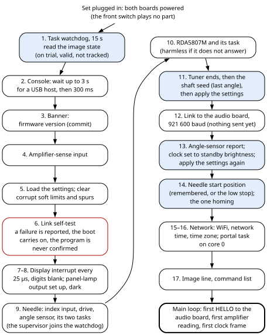
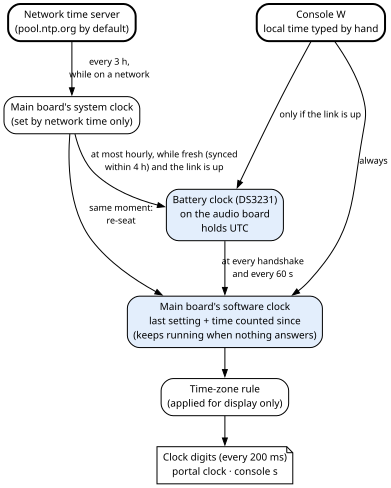

# 4. The main board: start-up, clock, lamps and time

The S3, an ESP32-S3 module, is the main board of Ambersong. It owns everything a person sees move or
light up on the front of the radio: the four-digit amber clock behind the dial glass (the
**Leditron**), the panel lamps behind the dial, and the dial needle. It also reads the tuning knob,
senses whether the amplifier is on, and runs the WiFi, the portal and the firmware updates of both
boards. This chapter covers how the S3 starts, how its work is shared out, the clock display, the panel
lamps, time keeping, the health it reports and its watchdog. The needle has chapter 5, tuning chapter 6,
the network and portal chapter 8.

## 4.1 What you see

- **The clock.** Four digits show local time as HH:MM, in 24-hour form by default. A leading zero in the
  hour is blanked, so 09:05 reads " 9:05". The colon between the digits is not under firmware control:
  it is always lit (Hardware Bible, chapter 7).
- **Two clock brightnesses.** Full while the amplifier is on, a lower "standby" level while it is off.
  The change never snaps: the clock holds for a quarter of a second, then eases to the new level over a
  second and a half.
- **An optional frequency readout** on the same four digits. `1017` means 101.7 MHz, because the display
  has no decimal point. It can be off (the default), always on, or shown only while the tuning knob is
  being turned.
- **Blank digits when the machine does not know the time.** This is deliberate: a blank clock is better
  than a plausible wrong one. After every start of the S3 the clock is blank for the second or two it
  takes to get the time from the audio board.
- **Panel lamps** that follow what you do. They are dark with the amplifier off. On the RADIO source
  they come up to full while the knob is turned, and ease down to half five seconds after the knob
  stops. On the AUX and Bluetooth sources they sit at a separate level.
- **During an update of the S3** the clock goes blank, the panel lamps go dark and the needle stops. The
  radio keeps playing, because the sound lives on the A32. Everything comes back when the S3 restarts.

The S3 never reads the source selector, the volume knob or the Bluetooth button, and never drives the
blue lamp: those belong to the A32. It learns the source, the Bluetooth state, the volume and the
selector's raw reading (for diagnosis) from the status report the A32 sends four times a second. No
firmware on either board drives a fan.

**Terms used in this chapter** (chapter 2, section 2.4 explains tasks, cores and priorities):

| Term | Meaning |
|---|---|
| **Interrupt routine** | A function the hardware calls on a timer. It pre-empts every task on its core. |
| **IRAM** | The chip's internal instruction RAM. Code placed there keeps running while the external flash chip is busy, for example during a settings save or a firmware write. |
| **LEDC** | The ESP32's PWM peripheral ("LED control"). Used here for the panel lamps and the needle motor's coils. |
| **Handshake** | The HELLO / HELLO_ACK exchange that opens the link with the A32 (chapter 9). |
| **Epoch** | Seconds since 1970-01-01 00:00 UTC (Unix time). |
| **Software clock** | The S3's own count of the time, re-set from the battery clock or network time (section 4.9). |

## 4.2 Start-up, step by step

**An S3 start-up is not the moment a person turns the radio on.** Both boards are powered whenever the
set is plugged in, whatever the front switch says (Hardware Bible, chapter 5). The S3 starts when the
set is plugged in, or after a restart. The front switch brings the amplifier up, and that is the moment a
person turns the radio on; the S3 sees it as an amplifier change (section 4.5).



The start-up runs on core 1, in this order:

| Step | What happens | Why it sits here |
|---|---|---|
| 1 | **The task watchdog**, 15 s, panic on, and the main loop placed under it. Then the S3 reads the state of the program it is running from: on trial, valid, or not tracked (chapter 3, section 3.11). | First, so that a hang anywhere below resets the chip. |
| 2 | **The console.** It waits up to 3 s for a USB host to open the port, then 300 ms more. With no cable attached this costs the full 3.3 s at every start. | The wait keeps the start-up report whole when a cable is attached. It is a known delay, not yet shortened (chapter 12). The whole start-up must finish within 15 s, because the watchdog is already watching. |
| 3 | **The banner:** the name and `firmware <FW_VERSION> (<FW_COMMIT>)`, between two rules of `=`. | — |
| 4 | **The amplifier-sense input**, a plain input with no internal pull resistor. | — |
| 5 | **The settings** are loaded from flash (chapter 7). Stored soft limits found corrupt are cleared, and so is a stored spur list longer than 16 entries or with any entry outside 77.2 to 97.2 MHz (chapters 5 and 6). | — |
| 6 | **The link self-test.** It encodes a status frame, decodes it, compares the two, then corrupts one byte and checks that the checksum rejects it: a checksum never seen to fail is not known to work. A failure is reported and the start-up carries on; such a program is never confirmed (chapter 3, section 3.11.7). | — |
| 7 | **The display.** Seven segment outputs and four digit outputs, all low; hardware timer 0 starts its interrupt every 25 µs (section 4.6). The digits stay blank until the main loop draws the first frame. | Started from core 1, so the interrupt lives on core 1, away from WiFi on core 0. |
| 8 | **The panel lamps:** LEDC channel 1, 1 kHz, 8 bits, dark. | — |
| 9 | **The needle:** the index input (its debounce seeded from a live read), the motor drive (microstepping at `microFast`), the angle sensor's bus with its first status and angle reads, a warning if the sensor's gain is near its ceiling (checked against the compiled defaults, since the stored settings are not applied yet), and the needle's two tasks, `nstep` and `needle` (chapter 5). The `needle` task puts itself under the watchdog. | After step 1, so the watchdog exists when the supervisor joins it. |
| 10 | **The RDA5807M** receiver: its bus, the chip set-up, and the `rda` task. Harmless if the chip does not answer (chapter 6). | — |
| 11 | **The tuning shaft:** the measured tuner ends first, **then** the shaft seed from the last stored angle, then all the settings are pushed to every module. | The seed uses the tuner ends to decide which turn of the shaft the knob is on (chapter 6). |
| 12 | **The link** to the A32 on its serial port, at 921 600 baud, 8N1, no flow control, with its pins given explicitly. Nothing is sent yet; the main loop sends the first HELLO. | — |
| 13 | **The angle-sensor report** (does it answer, does it see its magnet, its automatic gain). Then the clock is set at once to its **standby** brightness, and the settings are pushed again. | The clock starts dim and eases up once the main loop has read the amplifier as on. |
| 14 | **The one homing.** The needle's start position is set from the reason for the reset: after a software-type reset, the position remembered in RAM; after a power-up, the low stop (section 4.10; chapter 5). Then homing starts. | After step 13's settings, which give the needle its geometry. |
| 15 | **The network:** the WiFi network, network time server and time zone are loaded from their own store; the time zone is applied; the S3 starts joining the house network or raises the rescue access point (chapter 8). | — |
| 16 | **The portal:** the web server and its task on core 0 (chapter 8). | — |
| 17 | **The image line**, `image      : <state>, watchdog on\|OFF`, with ` - an earlier update was ROLLED BACK` when the bootloader has thrown an earlier program away; then the list of console keys. | — |

> **For firmware changes**
>
>
> Pushing the settings to the modules sets the clock brightness target and the panel levels and timings.
> It sets the needle's limits, motion profiles, microstepping and geometry (taking back what the needle
> accepted). It also sets the index band, the tuner ends, the tuning curve, the printed dial, the
> RDA5807M's list of fixed spurs, and the WiFi transmit power.
>
> **Four orderings matter, and only the order of the code enforces them:**
>
> 1. the watchdog before everything (step 1);
> 2. the tuner ends before the shaft seed (step 11);
> 3. standby brightness before the first amplifier reading (step 13);
> 4. the needle's geometry before its start position (step 14).
>

When homing finishes, the main loop sees the needle's "homed" flag change and gives the needle its job:
follow the knob or park (chapter 5). A sweep in progress is not interrupted.

## 4.3 Tasks and cores: the rules a modifier must keep

The S3's tasks, their cores, priorities, periods and stacks are in one table in chapter 2, section 2.4.
What follows is what that layout means for anyone changing the code.

> **For firmware changes**
>
>
> - **On core 1, the main loop never yields.** It has no delay in its normal path, so the idle task of
>   core 1 never runs, and nothing at priority 0 ever gets core 1. A task at priority 1 on core 1 shares it
>   with the main loop only by time slicing. Periodic work belongs in the main loop, or in a task at
>   priority 2 or higher that yields. The watchdog does not check core 1's idle task in this build's
>   configuration, so this causes no resets.
> - **On core 0, the step emitter `nstep` spins at priority 19 while the needle moves**, so the portal
>   (priority 3) and WiFi get core 0 only between steps. Portal requests can be slow while the needle
>   moves; this is known and accepted. Core 0's idle task cannot run during a move either, so the step
>   emitter takes it off the watchdog. The watchdog watches the main loop and the `needle` supervisor, and
>   not core 0's idle task, the step emitter or the portal (section 4.11).
> - **Why the step emitter is on core 0.** On core 1 it would starve the main loop (the link and the
>   panel) for the length of every sweep, and it would compete with the display interrupt. A needle stutter
>   while the portal is in use is more forgivable than a stalled link or a glitched clock.
> - **Why the portal is on core 0.** Core 1 belongs to the display interrupt and the needle.
> - **What can hold the main loop.** Three console prompts wait inside it and keep the watchdog fed while
>   they wait: `W` (the clock) until 40 s after the last key typed, `y` (the WiFi network) until 60 s after
>   the last key typed, and `l` (the live index monitor) for up to 60 s. Each key typed at `W` or `y`
>   starts its wait again, so those two can hold the loop longer. The `i` report's WiFi scan holds it for a few seconds; a settings save
>   for milliseconds. The `needle` and `rda` tasks pre-empt it.
>

## 4.4 The main loop

The main loop runs on core 1 and does the S3's routine work: the link, the network, the settings save,
the clock, the panel lamps and the console (chapter 2, section 2.4).

> **For firmware changes**
>
>
> Every pass runs these steps, in this order, with no delay between passes:
>
> 1. **Receive from the A32.** Complete frames go to the message handler (chapter 9).
> 2. **The network state machine** and network-time bookkeeping (chapter 8). Then, while the running
>    program is on trial, the check that confirms it (chapter 3, section 3.11.2).
> 3. **The learned WiFi transmit power:** if the network module's value differs from the stored one, it is
>    copied into the settings and marked changed. It is learned by the network module and stepped only
>    from the console; it is not a portal row and not in the settings file (chapter 8).
> 4. **The RDA sampler and the needle's re-index triggers** (chapters 5 and 6).
> 5. **The settings save:** settings unchanged for 2 s are written if it is safe: the needle still, no
>    calibration running, no upload active. They are never written while the running program is on trial
>    (chapter 7).
> 6. **The clock brightness fade** advances one step (section 4.7).
> 7. **Amplifier sense** (section 4.5): debounce; on a change, retarget the clock brightness, perhaps home
>    or sweep the needle, re-apply the needle's job, and tell the A32 at once. Otherwise tell the A32 the
>    amplifier state every 2 s while the handshake stands.
> 8. **The link keepalive.** HELLO every second until the A32 answers; after that a PING every second and a
>    request for the time every 60 s. A time request that gets no answer within 5 s, while the A32 is
>    otherwise answering, marks the battery clock as not answering (section 4.10). If the link has been
>    silent for more than 2 s, the handshake is dropped and the copy of the A32's status and settings is
>    forgotten (chapter 7). The console prints `[WARN] A32 silent. Clock and needle keep running.`
> 9. **The needle follows the source and the amplifier.** On a change of source, or when homing finishes,
>    the needle's job is re-applied (not during an upload). If an upload ended without a restart and the
>    needle's stop has landed, an unhomed needle is homed, or the job re-applied (chapter 5).
> 10. **The band calibration:** if one finished, its result is copied into the settings, the soft limits
>     are shifted with it, and the settings are saved (chapter 5).
> 11. **The panel lamps** are given the amplifier state, the source and "knob moving", or driven dark
>     during an upload (section 4.7).
> 12. **What the digits show** is decided every 200 ms, except during an upload (section 4.6.2).
> 13. **Network time is written through** to the battery clock at most once an hour (section 4.9).
> 14. **The shaft position:** every 10 s, if the angle sensor answers and the shaft count changed, the
>     count is stored as the last angle. The next start-up can then tell which turn of the shaft the knob
>     is on. Only a live count is stored. Before the sensor's first good reading the count is a
>     placeholder, and saving it would seat the next start-up on the wrong turn (chapter 6).
> 15. **The console:** one key is taken and dispatched (Appendix D).
>

**While the link is down, the S3 takes the source as AUX everywhere.** With the amplifier on, this parks
the needle and sets the panel lamps to their "other source" level. It also stops the "while tuning"
readout.

## 4.5 Amplifier sense and "radio live"

The S3 reads its amplifier-sense input. **Low means the amplifier is powered.** The input is plain; the
pull-up and the detector that pulls it low are outside the board (Hardware Bible, chapter 9).

- **Debounce.** A new reading is accepted only once it has differed from the accepted state for more
  than 50 ms. The first accepted reading after start-up makes the state known; before that the console
  reports the amplifier as "unknown".
- **On an accepted change**, the console prints `amp ON` or `amp OFF`, and the clock brightness is
  retargeted (`brightOn` or `brightOff`). If the amplifier has just come **on**, this is not the first
  reading after start-up, and no upload is running:
  - a needle with no zero starts homing, including a needle in FAULT: switching the amplifier on is a
    person asking for another try (chapter 5);
  - otherwise, if `sweepOn` is set, the needle makes its decorative end-to-end sweep.

  Then the needle's job is re-applied, and the new amplifier state is sent to the A32 at once.
- **The front switch does not home a needle that has its zero.** Homing happens once, at S3 start-up;
  after that the needle knows where it is (chapter 5). The one exception is the bullet above: a needle
  with no zero, FAULT included, starts homing on every amplifier-on edge.
- **The A32 is told the amplifier state every 2 s.** It treats 2 s without hearing from the S3 as
  "amplifier down" and goes quiet (chapter 9). That is why any console routine that holds the main loop
  must keep sending PING.
- **Two minutes after the amplifier goes off**, once per off period, the needle quietly re-homes and
  returns (chapter 5).

**"Radio live" has one definition:** the amplifier is on **and** the source is RADIO, with the source
taken as AUX when no valid status report from the A32 is held. It decides whether the needle follows the
knob or parks, whether the "while tuning" readout may show, and whether an RDA measurement may run.
**It is a listening policy, not a statement about the tube set.** The selector only tells the A32 which
sound to play. The tube set runs whenever the amplifier does, whatever the selector says (Hardware
Bible, chapter 5). The needle follows and the dial calibrates only while the radio is what you are listening
to, by choice.

## 4.6 The clock display

### 4.6.1 Multiplexing

The display has four seven-segment digits. **Only one digit is lit at any instant.** Each digit gets a
**slot** of 2500 µs; four slots make a 10 ms frame, so the whole display refreshes at 100 Hz. Hardware
timer 0 calls the display's interrupt routine every 25 µs; each call is one **tick**. A prescaler of
80 on the 80 MHz clock gives 1 µs counts, and the alarm reloads at 25. 25 µs is the greatest common
divisor of 825 and 1675 µs, so both phases below fall on whole ticks.

> **For firmware changes**
>
>
> One slot is 100 ticks:
>
> | Ticks | What happens |
> |---|---|
> | 0 to 32 (825 µs) | **Everything dark: the dead time.** It is never shortened. |
> | 33 | The slot is timestamped, and its deviation from 2500 µs recorded if it is the worst so far. Then, if the lit window L is not zero, the digit is selected **first**, then that digit's segments are lit. |
> | 33 + L | The segments are cleared **first**, then the digit. Releasing the digit first would let the outgoing digit briefly show the incoming pattern. |
> | 99 | **Unconditional blank:** all segments and the digit cleared, the tick counter reset, and the next digit chosen. This runs whatever L is. |
>

**The dead time** gives the outgoing digit's switch time to turn fully off before the next digit is
enabled; without it the display ghosts. On this machine the outgoing digit's high-side switch takes
about 825 µs to stop conducting once its select is released. That figure was measured on this machine,
and it is the firmware's own value: the Hardware Bible (chapter 7) records the circuit that causes the
slow turn-off, not the timing. **Another build of the display must measure its own.**

**Polarity.** The routine sets a digit-select output high to turn its digit on, and a segment output
high to light a segment, through the driver stages (Hardware Bible, chapter 7).

**Brightness changes only the lit window L, never the slot.** L is the part of each slot during which
the digit is lit. L = brightness × 67 ÷ 255 ticks, at least
1 tick when the brightness is above 0, and at most 66. So the frame rate never changes and dimming cannot
flicker. 255 is the maximum; there is no headroom above it. 0 is dark, but the display keeps refreshing.

> **Worked example.** At 255, L = 66 ticks = 1650 µs lit in each 2500 µs slot: each digit is lit 16.5 %
> of the time. At the standby default of 110, L = 110 × 67 ÷ 255 = 28 ticks = 700 µs, or 7 % of the
> time.

**The font** has the digits 0 to 9 only, in the standard layout (bit 0 = segment A at the top, then B,
C, D, E, F, and bit 6 = G in the centre). Any other value blanks that digit. The digits are numbered
from the right: digit 1 is the rightmost (units of minutes), digit 4 the leftmost (tens of hours). New
digits are handed to the routine all four at once, with interrupts disabled, so it never shows half of
an update. In 12-hour form the hour is shown modulo 12, with 0 shown as 12; there is no AM/PM indicator.

**Timing health.** The worst slot deviation is shown by the console `s`
(`display : brightness N worst slot error N us`) and in the portal field `slot`. The console key `Z`
zeroes it.

### 4.6.2 What the digits show

Every 200 ms the main loop decides, in this order:

1. **A test pattern**, if one is set: `8888` (console `8`, or the portal's display test), or all blank
   (console `b`). Console `9` returns to normal. A display you can command is the difference between
   "the clock is broken" and "the clock has no time yet".
2. **During an S3 update**, nothing is decided: the digits were blanked when the upload began
   (section 4.8).
3. **The frequency readout**, if `showTuning` asks for it:
   - **1, "tuning always":** always, whatever the amplifier and the source. This is an operator
     override and the calibration instrument; calibrating the shaft against the printed dial is done
     standing at the set, often with the amplifier off.
   - **2, "tuning while tuning":** only while the radio is live and the knob moved within the last
     `tuneHoldMs` (4 s by default). The time of the last turn is **not** cleared while the radio is not
     live. Otherwise a 250 ms glitch of the source selector, or a 2 s link hiccup, would wipe a readout
     the listener is in the middle of reading.

   The frequency comes from the tuning curve (chapter 6) and is clamped to the printed dial,
   `dialLow` to `dialHigh` (87.9 to 107.9 MHz by default). Mode 2 then snaps to the nearest North
   American FM channel; the channels sit on odd tenths of a MHz (87.9 + 0.2 k). The snap uses the
   unrounded value and never leaves the printed dial. Mode 1 is not snapped: it is the instrument, and
   rounding would hide the tenth of a MHz being measured. Leading zeros are **not** blanked, so 87.9 MHz
   reads `0879`. The portal shows the true, unclamped frequency, with "(past the printed face)" when it is
   off the dial; only the clock digits clamp.
4. **No valid time:** all four digits blank.
5. **The clock:** local time from the software clock, through the time-zone rule (section 4.9), shown
   with the `hour12` and `blankLeadZero` settings.

## 4.7 Brightness and panel lamps

**The clock brightness** has two targets: `brightOn` (255 by default) while the amplifier is on,
`brightOff` (110) while it is off.

- A new target starts a move **from the current level**, so a change of mind mid-fade never jumps.
- The level holds for `dispDwellMs` (250 ms), then moves along a **smoothstep** curve,
  k = p²(3 − 2p), over `dispFadeMs` (1500 ms). Smoothstep has zero slope at both ends, so the level
  starts slowly, speeds up and settles.
- Any change of setting retargets the brightness, so a new `brightOn` from the portal eases in.
- Only the start-up sets a level at once (section 4.2, step 13).
- The console keys `-` and `=` (or `+`) change `brightOn` by 15 and write it straight to the display,
  bypassing the fade (section 4.16).

**The panel lamps** are one PWM output, at 1 kHz with 8-bit duty. A higher duty makes the panel lamps
brighter (Hardware Bible, chapter 9). The 1 kHz frequency is a firmware choice.

> **For firmware changes**
>
>
> The panel lamps' output is LEDC channel 1. LEDC channel 0 is left unused on the S3, for two reasons.
> The A32 uses its channel 0 for the blue lamp, and keeping them distinct makes the two programs read alike.
> And in this Arduino core, channels 0 and 1 share LEDC timer 0, so anything put on channel 0 at another
> frequency would change the panel lamps' frequency too.
>

Every pass of the main loop gives the lamps three inputs: the amplifier state, the source, and whether
the knob is moving. The target level comes from those three alone, so there is no internal state to fall
out of step:

| Condition | Target |
|---|---|
| Amplifier off | 0 (dark) |
| Amplifier on, source RADIO, knob moved within `panelIdleMs` (5 s) | `panelTuning` (255) |
| Amplifier on, source RADIO, knob idle for 5 s | `panelIdle` (128) |
| Amplifier on, source AUX or Bluetooth (or the link down) | `panelOther` (96) |
| S3 update in progress | 0 (the main loop passes "amplifier off") |

"Knob moving" is the needle module's tuning-activity flag. Its deadband must be wider than the angle
sensor's own jitter, or the lamps flash to full with nobody touching the knob (chapter 5).

**Motion.** A new target starts a move from the current level. The level holds for `panelDwellMs`
(250 ms), then follows the same smoothstep curve over `panelFadeMs` (900 ms). The hold is what makes the
machine seem to decide rather than react. The console `s` shows the panel's current level and target
(`panel : current -> target`).

## 4.8 During an upload

When an update of the S3's own program starts (chapter 3, section 3.10.2), the S3 goes quiet: the
needle stops and the display is blanked. While it is quiet:

- the digits stay blank;
- the panel lamps are driven dark;
- amplifier and source changes do not move the needle;
- no settings are saved (chapter 7).

**Why.** A firmware write is a long flash operation, and the machine cannot absorb one while it is moving
or lit. The display timing test found flash traffic to be the one load that disturbs the display. It
concluded that an upload should stop and darken the machine rather than let it look broken.

A successful upload ends in a restart, which brings everything back. An upload that ends without a
restart (refused, aborted, failed) wakes the S3 up again. Once the needle's stop has landed, the main
loop homes an unhomed needle or re-applies its job (chapter 5).

An S3 upload refused because the running program is on trial is refused before anything goes quiet, so
the needle keeps running and the clock stays lit. An update of the A32, relayed through the S3, does not
quiet the S3 at all (chapter 3, section 3.10.3).

## 4.9 Time keeping



**The battery clock is on the A32.** The DS3231 clock chip is reachable only from the A32, so the time
must cross the link. Its module carries a backup battery, which is what lets it keep time through a
power cut (Hardware Bible, chapter 4); this book calls it **the battery clock**, as the portal does.

**The S3 keeps its own software clock:**

```
now = epoch at the last setting + (milliseconds since then) ÷ 1000        (0 while there is no valid time)
```

It keeps counting when the A32 or the network is absent. A slow or missing link never makes the display
stutter; the clock simply stops being corrected.

**Three sources of time:**

1. **The battery clock, through the A32.** At every handshake, and every 60 s after, the S3 asks the A32
   for the time. The A32 answers with the time in UTC, a validity flag, and the chip's temperature in
   quarter degrees. It sets the flag only if all three hold: the time is plausible (after 1600000000,
   that is September 2020); the chip's status register answered; and the chip's oscillator-stopped flag
   is clear. A clock that has stopped is not trusted (chapter 9). The S3 accepts a valid, plausible time and re-sets its
   software clock. An invalid one prints `[WARN] the DS3231 has no valid time yet.` and leaves the
   software clock alone, still running if it was valid. Either way, the answer also sets the battery
   clock's health (section 4.10). The temperature is not used.
2. **Network time (NTP)**, only while the S3 is on a network. The stored server defaults to
   `pool.ntp.org`, with `time.nist.gov` as the second. The S3 re-synchronises every 3 hours. Network time
   counts as **fresh** only if a synchronisation actually happened within the last 4 hours (the 3-hour
   interval plus an hour's grace). **Network time disciplines the battery clock, not the other way
   round.** While the handshake stands and network time is fresh, the S3 sends the network time to the
   battery clock at most once an hour (at once the first time). It also re-sets its software clock. The
   console prints `clock disciplined from NTP.` The write goes through to the battery clock so that the
   correction survives the next power cut. Without a network, which is most of the time, the battery
   clock is the authority.
3. **By hand, the console key `W`** (also from the portal's Console tab). It asks for local time as
   `YYYY-MM-DD HH:MM:SS`, converts it to UTC, refuses anything before 1600000000, and re-sets the
   software clock. Then it looks at the link:
   - if the handshake stands, it sends the time to the battery clock and prints
     `clock set, and pushed to the DS3231.`;
   - if the A32 is not answering, it sends nothing and says so: `clock set on this board only - the
     audio board is not answering, so the battery clock was NOT updated. Set it again once the link is
     back.`

   Writing the battery clock clears its oscillator-stopped flag. Unreadable input changes nothing. The
   prompt gives up 40 s after the last key typed.

**The battery clock always holds UTC.** Local time is applied only for display. Keeping local time in a
real-time clock makes the hour after a daylight-saving change ambiguous and the hour before it happen
twice.

**The time zone** is a POSIX time-zone rule, stored with the network settings. It is applied once at
start-up, and again whenever it is changed on the portal. The default is `EST5EDT,M3.2.0,M11.1.0`
(eastern North America: UTC−5, daylight time from the second Sunday of March to the first Sunday of
November). **Builders in another zone: set your own rule on the portal** (chapter 8).

> **Caution — the `W` prompt's zone is fixed.** It sets the rule `EST5EDT,M3.2.0,M11.1.0` before
> converting, whatever the portal says, and leaves it in force afterwards. After a `W` on a set
> configured for another zone, the display shows eastern North American time until the zone is saved
> again on the portal or the S3 restarts. A note in the code there reads "BUILDERS, PERSONALISE THIS".
> It is left as it is on purpose.

**Who reads which clock.** The clock digits, the portal's `clock` field ("HH:MM" local, or "--:--") and
the console `s` all read the software clock. The S3's system clock, which network time sets, is used
only as the source of network time.

## 4.10 Health reporting

**Uptime** comes from a 64-bit microsecond timer. The portal shows it as `up` ("Nd HH:MM:SS"); the
console `s` shows `uptime N s`.

**The reset reason.** The console `s` prints the last reset reason: POWERON, EXT (the reset pin), SW
(software restart), PANIC (crash), TASK WATCHDOG, INTERRUPT WATCHDOG, OTHER WATCHDOG, BROWNOUT, deep
sleep, or unknown. The S3 is on native USB and does not reset when a terminal attaches, so its start-up
banner is almost never seen. A reboot loop would be invisible unless the reason could be read
afterwards. The reason is not a portal field; the portal reaches it through its Console tab.

The reset reason also decides where the needle is believed to be at start-up (chapter 5):

| Reset reason | Needle position at start-up |
|---|---|
| SW, PANIC, interrupt watchdog, task watchdog, other watchdog (software-type) | Restored from a checksummed record in RAM that survives these resets, if the record is whole and sane; otherwise the low stop. |
| POWERON, BROWNOUT, EXT, deep sleep, unknown | Assumed at the low stop. |

**Console prefixes.** The S3 marks its lines `[PASS]`, `[WARN]` and `[FAIL]` where they apply. The A32's
log lines arrive over the link and print as `[A32] ...`.

**Portal health fields** in this area (chapter 8 lists every field): `amp`; `link` (the handshake
stands); `hello`; `astate` (a valid status report from the A32 is held; the page blanks audio readings
when it is 0); `linkrx`, `linktx`, `linkcrc` (a receive count at 0 points at wiring or power; receive and
checksum counts climbing together point at signalling); `linkver` (frames dropped for another protocol
version); `rtc` (the battery clock's health, below); `slot` (the display's worst slot error); `heap`;
`up`; `clock`. While no valid status report is held, values from the A32 are zeroed, or set to a marker
where 0 is a real value. A missing key would make the page read "-", and a stale one would make it read
a lie.

**The battery clock's health.** The S3 keeps one number, published as the field `rtc`:

| `rtc` | Set when | Portal pill |
|---|---|---|
| 0 | Fine, or not asked yet. Set by every answer that carries a valid, plausible time. | none |
| 1 | The battery clock answered with no valid time: its oscillator stopped, or it was never set. | **BATTERY CLOCK LOST ITS TIME - check its battery** |
| 2 | The battery clock did not answer at all: a 60-second time request got no answer within 5 s while the handshake stands (the A32 sends nothing when its own read of the chip fails). | **BATTERY CLOCK NOT ANSWERING** |

The value changes only on those events: a later valid time clears it to 0, and a link drop does not
clear it. The pill changes nothing in how the clock behaves; it only makes the fault visible without a
cable.

**Version skew comes in two kinds**, and they look different:

- **Another protocol version.** The link drops such frames and counts them. The link looks silent:
  there is no handshake, so the A32 sleeps and the radio and Bluetooth are silent (AUX never passes through
  the A32, so it still plays). The count and the pill **BOARDS RUN DIFFERENT PROTOCOL VERSIONS - flash both** tell it apart from a
  broken cable (chapter 3, section 3.13; chapter 9).
- **The same protocol version, but a different status layout.** A status report that passes its
  checksum but has the wrong length means the two builds disagree on it. The S3 drops its copy of the
  A32's status and prints once: `the A32's STATE frame does not match this build. Flash BOTH MCUs. Audio
  is unaffected - only telemetry stops.`
  The sound is not affected.

**A short A32 restart.** A restart of the A32 can be shorter than the 2-second silence rule. It then
shows as the A32's millisecond counter going backwards in its status reports (with a guard against that
counter's own 49.7-day wrap). The S3 prints `[WARN] the A32 restarted - handshaking again.` and shakes
hands again, which re-reads the A32's version, time and settings.

## 4.11 The watchdog

The **task watchdog** resets the chip when a task it watches has not reported in ("fed" it) for too
long. The first lines of the start-up set it to 15 s with panic on. It watches two tasks:

- **The main loop**, which includes the start-up itself. The pinned Arduino core feeds the watchdog once
  before every pass, so any single pass that takes longer than 15 s resets the S3, and so does a
  start-up that takes longer than 15 s in total.
- **The needle supervisor, `needle`.** It joins the watchdog when it starts and feeds it at the top of
  every pass. Every branch of a pass sleeps 5 to 20 ms, so 15 s trips only on a real hang (chapter 5).

It does **not** watch three things:

- the portal task: a flash write legitimately blocks it, and the portal's own upload watchdog already
  ends a stalled upload;
- the step emitter: it spins by design;
- core 0's idle task: the step emitter removes it (section 4.3).

Core 1's idle task is not checked in this build's configuration. The image line reports whether the
main loop's subscription worked: `watchdog on` or `watchdog OFF`.

> **For firmware changes**
>
>
> **Console prompts feed the watchdog.** `y` (60 s after the last key typed), `W` (40 s after the last
> key typed) and `l` (60 s) wait inside the main loop for longer than 15 s. Each feeds the watchdog on
> every pass of its waiting loop. The `i` report's WiFi scan holds the loop for a few seconds without
> feeding it, well under 15 s. **Any new routine that waits inside the main loop must do the same.**
>

**After a watchdog reset** the console `s` shows `last reset : *** TASK WATCHDOG ***`. The needle treats
it like a software restart and homes from its remembered position (chapter 5). A watchdog reset of a
program still on trial is a rollback (chapter 3, section 3.11).

The pinned core also runs an **interrupt watchdog** of 300 ms on both cores, and a brownout detector;
both reset the chip.

**A failed link self-test does not stop the S3.** It reports the failure and starts as usual; only the
program's confirmation is withheld (chapter 3, section 3.11.7).

## 4.12 Settings, console keys and constants

### 4.12.1 Stored settings

These live in the S3's stored settings (chapter 7) and are edited on the portal. "Admin" means only the
administrator account can change it.

| Setting | Default | Unit | Range | What it does | Where you change it |
|---|---|---|---|---|---|
| `brightOn` | 255 | level | 0–255 | Clock brightness, amplifier on. 255 is the maximum. | Display tab; console `-` `=` |
| `brightOff` | 110 | level | 0–255 | Clock brightness, amplifier off. | Display tab |
| `hour12` | 0 | on/off | 0–1 | 12-hour clock, with no AM/PM indicator. | Display tab (admin) |
| `blankLeadZero` | 1 | on/off | 0–1 | Blank a leading zero in the hour. | Display tab (admin) |
| `dispDwellMs` | 250 | ms | 0–5000 | Hold before the clock brightness moves. | Display tab (admin) |
| `dispFadeMs` | 1500 | ms | 0–10000 | Eased travel between the two brightnesses. | Display tab (admin) |
| `showTuning` | 0 | choice | 0 clock always, 1 tuning always, 2 tuning while tuning | What the digits show. | Display tab (admin); console `f` |
| `tuneHoldMs` | 4000 | ms | 500–20000 | How long the mode-2 readout stays after the knob stops. | Display tab (admin) |
| `panelTuning` | 255 | level | 0–255 | Panel lamps while tuning on RADIO. | Lights tab |
| `panelIdle` | 128 | level | 0–255 | Panel lamps on RADIO, knob idle. | Lights tab |
| `panelOther` | 96 | level | 0–255 | Panel lamps on AUX or Bluetooth. | Lights tab |
| `panelIdleMs` | 5000 | ms | 0–60000 | Idle time before the panel lamps dim to `panelIdle`. | Lights tab (admin) |
| `panelFadeMs` | 900 | ms | 0–5000 | Eased travel (0 is treated as 1). | Lights tab (admin) |
| `panelDwellMs` | 250 | ms | 0–5000 | Hold before the panel lamps move. | Lights tab (admin) |
| `sweepOn` | 0 | on/off | 0–1 | A decorative end-to-end needle sweep each time the amplifier comes on. | Needle tab (admin) |

The printed dial, `dialLow` and `dialHigh`, which also bounds the readout, is in chapter 6. The blue
lamp's levels on the Lights tab are A32 settings that the S3 only mirrors and forwards (chapter 10). The
time zone and network time server are network settings, stored apart (chapter 8).

### 4.12.2 Console keys

| Key | What it does |
|---|---|
| `8` | Show 8888 (all segments). |
| `b` | Blank the display. |
| `9` | Back to normal. |
| `-` / `=` (or `+`) | `brightOn` −15 / +15, written straight to the display (no fade), and saved. |
| `f` | Cycle `showTuning` 0 → 1 → 2, and save. |
| `W` | Set the clock by hand (local time, fixed zone; section 4.9). Pushed to the battery clock only while the A32 answers, and it says which. |
| `Z` | Zero the step-jitter and display slot-error counters. |
| `s` | The status page: among the rest, the link's `wrong-version` count, the last reset reason and the image line. It ends with the command list. |
| `?` | The command list. |
| `l` | Live index monitor for up to 60 s; keeps the link alive and feeds the watchdog (chapter 5). |

Every key of both boards is in Appendix D.

### 4.12.3 Constants

> **For firmware changes**
>
>
> | Name | Value | Meaning |
> |---|---|---|
> | `TICK_US` | 25 µs | The display interrupt's period. |
> | `DEAD_TICKS` | 33 (825 µs) | Dark time at the start of each slot; measured on this machine. |
> | `SLOT_TICKS` | 100 (2500 µs) | One digit's slot; four slots give 100 Hz. |
> | `LIT_MAX` | 67; effective maximum 66 | Longest lit window; brightness is clamped to 66 so the turn-off lands inside the slot. |
> | Display timer | hardware timer 0, prescaler 80 | 1 µs ticks. |
> | `FONT` | 0x3F 0x06 0x5B 0x4F 0x66 0x6D 0x7D 0x07 0x7F 0x6F | Digits 0–9, bit 0 = A … bit 6 = G. |
> | Panel PWM | LEDC channel 1, 1000 Hz, 8 bits | — |
> | Amplifier debounce | 50 ms | — |
> | Display decision | every 200 ms | What the digits show. |
> | Amplifier state to the A32 | every 2000 ms | Matches the A32's 2-second silence rule. |
> | HELLO / PING | every 1000 ms | — |
> | Time request | every 60 000 ms | Battery clock resync. |
> | Battery clock answer wait | 5000 ms | No answer this long after a 60-second request sets `rtc` to 2. |
> | Network time write-through | every 3 600 000 ms | Hourly. |
> | `NTP_FRESH_MS` | 4 h | Network time is fresh within this of the last synchronisation. |
> | Plausible epoch | 1600000000 | Earlier times are refused. |
> | USB wait at start-up | 3000 + 300 ms | Keeps the start-up report whole when a cable is attached (section 4.2, step 2). |
> | `W` / `y` / `l` timeouts | 40 s / 60 s / 60 s | Console prompts. `W` and `y` count from the last key typed. |
> | `WDT_TIMEOUT_S` | 15 s | Task watchdog on the main loop and the `needle` task, panic on. |
> | `CONFIRM_AFTER_MS` | 60 000 ms | No trial confirmation before this uptime (chapter 3). |
> | Confirmation retry | 10 000 ms | One confirmation try every 10 s after that. |
>
> **Framework settings this chapter relies on** (the pinned core's configuration, not set by this
> project): the main loop on core 1 with an 8192-byte stack; a 1000 Hz FreeRTOS tick; WiFi pinned to
> core 0; the interrupt watchdog at 300 ms on both cores; the brownout detector on; print-and-reboot on
> panic; bootloader application rollback enabled; network time interval 3 h.
>

### 4.12.4 Peripherals the S3 firmware takes

> **For firmware changes**
>
>
> | Peripheral | User |
> |---|---|
> | Hardware timer 0 | The display interrupt. |
> | LEDC channel 0 | Unused on purpose: the A32 uses its channel 0 for the blue lamp. Also, in this core, channels 0 and 1 share LEDC timer 0: anything put on channel 0 at another frequency would change the panel lamps'. |
> | LEDC channel 1 (timer 0) | Panel lamps. |
> | LEDC channels 2–5 (timers 1–2) | The needle motor's coils (chapter 5). |
> | I2C bus 0 (`Wire`) | The angle sensor (chapter 5). |
> | I2C bus 1 (`Wire1`) | The RDA5807M (chapter 6). |
> | `Serial2` | The link to the A32 (chapter 9). |
> | RAM not cleared at reset | The needle's position record (chapter 5). |
>
> Which pin the firmware drives or reads for each of these is in Appendix I; what each pin is wired to is
> in the Hardware Bible, chapter 4.
>

## 4.13 When it goes wrong

| What you see | What happened | What the S3 does | What you do |
|---|---|---|---|
| `[WARN] A32 silent. Clock and needle keep running.` | Nothing valid from the A32 for more than 2 s. | Drops the handshake; takes the source as AUX (needle parks, panel lamps to `panelOther`, mode-2 readout off); the software clock keeps counting; no battery-clock resync and no network-time write-through (both need the handshake); forgets its copy of the A32's settings, so audio-board edits get HTTP 409 "the audio board is not answering - its settings cannot be changed now" and a settings download writes `n/a` for them; `W` sets this board only, and says so; HELLO every second. | Nothing: it heals when the A32 answers, which also fetches its settings again (chapter 1, section 1.8). |
| `[WARN] the A32 restarted - handshaking again.` | The A32 restarted in under 2 s. | Shakes hands again; re-reads version, time and settings. | Nothing. |
| `wrong-version N` on `s`, pill **BOARDS RUN DIFFERENT PROTOCOL VERSIONS - flash both** | The boards run different protocol versions. | The link looks silent: no handshake, so the A32 sleeps and the radio and Bluetooth are silent (AUX still plays). Once the A32 has confirmed its program, this survives a power cycle. | Update the S3 first, over its own WiFi, to the A32's protocol version; then the A32 through it if needed (chapter 3, section 3.13). |
| `the A32's STATE frame does not match this build. Flash BOTH MCUs. Audio is unaffected - only telemetry stops.` | Incompatible builds of the same protocol version. | Drops the A32's status; telemetry only. The sound is not affected. | Update both boards. |
| `[WARN] the DS3231 has no valid time yet.` every minute, pill **BATTERY CLOCK LOST ITS TIME - check its battery** | The battery clock's oscillator stopped, or it was never set, and there is no network time. | Keeps its software clock; digits blank if it never had a valid time. | Join a network (it heals by itself), or set the time with `W`; either write clears the flag. Then check the module's battery. |
| Pill **BATTERY CLOCK NOT ANSWERING** | The battery clock does not answer; the A32 logs its own read failure. | Keeps its software clock. | Hardware: Hardware Bible, chapter 4. |
| Clock a little off | Drift of the software clock. | Re-set from the battery clock every 60 s. | Nothing. |
| — | The amplifier-sense reading bounced. | 50 ms debounce. | Nothing. |
| Clock blank, lamps dark, needle still | An S3 update is writing. | No saves; amplifier changes ignored; wakes up again if the upload ends without a restart. | Wait. |
| `s` shows PANIC | A crash. | Reboots; the needle position is restored from RAM. | Nothing; if it repeats, it is a defect to find. |
| `s` shows INTERRUPT WATCHDOG | The 300 ms interrupt watchdog fired. | Reboots; the needle position is restored. | Nothing. |
| `s` shows `*** TASK WATCHDOG ***` | The main loop or the needle supervisor hung for 15 s. | Reboots; the needle position is restored. A program on trial rolls back. | Nothing. |
| The portal is dead, but the radio, clock and needle work | The portal task or the WiFi stack hung. Nothing watches them. | Nothing. Never seen on the radio. | Unplug the set (a USB console still works meanwhile). |
| Trouble with a new S3 program while it is on trial | See chapter 3, section 3.15. | — | — |
| A new S3 program ran healthily for a minute, confirmed itself, but is wrong | It earned confirmation, so it is permanent. | Nothing. | Upload a good program through the portal. |
| `s` shows BROWNOUT | The supply dipped. | Reset; the needle is assumed at the low stop. | Nothing. |
| The A32 goes quiet while a console prompt waits | `W` (40 s) or `y` (60 s) holds the main loop: no amplifier state, no PING. | The A32 treats the silence as "amplifier down" after 2 s. The prompts feed the watchdog, so they never trip it. | It ends when the prompt ends. Accepted for `y`. |
| The clock at the wrong brightness after `-` or `=` with the amplifier off | Those keys write `brightOn` straight to the display. | Shows `brightOn` until the next retarget. | Switch the amplifier, or change any setting. |
| After `W`, the old time comes back | `W` was typed while the A32 was not answering. | Set the S3 only, and said so; the next handshake brought the battery clock's time back. | Type `W` again once the link is back. |

## 4.14 Design choices

- **Two boards, and the S3 owns everything visible.** The A32 must carry the Bluetooth audio (chapter 2,
  section 2.3). Everything a person sees move or light up went to the S3. That also keeps the
  priority-19 step emitter away from the audio timing.
- **The display interrupt, the needle supervisor and the main loop on core 1; WiFi, the portal and the
  step emitter on core 0.** Settled by a timing test. WiFi with four concurrent multi-megabyte HTTP
  streams was imperceptible on the display, and so was a moving stepper on top. Deliberate flash-bus
  thrashing was the only load that visibly degraded it, and it was still bearable. The same test set
  three rules the firmware keeps: debounce settings writes, darken the machine during an upload, never
  read or write flash in a loop.
- **Portal requests may starve while the needle moves.** The step emitter's timing wins over web
  responsiveness.
- **The display interrupt lives in IRAM and only writes registers.** Flash traffic is the one load that
  disturbs the display, and IRAM code does not wait for flash.
- **825 µs of dead time in firmware, instead of a hardware change.** Without it the display ghosts, and
  the resulting brightness was judged fine by eye. Worth revisiting only if the display is ever judged
  too dim.
- **Brightness shortens the lit window, never the slot.** A constant frame rate means dimming cannot
  flicker.
- **An unconditional blank at the end of every slot, and the lit window clamped to 66 ticks.** At
  brightness 255 the turn-off once fell on tick 100, which never comes because the slot rolls over at 99.
  The segments stayed lit and the display read 88:88. The clamp fixes the arithmetic; the blank means no
  future arithmetic can bring the bug back.
- **Two clock brightnesses, both adjustable.** The colon is lit independently of the firmware and cannot
  dim with the digits, which is why `brightOff` defaults to a modest 110. The colon's brightness is not a
  firmware matter.
- **Eased changes (a hold, then smoothstep) for both clock and panel lamps.** A linear ramp reads as a
  setting being changed, and an instant step as a glitch. The intent is lamps that let go like a
  capacitor emptying, and a clock that does not snap to standby.
- **Panel rules:** dark with the amplifier off, full while tuning on RADIO, an idle level after 5 s, its
  own level on AUX and Bluetooth, all adjustable. A panel-lamp fault pulse was decided against.
- **Three readout modes; mode 2 only while the radio is live and snapped to the channel grid; mode 1
  neither gated nor snapped.** The readout should appear under the hand while tuning, and only for a
  source that is playing. But the instrument must stay available with the amplifier off. Turning up from
  91.3 should go to 91.5, not 91.4.
- **Time lives on the A32; the S3 keeps a software clock re-set from the battery clock; network time
  writes through hourly; the battery clock holds UTC.** The clock chip is on the A32's side and the
  display on the S3's. The software clock keeps the display smooth whatever the link does. The
  write-through makes a correction survive a power cut.
- **A battery clock whose oscillator stopped is not trusted, and the portal says so.** A stopped clock can
  hold a wrong but plausible date. A stopped oscillator most likely means a failing battery or module.
- **`W` claims the push to the battery clock only when the A32 answers.** Otherwise the next handshake
  quietly brought the old time back.
- **Network time counts as fresh only within 4 h of an actual synchronisation.** The old test stayed true
  for ever after one synchronisation, so a free-running clock was written to the battery clock hourly.
- **The `W` prompt's zone stays fixed, with a note for builders.** A builder elsewhere personalises it
  for their own device.
- **Uptime from the 64-bit microsecond timer.** The 32-bit millisecond count rolls over every 49.7 days.
- **The status page and the command list on demand, not only at start-up.** On native USB nobody sees
  the start-up banner.
- **The `y` prompt may hold the main loop until 60 s after the last key typed.** Realistically it does no meaningful harm.
- **A task watchdog on the main loop and the needle supervisor only.** A flash write legitimately blocks
  the portal task, and the step emitter spins by design.

## 4.15 Tried and rejected

> **For firmware changes**
>
>
> - **"The clock never dims":** one brightness, so the always-lit colon matched the digits. A dimmer clock
>   with the amplifier off was wanted.
> - **Shortening the dead time with a hardware change:** the firmware dead time gave an acceptable
>   brightness with no rework of a built board. Kept as the answer if the display is ever too dim.
> - **Longer digit slots** to win back lit time: 4 ms per digit gives a 62.5 Hz frame, judged marginal for
>   flicker. Not built.
> - **Letting the firmware dim the colon** by moving it to a free driver channel: closed as a non-issue.
> - **"Brightness 240 is the maximum":** a workaround for the tick-100 bug, not a limit. Removed with the
>   fix.
> - **Forcing the time zone on every redraw:** it would have overridden the zone set on the portal. Now set
>   once.
> - **Uptime from the millisecond counter:** rolled over every 49.7 days.
> - **"Network time is fresh if the clock reads past 2020":** true for ever after one synchronisation.
> - **Trusting the battery clock on plausibility alone:** a stopped clock kept a wrong but plausible date
>   and was adopted.
> - **A start-up-only help list:** nobody sees the banner on native USB, and the list drifted from the
>   keys. One list now, printed by `s` and `?`.
> - **Clearing the mode-2 readout hold when the radio is not live:** a selector glitch or a link hiccup
>   wiped a readout being read.
> - **Snapping the readout with an "even tenth goes up" rule:** it showed 91.5 for a true 91.36. Replaced
>   by snapping from the unrounded value.
> - **Halting the S3 for ever on a failed link self-test:** a board that halts before WiFi can only be
>   fixed by USB. Replaced by carrying on unconfirmed.
> - **`W` claiming the push to the battery clock whatever the link:** with the A32 silent the claim was
>   false.
> - **Looking silent on a protocol mismatch:** a half-updated pair read `SILENT rx 0`, exactly like a
>   broken cable. Replaced by counting and showing the dropped frames.
>

## 4.16 Known limits

- **About 3.3 s of start-up delay without a USB host**, waiting for the console port (chapter 12).
- **The clock is blank for a moment after every S3 start-up**, until the A32's first time answer, and
  stays blank if neither the battery clock nor network time has a valid time.
- **Network time cannot reach the display while the link is down.** The write-through needs the
  handshake, and nothing else re-sets the software clock from network time (chapter 12).
- **The software clock is exact only between re-settings.** It is re-set at a whole second, so it can lag
  the battery clock by up to about a second. The display shows minutes, so this is not visible. Only an
  A32 silence longer than 49.7 days would break its arithmetic.
- **`W` uses a fixed zone and leaves it in force** (section 4.9).
- **A `W` typed while the A32 is silent sets this board only.** If the battery clock holds a valid time,
  the next handshake puts that time back on the display.
- **12-hour mode has no AM/PM indicator.** The font has digits only, so the display cannot show letters
  or error codes.
- **The readout below 100 MHz shows a leading zero** (`0879`).
- **Readout mode 1 does not check that the angle sensor answers;** with a dead sensor the digits show a
  frequency from the last count.
- **`-` and `=` bypass the fade:** the clock can sit at the wrong level, or step back briefly before
  easing.
- **Portal requests can be starved while the needle moves.**
- **The `y` prompt holds the main loop until 60 s after the last key typed**, so the A32 goes quiet meanwhile. It also echoes
  what is typed, the WiFi password included, into the console the portal reads (chapter 8).
- **With the link down, the panel lamps treat the source as AUX**, so with the amplifier on they sit at
  `panelOther`.
- **The battery clock's temperature** arrives with every time answer and is not used.
- **A settings change made in the trial minute of a new S3 program** is lost if the trial ends in a
  reset (chapter 3, section 3.11.5).
- **Exercised on the radio:** a hung S3 program reset by the task watchdog and rolled back; the `rtc`
  and `linkver` fields at 0 on a healthy pair. **Never exercised on the radio:** a hang of the `needle`
  task; a hung portal task; the battery-clock pills in a real fault; the protocol-version pill; the
  HTTP 409 on an audio-board edit while the A32 is silent.

## 4.17 Changing it safely

> **For firmware changes**
>
>
> **What must stay true**
>
> 1. **The display interrupt (`onTick()` in `src/s3/display.cpp`) stays `IRAM_ATTR`, writes registers
>    only, touches no flash and calls nothing but `esp_timer_get_time()`.** Keep `Display::begin()` in
>    `setup()`, so the timer interrupt is allocated on core 1.
> 2. **Never shorten `DEAD_TICKS`. Keep the turn-off strictly inside the slot. Keep the unconditional
>    blank at tick 99. Only one digit select may ever be set.**
> 3. **All seven segment pins stay below GPIO 32.** The interrupt clears segments through the low output
>    register only (`segAllMask`, built with `1UL << pin`). Digit pins may be anywhere; `begin()` splits
>    them between the low and high output registers (`GPIO_OUT_W1TS/W1TC`, `GPIO_OUT1_W1TS/W1TC`). Three of
>    the four digit pins are above GPIO 32 today.
> 4. **`loop()` must not block.** A routine that must wait inside it keeps sending `MSG_PING` (as
>    `limitMonitor()` does), or the A32 decides the amplifier is down. It also returns within 15 s or calls
>    `wdtFeed()` while it waits, as the `y`, `W` and `l` routines do, or the watchdog resets the S3.
>    `portalStateJson()` and anything the portal task calls must not block or write flash.
> 5. **Core 1 below priority 2 belongs to `loop()`**, which never yields. A new task at priority 0 on
>    core 1 will never run. Put periodic work in `loop()`, or give the task priority 2 or more and make it
>    yield. Tasks on core 0 must yield at least `vTaskDelay(1)`: the step emitter spins at 19.
> 6. **No settings writes while the needle moves, a calibration runs or an upload is active, and none
>    while the program is on trial.** Change `cfg`, call `settingsTouch()`, and let `settingsFlush()`
>    write (chapter 7). Never add a write path that bypasses `settingsWrite()`. The reason is measured: a
>    flash write disables the flash cache, which stalls all code not in IRAM, the step emitter included.
>    During the first settings migration the step jitter reached 383 µs and the display's worst slot error
>    1257 µs; with writes kept away from motion they fell to 49 µs and 8 µs. The display interrupt survives
>    only because it lives in IRAM. A new stored field is appended, never inserted, with
>    `SETTINGS_VERSION` bumped and a migration added (chapter 7).
> 7. **Push settings to modules only through `applySettings()`.** It also writes back what a module
>    accepted (the needle's soft limits, for example), so `cfg` always holds what is running.
> 8. **LEDC:** channel 1 is the panel lamps, on LEDC timer 0; channels 2–5 are the needle motor. In the
>    pinned core a channel's timer is `(channel / 2) % 4`, so channels 0 and 1 share timer 0. Do not use
>    channel 0 on the S3 at another frequency: it would change the panel lamps'. Hardware timer 0 belongs to
>    the display.
> 9. **One definition of "radio live"** (`radioLive()`) and **one definition of the frequency**
>    (`Needle::tuneFreq10f()` / `tuneFreq10()`). Do not rebuild either locally; six copies of the mapping
>    once existed.
> 10. **The battery clock stores UTC.** Local time is applied only for display, with the time-zone rule
>     from the network module.
> 11. **A pin moves in `include/pins.h` and nowhere else**, and what it is wired to is the Hardware Bible's
>     business.
> 12. **The toolchain is pinned** (`espressif32@7.0.1`). Identify a board before flashing it over USB, and
>     never let the uploader pick a port by itself (chapter 3, section 3.7).
>
> The watchdog subscriptions (`esp_task_wdt_init(WDT_TIMEOUT_S, true)` and `enableLoopWDT()` first in
> `setup()`; `esp_task_wdt_add(NULL)` in `needleTask()`; the removal of core 0's idle task in `stepTask()`)
> and the trial rules of chapter 3, section 3.19 must hold together.
>
> **Traps that have bitten this project**
>
> - The turn-off on tick 100 that never happened: the 88:88 display.
> - A busy-spinning task on a core whose idle task is watched: a boot loop that looked like a power
>   problem (the step emitter).
> - The native-USB console does not reset on attach, so anything printed only at start-up is never seen.
> - A serial tool that toggles DTR/RTS resets the board: "uptime 1 s on every reading" was the reading tool
>   resetting it.
> - A word typed in the portal's console used to run as a string of one-key commands. Now one key per
>   send, unless a prompt wants a whole line (chapter 8).
> - `litTicks` starts at `LIT_MAX` (67) in `display.cpp`, one tick past the clamp, until the first
>   `setBrightness()` at start-up step 13. It is harmless only because the frame is blank then and tick 99
>   blanks anyway. Do not show digits before a brightness has been set.
>
> **Finding your way in `src/s3/main.cpp`** (about 3400 lines, in file order)
>
> | Section (main functions) | What it does | Chapter |
> |---|---|---|
> | Header, includes, `FW_VERSION` / `FW_COMMIT` fallbacks | — | 3 |
> | `SETTINGS_MAGIC`, `SETTINGS_VERSION`, `SettingsV1`, `SettingsV2`, `Settings` | The one stored settings structure and its history. | 7 |
> | Globals: `cfg`, `gTouchGen` / `gSavedGen`, `gLink`, `a32` (the A32's status), `a32cfg` (its settings), `haveState`, `peerHello`, `ampOn`, `ampKnown`, `epochAtSync`, `millisAtSync`, `timeValid` | The S3's shared state. | 4, 7, 9 |
> | `dispTest`, `brightnessTarget()`, `brightnessNow()`, `updateBrightness()` | Eased clock brightness. | 4 |
> | `refuse()`, `captureLimit()`, `purgeCorruptLimits()` | Refusal flag; soft-limit capture. | 5, 7 |
> | `setTuneModel()`, `fitTuneCurve()`, `solveLS()`, `purgeCorruptSpurs()` and helpers | The tuning curve. | 6 |
> | `applySettings()` | Pushes `cfg` into every module. | 4, all |
> | `settingsLoad()`, `settingsDump()`, `settingsTouch()`, `settingsWrite()`, `writeSafe()`, `settingsFlush()` and siblings | Load, migrate and save the settings. | 7 |
> | `nowEpoch()` | The software clock. | 4 |
> | `otaWaitAck()`, `otaSendFrame()`, `a32OtaBegin/Chunk/End/SetError/Abort()` | The A32 update relay. | 3, 9 |
> | `#include "settings_table.h"` | The settings table, actions, settings-file round trip. | 7, 8 |
> | `onMessage()` | Every frame from the A32: HELLO_ACK, STATE, TIME, CFG, OTA_STATUS, LOG. | 4, 9 |
> | `srcName()`, `btName()`, `portalRdaJson()`, `portalStateJson()` | The JSON the portal polls. | 8 |
> | `verifyRollbackLater()`, `s3ImageOnTrial()`, `wdtFeed()`, `imageReport()`, `confirmTick()` | Trial, confirmation, watchdog. | 3, 4 |
> | `otaQuiet`, `otaResume`, `portalNeedleResume()`, `portalOtaQuiet()` | Dark and still during an upload; resume if it ends without a restart. | 4, 8 |
> | `radioLive()`, `applyNeedleMode()` | "Radio live"; follow the knob or park. | 4, 5 |
> | `sampleStart()`, `sampleStore()`, `sampleTick()`, `autoSampleTick()`, `needleRecoverTick()`, `idleIndexTick()` | The RDA sampler and the re-index triggers. | 5, 6 |
> | `updateDisplay()` | What the digits show. | 4 |
> | `drainLine()`, `setWifiInteractive()` (`y`), `setClockInteractive()` (`W`), `limitMonitor()` (`l`), `commandList()`, `status()` (`s`) | Console prompts and the status page. | 4, 8 |
> | `setup()`, `loop()` | Start-up and the main loop, with the console key dispatcher at its end. | 4 |
>
> The display's interface is in `src/s3/display.h` (`begin()`, `setBrightness()` / `brightness()`,
> `showDigits()`, `showTime()`, `showNumber()`, `blank()`, `worstSlotErrorUs()`, `resetSlotStats()`); the
> panel lamps' in `src/s3/panel.h` (`begin()`, `update()`, the setters that only `applySettings()` calls,
> and `level()` / `target()`).
>
> **How to test a change, without instruments**
>
> - `8`, `b`, `9`: all segments, blank, normal.
> - Brightness 255 must not show 88:88 (the tick-100 regression test).
> - `Z`, then watch `slot` on the portal or in `s` under load: WiFi traffic, a sweep with `r`, a settings
>   save. After the settings-save guard the worst slot error measured 8 µs; the display timing test
>   treated anything under 100 µs as invisible. `Z` exists so a clean measurement can be taken after a
>   one-off event such as a start-up save. The bench tool behind that test no longer builds; the `slot`
>   figure is the instrument now.
> - Switch the amplifier: the clock should hold 250 ms, then ease for 1.5 s; the panel lamps should follow
>   their table.
> - `f` to cycle the readout modes; turn the knob with the amplifier on and the source on RADIO for
>   mode 2.
> - `W` to set the clock; check the time in `s` and on the portal.
> - `s` for everything at once: amplifier, source, needle, panel level and target, display brightness and
>   slot error, time, link counters, last reset and uptime.
> - After an S3 update, the trial checks of chapter 3, section 3.19. A change to the watchdog deserves the
>   rollback tests there: a portal reboot during the trial, and a deliberately hanging program, never
>   committed.
>
