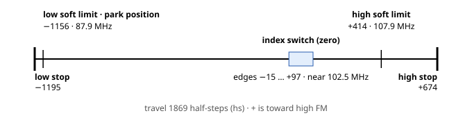
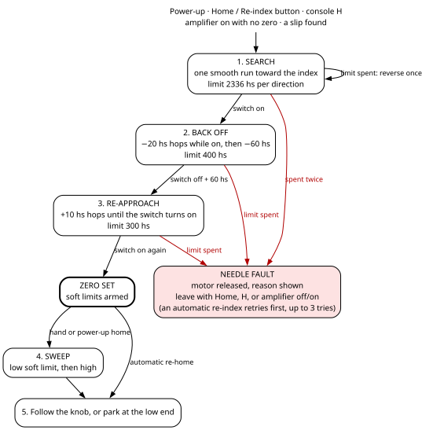
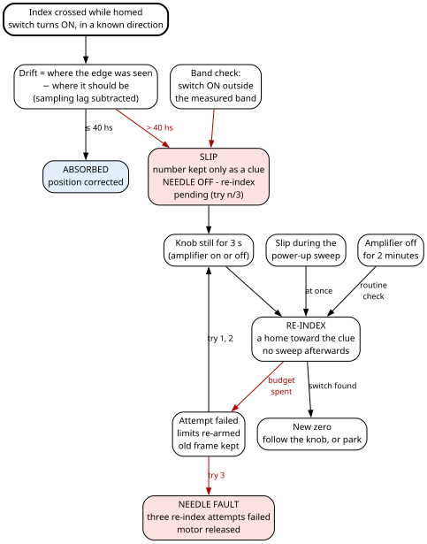

# 5. The dial needle

The needle on the glass dial is not pulled by a dial cord. A small stepper motor moves it, and the
main board (the ESP32-S3) decides where it goes. Nothing mechanical joins the tuning knob to the needle:
the knob turns the tube radio's tuning capacitor, a magnetic angle sensor reads that capacitor's shaft,
and the firmware turns the shaft angle into a frequency and the frequency into a needle position.
Chapter 2, section 2.2, shows the whole tie, and chapter 6 explains the tuning half of that chain. This
chapter is the needle half.

What matters most is **repeatability**: the same knob position must always put the needle in the same
place on the glass.

> **Specific to this build — adapt.** The needle, its stepper motor, its gearing, its index switch and
> its travel are this cabinet's mechanism; yours will differ. The methods carry over; the numbers do
> not. The numbers that belong to this machine are gathered in section 5.18.

## 5.1 What you see

1. **The radio is plugged in.** The main board starts, and the needle finds its reference point
   ("homes"). It then makes one flourish: a run to the low end of the dial, a run to the high end, then
   straight to where it belongs — the station if the amplifier is on and the source is RADIO, otherwise
   the low end. From plug-in to "homed and following the knob" took about 12 seconds when it was timed,
   on an earlier firmware.
2. **You switch on with the source on RADIO.** The needle leaves the low end and swings to the station
   like a meter movement: a small overshoot and a short settle. If the `sweepOn` setting is on, it first
   makes one full end-to-end sweep.
3. **You turn the tuning knob.** The needle follows continuously. It ignores changes smaller than two
   motor half-steps, so it does not chase sensor noise.
4. **You switch the amplifier off, or leave RADIO.** After one second without movement, the needle falls
   to the low end: a fast start and a long, slowing finish, like a drive winding down.
5. **Two minutes after the amplifier goes off.** The needle quietly re-checks its reference point and
   returns to the low end, so the next listening session starts from a checked zero.
6. **You tune past the printed scale.** The needle stays at that end of the scale.
7. **A firmware update reaches the main board.** The needle stops where it is and the clock display goes
   dark. The radio keeps playing, because the sound runs on the other board. After the restart the
   needle remembers where it was and homes from there.

> **Caution — unplug only with the needle parked.** The needle has no end switches. If the radio loses
> power while the needle is above the index (near 102.5 MHz), the next start may first search the wrong
> way, toward the high mechanical stop. The search has a step limit, but nothing physical stops it. Switch the amplifier
> off and wait for the needle to reach the low end before you pull the plug.

**There are no end switches.** One magnetic switch, the **index**, sits part-way along the travel and is
the only position reference. Everything else is kept by counting motor steps, and the count is corrected
every time the needle passes the index. Three firmware mechanisms keep the needle off the mechanical
stops in place of switches: **soft limits** checked before every single step, a **step limit on every
phase of homing**, and a **known starting belief** for the homing search (section 5.14).

Where the motor, the index switch and the angle sensor sit and how they are wired is in the Hardware
Bible, chapter 3, section 3.3, and chapter 8. This chapter states the few hardware facts it needs in
place.

## 5.2 The chain, layers and tasks

**The chain.** Chapter 2, section 2.5, draws the whole tuning chain. The needle's half of it, from the
shaft angle to the motor:

1. The angle sensor (an AS5600) gives 0 to 4095 per turn of the capacitor's shaft. The supervisor reads
   it every 20 ms and keeps a running **multi-turn count** (chapter 6).
2. For the needle only, that count is smoothed by a low-pass filter (section 5.10).
3. The **tuning curve** turns the count into a frequency (chapter 6).
4. The **printed face** turns the frequency into a needle position: the frequencies printed at the two
   ends of the glass (`dialLow`, `dialHigh`) are mapped onto the needle's two soft limits (`posMin`,
   `posMax`).
5. The needle **supervisor** plans a move: which motion law, which microstep (section 5.6).
6. The **step emitter** emits one step at a time and checks the soft limits before each (section 5.5).
7. The **drive layer** turns the position into four PWM duties for the motor's Darlington driver
   (section 5.4).

A **bring-up tool** is a jog or a held coil test (section 5.16): something that drives the motor
directly, for setting up a mechanism.

> **For firmware changes**
>
>
> The needle reads the tuning curve through two calls in `src/s3/needle.cpp`, `tuneFreq10f()` and
> `tuneFreq10Raw()`; everything about the curve itself is chapter 6. The pins the firmware drives are
> the defines `S3_STEPPER_I1` to `S3_STEPPER_I4`, `S3_INDEX_HALL`, `S3_AS5600_SDA` and `S3_AS5600_SCL`
> (Appendix I).
>
> **The layers.**
>
> | Layer | Where | Job |
> |---|---|---|
> | Policy | `src/s3/main.cpp` | When to home, track, park or sweep; the recovery and idle-check timers; capturing the soft limits; collecting the index calibration's result; saving the shaft count; pausing and resuming for an update; the console keys. |
> | Needle | `src/s3/needle.cpp`, `needle.h` | The two needle tasks: homing, tracking, parking, sweeps, reading the index, the index calibration, the AS5600 reads, the memory kept across a restart. |
> | Drive | `src/s3/drive.cpp`, `drive.h` | Turns a position into four PWM duties. Nothing above this layer knows which driver chip is used. |
> | Portal actions | `src/s3/settings_table.h` | The Needle tab's buttons. |
> | Update hooks | `src/s3/portal.cpp` | Stops the needle for an upload; resumes it if the upload does not end in a restart. |
>
> **The tasks.** The needle runs on two tasks, both started by `Needle::begin()`. Chapter 2, section 2.4,
> has them in the table of every task; what matters here:
>
> - **The step emitter, `nstep`**, on core 0 at priority 19. It runs a 1 ms control tick. While the needle
>   moves it spins between steps; it yields one tick when idle, or when the next event is more than 2 ms
>   away.
> - **The supervisor, `needle`**, on core 1 at priority 4. One pass every 5 ms (every 20 ms while a
>   bring-up tool holds the needle). It reads the AS5600 angle every 20 ms and its status every 500 ms.
>
> Two other tasks call into the needle: the main loop, which runs the policy and the console, and the
> portal task, which runs the Needle tab's buttons.
>
> **Why the emitter is on core 0.** Core 1 carries the clock display's 25 µs interrupt and the main loop,
> which services the link to the audio board. The emitter spins between steps, so on core 1 it would
> starve the main loop for the length of every sweep. On core 0 it shares time with WiFi and the portal
> instead, so the portal can be slow while the needle moves.
>
> **Why core 0's idle task is not watched.** The emitter starves core 0's idle task on purpose while it
> moves. With the idle task still watched, the task watchdog reset the chip in a boot loop that looked
> like a power problem. So `stepTask()` removes core 0's idle task from the task watchdog. The cost:
> nothing catches a task on core 0 that hangs for good. If that ever matters, watch the emitter task
> itself; do not put the idle task back.
>
> **The supervisor is watched.** The task watchdog watches the supervisor with a 15-second timeout
> (chapter 4). It feeds the watchdog at the top of every pass, and every branch of a pass sleeps 5 to
> 20 ms, so the watchdog trips only when the supervisor has truly stopped. A stopped supervisor would leave
> the needle deaf to every request; the watchdog restarts the main board instead, and the needle's memory
> carries its place across the restart (section 5.14). The step emitter is not watched, because it spins by
> design; neither is the portal task.
>

## 5.3 Units and the position frame

**The unit is the half-step**, written **hs**: one half-step of the stepper motor. Every geometry number
in this chapter — soft limits, the index band, step limits, drift — is in half-steps, counted from the
homed zero. On this machine one half-step moves the motor's output shaft by 0.088 degree. Speeds are in
half-steps per second (hs/s) and accelerations in hs/s².

| On this dial | Value |
|---|---|
| Travel between the two mechanical stops | **1869 hs** (about 164 degrees) |
| Index position | 1195 hs above the low stop, 674 hs below the high stop — near **102.5 MHz** on the glass |
| Zero | where the index switches **on** as the needle moves **up** the dial |
| Direction | **+** is toward high FM |
| Soft limits (the needle's working ends) | **−1156 hs** at the low end, **+414 hs** at the high end |
| Printed scale | 87.9 MHz at the low soft limit, 107.9 MHz at the high one |

The **soft limits** are where the needle is allowed to go. They sit inside the mechanical stops,
and the firmware checks them before every single step. The low soft limit is also the **park
position**, where the needle rests when the radio is off.

Because the index is near 102.5 MHz, an evening spent below that frequency never crosses it. That is
why the needle also re-checks the index by itself, two minutes after the amplifier goes off.

Two units you meet on the portal and in the settings:

- **Frequencies** are in tenths of a MHz inside the firmware: 1079 means 107.9 MHz.
- **The published position** (the portal's `pos`) is in **whole half-steps**. A movement smaller than one
  half-step does not show in it.

> **For firmware changes**
>
>
> **How it works inside.**
>
> - **Fine units.** Internally a position is counted in fine units: 256 fine units make one half-step,
>   and 2048 make one electrical revolution of the motor, which is 8 half-steps. The low 11 bits of a fine
>   position are therefore the motor's electrical angle, so the step path needs only a mask and table
>   lookups, never a division. Settings in hs/s are converted to fine units per second.
> - **Position and target** (`gPos`, `gTarget`) are 32-bit signed fine positions. They are 32-bit on
>   purpose: the processor has no atomic 64-bit load, and these are read on one core while written on the
>   other. The whole travel, 1869 hs, is about 478 000 fine units (positions from about −306 000 to about
>   +173 000), far inside 32 bits. Arithmetic that multiplies a position widens it to
>   64 bits where it happens.
> - **Zero** is the index switch's **forward ON edge**: the point where it switches on when the needle
>   approaches it moving in the + direction.
> - **+ is toward high FM.** On this machine, advancing the motor's electrical angle moves the needle
>   toward low FM. That inversion lives in one place only, `Drive::setInvert(true)`, called from
>   `Needle::begin()`. It flips the electrical angle, not the position, so everything above the drive
>   layer can say "position increases toward high FM" and mean it.
>

## 5.4 Driving the motor

The motor is a small **unipolar** stepper: each of its two phases is a winding split in two halves, and
each half conducts one way only. Four inputs of a Darlington driver array switch the four half-windings.
The drive layer, `src/s3/drive.cpp`, turns a fine position into four PWM duty cycles, one per input.

**Why PWM: microstepping.** Microstepping places the rotor between the motor's natural step positions by
giving the coils partial currents. It is the only way to microstep a unipolar motor through a plain
Darlington array. Plain half-stepping chatters visibly at the low speeds a needle uses: its
two-coils-on positions pull 41 % harder than its one-coil-on positions. At high speed the advantage
vanishes: the winding cannot follow the sine fast enough, so the current falls back into half-steps
while the emitter pays many times the step rate. The needle never needs that speed.

**The PWM.** Four PWM channels of the chip's LED controller (LEDC), channels 2, 3, 4 and 5, at
**20 kHz**, above hearing.

> **For firmware changes**
>
>
> `Drive::begin()` asks for 11-bit resolution and steps down one bit at a time,
> to 8 bits, until the chip accepts. If nothing is accepted it prints
> `[FAIL] LEDC would not accept 20 kHz at ANY resolution`, and the four outputs do nothing. What was
> achieved is kept and shown by the console `s`, which prints `*** LEDC REFUSED ***` when nothing was
> accepted. 11 bits at 20 kHz only just fits the 80 MHz clock the PWM runs from. The negotiation exists
> because the chip once refused 11 bits, and said so only by its setup call returning 0: the emitter stepped
> faithfully while the motor never moved. Check what a configuration call returns. Channel 1 is the main
> board's panel lighting and channel 0 the audio board's Bluetooth LED; the numbers are kept distinct across
> both firmwares.
>

**The waveform.** A 2048-entry table holds max(sin, 0), scaled 0 to 4096. The four outputs are:

- IN1 = max(cos, 0)
- IN2 = max(sin, 0)
- IN3 = max(−cos, 0)
- IN4 = max(−sin, 0)

A half-winding conducts one way only, so a signed sine wave becomes two rectified ones on opposite
half-windings. One electrical revolution is 8 half-steps; at each half-step position the duties are:

| Electrical angle | Half-step | IN1 | IN2 | IN3 | IN4 |
|---|---|---|---|---|---|
| 0° | 0 | 1 | 0 | 0 | 0 |
| 45° | 1 | 0.707 | 0.707 | 0 | 0 |
| 90° | 2 | 0 | 1 | 0 | 0 |
| 135° | 3 | 0 | 0.707 | 0.707 | 0 |
| 180° | 4 | 0 | 0 | 1 | 0 |
| 225° | 5 | 0 | 0 | 0.707 | 0.707 |
| 270° | 6 | 0 | 0 | 0 | 1 |
| 315° | 7 | 0.707 | 0 | 0 | 0.707 |

(1 is full duty, 4096 in the table.) At 45 degrees IN1 and IN2 each sit at 0.707: the current vector
keeps a constant size, which is why microstepping is smoother than half-stepping. Between these rows the
microsteps follow the same sine and cosine. IN1 with IN3 form one phase and IN2 with IN4 the other, in
the turning order IN1, IN2, IN3, IN4; that pairing is a physical value of this machine (section 5.18).
The wiring of the four inputs to the driver and the motor is in the Hardware Bible, chapter 8, and the
cable in chapter 10.

> **For firmware changes**
>
>
> **Modes.** `DRV_WAVE`, `DRV_FULL`, `DRV_HALF` and `DRV_MICRO`. Wave, full and half all read one 8-entry
> half-step table; the mode picks the step size and where the steps sit (full steps sit half a step over).
> In `DRV_MICRO` the divisor is rounded **down** to a power of two, at most 64, so every microstep is a
> whole number of fine units. `Drive::snap()` puts a position on the current mode's lattice of steps.
>
> **Writing and releasing.** `Drive::apply()` writes a channel only when its duty changed.
> `Drive::release()` sets all four duties to 0 and leaves the coils slack.
>
> **Duty.** `Needle::begin()` sets full duty (`Drive::setDutyPct(100)`). The motor is a 5 V part on a 5 V
> supply (Hardware Bible, chapter 8), so full duty is safe. The duty stays a parameter because it is the
> only thing that would stand between a 5 V motor and a higher supply.
>

## 5.5 The step emitter

The step emitter is the part of the firmware that moves the motor one step at a time and checks the
soft limits before each step (section 5.2).

> **For firmware changes**
>
>
> `stepTask()` in `src/s3/needle.cpp` is the only code that emits a step in normal operation. Each loop:
>
> 1. **Fold in any pending correction.** The supervisor never writes the position itself. It leaves a
>    correction in one shared word, `gCorrectHs`; the emitter takes it with an atomic exchange (reading and
>    zeroing in one step) and adds it, times 256, to the position.
> 2. **Stand aside for a bring-up tool.** If one holds the drive, sleep one tick and skip the rest.
> 3. **Every 1 ms control tick:** if a stop or abort is pending, the speed becomes 0 and the move is done.
>    Otherwise, if a constant ("manual") speed is set, use it. Otherwise run the motion law (section 5.6).
>    When a move has been finished for **400 ms**, release the coils: holding costs current and heat, and
>    the needle has no load to hold. This mechanism stays where it is with the coils unpowered
>    (section 5.18).
> 4. **While moving:** the time to the next step is one step divided by the speed, clamped between
>    **20 µs** (a ceiling of 50 000 steps per second) and 1 second. The deadline is **pulled in on every
>    pass** as the motion accelerates. Without that, a move leaving rest slowly schedules its second step
>    from its slowest speed and waits: on the bench rig this gave one step, then a 25-second wait, while
>    reporting 2000 hs/s.
> 5. **At the deadline:** if the soft limits allow a step in that direction, the position moves one step,
>    the coils are written, and the step counter goes up. If not, the needle is at a soft limit and the
>    move stops there. The worst lateness is kept (the portal's `jit`). A late emitter never bursts to
>    catch up; it re-synchronises.
>

**The count cannot drift.** Every step moves the position by exactly one whole step unit. There is no
fractional accumulator anywhere in the step path, so a million steps out and a million back land on the
number they started from. Any difference between the count and the needle is therefore the motor, never
the arithmetic.

> **For firmware changes**
>
>
> **Soft limits, step by step.** `stepAllowed()` refuses a + step at or above `posMax` and a − step at or
> below `posMin`, but only while the limits are **armed**. They are disarmed while homing, because zero is
> not yet known.
>

## 5.6 How the needle moves

Every move follows a **motion law**: a rule that sets the needle's speed from moment to moment, and so
how it starts, overshoots and settles. The motion was settled on a separate bench rig, a bare motor with no needle, and moved into the
firmware. The rig's results became the settings themselves; the settings in section 5.17 are the rule.
Each move runs one of **two laws**.

**The second-order law: a meter movement.** A damped mass on a spring, driven through an actuator with
limits: the equation of a moving-coil meter.

> **The second-order law**
>
> acceleration = `wn`² × error − 2 × `zeta` × `wn` × speed,
> then limited to |acceleration| ≤ `upAccel` and |speed| ≤ `upVmax`.
>
> **Gain ceiling:** keep `wn` < 4 × `zeta` × `upAccel` ÷ `upVmax`.
> At the defaults (0.50, 18000, 1100) the ceiling is 32.7 and `wn` is 9.

- `zeta` below 1 overshoots and settles: it is the **overshoot** knob.
- `wn` is the **ring-down** knob. Measured on the rig, and not intuitive: raising `wn` **reduces**
  overshoot, because with the speed clamped a stiffer system arrives with less momentum.
- **Why the gain ceiling.** The law only brakes once the error is small, and it does not know the motor
  cannot brake harder than `upAccel`. Braking must start before the stopping distance, which gives the
  ceiling. At start-up the firmware prints
  `[WARN] wn ... exceeds the gain ceiling ... - expect overshoot and hunting.` when `wn` is over it.
  Over the ceiling the failure is deceptive. On the rig, `wn` 12 against a ceiling of 8.4 overshot 11
  degrees and hunted. It looked like "this profile does not move the motor", because a bare motor
  asked to reverse at 2000 hs/s only buzzes. Recompute the ceiling whenever `upVmax` or `upAccel`
  changes.

**The decay law: a drive dying away.** A planned fall, used only for the park.

> **The decay law**
>
> speed follows (1 − e^(−t / `riseMs`)) × e^(−t / `fallMs`),
> scaled so that its total distance is exactly the distance to go.
>
> If the peak would exceed `dnVmax`, the fall time is stretched rather than the peak clipped,
> because clipping would leave the needle short. A small correction (gain 20 per second, capped at
> 30 % of `dnVmax`) keeps the needle on the plan.

The decay law has no acceleration limit; `dnAccel` is used only in its arrival test.

**Dwell.** A pause before a commanded move starts: `dwellUpMs` (100 ms) before a second-order move,
`dwellDnMs` (1000 ms) before the park. The pause is most of why the mechanism reads as mechanical.
**There is no dwell while following the knob.** Following issues a new move for every new target, and a
pause restarted by every new target made the needle seem to refuse to move until the knob had gone some
distance.

**Arrival.** A move is finished when the needle is within **one step** of the target **and** its speed
is below max(1.5 × √(2 × acceleration × step), 20 hs/s). A fixed 20 hs/s threshold gave a one-microstep
limit cycle: a 2-second move took 21.4 s to settle. A tolerance of half a step (half of the current
microstep, not a half-step) can never be met once the position is off the lattice, the set of positions
the current microstep can reach.

**Which law runs when:**

| Move | Law | Microstep | Dwell |
|---|---|---|---|
| Homing: search, backoff hops, re-approach hops | second-order | unchanged (whatever was last set) | 100 ms before each hop |
| Sweep legs (both directions) | second-order | `microFast` (1/16) | 100 ms |
| Following the knob (both directions) | second-order | `microSlow` (1/32) | none |
| Park at `posMin` | decay | `microFast` (1/16) | 1000 ms |
| Index calibration's measuring creeps | constant speed `reapHsps` | `microFast` | none |
| Jogs (bring-up tools) | constant speed, emitter set aside | half-step or `microFast` | none |

So **"up" and "down" in the setting names are the names of the two laws, not directions.** The
second-order limits (`upVmax` 1100) govern every profiled move but the park; the decay limits govern only the
park.

> **For firmware changes**
>
>
> **Microstep changes only at rest.** `useMicro()` does nothing if a move is running. Each division has its
> own lattice of positions; changing it mid-move leaves a target that whole steps can never reach, and the
> needle jiggles for ever. At 1/32, 1700 hs/s needs 54 400 steps per second, which the 20 µs floor clamps
> to about 92 % of the command; that is why moves use 1/16 and slow motion 1/32.
>

## 5.7 The supervisor

The supervisor is the part of the firmware that decides what the needle does next and plans its moves
(section 5.2). It runs one pass every 5 ms.

> **For firmware changes**
>
>
> `needleTask()` does this every 5 ms:
>
> 1. Feed the task watchdog, then carry out any posted stop or calibration abort (section 5.15).
> 2. Run the hunting detector (section 5.15).
> 3. Read the index switch, once (section 5.8).
> 4. Run the band check (section 5.11.2).
> 5. Update the needle's memory in RTC RAM (section 5.14).
> 6. Every 20 ms, read the AS5600 angle; every 25th time, its status.
> 7. If a bring-up tool holds the needle: sleep 20 ms and start again.
> 8. If an index calibration is running: advance it one step, sleep 5 ms, start again.
> 9. By state: a homing state advances homing. SWEEP runs the sweep, or abandons it on a slip. TRACKING
>    plans a new move if the target differs from the position by 2 hs or more. PARKED re-parks if the
>    position is 2 hs or more from `posMin`.
> 10. Log index edges (console `e`) and score a crossing (section 5.11.1).
> 11. Sleep 5 ms.
>

## 5.8 Reading the index switch

The index is a **Hall-effect switch**, passed by a tiny magnet on the needle's mount. Its output is LOW
while the magnet is over it and pulled up otherwise, so the firmware reads LOW as **ON**.

> **For firmware changes**
>
>
> **Read in one place.** The switch is read for motion purposes in exactly one place, `sampleIndex()`,
> once per supervisor pass, before anything branches on state. Homing, the crossing check and the index
> calibration all read its result — a debounced level and a one-shot "new edge" flag with its snapshot —
> and never the pin.
>

The switch is read once per supervisor pass, every 5 ms. Each reading is called a **poll**.

**Debounce: 4 agreeing polls** (`IDX_DEBOUNCE_K`). A new level is believed only when four consecutive
5 ms polls agree. The number is derived, not picked:

- To reject glitches of 10 ms or more: (K − 1) × 5 ms > 10 ms, so K ≥ 4.
- To still see a fast crossing: the narrowest ON region (reverse ON to reverse OFF, 94 hs) crossed at
  the fastest speed near it (1700 hs/s, the park) lasts 55.3 ms, about 11 polls. Seeing both edges needs
  2K polls, so K ≤ 5.

K = 4 leaves about three polls of margin.

**Back-dated, not delayed.** When the raw level first disagrees with the confirmed one, the firmware
records the position, the speed and the time since the previous poll at that moment. If the run of
agreeing polls reaches four, the edge is reported at **that first snapshot**, not at the poll that
confirmed it. The debounce therefore delays knowing about an edge by three polls, but adds no error to
where the edge is recorded. What remains is one poll interval of uncertainty: the edge happened somewhere
between the previous poll and this one. The recorded interval is clamped to 20 ms, so a scheduling
hiccup is not taken for a large lag.

> **For firmware changes**
>
>
> **A true first look.** `Needle::begin()` seeds the debounce with a live read, so a magnet already over
> the switch at power-up reads ON from the first poll, with no false edge. Homing can start within 15 ms of
> the supervisor starting, and must see the truth from its first look.
>

## 5.9 Homing

Homing finds the index and sets zero on it. It runs at every power-up, when you ask for it, when the
amplifier comes on while the needle has no zero, and when the needle finds it has slipped (section 5.11).

| Phase | What the needle does | Step limit |
|---|---|---|
| **1. Search** | Moves toward the index in one smooth run, until the switch turns on. | 2336 hs per direction (the whole travel plus 25 %). If it runs out, it reverses **once** and searches the other way. |
| **2. Back off** | Steps down 20 hs at a time while the switch is on; once it turns off, moves a further 60 hs down. | 400 hs |
| **3. Re-approach** | Creeps up 10 hs at a time, with a short pause before each hop, until the switch turns on again. That edge is **zero**. | 300 hs |
| **4. Sweep** | Runs to the low soft limit, then the high one. Skipped when the home was automatic. | — |
| **5. Settle** | Follows the knob, or parks at the low end. | — |

The final approach always comes **from below**, so zero is always the same edge of the switch. If the
switch is already on when homing starts, the search is skipped and homing begins at the backoff.

**Which way the search goes.** If the needle has a recorded clue (it saw the index recently), it
searches toward the clue. Otherwise, a needle believed above zero searches down, and one believed at or
below zero searches up. After a power cut the main board assumes the needle is at the low stop, so it
searches up. After a software restart it starts from the position it remembered (section 5.14).

**When the first direction runs out.** In the normal case the search limit is never reached: the search
stops the moment the switch confirms ON. From the low stop the first pass travels about 1195 hs. If the
limit is reached, the console prints
`[WARN] index not found in the expected direction - the needle was not where the frame believed. Trying the other way.`
and the search reverses, once.

**When homing fails — FAULT.** If any phase runs out of steps, the needle stops, the motor coils are
released, and the portal shows **NEEDLE FAULT** with the reason:

| Reason shown | What it means |
|---|---|
| index never found in either direction | Both searches ran out of steps without the switch turning on. |
| sensor never released during backoff | The switch stayed on for the whole 400 hs. |
| sensor never returned during the re-approach | The switch did not turn on again within 300 hs. |

For any of them, check the index switch, its magnet, its pull-up resistor, and the motor. An automatic
re-index that runs out of steps does not fault at once; it retries (section 5.11.3).

**Getting out of FAULT.** The needle does nothing by itself in FAULT. Any of these starts a fresh home:

- the portal's **Home** or **Re-index** button;
- the console key **`H`**, or **`x`** then **`T`**;
- switching the amplifier off and on again.

The console keys `T` and `P` alone refuse while in FAULT, and say so.

**The step limits, and where they come from.** Every phase has its own limit, because the soft limits
are disarmed while zero is unknown and nothing physical stops the needle. They are properties of the
mechanism, never of the soft limits:

| Phase | Limit | Derived from |
|---|---|---|
| Search, per direction | 2336 hs (`HOME_BUDGET_HS`) | the measured travel, 1869 hs, plus 25 % |
| Backoff | 400 hs (`HOME_BACKOFF_BUDGET_HS`) | about twice the worst case: the band edge, plus the 60 hs clearance, plus one 20 hs hop |
| Re-approach | 300 hs (`HOME_REAPPROACH_BUDGET_HS`) | about 2.4 times the roughly 127 hs needed: the 60 hs clearance plus the 67 to 79 hs offset between the switch's two directions |

**The re-approach speed, and what `reapHsps` really drives.** Each 10 hs re-approach hop is an ordinary
second-order move under `upVmax` and `upAccel`, with the 100 ms dwell before it. The setting `reapHsps`
is **not** used here, despite its name and its portal label, "Measuring pass speed". It drives exactly two
things. The first is the speed of the index calibration's four measuring creeps (section 5.12.1), which
is the measuring pass the label means. The second is the speed of the portal's jog buttons. A 10 hs hop never comes near `upVmax`;
the second-order law itself keeps it slow. The effective re-approach speed has no set figure and has not
been measured.

**The states** (`Needle::State`): IDLE, SEEK_INDEX (search), BACKOFF, REAPPROACH, SWEEP, TRACKING, PARKED,
FAULT. A stop sends any state to IDLE; so does a jog or a coil test.

> **For firmware changes**
>
>
> **How zero is set** (`homingTick()`). On the new ON edge, homing computes the shift that makes the
> back-dated edge read 0 and hands it to the emitter through `gCorrectHs`. It then **waits** until the
> emitter has folded the shift in (`gCorrectHs` reads 0 again, `gZeroPending` clears). Only then does it
> mark the needle homed, arm the soft limits, forget the index clue, note the crossing count as of this
> home, clear the fault reason and plan the sweep. Without the wait, the crossing check scored the zero
> edge against the old frame, and the sweep had the frame jump under it mid-move.
>
> **Starting a home** (`startHoming()`). It returns nothing when homing started, otherwise a reason, which
> it also prints. It refuses while an index calibration or a bring-up tool holds the needle. Starting a
> home clears the old fault reason, the drift evidence, the homed flag and a repeating sweep; it **keeps**
> the index clue. It does not check whether a home is already running: a second `H`, portal **Home** or
> amplifier-on edge during a home restarts homing from where the needle is, with fresh step limits.
>

## 5.10 Sweep, tracking, parking

**The sweep.** After any home that is not an automatic re-index, the needle sweeps: microstep 1/16, a
second-order move to `posMin`, then to `posMax`, then on to where it should be. The repeating sweep
(console `r`, portal **Sweep repeatedly**) goes back to `posMin` and continues until stopped.

**Where the needle goes next.** The needle keeps a "where to go when the busy phase ends": TRACKING
(follow the knob) or PARKED. Asking it to track or park sets that:

- if homing, a sweep or a calibration is running, the request only sets where it goes next, and the busy
  phase finishes first;
- if the needle is homed, it switches at once;
- if it is IDLE and has no zero, it starts a home;
- otherwise (FAULT, or no zero and not IDLE) the request is dropped, and the portal and the console say
  so.

At power-up the needle goes to PARKED unless told otherwise.

**When it follows and when it parks.** The main loop asks it to follow while the **radio is live** —
amplifier on **and** source RADIO — and to park otherwise. That is a listening policy, not a statement
about the tube radio, which runs whenever the amplifier does. The needle follows the dial while the radio
is what you are listening to (chapter 4). Nothing is asked while a main-board upload runs or while the
needle has no zero. The main loop asks again when the source changes, when the amplifier changes, when
the needle becomes homed, after an index calibration, and after an upload that did not end in a restart.

**The amplifier-on edge.** When the amplifier comes on, the main loop also starts a home if the needle has
no zero, or a sweep if `sweepOn` is set. **The power-up home always ends in a sweep; `sweepOn` adds one
on each amplifier-on edge.** "No zero" includes FAULT, so every amplifier-on edge sends a faulted needle
homing again, up to 2336 hs each way. That is kept on purpose (section 5.20).

**Where to point.** The target is the frequency mapped, in a straight line, from the printed face
(`dialLow` to `dialHigh`, the frequencies **printed** at the two needle ends) onto the soft limits
(`posMin` to `posMax`), clamped at both ends. It uses the **unrounded** frequency. Three mappings are kept
apart on purpose:

- shaft count to share of the capacitor's travel (the tuner ends, chapter 6);
- shaft count to frequency (the tuning curve, chapter 6);
- frequency to needle (the printed face, here).

> **Worked example — this machine's calibration.** Soft limits −1156 and +414 hs, printed face 87.9 to
> 107.9 MHz. The face spans 1570 hs over 200 tenths of a MHz: 7.85 hs per 0.1 MHz.
> At 100.0 MHz the target is −1156 + (1000 − 879) × 1570 ÷ 200 = −1156 + 950 = **−206 hs**.

**A filtered shaft.** The needle follows a smoothed copy of the shaft count: each 20 ms sample moves it
35 % of the way (`TRACK_ACC_ALPHA` = 0.35). A real turn of the knob arrives in about 100 ms; a one-sample
spike is cut to about a third. Everything else — the tuning-activity detector, the tuning-curve samples
(chapter 6), every readout — uses the raw count.

**Deadband.** While following, a new move is planned only when the target differs from the position by
**2 hs or more** (`TRACK_DEADBAND_HS`). A move is a whole profile (accelerate, decelerate, settle), and one
per half-step of sensor noise is audible. PARKED uses the same 2 hs deadband against `posMin`, because a
park that settles one half-step short would otherwise be re-commanded for ever.

**The moves.** Following: second-order, 1/32, no dwell. Parking: decay to `posMin`, 1/16, after a
one-second dwell. `posMin` is both the low soft limit and the park position.

## 5.11 Staying right

Once homed, the needle keeps its place by counting steps from zero. The **frame** is that count: where
the firmware believes zero is, and so where it believes the needle is. If the motor loses steps, the
frame is wrong. This section is how the firmware checks the frame and repairs it.

### 5.11.1 Every crossing is a free measurement

Every confirmed ON edge seen while homed tells the firmware where the needle really is. The supervisor
handles each one in five steps:

1. **Subtract the sampling lag.** The edge happened somewhere in the poll interval before the first
   disagreeing sample, so on average half an interval earlier: lag = speed × interval ÷ 2. At 1100 hs/s
   and a 5 ms poll that is about 3 hs.
2. **Score only an edge with a known direction.** The switch turns on at different places moving up and
   moving down (its hysteresis). An edge moving + is compared with the forward ON edge (0). An edge moving
   − is compared with the reverse ON edge, but only once the index calibration has measured it. An edge
   at rest, or moving − with no band measured, is counted and nothing is concluded.
3. **Drift = where it was seen − where it should be.** Each scored edge is counted (`gMeas`).
4. **|drift| ≤ 40 hs (`CORRECT_MAX_HS`): absorbed.** The correction goes to the emitter. The slip flag
   (the firmware's note that the frame is wrong) is cleared and the index clue (section 5.11.5) retired: the frame has just been shown right.
5. **|drift| > 40 hs: not believed.** The number never enters the frame. It becomes a clue to where the
   index is (expected position + drift), the slip flag is raised, and the console prints a warning.
   Recovery follows (section 5.11.3).

Nothing is corrected while an index calibration runs, because it is measuring these same edges.
Crossings during a jog are not scored either. A jog runs with the emitter set aside, and the supervisor
skips everything after its bring-up branch.

**Why 40.** It is about half the roughly 79 hs gap between the forward and reverse ON edges — the one
systematic error that could pass for drift. A crossing read in the wrong direction is absorbed only if
the needle had already drifted about 39 hs or more the other way; with less, it is refused as a slip.

### 5.11.2 The band check

The crossing check scores ON edges only. It cannot see steps lost **after** a correct ON edge, while the
magnet is still over the switch. That is how this needle once lost steps going up through the index too
fast (section 5.20).

So the firmware also checks the **band**: the stretch of travel where the switch reads ON, measured by
the index calibration (section 5.12.1). It checks on every pass while the needle is homed,
band-calibrated, not calibrating, not in a bring-up tool and not homing. If the switch reads ON while the
position is outside the measured band, widened by a margin, the frame is wrong.

- **The band:** from the lower of the reverse OFF and forward ON edges, to the higher of the forward OFF
  and reverse ON edges.
- **The margin:** 30 hs plus 40 ms of travel at the current speed, because the debounced level lags the
  needle. A fixed 30 hs was tried first. Going up at 1100 hs/s it fired at 131, 34 hs past the OFF edge at
  97 — pure lag — and re-indexed the needle at every start-up.

It fires once per excursion: the clue is set to the current position, the slip flag is raised, a warning
is printed, and recovery follows. It does not run before the band has been calibrated: with all four band
values at 0, every ordinary crossing would read as a slip and re-index in a loop with no exit.

> **Example — this machine's band** (forward ON 0, forward OFF 97, reverse ON 79, reverse OFF −15). With
> the needle at rest, the switch reading ON anywhere outside **−45 to 127 hs** fires the check. At
> 1700 hs/s the margin grows to 98 hs.

### 5.11.3 The re-index ladder

A **re-index** is a home that recovers a frame the needle already has: it searches toward the clue, sets
a new zero, and ends without the sweep.

| Drift at a scored crossing | What happens |
|---|---|
| 40 hs or less | Absorbed silently. |
| More than 40 hs, or the band check fires | Slip flag raised; once the knob has been still for 3 s, a re-index. |
| A re-index fails | The soft limits are re-armed, the old frame is kept, and it tries again — up to 3 attempts. |
| The third attempt fails | **NEEDLE FAULT**, with "three re-index attempts failed. Something is mechanically wrong". |

**The trigger.** A re-index starts when all of these hold:

- a slip is outstanding;
- no upload is running, and no recovery;
- fewer than 3 attempts have failed;
- the knob has been still for **3 s** (`REIDX_STILL_MS`);
- no calibration runs.

The amplifier does not need to be on.

**The re-index itself.** It refuses during a calibration, a bring-up tool, homing or the sweep. Otherwise
it is an ordinary home flagged as automatic. It ends in "where to go next" with no sweep, and a failure is
counted instead of faulting. On a failed attempt the limits are re-armed and the homed and slip flags
restored, so the trigger comes round again. A wrong frame is then still bounded: the limits are the right
distance apart, only in the wrong place.

> **For firmware changes**
>
>
> In the code, the trigger is `needleRecoverTick()` in `src/s3/main.cpp`; the re-index is `startReindex()`,
> then `beginReindex()`.
>

**No zero, no re-index.** A re-index recovers a frame that exists. When the needle has no zero — it is in
FAULT, or it was stopped before a home finished — the re-index prints
`needle: no zero to re-index from - homing instead.` and runs a plain home. That home ends in the sweep
like any other, and if it fails it goes straight back to FAULT. In practice only the portal's
**Re-index** button reaches this case: the automatic triggers all need a homed needle. The portal still
answers "re-indexing".

**A slip during the sweep** does not wait. The sweep sees the slip, abandons itself, and re-indexes at
once.

### 5.11.4 The routine index check

A park that starts below the index never crosses it. Without a routine check, the needle could not learn
of lost steps between listening sessions.

So once the amplifier has been off for **2 minutes** (`IDLE_CHECK_MS`), the main loop starts a re-index.
It does so once per off period, with the needle homed and no recovery, calibration, tuning measurement or
upload running. The off period's check counts as done only if the re-index actually started.

> **For firmware changes**
>
>
> In the code, the routine check is `idleIndexTick()`.
>

### 5.11.5 The index clue

The **clue** is where the index was last seen, in the frame the position is counting in. A flag says
whether it holds a real observation.

- It is **replaced** by any newer sighting: a slip at a crossing, the band check, or the switch found ON
  by a homing search.
- It is **cleared** only when the frame is made or shown true: the re-approach declaring zero, the index
  calibration shifting the frame, or an absorbed crossing.
- Nothing that merely starts or stops a home touches it. So a re-index cut short by a stop, an upload or a
  restart still leaves the next home pointed at the index.

> **For firmware changes**
>
>
> In the code, `believeIndexAt()` records a clue and `forgetIndexClue()` clears it.
>

## 5.12 Calibrating the index band and setting the soft limits

Both of these are repairs: you need them on a new build, after the soft limits were reset to ±300, or
after the index switch or its magnet was moved. **Download the settings file first** (System tab,
Settings file card): it is the only undo (chapter 7).

### 5.12.1 The index band

The index calibration measures the four edges of the switch's ON region: on and off, moving up and moving
down.

**It refuses unless** the needle is homed, no slip is outstanding, no homing or sweep is running, and the
needle sits **on** the switch. It says why.

**One pass** is four constant-speed creeps at `reapHsps` (60 hs/s), each limited to 600 hs:

| Creep | Direction | Until the switch turns | Records |
|---|---|---|---|
| 1 | up (+) | OFF | forward OFF (`idxOffFwd`) |
| 2 | down (−) | ON | reverse ON (`idxOnRev`) |
| 3 | down (−) | OFF | reverse OFF (`idxOffRev`) |
| 4 | up (+) | ON | forward ON (`idxOnFwd`) |

The portal runs 3 passes, the console `k` 5 (it accepts 1 to 12). The console prints every pass, then
each edge's mean and spread. The positions are the back-dated edge snapshots that homing uses too. At
60 hs/s the sampling lag is about 0.15 hs on average and 0.3 hs at most. That is why these slow edges
can serve as the reference that faster crossings are scored against.

**Why a constant speed.** A move profile is for going somewhere known. A creep moves until the switch says
stop and cannot know the distance in advance; a profiled move would mean a fresh dwell and acceleration
ramp every few steps. So the emitter has a constant-speed mode that overrides the profile; the jogs use
it too.

> **For firmware changes**
>
>
> **One step per pass.** The calibration is advanced one step per supervisor pass rather than run as one
> blocking routine, because it is started from a portal button and a blocking call would freeze the portal.
>

**The soft limits stay armed.** A creep that reaches a limit fails the calibration with
"stopped at a soft limit - the band runs past it; aborted" rather than pushing on.

**The result.** The frame is shifted so the mean forward ON edge is 0, and the other three edges are
stored relative to it. The needle is marked homed, the slip evidence and the clue are cleared, and the
crossing count is noted afresh: a frame shift makes every earlier crossing evidence about a frame that no
longer exists, as a new home does. The main loop then copies the result into the settings (the
`idxOffFwd`, `idxOnRev`, `idxOffRev` rows) and **moves both soft limits by the same shift**, because they
are physical marks on the dial. If the moved pair no longer brackets 0, it falls back to ±300. Then it
applies, saves, and sends the needle back to following or parking.

After a real calibration the forward ON edge is 0 and the other three are not. The band counts as
calibrated when any of the three stored edges is not zero.

**Procedure:**

1. Press **Home** (or console `H`) and let the home finish. It ends by sweeping away from the index, so
   the needle is not on the switch afterwards.
2. Jog the needle back into the band with the jog buttons. About 40 hs above zero is well inside it on
   this machine. Watch the portal's live index field until it shows the switch on. (The console's edge
   log prints nothing during a jog.)
3. Press **Calibrate the index** (or console `k`). The Needle tab shows the progress and the message.
   Four things stop it: **Abort calibration** or **STOP** on the Needle tab, console `A`, or console `x`.
4. Read the result: forward ON 0, and three non-zero edges in the settings.

### 5.12.2 The soft limits

**The rule.** `posMin` ≤ 0 ≤ `posMax`, and `posMin` < `posMax`. The index is a mid-travel mark, so any
real pair brackets 0. A pair that fails is refused and the old one kept, and the settings always show the
pair the needle runs.

**The defaults, ±300 hs** (`PROVISIONAL_LIMIT_HS`), are deliberately narrow. With no end switches, a
default must be shorter than the travel on both sides. It also must not be too short: the sweep after a
home at ±300 must still cross the index band, or the limits could never be captured.

**Purge at start-up.** Once, after the settings load, a stored pair that is crossed or does not bracket 0
is reset to ±300 and saved. The band values are kept: they are relative to the index.

**Capture.** **Set low limit here** and **Set high limit here** (Needle tab), or console `m` and `M`,
store the current position as `posMin` or `posMax`. Capture **refuses** unless:

- the needle is homed;
- no calibration runs;
- the band is calibrated;
- the index has been crossed **and scored** since the last home or index calibration (a jog does not
  count);
- no slip is outstanding.

It then applies the value and checks that it took.

**Nudge.** **Needle Limit ◀ 20** and **20 ▶** (Needle tab) move **both** limits by the same amount (the
action accepts 1 to 200 hs). That slides the position the needle is sent to for every frequency. **The
press itself does not jog the needle:** it changes only the two limits, and it is not a clearance tool. It refuses a result that would not bracket 0.

**Procedure** (after the index band is calibrated):

1. Let the needle cross the index once, for example with **Sweep once**, so a crossing is scored.
2. Jog the needle to the lowest printed mark of the glass (87.9 MHz on this dial). Jogs are not stopped
   by the soft limits — that is how a limit is widened — but each press moves at most 200 hs and crossing
   a limit is announced. A needle driven against a mechanical stop loses steps.
3. Press **Set low limit here** (or `m`).
4. Jog to the highest printed mark (107.9 MHz) and press **Set high limit here** (or `M`).
5. Type the frequencies printed at those two marks into `dialLow` and `dialHigh` if they are not already
   right.

With the provisional ±300 limits the whole printed face maps onto 600 hs, and the needle hugs the middle
of the dial. That is not a failed calibration; capture the real limits.

## 5.13 When the angle sensor drops out

The angle sensor's reading, its outages and how the shaft's turn is chosen belong to chapter 6. What the
needle does:

- **While the sensor does not answer**, the shaft count is frozen and the needle **holds its last
  target**. The firmware retries every 2 seconds, and the portal's `i2c` field reads 0.
- **When it answers again**, the fresh angle is placed back on a turn of the shaft (chapter 6 says which),
  and the needle follows again. A movement hidden by the outage counts as tuning, so the "knob still"
  timers, including the 3-second re-index wait, start again, and the console prints how far the shaft
  moved.

Measure both tuner ends (chapter 6): with them, the turn after an outage is always the right one; without
them, a wrong turn can be saved and inherited by every later start-up.

## 5.14 Memory across restarts

A software restart does not move the needle, and a power cut leaves it wherever it was. The main board
uses this to choose where to believe the needle is at start-up, and so which way homing searches first.

| Reset reason (as console `s` prints it) | Starting belief |
|---|---|
| SW: a portal reboot, an update, a console restart | The remembered position, if the record is whole and sane. |
| PANIC (a crash) | The remembered position, as above. |
| TASK WATCHDOG, INTERRUPT WATCHDOG, OTHER WATCHDOG | The remembered position, as above. |
| POWERON | The low stop. |
| BROWNOUT | The low stop. Excluded on purpose: a count kept through a supply sag is not one to steer by. |
| EXT (the reset pin), deep sleep, unknown | The low stop. |
| Any of the first three, with the record missing, torn or out of range | The low stop. |

When the remembered position is used, the console prints
`needle: remembered at N (software restart) - homing from there.`

**Homing always runs afterwards.** The memory is a better starting belief for the search direction, not
a substitute for finding zero.

**"The low stop" is a direction hint, not a position.** It sets the position to `posMin`, which is
negative, so the search goes up. It is wrong by up to the whole travel, and harmless only because the
needle is never asked to follow or park while it has no zero. It holds because the needle parks at the
low end whenever the amplifier goes off and does not move while unpowered — hence the caution in
section 5.1.

**Rollback.** A watchdog reset counts as a software restart, so a hang ends in a restart that homes from
the remembered position. A freshly updated program that crashes or hangs during its trial is rolled back
by the bootloader (chapter 3), and the previous program reads the same record and homes from there.

> **For firmware changes**
>
>
> **How it works inside.** The record lives in RTC memory that survives a software reset
> (`RTC_NOINIT_ATTR`). It holds a magic number `MEM_MAGIC` ("NM01", 0x4E4D3031), the position in fine units,
> the homed flag, the clue's valid flag, the clue position, and a checksum (FNV-1a over the fields, never
> over the structure's bytes).
>
> - **Writing** (`memRecord()`, needle task only, on every pass in which anything changed): magic = 0
>   first, then the fields, then the checksum, then the magic last. All members are `volatile`, so the
>   stores keep that order, and a reset in the middle leaves magic = 0. Nothing is recorded while a new
>   zero is in flight, and nothing before the start-up position has been set: the needle task starts before
>   `setup()` reaches `bootPosition()`, and would otherwise overwrite the record with the cold position 0.
> - **Reading** (`bootPosition()`): the record is read once and invalidated before anything else, so it is
>   never used twice. It is used only for the reset reasons above, and only if the magic and the checksum
>   match, both flags are 0 or 1, and both positions are within ±6000 hs (`MEM_POS_SANE_HS`). The position
>   is then snapped to the current microstep lattice and the clue restored. Otherwise `assumeAtLowStop()`
>   runs.
> - The record is kept in fine units so the drive's electrical angle matches where the rotor actually
>   sits. It is read by whichever program starts, so a program with a different record layout must change
>   `MEM_MAGIC`.
>

Where homing fits in the main board's start-up sequence is in chapter 4.

## 5.15 Stops, hunting, uploads

### 5.15.1 Stop and abort

**Stop and abort are requests.** They can come from the console, from portal buttons and from the upload
hook, on either core. They only set a request bit and zero the speed. The emitter stops stepping at once:
it checks the bit every control tick and before every step. The supervisor does the rest at the top of
its next pass, within 5 ms:

1. abort a calibration;
2. clear a constant speed;
3. end a recovery;
4. end a repeating sweep;
5. set the target to the position;
6. release the coils;
7. release a held coil test (back to microstepping at `microFast`);
8. go to IDLE.

The bits are cleared only after the work. Nothing can set a constant speed while a request is pending.

- A stop during a home leaves the needle IDLE with no zero. It homes again on the next `H`, `T`, `P`,
  **Re-index**, amplifier-on edge or upload resume.
- **A running jog is not interrupted by a stop.**
- After a jog the needle stays IDLE where it was put. Automatic behaviour resumes on `H`, `T`, `P` or a
  source change.

> **For firmware changes**
>
>
> **Who writes the position.** The emitter owns the position. The supervisor hands corrections over
> through `gCorrectHs`: one 32-bit word, one writer, and one reader that only adds it in, with an atomic
> exchange. A new zero waits for the fold (section 5.9). `stopPending()` lets the main loop wait for a stop
> to land before starting the needle again. The places that still write the position directly are listed
> in section 5.22.
>

### 5.15.2 Hunting

**Hunting** is a needle that keeps stepping without going anywhere. Every 4 seconds
(`HUNT_WINDOW_MS`) the firmware checks: if at least 120 steps were emitted (`HUNT_STEPS_MIN`) and the net
movement is under 8 hs (`HUNT_NETMOVE_MAX`), the needle is hunting.

- The console prints `[WARN] the needle is HUNTING` when it starts and `the needle has settled` when it
  ends. The portal shows **NEEDLE HUNTING** (`hunt`).
- **It is a warning only.** Nothing is driven differently, and it names no cause.
- Following the knob moves both numbers together, so only travel that cancels itself trips it. It stayed
  quiet across 41 samples of a settled needle.
- What it cannot see: a needle stuck and not moving, a slow one-way error, or a wrong but steady reading.
- The count is of emitted steps at the current microstep: 120 steps is 3.75 hs at 1/32 and 7.5 hs at
  1/16.

It exists because a wobble was once found only by watching the driver board's LEDs. The portal
truthfully reported a still needle: the two positions it alternated between rounded to the same
half-step.

### 5.15.3 Uploads and reboots

A flash write stalls every task running from flash, the emitter included. So for an upload of the main
board's own program (the update itself is chapter 3):

- **Start.** The needle is stopped and the clock display blanked. While the upload runs, nothing asks the
  needle to follow or park, and the amplifier edge, the recovery trigger and the routine check do
  nothing.
- **Success.** The main board restarts, and the needle's memory points the start-up home toward the
  index (section 5.14).
- **No restart.** A refused image (wrong chip), an aborted upload, a failed write, or 15 seconds with no
  upload activity resumes the needle — but only once the stop has landed. It homes if it has no zero (and
  is neither recovering nor faulted); otherwise it goes back to following or parking.
- **A refused reboot.** The portal's reboot saves the settings first. If the save is refused because the
  needle is moving, it stops the needle and retries for 1.5 seconds. If the save still fails, the reboot is
  refused and the needle resumes.
- **A reboot during a trial** skips the save and the stop and restarts at once, because nothing is saved
  during a trial and the reboot is what rolls the program back (chapter 3). The needle's memory carries
  the position across it.
- **An upload refused because the program is on trial** is refused on its first block, before the needle
  is stopped: the needle carries on as if nothing had happened.
- **An upload to the audio board** does not stop the needle.

No setting is written while the needle moves, while a calibration runs or while an upload is active,
and none while a program is on trial (chapter 7).

## 5.16 Portal and console

The needle's pills (**NEEDLE OFF - re-index pending (try n/3)**, **NEEDLE RE-INDEXING**, **NEEDLE
FAULT**, **NEEDLE HUNTING**, and the `needle` dot lit when homed) are in chapter 1, section 1.13.

**Needle tab buttons** (administrator only):

| Button | What it does |
|---|---|
| **Home** | Starts a home. A refusal is shown. |
| **Re-index** | Starts a re-index. Refused during a calibration, a bring-up tool, homing or the sweep. With no zero (FAULT, or a stopped home) it runs a plain home instead. |
| **Sweep once** / **Sweep repeatedly** | One end-to-end sweep, or sweeps until stopped. Refused unless homed. |
| **Track the tuner** | Follow the knob. Says so when the request is dropped. |
| **STOP** | Stops the needle; also aborts a running calibration. |
| **◀ 100**, **◀ 10**, **10 ▶**, **100 ▶** | Jog that many half-steps, microstepped, at `reapHsps`. Clamped to ±200 hs, and says so if clamped. Not stopped by the soft limits. The portal waits for the jog to finish. |
| **Set low limit here** / **Set high limit here** | Capture `posMin` / `posMax` (section 5.12.2). |
| **Calibrate the index** | The index calibration, 3 passes (section 5.12.1). |
| **Abort calibration** | Aborts it. |
| **Tuner = low end** / **Tuner = high end** | Stores the tuner end for the tuning (chapter 6). Refused if the angle sensor is not answering. |
| **Needle Limit ◀ 20** / **20 ▶** | Moves both soft limits by 20 hs (section 5.12.2). |

There is no park button. The tab also holds the tuning-curve buttons (chapter 6). Its status card shows
the position, the state (with the fault reason), the index switch live, and the calibration's progress
and message. The **Now** page shows the position, the state and the index switch too.

**Console keys** (USB, or the portal's **Console** tab; every key is in Appendix D):

| Key | What it does |
|---|---|
| `H` | Home. |
| `T` / `P` | Track / park. Prints "NOT tracking" / "NOT parking" when the request is dropped. |
| `x` | Stop the needle; also aborts a running calibration and ends a recovery. |
| `r` | Repeating full sweep, until `x`. |
| `k` | Index calibration, 5 passes (put the needle on the switch first). |
| `A` | Abort a calibration. |
| `m` / `M` | Capture the low / high soft limit here. |
| `n` / `N` | Jog −20 / +20 hs at 60 hs/s, microstepped. |
| `j` / `J` | Jog +200 / −200 hs at 200 hs/s, half-steps. |
| `u` / `U` | Jog +200 / −200 hs at 200 hs/s, microstepped. |
| `1` … `4` / `0` | Hold one driver input at full duty / release. |
| `e` | Index edge log on or off: every edge, with its back-dated position and direction. |
| `l` | Live index monitor, the raw pin, for up to one minute. Stops on any key other than Enter. |
| `c` / `C` | Store the tuner's low / high end (chapter 6). |
| `g` `G` | Prints that the end-stop calibration was removed and that `m` / `M` replace it. |
| `Z` | Clear the jitter counters. |
| `s` | Status: position, target, state, drift, crossings, jitter, steps, speed, PWM, and the angle sensor's chain, with the residue (accumulated count − raw angle) & 4095, which must stay constant. Then the list of commands. |
| `D` | Dump all settings. |

The S3's console does not restart when a monitor attaches, so its start-up messages are never seen;
press `s`. The `l` monitor holds the main loop while it runs, feeding the task watchdog on every pass.

> **For firmware changes**
>
>
> **For a firmware modifier: the needle's portal state fields.** `pos`, `tgt` (half-steps), `nstate` (state
> name), `homed`, `drift`, `driftpend`, `driftmeas`, `calbusy`, `calpct`, `calmsg`, `fault`, `reidx`,
> `reidxtry`, `hunt`, `idx` (the index switch, live, raw), `jit`, `i2c`, `magnet`.
>

## 5.17 Settings and constants

All of these are on the portal's **Needle** tab (admin only), in the downloadable settings file, and
in the console's settings dump (key `D`). A change is saved after 2 seconds without further changes,
never while the needle moves, and never while a new firmware is on trial (chapter 3). The portal's range
clamps the value.

**Motion**

| Setting | Default | Range | What it does |
|---|---|---|---|
| `upVmax` | 1100 hs/s | 100–4000 | Top speed of every normal move: following, sweeps, homing. Portal: "Sweep up, top speed". 1100 is this mechanism's measured limit. Steps by 50. |
| `upAccel` | 18000 hs/s² | 1000–60000 | Acceleration limit of normal moves. |
| `dnVmax` | 1700 hs/s | 100–4000 | Top speed of the fall to the park position. |
| `dnAccel` | 18000 hs/s² | 1000–60000 | Used only to decide when the park move has arrived. |
| `wn` | 9.0 rad/s | 1–21 | How quickly the swing settles. Keep it below 4 × `zeta` × `upAccel` ÷ `upVmax`. |
| `zeta` | 0.50 | 0.1–2.0 | How much the needle overshoots (about 5 degrees, about 300 ms of settling, measured on the bench rig). |
| `riseMs` / `fallMs` | 100 / 1000 ms | 10–3000 / 10–5000 | Shape of the fall to the park position. |
| `dwellUpMs` | 100 ms | 0–3000 | Pause before a normal move (not while following the knob). |
| `dwellDnMs` | 1000 ms | 0–3000 | Pause before the fall to the park position. |
| `microFast` | 16 | 1–32 | Microstepping for sweeps, parking, calibration and jogs. Rounded down to a power of two. |
| `microSlow` | 32 | 1–32 | Microstepping while following the knob. The portal labels these two settings "Microstep while moving" (`microFast`) and "Microstep at rest" (`microSlow`); the labels mislead — the parked needle uses `microFast`. |
| `reapHsps` | 60 hs/s | 10–500 | Speed of the index calibration's measuring passes and of the portal's jog buttons. Portal: "Measuring pass speed". Despite its name, it does **not** set the homing re-approach speed. |
| `sweepOn` | off | on/off | A full sweep each time the amplifier comes on. |

**Where the dial is**

| Setting | Default | Range | What it does |
|---|---|---|---|
| `posMin` | −300 hs | −3000–3000 | Low soft limit, park position, and where `dialLow` is printed. On this machine: −1156. |
| `posMax` | +300 hs | −3000–3000 | High soft limit, and where `dialHigh` is printed. On this machine: +414. |
| `dialLow` | 87.9 MHz | 50.0–200.0 | Frequency printed at the low end of the glass, mapped onto the low soft limit (`posMin`), not onto the mechanical stop. |
| `dialHigh` | 107.9 MHz | 50.0–200.0 | Frequency printed at the high end of the glass, mapped onto the high soft limit (`posMax`), not onto the mechanical stop. |
| `idxOffFwd`, `idxOnRev`, `idxOffRev` | 0 | −500–500 | The index switch's edges, measured by the index calibration. On this machine: 97, 79 and −15. |

The defaults of ±300 hs are safe starting limits for a new build, not this machine's values. A pair of
limits that is crossed, or that does not bracket the index, is refused and the old pair kept.

- **Who changes the limits:** the capture (`m`, `M`, the portal), the nudge, the index calibration's
  carry, the purge at start-up, the portal rows and the settings file.
- **The ranges of `posMin` and `posMax` are wide on purpose**, because validity is checked separately,
  not by the range. They are signed on purpose too: a range that started at 0 once clamped a negative
  value silently and answered "ok".
- **The three band rows** are rows so that the settings file carries them: a restore onto a blank board
  had left all four band values at 0, and with them the band check and the scoring of downward crossings
  switched off.
- **`idxOnFwd`** is stored but is not a row: it is 0 by definition.
- **`dialLow` and `dialHigh`** describe this set's printed glass; another set's builder types in their
  own. Inside the firmware they are in tenths of a MHz (879 and 1079).
- The tuner ends (`calLow`, `calHigh`) and the saved shaft count (`lastAngle`) belong to the tuning,
  chapter 6.

> **For firmware changes**
>
>
> **Compile-time constants.** These change only with a new build.
>
> | Name | Value | What it is |
> |---|---|---|
> | `CTRL_US` | 1000 µs | Motion control tick. |
> | `FINE_PER_HALFSTEP` / `FINE_PER_EREV` | 256 / 2048 fine | One half-step; one electrical revolution. |
> | `DRV_LEDC_FREQ_HZ` / `DRV_LEDC_BITS` | 20 000 Hz / 11 bits | Motor PWM; the bits are negotiated down to 8. |
> | LEDC channels | 2, 3, 4, 5 | The four motor inputs. |
> | Step interval clamp | 20 µs to 1 s | 50 000 steps per second at most. |
> | Coil release delay | 400 ms | After a move ends. |
> | `IDX_DEBOUNCE_K` | 4 polls | Index debounce. |
> | Sample interval clamp | 20 000 µs | Cap of the lag model. |
> | `CORRECT_MAX_HS` | 40 hs | Largest drift absorbed. |
> | `BAND_MARGIN_HS` | 30 hs | Band-check margin, plus 40 ms of travel. |
> | `TRACK_DEADBAND_HS` | 2 hs | Following and park deadband. |
> | `HOME_BUDGET_HS` | 2336 hs | Search limit per direction. |
> | `HOME_BACKOFF_BUDGET_HS` | 400 hs | Backoff limit. |
> | `HOME_REAPPROACH_BUDGET_HS` | 300 hs | Re-approach limit. |
> | Backoff hop / clearance | 20 / 60 hs | In homing. |
> | Re-approach hop | 10 hs | In homing. |
> | `AUTO_TRIES_MAX` | 3 | Failed automatic re-indexes before FAULT. |
> | `BAND_BUDGET` | 600 hs | Limit of each index-calibration creep. |
> | Index calibration passes | portal 3, console 5, 1 to 12 accepted | |
> | `HUNT_WINDOW_MS` / `HUNT_STEPS_MIN` / `HUNT_NETMOVE_MAX` | 4000 ms / 120 steps / 8 hs | Hunting detector. |
> | `MEM_MAGIC` | 0x4E4D3031 | Memory record; change it if the record changes. |
> | `MEM_POS_SANE_HS` | 6000 hs | Memory record's sanity bound. |
> | AS5600 poll / status | 20 ms / every 25th read | |
> | Bus retry | 2000 ms | After an angle-sensor bus failure. |
> | `TUNE_DEADBAND` | 12 counts | Knob-movement detector (chapter 6). |
> | Tuning-active hold | 400 ms | How long after a knob movement the knob counts as moving. |
> | `TRACK_ACC_ALPHA` | 0.35 per 20 ms | The needle's shaft filter. |
> | `SEAT_MARGIN` | 300 counts | Turn window around the tuner ends (chapter 6). |
> | Decay correction gain | 20 per second, capped at 0.3 × `dnVmax` | Keeps the park on its plan. |
> | Jog speed clamp | 5 to 900 hs/s | |
> | Portal jog clamp | ±200 hs | |
> | Nudge range | ±1 to 200 hs | |
> | `PROVISIONAL_LIMIT_HS` | 300 hs | Default and purge soft limits. |
> | `REIDX_STILL_MS` | 3000 ms | Knob still before an automatic re-index. |
> | `IDLE_CHECK_MS` | 120 000 ms | Amplifier off before the routine index check. |
> | `lastAngle` save period | 10 000 ms | Shaft count saved when it changed (chapter 6). |
> | `HALFSTEPS_PER_REV` | 4096 hs | Defined, used nowhere. |
> | Placeholders at start-up | limits ±300, dial 88.0 to 108.0, a flat tuning curve at 88.1 MHz | Overwritten by the stored settings before any move. |
>

## 5.18 Physical values of this machine

No other device will be built exactly like this one, so this mechanism's physical values are kept here,
in the firmware book, rather than in the Hardware Bible. The Hardware Bible records what is wired to what
and how the mechanism is built. It does not record how this particular mechanism behaves: which way the
motor turns the needle, how far the needle can travel, where the index magnet sits in that travel, how
fast the gearbox will follow. The firmware depends on all of these, and another builder will not share
them.

How to read the tables:

- **Compiled**: written into the source; changes only with a new build. **Setting**: a stored setting with
  a compiled default. **Measured**: the firmware measures it on the machine and stores it; only its
  compiled default is this machine's.
- **Depends on it**: the firmware values derived from a physical value. Change the physical value and
  re-derive those (section 5.23).
- Positions are in half-steps from the homed zero, the index's forward ON edge; shaft angles are AS5600
  counts, 4096 per turn.

### 5.18.1 The motor and its drive

| Physical value | This machine | Held as | Another builder |
|---|---|---|---|
| Direction: advancing the motor's electrical angle moves the needle toward **low** FM | inverted; measured on this machine | the inversion switched on at start-up; compiled | Jog `u` (+200 hs). If the needle moves toward low FM with the inversion off, turn it on, and the other way round. Every position above the drive layer assumes + is toward high FM. |
| Coil pairing: IN1 and IN3 are the two halves of one phase, IN2 and IN4 of the other, turning order IN1, IN2, IN3, IN4 | as stated; the needle has always moved microstepped in both directions on it | the half-step table and the phase offsets of the drive; compiled | Hold each input with `1` … `4`, then step with `j`/`J` and `u`/`U`. A needle that buzzes, stalls or moves backward on some steps has another pairing: change the table, not the wiring. |
| The motor is a 5 V part, so full PWM duty on its 5 V supply is safe | 5 V, 100 % duty | the duty set at start-up; compiled | If your motor's rated voltage is below its supply, lower the duty before anything moves. The bench rig worked out, but never soak-tested, the duty that gives the same coil current as 5 V continuous through this kind of driver: about 100 × 4.8 ÷ (V − 0.2) %, so 41 % at 12 V. Check the temperature before trusting it. |
| The needle holds its place with the coils unpowered | holds | coil release 400 ms after every move; compiled | If your needle drifts or falls when released, remove the release (and accept the heat), or re-reference more often. A needle that moved while released would show as drift at the next index crossing. |
| The motor and gearbox do not lose steps at the settled motion | no lost steps: a 30-minute edge log showed the trip points repeating within ±4 hs over dozens of crossings; steps were lost only when driven past a physical stop | the whole open-loop position model | Log `e` over a long `r` sweep: the index edges must repeat. If they wander, slow the motion before anything else. |
| The speed the mechanism follows going up through the index | 1100 hs/s never lost steps; 1200 to 1400 often did; 1500 always did (every power-up sweep then landed about 400 hs, about 5 MHz, low) | `upVmax` default 1100; setting | Sweep `upVmax` downward from high, watching `last drift` over repeated `r` sweeps, and keep a margin below the first failure. `dnVmax` (1700) governs only the park, and is the fastest the needle ever crosses the index. Depends on both: `IDX_DEBOUNCE_K`. |
| Gear ratio 64:1 (4096 hs per output turn) | 4096, recorded as measured on this motor | `HALFSTEPS_PER_REV`; compiled, **used nowhere** | Nothing to do: the firmware counts half-steps from the index and never needs the ratio. Many motors of this family are about 63.68:1 rather than 64:1. |

**The motion feel** — `wn` 9, `zeta` 0.50, `upAccel` and `dnAccel` 18000, `riseMs` 100, `fallMs` 1000,
the dwells, 1/16 moving and 1/32 following — is a matter of taste, settled on the bench rig. It is not a
physical value, but it was judged on this motor and needle, and a lighter or heavier pointer may want it
re-tuned by eye.

### 5.18.2 The travel, the index and the soft limits

| Physical value | This machine | Held as | Another builder |
|---|---|---|---|
| Travel between the two mechanical stops | 1869 hs (about 164 degrees of the motor's output shaft, at 0.088 degree per hs) | `HOME_BUDGET_HS` = 2336 (1869 + 25 %); compiled | Jog from stop to stop and read `pos`. Depends on it: `HOME_BUDGET_HS`, `MEM_POS_SANE_HS` (6000: the travel plus a whole search, with room). |
| Where the index sits in the travel | 1195 hs above the low stop, 674 hs below the high stop; near 102.5 MHz on the glass, so listening below that never crosses it | the homing limits; compiled | Read `pos` at each stop after a home. Depends on it: the backoff and re-approach limits (each runs one way, and neither may reach a stop), `PROVISIONAL_LIMIT_HS`. The index must be mid-travel for anything in this chapter to work. |
| The index band: the four switching edges | forward ON 0, forward OFF 97, reverse ON 79, reverse OFF −15 | `idxOffFwd`, `idxOnRev`, `idxOffRev`; forward ON 0 by definition; measured | Run the index calibration with the needle on the switch (section 5.12.1). Nothing needs re-deriving by hand except the constants in the next three rows. |
| Offset between the ON edges seen moving + and moving − | about 79 hs (earlier estimates said 67) | `CORRECT_MAX_HS` = 40; compiled | Keep `CORRECT_MAX_HS` at about half your offset, so a crossing read in the wrong direction is refused as a slip unless the needle had already drifted that far the other way. |
| Narrowest ON region (reverse ON to reverse OFF) | 94 hs: about 55 ms, 11 polls, crossed at 1700 hs/s | `IDX_DEBOUNCE_K` = 4; compiled | Re-derive K: (K − 1) × 5 ms above the glitch you reject, and 2 × K polls inside the narrowest region at your fastest speed near the index (section 5.8). |
| How far outside the band the switch may still read ON | 30 hs plus 40 ms of travel, chosen from the debounce lag at speed plus room | `BAND_MARGIN_HS` = 30; compiled | Re-check against your band and speeds: too small raises false slips, too large misses real ones. |
| Homing hops and limits | backoff hops 20 hs, clearance 60 hs, limit 400; re-approach hops 10 hs, limit 300 | compiled | Re-derive from your band width; each limit must stay shorter than the distance to the stop it faces. |
| Provisional soft limits | ±300 hs: under the travel on both sides (1195 and 674), and above half the band, so the sweep after a home crosses the band | `PROVISIONAL_LIMIT_HS`; the `posMin`/`posMax` defaults | Keep it below the shorter side of your travel and above half your band width. |
| The soft limits themselves | −1156 / +414 hs, moved 20 hs inward from −1176 / +434 | `posMin`, `posMax`; measured (captured) | Capture your own, after a home, an index calibration and one scored crossing (section 5.12.2). |
| The needle is at the low stop after a power-up | low stop: the needle parks at `posMin` when the amplifier goes off and holds unpowered | the starting belief after a power-on; compiled | Only a direction hint: if your set is often unplugged while playing, the first search may go the wrong way first, within its limit. |
| A software reset leaves the rotor where it was, to within a detent | yes, to within a detent, across a portal reboot, an update and a watchdog rollback | the memory record (section 5.14); compiled | Nothing to do unless your driver moves the rotor at reset. |

### 5.18.3 The tuner and the dial

| Physical value | This machine | Held as | Another builder |
|---|---|---|---|
| The tuner's whole travel lies inside one shaft turn | about 2200 counts of 4096 (2197 measured), for about 20 MHz | the turn choice, and `SMP_MAX_DRIFT` = 20 (about 0.2 MHz), both chapter 6; compiled, checked at run time | Measure both tuner ends (`c`/`C`, or **Tuner = low end** / **high end**). If the span is a whole turn or more, the firmware falls back to the nearest turn, which is right only for movement under half a turn. |
| The tuner's ends repeat | within 300 counts: a margin chosen with the rule above, not a measurement of repeatability | `SEAT_MARGIN` = 300; compiled | Keep the measured span plus twice the margin under 4096. |
| The tuner's ends | measured: `calLow` 1024, `calHigh` −1173 (the count runs down as the frequency rises, which is allowed); compiled placeholders 0 / 6023 | `calLow`, `calHigh`; measured | Measure both ends. The 6023 placeholder is left from an older belief that the shaft turned about 1.47 times; its span is wider than a turn, so it also switches off the measured-ends turn choice until real ends are stored. Nothing reads the placeholder as a measurement (chapter 7). |
| What the tuner reaches before any calibration | 88.1 MHz at the low end, 107.9 MHz at the high end | `bandLow` 881, `bandHigh` 1079; compiled defaults | Calibrate the tuning curve (chapter 6). |
| The frequencies printed at the two needle ends | 87.9 MHz low, 107.9 MHz high, read off this set's glass | `dialLow` 879, `dialHigh` 1079; setting | Type in what your glass prints at each end. |

**What another builder does first**, in order:

1. Set the direction.
2. Check the coil pairing and the duty.
3. Find the stall speed and set `upVmax` below it.
4. Jog to both stops and read the travel and the index position.
5. If yours differ, re-derive the homing limits, `CORRECT_MAX_HS`, `IDX_DEBOUNCE_K` and
   `PROVISIONAL_LIMIT_HS`, and rebuild.
6. Home.
7. Run the index calibration.
8. Capture the soft limits.
9. Measure the tuner ends.
10. Type in the printed dial.
11. Calibrate the tuning curve (chapter 6).

## 5.19 When it goes wrong

The last column is the fault's class on the recovery ladder (NOTE, DEFECT, BLOCKER), set out in *About
this book*.

| What you see | What happened | What the needle does | What you do | Class |
|---|---|---|---|---|
| Nothing | It lost a few steps (40 hs or less). | Corrects itself at the next pass over the index. | Nothing. | NOTE |
| **NEEDLE OFF** on the portal | It lost more than 40 hs, found at a crossing. | Re-homes by itself after 3 seconds with the knob still. | Nothing. | NOTE |
| **NEEDLE OFF** on the portal | It lost steps while the magnet was still over the switch; the band check saw it. | As above. | Nothing. | NOTE |
| A sweep stops halfway at power-up | It slipped during the sweep. | Re-homes at once. | Nothing. | NOTE |
| Nothing | It lost steps while parked or parking, below the index. | The routine check 2 minutes after switch-off finds it. | Nothing. | NOTE |
| **NEEDLE OFF - re-index pending (try n/3)**, with n rising | An automatic re-index failed (first or second time). | Re-arms the limits, keeps the old frame, tries again. | Nothing. | NOTE |
| **NEEDLE FAULT** after an automatic re-home | Three automatic re-homes in a row failed. | Stops, releases the motor. | Home it by hand (section 5.9). If it fails again, check the index switch and the motor. | DEFECT |
| **NEEDLE FAULT** at power-up or after Home | A homing phase ran out of steps. | Stops at once. | As above; the console suggests checking the switch, its magnet, its pull-up and the motor. | DEFECT |
| **Re-index** on a needle with no zero answers "re-indexing" | There is no frame to recover. | Runs a plain home; a failure returns to FAULT, never to a guessed frame. | As above. | NOTE |
| `[WARN] index not found in the expected direction ...` | The first search went the wrong way. | Searches the other way, once. | Nothing, if the needle survives it. | BLOCKER if the needle is driven against a stop: the limits are off, up to 2336 hs. Made unlikely by the clue and the memory, not impossible. |
| The first search after a power cut or brownout goes up and away | The needle was above the index when power was lost. | Assumes the low stop, searches up first. | Nothing, if it survives the wrong-way pass. Park before unplugging (section 5.1). | As above; a brownout is accepted. |
| A wrong-way first search after a software restart | The memory record was torn or missing. | Assumes the low stop. | As above. | NOTE when the needle was low; as above otherwise. |
| **NEEDLE HUNTING** on the portal | The needle keeps moving back and forth around one position. | Warns only. | Find the cause; the console key `x` stops it. | NOTE |
| Needle holds still while you tune | The angle sensor stopped answering. | Holds its last target (section 5.13). | See chapter 6, section 6.12. | NOTE |
| Tuning wrong after a long angle-sensor outage, or from start-up | The shaft was placed on the wrong turn. | — | Measure both tuner ends (chapter 6). With them, the right turn is always chosen. | NOTE with the ends measured; without them a wrong turn can be saved and inherited by every start-up: BLOCKER, cured by measuring the ends. |
| Typed soft limits rejected | The pair was crossed or did not bracket the index. | Keeps the old pair; the console warns. | Enter a valid pair. | NOTE |
| Soft limits back at ±300 hs | They were found corrupt in memory and reset. | Works inside the safe defaults. | Home, run the index calibration, capture the limits again (section 5.12). | BLOCKER (guarded: the needle stays off the stops, but the limits must be captured again) |
| "stopped at a soft limit - the band runs past it; aborted" | An index-calibration creep reached a soft limit. | The calibration fails and says so. | Move the limit, or accept. | NOTE |
| Needle pinned at one end while tuning | You are past the printed scale. | Holds at the soft limit. | Nothing. | NOTE |
| Needle frozen, clock display dark | A main-board update is running. | Resumes when it ends. | Wait. | by design |
| Needle resumes after an update that did not finish | The upload was refused, aborted, failed, or silent for 15 s. | Resumes once the stop has landed. | Nothing. | NOTE |
| A portal reboot refused | The settings save failed. | The needle resumes. | Retry later. | NOTE |
| A reboot during a trial | — | Restarts at once without saving; the previous program comes back and homes from the remembered position. | Nothing. | NOTE |
| A home after a crash, watchdog or software restart | The main board restarted mid-motion. | Homes from the remembered position. | Nothing. | NOTE |
| The needle never moves; `s` shows `*** LEDC REFUSED ***` | The chip accepted no PWM resolution at 20 kHz (`[FAIL] LEDC would not accept 20 kHz at ANY resolution`). | Nothing moves. | A firmware change. Never seen. | BLOCKER |
| A restart and a home; `s` shows the reset reason TASK WATCHDOG | The supervisor hung; the task watchdog reset the board. | Homes from the remembered position. | Nothing. Never seen. | NOTE |
| Needle frozen, or the portal dead, for good | A task on core 0 (the emitter or the portal) hung; nothing watches them. | Nothing. | Power cycle. | BLOCKER; an accepted cost |

## 5.20 Design choices

- **The needle follows frequency through the printed face, not the capacitor's travel.** The capacitor
  is one ganged assembly shared with AM and SW and turns wider than the printed FM scale; following its
  travel compressed and offset every station.
- **The motion comes from the bench rig: a second-order law for every move but the park, a decay law for
  the park, a dwell before commanded moves, microstep by activity.** A trapezoid reads as a machine; a
  meter movement overshoots slightly and settles. `wn` 9 and `zeta` 0.50 gave about 5 degrees of
  overshoot and a 300 ms ring-down (475 ms at 6 and 0.60); the fall gave a 1-second hesitation, a peak at
  about 15 % of travel, a long trickle, and landed exactly. At 1700 hs/s, 1/8 and 1/16 delivered 100 % of
  the steps and 1/32 92 %; the worst step jitter was 5 to 10 µs (no motor attached). The firmware before
  the rig swept a trapezoid at 850 hs/s, about 2.8 s for a full sweep, far below what the motor could do.
- **Following uses 1/32; everything else 1/16.** 1/32 is smoother exactly where smoothness shows, but the
  20 µs floor clamps it at speed.
- **`upVmax` is 1100, not the rig's 1700.** Faster, the needle stopped following through the index while
  the count went on, and every power-up sweep landed about 400 hs (about 5 MHz) low: 1500 failed every
  time, 1200 to 1400 often, 1100 never.
- **No end switches: one mid-travel index, soft limits, step limits and a starting belief.** This motor
  does not lose steps at the settled configuration: one full sweep came back to the index 17 hs out,
  repeated returns agreed within about 12 hs with gear lash, and a 30-minute edge log showed the trip
  points within ±4 hs; its one jump (about 215 hs) came when the needle was commanded into a stop.
- **Home once, at power-up; the front switch does not home a needle that has its zero.** The main board starts only when the set is
  plugged in; afterwards every crossing corrects the count, and the run from the low end to the station is
  itself a sweep, so `sweepOn` is pure theatre.
- **A needle with no zero homes on the amplifier-on edge, FAULT included.** Kept on purpose, as one of
  the ways a person gets the needle out of FAULT.
- **Zero is one edge approached one way: the forward ON edge, after a backoff below the band.** A Hall
  switch turns off at a weaker field than it turns on, so the ON region shifts with the direction of
  travel; a one-way approach cancels that, and gearbox backlash with it.
- **Zero comes from the slow re-approach, not from a crossing at speed.** Reading the index inside the
  step emitter for precision at speed would gain single half-steps, at the cost of moving the sensor read
  across a task boundary on a mechanism with no end switches; a reading at speed only decides between
  absorbing and re-indexing anyway.
- **Every crossing re-references, but only an edge of known direction is scored, with the sampling lag
  subtracted.** The two directions trip about 79 hs apart, twice what may be absorbed. A crossing read at
  1500 hs/s was up to 7.5 hs late, always in the direction of travel; with the lag subtracted, the first
  start-up read `last drift 4` against 7 to 13 before.
- **Absorb up to 40 hs; above that, re-index — never trust the bigger number.** A re-index uses the number
  only as a direction hint and takes the new zero from the switch. Each rung of the ladder uses a better
  measurement than the one below, not a bigger dose of the same one.
- **Three failed attempts, then FAULT; a failed attempt re-arms the soft limits.** A needle that slips
  straight back out is mechanical, and repeating would grind; bounded-and-wrong costs accuracy, not
  gearbox.
- **An automatic re-index ends without the sweep.** The sweep is theatre; a repair should happen quietly
  between one thing and the next. A re-index takes about ten seconds end to end.
- **The band check: ON outside the measured band means the frame is wrong.** The crossing check cannot
  see steps lost after a correct ON edge.
- **A slip during the power-up sweep ends the sweep at once and re-indexes, with no 3-second wait.** The
  sweep drives to the limits in a frame the slip has just shown wrong.
- **The automatic re-index waits for 3 seconds of still knob, amplifier on or off.** It waits for exactly
  what the display calls "the hand has left the knob"; with the set off, nobody is looking at the dial.
- **A routine index check 2 minutes after the amplifier goes off.** Parking never crosses the index from
  below.
- **The index clue is kept until a better one replaces it.** A re-index cut short used to leave no clue,
  and the next home searched by the sign of a frame just proved wrong, with the limits off and a 2336 hs
  limit.
- **The starting belief: the low stop after power-on, the remembered position after a software reset,
  brownout excluded.** "Believe the low stop, search up" ran away from the index after every reboot made
  with the needle above it.
- **Homing limits are properties of the mechanism, not of the soft limits.** Limits from the soft-limit
  span gave a 750 hs search with the ±300 defaults, against a needle about 1195 hs below the index: it ran
  out, tried the other way into the low stop, and faulted. Every phase has one, because a magnet already
  over the switch starts at the backoff.
- **Soft limits must bracket the index; defaults ±300; purge at start-up; carry with the band shift.** A
  stored pair of −1837 to −117 put the index outside the range, killed re-referencing and drove the park
  into a stop. Re-setting the limits by hand after every index calibration was the step every earlier
  corruption came from.
- **The index calibration measures from the switch outward and keeps the soft limits armed; there is no
  end-stop calibration.** The operator places the needle and the machine measures back to the index, so
  nothing is driven into a stop while being calibrated.
- **The needle follows the unrounded frequency, with a 2 hs deadband, from a filtered shaft, with no dwell
  while following.** A pointer on a glass dial is an analogue indicator; following the rounded tenth of a
  MHz made the target hop 7.85 hs on sensor noise. After the fix, 68 of 71 samples of a resting needle sat
  at one position; the filter removed the remaining 2 to 3 hs flips.
- **The shaft's turn is chosen by the measured tuner ends** (chapter 6).
- **Stop and abort are requests; only the emitter writes the position; a new zero waits for the fold.**
  An in-place stop from core 0 raced homing and calibration on core 1, and corrections written between a
  read and a clear were lost.
- **The emitter runs on core 0, core 0's idle task is off the watchdog, and nothing is written to flash
  while the needle moves.** A settings write stalled the emitter to 383 µs of step jitter, against 49 µs
  with the guard. For uploads, a dark and still needle is preferred to a stuttering one. A slow portal
  while the needle moves is an accepted cost.
- **Jogs are limited by their step count (±200 hs), not by the soft limits.** A needle sitting at a limit
  must be able to go past it, or the limits could never be widened.
- **After a jog the needle stays where it was put.** A hand command the machine overrides a moment later
  is worse than no command.
- **FAULT is left to a person.** If the firmware cannot fix it, a power cycle will not either. A
  panel-lamp pulse to signal FAULT was proposed and left out.
- **Refusals say why, and failures are visible.** Every failure the machine can have must move some
  published field, at a resolution that would show it.
- **`idxOnFwd` is not a settings row.** It is 0 by definition; an edited value moved both soft limits
  physically, into a stop.
- **A re-index with no zero runs a plain home.** A failed re-index hands back the frame it had; on a needle
  that never had one, that frame was unmeasured.
- **`upVmax` changes only through its settings row.** The console keys that stepped it had no ceiling.
- **Asking to track or park names where the needle goes next; it never cuts a busy phase short.** Done
  the other way, the power-up sweep was overwritten before it started.
- **An interrupted upload resumes the needle only after the stop has landed; a refused reboot resumes it
  too.** A resume issued in the 5 ms before the stop lands would be undone by it.

## 5.21 Tried and rejected

> **For firmware changes**
>
>
> These were dead ends on this machine. They may not be dead ends on yours.
>
> - **Two end-stop switches, homing against them.** Replaced by one mid-travel index (the hardware change is
>   in the Hardware Bible, chapter 8).
> - **Plain on/off half-stepping** (and a stepping library's pin order). Here, half-step chatter was visible
>   at needle speeds. Replaced by sine microstepping through PWM.
> - **An 850 hs/s trapezoid profile.** Here it read as a machine.
> - **Other motion profiles on the rig.** Measured on a 170-degree move at 2000 hs/s and 6000 hs/s², judged
>   on taste and on this motor:
>
>   | Profile | Character | Overshoot | Settled |
>   |---|---|---|---|
>   | Trapezoid | constant acceleration, cruise, constant braking; reads as a machine | 0.2° | 1.62 s |
>   | S-curve, planned in time | no corner anywhere | 0.1° | 2.06 s |
>   | Second-order (kept) | the meter movement | 6.0° | about 4.3 s at the rig's gains of the day |
>   | Exponential | decisive start, soft landing, never overshoots; servo-like | 0° | 3.08 s |
>   | Spring-with-friction fall | a mass on a return spring against friction | 0° | 4.59 s |
>
>   A jerk-limited chase overshot 33 degrees before the s-curve was re-planned in time. The spring fall
>   could stop short of zero (at one setting it died 19.8 degrees short), the signature of a worn old set;
>   a fall that always lands was preferred. A random "wobble" needed microstepping to show at all, had to
>   stay under the gear lash or the needle buzzed instead of breathing, and was measured not viable on this
>   gearbox.
> - **Homing on every amplifier power-up.** Replaced by homing once.
> - **A cold start belief of position 0.** It searched down into the stop the needle sat on. Replaced by
>   "the low stop", now itself limited to cold starts.
> - **A start-up position saved to flash.** Planned as a switch replacement, never built; the RTC memory
>   does the job for software restarts.
> - **Homing limits from the soft-limit span** (see *Design choices*).
> - **±967 default soft limits**, an estimate about 293 hs past the measured high stop. A purge that fell
>   back to them, combined with a newly working sweep, would have driven the needle nearly 300 hs into the
>   high stop on its first start-up.
> - **The end-stop calibration** (`g`/`G`, and two portal buttons). It checked nothing before it drove and
>   disarmed the limits: run the wrong one and it crept 4000 hs (about 66 s) into a stop, then left the frame
>   4000 hs out. Every attempt that drove outward against a guessed limit lost about 300 hs.
> - **A seek-speed setting.** The search only has to find the switch.
> - **Two reads of the index microseconds apart**, and before them an edge detector that froze during jogs
>   and calibration and invented a crossing when released. Replaced by the 4-poll back-dated debounce.
> - **Writing zero straight into the position at the re-approach.** Replaced by a back-dated shift through
>   the emitter, made to wait for the fold: without the wait, a crossing was scored against the old frame
>   (−1226 hs, "Something slipped") and the sweep had the frame jump 1226 hs under it.
> - **A 64-bit position.** Torn reads across cores.
> - **Read-then-clear of the correction word.** It lost corrections; now an atomic exchange.
> - **Limit-capture guards on |last drift| > 12 and on a crossing count taken at the start of homing.** The
>   first refused on a drift already corrected and its advice re-created the trigger; the second was
>   satisfied by homing's own crossing.
> - **Following the capacitor's travel, then the rounded frequency.**
> - **Accumulating the shaft count across a sensor gap** (it injected a whole revolution), then dropping the
>   movement, then the nearest turn (chapter 6).
> - **Absorbing more than 40 hs; requiring several crossings to agree** (the index is crossed about twice
>   per power cycle, hours apart); **a separate "full search" rung** (the search already tries the other
>   way).
> - **A slip over 40 hs flagged and left alone.** A one-way ratchet: the needle was 394 hs out after 16 h
>   40 min of ordinary use, about 24 hs an hour, with the console normally unplugged.
> - **Taking a crossing's direction from the sign of the speed.** At rest, which is after every completed
>   move, it guessed "forward". Scoring downward crossings before the band was measured was dropped with it.
> - **Crossing lag absorbed as drift**, from a crossing read that also took the edge log's print time into
>   the recorded position. The frame breathed by about a needle width depending on which way it last
>   crossed.
> - **A band result kept only in RAM.** The next settings change zeroed it while the frame kept its shift;
>   every limit captured afterwards was about 640 hs out, which is how the pair −1837 to −117 came about.
> - **A jog bounded by the soft limits.** A needle at `posMax` refused every forward press.
> - **The index calibration disarming the soft limits**, a leftover from when it could run with no zero.
> - **Stop and abort carried out in place, from any core.**
> - **A dwell before every tracking move.** It read as a threshold; it was a timer, restarted by every new
>   target.
> - **A panel-lamp pulse for FAULT.**
> - **A real re-index on a needle with no zero.** It handed back a frame that had never been measured, armed
>   the limits in it, and tracked or parked in it until the retries ran out.
> - **Two console keys that stepped `upVmax`**, the comma (`,`) and the full stop (`.`). The full-stop key had no
>   ceiling.
> - **Soft limits checked once per move, keyed to the logical direction**, in the earliest bench firmware.
>   With the motor's direction inverted, a move toward one stop consulted the other stop's switch and would
>   have pushed through it. Replaced by a check before every step, in the frame the inversion has already
>   corrected.
> - **The bench rig itself** (a bare motor, driver and ESP32, no needle). It produced the motion numbers;
>   it is retired and not published. Section 5.23 says how to rebuild one.
>

## 5.22 Known limits

**Seen working on the radio:** the portal **Re-index** (about 10 s, back to the same position); the
band-check re-index; the routine check after switch-off; the memory after a portal reboot, after an
update, and after a watchdog reset that rolled a program back; the hunting detector.

**Never exercised on the radio:** a slip over 40 hs found by a crossing (rather than the band check)
driving the ladder; the three-failure FAULT; any homing FAULT since the step limits were fixed;
**Re-index** on a needle with no zero; the memory after a crash, and the detection of a torn record; the
measured-ends turn choice after an outage of more than half a turn; a portal stop or abort landing in the
middle of an index calibration.

**Known limits and notes** (chapter 12 has the details and starting points for a fix):

1. **Homing runs with the soft limits off**, under a 2336 hs limit per direction. A wrong starting belief
   — a cold start with the needle left high, a brownout, a torn record — can drive toward the far stop
   before it reverses. In practice: switch the amplifier off, so the needle parks, before unplugging.
2. **FAULT has no local sign.** Only the portal and the console show it.
3. **The portal's needle buttons run on core 0**, writing needle state from the portal task while the
   needle task runs on core 1; only stop and abort are safe across cores.
4. **The position is still written outside the emitter** by the index calibration's start and finish,
   which break the ownership rule and could race the emitter; and, safely by construction, by a
   microstep change (at rest), by the start-up position (before the needle runs), and by the coil
   release and the jog (emitter set aside). Section 5.23 names them.
5. **A second home during a home restarts it** from wherever the needle is, with fresh limits.
6. **The portal answers "re-indexing" when Re-index runs a plain home**, and its refusal during homing or
   the sweep says "a calibration or a bring-up tool has the needle".
7. **A portal jog holds the portal** for its whole length: up to 20 s at the minimum `reapHsps`.
8. **The gain-ceiling warning checks only the compiled defaults**, once at start-up.
9. **The power-up home always ends in a full sweep**; `sweepOn` governs only the amplifier-on sweep.
10. **Whether the soft-limit margin is enough is open.** The limits were moved 20 hs inward at each end.
    Before, `posMin` left 19 hs between the park position and the low stop, and the needle drifted about
    24 hs an hour. The feared loop — a park in a wrong frame lands past the stop, loses steps, and makes the
    next park worse — was an analysis, not an observation. After the change: 2 hs of drift in 3 h 20 min,
    then 2 hs at 1 day 20 h with no re-index needed. Consistent with the loop being real and broken, not
    proof: nothing counted the switch-offs in those windows.
11. **`CORRECT_MAX_HS`, `IDX_DEBOUNCE_K`, the band margin, the homing limits and the other values of
    section 5.18 belong to this mechanism.** A different magnet, switch position, travel or faster motion
    needs them re-measured and re-derived.
12. **A settings write can land during a move's dwell or a portal jog** (the speed reads 0 then) and make
    the jog stutter.
13. **`HALFSTEPS_PER_REV`** is defined and used nowhere.
14. **The re-approach speed is not a setting** and has not been measured.
15. **A stop during a home leaves the needle IDLE with no zero** until the next `H`, `T`, `P`,
    **Re-index**, amplifier-on edge or upload resume.
16. **The `upVmax` row accepts up to 4000 hs/s**, far past the 1100 this mechanism follows through the
    index.

## 5.23 Changing it safely

> **For firmware changes**
>
>
> ### 5.23.1 What must stay true
>
> 1. `posMin` ≤ 0 ≤ `posMax` and `posMin` < `posMax`, always. `setGeometry()` enforces it; every writer goes
>    through `applySettings()` and its write-back.
> 2. Only the emitter writes `gPos` in operation. Everyone else hands a correction through `gCorrectHs`. A
>    new zero is not used until the emitter has folded it (`gZeroPending`). Known exceptions:
>    `calStartBand()` and `calFinishBand()`, which break the rule and could race the emitter; and
>    `useMicro()` (at rest), `assumeAtLowStop()` and `bootPosition()` (in `setup()`), `coilRelease()` and
>    `jogRaw()` (emitter set aside), which are safe by construction.
> 3. The index pin is read for motion decisions only in `sampleIndex()`, once per pass.
> 4. Every homing phase has a constant limit derived from the mechanism, never from the soft limits.
> 5. `PROVISIONAL_LIMIT_HS` stays above about half the index band's width, so the sweep after a home
>    crosses the band.
> 6. `CORRECT_MAX_HS` stays below half the forward/reverse ON offset.
> 7. The debounce must fit: (K − 1) × 5 ms above the glitch you reject, and 2 × K polls inside the narrowest
>    ON region at the fastest speed near the index. Raise `upVmax` or `dnVmax`, or change the magnet, and
>    recompute K.
> 8. `wn` < 4 × `zeta` × `upAccel` ÷ `upVmax`.
> 9. Arrival: a tolerance of one step; a speed threshold that scales with the square root of the step.
> 10. Never change the microstep division during a move; snap both position and target.
> 11. Keep the deadline pull-in in `stepTask()`.
> 12. At 1/32, speeds above about 1560 hs/s are clamped by the 20 µs step floor.
> 13. No flash writes while the needle moves (`writeSafe()`); uploads stop it.
> 14. Settings are append-only: bump `SETTINGS_VERSION` and add a migration case (chapter 7).
> 15. Change `MEM_MAGIC` whenever the memory record (`NeedleMemory`) changes.
> 16. The direction inversion lives only in `Drive::setInvert()`.
> 17. LEDC channels 2 to 5 are the stepper's, in both firmwares' numbering.
> 18. `assumeAtLowStop()` is a direction hint; nothing may read its position as true.
> 19. The index clue changes only through `believeIndexAt()` and `forgetIndexClue()`, and is cleared only
>     when the frame is made or shown true.
> 20. Stop and abort stay requests; anything that sets a speed checks for a pending request.
> 21. A refusal returns a reason; never report success for a request that was dropped.
> 22. A re-index needs a zero. Anything that can reach `beginReindex()` on a needle that has none must go
>     through `startReindex()`, which homes instead.
> 23. The physical values of section 5.18 are this machine's. Change one only from a measurement, and
>     re-derive every constant its row says depends on it.
>
> ### 5.23.2 Traps
>
> - "Up" and "down" in setting names are the two laws, not directions (section 5.6).
> - `reapHsps` does not set the homing re-approach, whatever its name and its label "Measuring pass speed"
>   suggest; it sets the index calibration's creep and the portal jog.
> - `gCross` counts edges; `gMeas` counts edges a conclusion was drawn from.
> - `gDrift` is history; `gDriftPending` means "still wrong".
> - The hunting count is emitted steps, not half-steps.
> - `pos` is published in whole half-steps; a smaller oscillation is invisible in it. Watch `hunt`, `jit`
>   and the driver board's LEDs.
> - A jog runs with the emitter set aside: its crossings are not scored or logged, and it does not satisfy
>   the limit-capture guard.
> - After a correct index calibration `idxOnFwd` is 0 and the other three are not.
> - The S3 console is native USB and does not restart when a monitor attaches: anything printed only at
>   start-up is never seen. Use `s`.
> - A stop is carried out up to 5 ms later; the state read right after `stop()` may still show the old one.
> - With the provisional ±300 limits the needle hugs the middle of the dial. That is not a failed
>   calibration.
> - A home ends by sweeping away from the index. To run the index calibration, jog back into the band
>   first.
> - A tuner end can be negative, and the "low" end can be the larger count (`calLow` 1024, `calHigh` −1173
>   on this set). The turn choice takes the ends in either order.
> - A gain over the ceiling looks like a profile that does not move the motor.
> - Two individually correct changes can be jointly worse than the bug: a purge falling back to old wide
>   defaults, plus a newly working sweep, would have driven the needle into a stop. Neither half showed it
>   alone.
>
> ### 5.23.3 How to test a change
>
> - **On the radio, with the console open:** `e` (every index edge with position and direction), `l` (the
>   raw switch), `s` (position, target, state, drift, crossings, jitter, steps, speed, PWM, and the angle
>   sensor's residue, which must stay constant), `r` (a repeating sweep, to watch `last drift` over many
>   crossings), `Z` (clear the jitter counters), `D` (settings). On the portal: **Re-index** to exercise
>   recovery, and the state fields `drift`, `driftpend`, `driftmeas`, `reidx`, `reidxtry`, `hunt`, `fault`,
>   `jit`.
> - **Build** both firmware programs with the pinned toolchain (`espressif32@7.0.1`) and check the build's
>   exit code, not its output (chapter 3).
> - **Flash** only a board you have positively identified, and not while someone is listening or watching
>   the dial. Uploading through the portal is the normal route (chapter 3).
>
> ### 5.23.4 Building a bench rig
>
> Motion and drive changes were measured on a bare-motor bench rig before they reached the needle. That rig
> is retired. A new one needs only a motor, its driver board and an ESP32.
>
> - Tape a paper pointer to the shaft, and make every test end where it began, so any pointer error is lost
>   steps.
> - Run every return leg at a rate already known to be safe, so the return can never be what lost the
>   steps.
> - Tests worth rebuilding: a rate ladder (where the motor starts to buzz); an out-and-back at a fixed rate
>   over many cycles (the real pull-out test); an unramped start (pull-in); an acceleration ladder; a
>   many-turn run for the gear ratio; a thermal soak; and a backlash measurement (do that one early).
> - Measure rates at the division you will move at. At 1/32, rates above about 1560 hs/s are clamped by
>   the 20 µs floor: 1700 hs/s delivers about 92 %.
>
