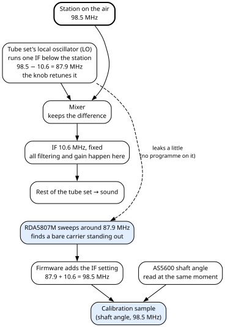
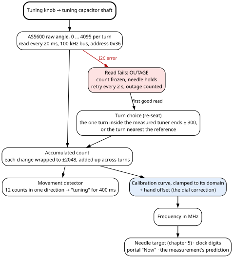
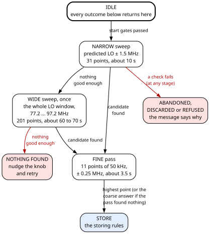
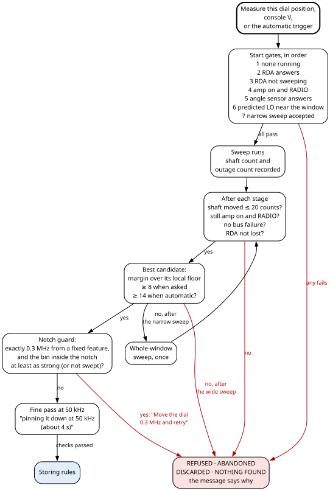
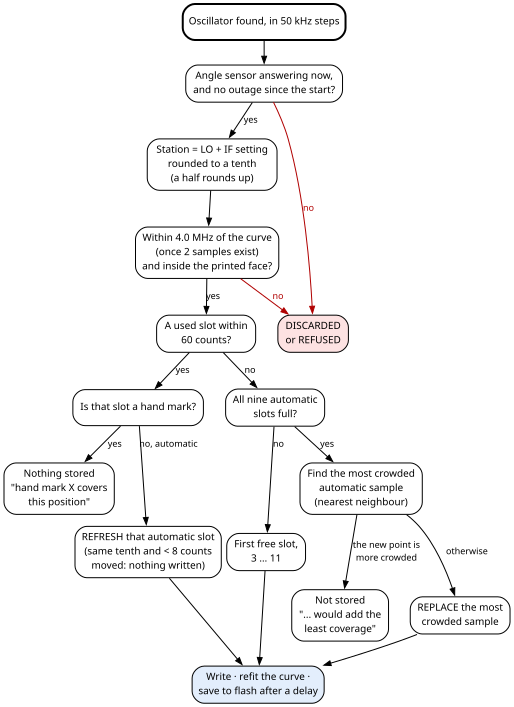

# 6. Tuning and the dial's self-calibration

You tune the radio with its original knob, which turns the tube set's own tuning capacitor. The
main board reads the angle of that capacitor's shaft and turns it into a frequency in megahertz
(MHz). That frequency drives the needle on the glass, the clock digits when they are set to show
tuning, and the **Now** readout on the portal. The relation between shaft angle and frequency is a
curve. It is not known in advance, and it can drift, so the machine measures it itself: a small FM
receiver chip inside the cabinet listens to the tube set's own oscillator and works out where the
set is really tuned.

Chapter 2, section 2.2 explains how the two sensors share the work: the angle sensor is the live
measure, and the receiver chip only calibrates the curve. Chapter 5 is the needle half of the chain.
This chapter is the tuning half.

> **Specific to this build — adapt.** The tuning chain is fitted to this LLOYDS TM-838N: its dial,
> its intermediate frequency and its local oscillator. Your set will differ. The method carries over.

## 6.1 What you see

1. **You turn the knob.** The needle follows, the portal's **Now** shows the frequency to a tenth of
   a MHz, and the clock digits show it too when set to (section 6.4).
2. **You listen to the radio and leave the knob alone.** After 8 seconds of stillness the radio
   measures the dial by itself, at most once every five minutes. The outcome appears on the portal's
   Needle tab, under *last measurement*. For example:
   `RE-MEASURED 106.1 MHz (LO 95.50, +36 over local) -> slot 4; 6 stored; curve QUADRATIC`.
   Section 6.8 works through this very line.
3. **You press Measure this dial position.** The same measurement, at once, with a slightly lower
   bar for what counts as found. It takes about 15 seconds when the curve already predicts well, up to
   about 85 seconds when it has to search the whole range. A refusal always says why.
4. **The measurements accumulate.** Nine slots hold measured samples. A measurement near an existing
   sample replaces it, so the positions you actually listen to keep being re-measured. Once all
   nine are full, a new position replaces the most crowded sample, so the nine stay spread across
   the dial.
5. **You can correct by hand.** You can type up to three stations you know by ear (the **hand
   marks** A, B and C), slide the whole curve in 0.1 MHz steps (the **dial correction**), reset that
   correction to 0, and remove any single sample. **Nothing automatic ever changes a hand mark or the
   dial correction.**
6. **You tune past the printed scale.** The clock digits stop at the end of the scale. The portal's
   **Now** keeps the true value and adds "(past the printed face)".

## 6.2 Radio terms you need

**Superheterodyne ("superhet").** The tube set does not amplify the station it receives directly. It
generates a signal of its own, the **local oscillator (LO)**, and mixes the incoming station with it.
The mixer produces the difference between the two frequencies. That difference is fixed by design and
is called the **intermediate frequency (IF)**. All the set's filtering and amplification happen at
the IF. Turning the knob retunes the LO; the IF never moves. So at any knob position the LO and the
station differ by exactly the IF.

**Low-side injection.** The LO can run above the station ("high-side") or below it ("low-side"). This
set's FM oscillator runs **below** the station, so the firmware computes **station = LO + IF**. This
was measured on the bench (section 6.13), and the Hardware Bible records it (chapter 13).

**The IF value.** This set's FM IF is **10.6 MHz**. It was set when a professional tuned the FM path,
and the RDA5807M's readings of the oscillator agree with it. The 10.7 MHz on the set's drawing is the
design value. The firmware's IF is a setting, **Tube set IF**, with a default of 10.60 MHz (section 6.11).

**Why the LO can be heard.** A set of this age has nothing that stops its oscillator from radiating a
little. A receiver a few centimetres away hears it as a **bare carrier**: a signal with nothing
broadcast on it. The RDA5807M's antenna is a 30 cm wire inside the tube radio's cage, bent over the
radio's FM oscillator (Hardware Bible, chapter 8, section 8.5).

**Worked example.** The set is tuned to a station at 98.5 MHz. With an IF of 10.6 MHz the LO runs at
98.5 − 10.6 = 87.9 MHz. The RDA5807M, sweeping around 87.9 MHz, finds a carrier standing out there.
The firmware adds the IF back: 87.9 + 10.6 = 98.5 MHz. It reads the shaft angle at the same moment
and stores the pair (angle, 98.5 MHz) as a **sample**.

**RSSI.** "Received signal strength indicator": the strength number the RDA5807M reports for the
frequency it is tuned to, from 0 to 127 (bits 15:9 of its register 0x0B).

**Spur, fixed feature, notch.** A **spur** is a signal the RDA5807M hears that is *not* the tube
set's oscillator: interference made inside the cabinet itself. It stays at the same frequency
whatever the knob does. The firmware calls a learned spur a **fixed feature**, and around each one it
cuts a **notch**: the search may not choose any frequency within ±0.2 MHz of a fixed feature. On this
radio the spurs form a **comb** of seven peaks, at 79.0, 81.8, 84.6, 87.4, 90.3, 93.1 and 95.9 MHz,
2.7 to 2.8 MHz apart, present with the set switched on and off. One of them, 79.0 MHz, reads louder
than the oscillator. Their source is unknown (section 6.15).

**Stereo pilot.** An FM broadcast in stereo carries a 19 kHz "pilot" tone. A bare oscillator never
carries one. So when the RDA5807M's stereo indicator (register 0x0A, bit 10) is set on a strong
signal, that signal is a broadcast and not the LO. The indicator can only *reject*: a mono or weak
broadcast reads the same as a bare carrier.

**Floor, local floor, margin.** The **floor** of a sweep is the median RSSI of all its points. The
**local floor** of one point is the median of up to 16 neighbours within ±0.8 MHz of it. The
**margin** of a point is its RSSI minus its local floor. The firmware judges a peak by its margin,
never by its height.

## 6.3 Units and tasks

Several units are mixed on purpose. In the code, the end of a variable's name tells its unit.

| Name ending | Unit | Example |
|---|---|---|
| `f10`, `...10` | tenths of a MHz | 985 = 98.5 MHz |
| `f20`, `...20` | twentieths of a MHz (50 kHz steps) | 1971 = 98.55 MHz; IF 212 = 10.60 MHz |
| `acc`, `tuneP[]`, `calLow`, `calHigh` | angle sensor **accumulated counts**: 4096 per shaft turn, counted across turns | — |
| permille | 0 to 1000 across `calLow` … `calHigh` | shown only by the console `s` |

**On this radio the count falls as the frequency rises.** The firmware never relies on that direction:
every test compares sizes or the signs of slopes, never order.

> **For firmware changes**
>
>
> The tuning work runs in four places on the main board, all but the portal on core 1. Chapter 2,
> section 2.4 has the full task table.
>
> | Work | Runs in | Priority | Rate |
> |---|---|---|---|
> | Angle sensor read | the needle task | 4 | every 20 ms |
> | RDA5807M sweeps and fine passes | its own task, `rda` | 2 | looks for a request every 100 ms; each point takes at least 300 ms |
> | Measurement stages, automatic trigger, console keys, saving `lastAngle` | the main loop | 1 | every pass; `lastAngle` checked every 10 s |
> | Portal actions (measure, marks, settings) | the portal task, core 0 | 3 | on request |
>
> **The RDA task outranks the main loop on the same core.** A path in it that never pauses starves the
> main loop, and a main loop starved for more than 2 seconds mutes the audio (the link to the audio
> board times out). So every path in the RDA task pauses: 300 ms per measured point, 10 ms per failed
> point, 100 ms while idle. The main loop is also under a 15-second watchdog (chapter 4); the RDA task
> is not watched.
>

## 6.4 From shaft angle to megahertz

**1. Read.** Every 20 ms the firmware reads the 12-bit raw angle from the AS5600, a magnetic angle
sensor on the tuning capacitor's shaft, at I2C address 0x36 on the main board's first I2C bus. I2C is
the two-wire bus the main board uses to talk to its sensors. The firmware runs this one at 100 kHz,
not 400 kHz: slower edges radiate less, and a hand-turned knob needs no speed. The difference from
the previous read is wrapped to ±2048 counts and added to the **accumulated count**, which carries on
across shaft turns.

The firmware only ever *reads* the sensor: the raw angle, its status, its automatic gain (AGC) and the
magnetic field strength. It writes none of its configuration and never touches its one-time
programmable range, which can be burned once only, ever. The sensor runs at its power-on settings, and
all scaling is done in firmware. The full 4096 counts per turn are plenty: the tuner's roughly 2200
counts across 20 MHz are about 10 kHz per count, against channels 200 kHz apart. The status is kept as
three separate facts (magnet detected, too weak, too strong) beside the gain and the field strength.
That is because "no magnet" covers three conditions that need different fixes.

**2. Which turn.** The AS5600 knows the angle within one turn only. At start-up, and after an outage,
the firmware must choose the turn:

- If **both tuner ends were measured**, and the span between them plus 300 counts on each side is
  narrower than one turn, exactly one turn puts the angle inside that window. That turn is taken,
  whatever moved meanwhile.
- **Otherwise** (ends not measured, the window a whole turn or wider, or the angle outside it) the
  turn nearest a reference is taken: the saved `lastAngle` at start-up, the last count after an
  outage. That is right for any movement under half a turn.

The main loop saves the live count as `lastAngle` every 10 seconds, only when it changed and only
while the sensor answers. A placeholder count from before the first good read is never saved. At
start-up the measured tuner ends are loaded before the first reading is placed on its turn, so the
ends can choose the turn (chapter 4 gives the whole start-up order).

On this tuner the whole travel lies inside one shaft turn: about 2200 counts (2197 measured), some
190 degrees. The firmware relies on that and on the ends repeating within 300 counts; it checks the
first at run time, and a measured span too wide for one turn falls back to the nearest turn.

**3. Outages.** When a read fails, the sensor is left alone for 2 seconds before the next try, the
outage counter goes up once, and the sensor is reported down (`i2c` 0 in the portal's state). While
it is down, the count is frozen and the needle holds its last target. On the first good read the
angle is **re-seated** on a turn by the rule above, never simply added across the gap. A movement
hidden by the outage counts as tuning, and the console prints how far the shaft moved. The sensor is
reported up again only after the re-seat. Chapter 2, section 2.2 says what each surface does
meanwhile.

**4. "The knob is being turned."** The firmware treats the knob as being turned for 400 ms after the
last detected movement. A movement is detected when changes in the same direction add up to 12 counts
(the deadband). A reversal resets the sum, so sensor jitter never trips it, and a slow turn still
counts. This drives the tuning readout on the clock digits and every "knob still" timer. Those timers
include the 3-second wait before a needle re-index (chapter 5) and the 8 seconds before an automatic
measurement.

**5. The curve.** The count is clamped to the range the curve was fitted over (its **domain**), the
curve is evaluated in tenths of a MHz, and the **hand offset** (the dial correction) is added. A
curve value that is not a number, or lies outside 10 to 300 MHz before the offset is added, gives
88.1 MHz plus the offset instead. One version of the result is rounded to the nearest tenth, another
is not; the table below says which surface shows which.

**6. Who uses which count.** The needle follows a filtered copy of the angle (chapter 5). The
measurements, the readouts and the movement detector all use the raw accumulated count.

**Where the frequency is shown.**

| Surface | What it shows |
|---|---|
| Clock digits, `showTuning` = 1 ("Tuning always") | The frequency rounded to the nearest tenth, held inside `dialLow` … `dialHigh`. Shown whatever the amplifier and source. The panel has no decimal point: `1017` means 101.7 MHz. |
| Clock digits, `showTuning` = 2 ("Tuning while tuning") | Only while the amplifier is on and the source is RADIO, and for `tuneHoldMs` after the last movement. The unrounded frequency, held inside the printed face, then snapped to the nearest odd tenth (87.9, 88.1, … the grid of FM channels in the Americas), never off the face. |
| Portal **Now** | The frequency to a tenth, **not** held inside the face; "(past the printed face)" is added outside `dialLow` … `dialHigh`. Shown whenever the angle sensor answers. |
| Portal Needle tab | *last measurement* (the last outcome sentence, or "measuring N % ..."), *tuning curve* (how many samples, the model, the hand offset), *tuner reaches* (the curve's frequencies at the two ends of its domain). |

Chapter 4 describes the clock readout's modes in full.

## 6.5 The calibration curve

The curve is fitted through **samples**: pairs of (shaft count, frequency in tenths of a MHz). There
are twelve slots. **Slots 0 to 2 are the hand marks A, B and C**; **slots 3 to 11 are RDA samples**.
The fit treats them alike. Every change to any setting refits the curve, so a stored sample and the
running curve can never disagree.

| Samples | Curve |
|---|---|
| Fewer than 2 | The **stored straight line**: from `bandLow` (88.1 MHz) at `calLow` to `bandHigh` (107.9 MHz) at `calHigh`. |
| 2 | A least-squares straight line. |
| 3 or more | A **quadratic** (a gentle curve), accepted only if its slope has the same sign at both ends of the domain: a tuner never turns back. Otherwise, or if the samples are degenerate, a least-squares straight line. |

**Least squares** means the curve that makes the sum of the squared errors at the samples as small as
possible.

**The domain.** If both tuner ends are measured, the domain is exactly `calLow` … `calHigh`, widened
only to include a sample outside it. If not, it is the samples' own span padded by 30 % on each side
(at least 100 counts), and the curve's description says "tuner ends NOT measured". Until the ends are
measured, `calLow` and `calHigh` hold the placeholders 0 and 6023, which mean "not measured".

**Guards.** At both ends of the domain the curve, without the hand offset, must lie between 50.0 and
200.0 MHz, and the two ends must be at least 2.0 MHz apart. If either test fails, the stored straight
line is installed instead.

**The tuning sentence.** The model actually running is recorded, never guessed from the number of
samples. One sentence describes it, "N marks, MODEL, reaches X - Y MHz", and the console, the portal's
card and every tuning message print that same sentence. These words in it mean something is wrong:

| Words in the sentence | Meaning | What you do |
|---|---|---|
| "QUADRATIC REFUSED: turns back on itself" | The quadratic would reverse inside the tuner's travel; a straight line is running. | Find the bad sample (console `s` residuals) and drop it. |
| "the marks are degenerate" | The samples cannot define a quadratic; a straight line is running. | Drop the bad sample. |
| "MARKS REFUSED (...)" | The fit failed a guard; the stored straight line is running. The portal's message is red. | Re-mark or drop the bad sample. |
| "tuner ends NOT measured" | The domain is a guess padded around the samples. | Press **Tuner = low end** and **Tuner = high end** (section 6.10). |

Typing `calLow` or `calHigh` into its portal row returns the sentence as a warning when something is
wrong (the fit refused or demoted, or a tuner end not measured). A single field edit can demote the
curve and throw marks away, and the answer says so instead of a plain "ok".

> **Caution — the reach can reassure falsely.** The stored straight line always reports the most
> reassuring reach, 88.1 to 107.9 MHz. Read the model in the sentence, not the reach, to know whether
> your samples are in use.

## 6.6 The RDA5807M as an instrument

The RDA5807M is a single-chip FM receiver. Here it plays no sound: it is a measuring instrument. It
sits on the main board's **second** I2C bus, which the firmware runs at 100 kHz, and answers at
address 0x11; the firmware addresses it there only. The chip, its supply and its antenna are in the
Hardware Bible, chapter 8, section 8.5.

> **For firmware changes**
>
>
> **Set-up.** At start-up and at every re-probe the firmware resets and enables the chip, then writes:
>
> | Setting | Value | Why |
> |---|---|---|
> | Register 0x02 | DHIZ, DMUTE, NEW_METHOD, ENABLE | NEW_METHOD is a sensitivity mode of the chip; the bench test ran with it. |
> | **MONO** (in 0x02) | cleared | The stereo indicator needs the stereo decoder running. |
> | **AFC** (automatic frequency control), register 0x04 | **off** | AFC would let the chip slide toward a louder neighbour and report its frequency. |
> | Band, register 0x03 | band 2, 76 to 108 MHz, 100 kHz spacing | The LO window starts at 77.2 MHz, below the ordinary 87–108 band. |
> | Low-noise amplifier, register 0x05 | both input ports, 2.7 mA | The chip's most sensitive settings. The bench test used the defaults (1.8 mA, one port) and still read the LO at 59 against a floor of 44, but inside the cabinet that margin might not survive, and these cost nothing. Both ports work whichever way the module's antenna pad is routed. |
> | Volume, register 0x05 | 0 | An instrument, not a radio. |
>

The chip is set up at start-up and at every re-probe. Every one of these set-up writes must succeed, and a final read of register 0x0A must answer, or the chip is
reported absent. A **re-probe** runs the whole set-up again, not just a check for an answer: a chip that
came back may have browned out and reset to its power-on defaults, AFC on among them.

**One point.** The firmware tunes the chip to a channel, on the 100 kHz grid (channel = tenths of a MHz
− 760) or the 50 kHz grid (channel = twentieths − 1520), waits up to 60 ms for the chip's "tune
complete" flag (STC, register 0x0A bit 14), then waits **300 ms**, the **dwell**, whatever the
caller asked. The RSSI reading needs about 300 ms to settle after a tune: on the bench a 40 ms dwell
hid the oscillator completely. Then it reads the RSSI and the stereo flag. The stereo flag is read only
after the tune has completed, because its power-on value is 1 and an early read says "stereo" for
everything. A failed read is a failure: never a zero, and never "mono".

**A sweep** is a run of points 100 kHz apart, each kept as a **bin**. It is clamped to the **LO
window, 77.2 to 97.2 MHz**, a compiled range. A sweep is refused if one is already running or asked
for, if the chip is absent and a re-probe fails, or if nothing is left after the clamp. A failed point
is recorded as RSSI 0 and counted. At the end, the sweep's floor is the median of all its bins.

| Sweep | Points | Time |
|---|---|---|
| Narrow, ±1.5 MHz around a prediction | 31 | about 10 s |
| The whole window | 201 | about 60 to 70 s |
| Fine pass, ±0.25 MHz in 50 kHz steps | 11 | about 3.5 s |

**The candidate.** Over the last sweep's bins, skipping any bin within ±0.2 MHz of a fixed feature
and any bin whose stereo flag is set **above the floor + 3**, the firmware picks the bin with the
**largest margin** over its local floor. The local floor uses up to 8 bins each side.

**The fine pass** pins the candidate down: eleven points 50 kHz apart, ±0.25 MHz around it. It skips
any point within ±0.2 MHz of a fixed feature, and any point whose stereo flag is set above the last
sweep's floor + 3. It keeps the **highest** reading: the coarse sweep has already decided this is the
oscillator, and a local floor over eleven neighbouring points would measure the peak against itself.
If every point was skipped or read 0, the pass found nothing. The fine pass is not clamped to the LO
window (only its centre must be inside it), so it can reach 0.25 MHz past either end. Sweeps and fine
passes share one request slot, so only one run is ever in progress.

**Both halves stay readable.** The coarse bins and the fine pass's eleven points stay readable until
the **next sweep** starts; only a sweep clears them. In the fine list, a point skipped as a fixed
feature, or whose read failed, shows RSSI 0; a point skipped as a broadcast keeps the RSSI it read. A
fine pass that loses the chip keeps no points.

**Losing the chip.** Five failed points in a row end the run. The chip is marked **lost**, and the run
publishes nothing (no bins, floor 0). A re-probe tries the chip again at most once every 10 seconds,
never while a run holds the bus, and runs the whole set-up if it answers. Every sweep request, fine
pass request, measurement start and automatic trigger calls the re-probe. The firmware also counts
every failed transfer of the last run, in a row or not.

**Fixed features.** The list lives in the settings, up to 16 entries, empty by default. The RDA task
holds a copy, refreshed whenever settings change. It is learned by hand with the console key `o`,
which marks the current best candidate of the last sweep as a fixed feature and saves the list. Do it
with the set powered but switched **off**: the mains cord in, so both boards and the RDA5807M run, and
the front switch off. The tube set runs only while the amplifier does, so its oscillator is then not
running, and every peak is a spur (section 6.10, step 2). The console `O` or the portal's **Forget the fixed features** clears the list,
and the clear is saved too. At start-up a stored list longer than 16, or with any entry outside 77.2 to
97.2 MHz, is cleared whole.

## 6.7 One measurement

A measurement is started by a person (**Measure this dial position** on the portal, or the console
`V`) or by the automatic trigger (section 6.8). It moves through stages: a **narrow** sweep around
the predicted LO; if that finds nothing good enough, one **wide** sweep of the whole window; then a
**fine** pass at 50 kHz; then **storing**. Each stage is judged once its sweep has finished.

**Start gates, in order.** Each refusal says why.

| # | Gate | Refused when |
|---|---|---|
| 1 | No measurement already running | one is running |
| 2 | The RDA5807M is present, or answers a re-probe | it does not; the message tells "stopped answering after boot" from "not answering" |
| 3 | The RDA5807M is not sweeping | it is |
| 4 | The amplifier is on **and** the audio board reports the source RADIO | "the dial calibrates only while you listen to the radio - switch the amp on and select RADIO" |
| 5 | The angle sensor answers | it does not |
| 6 | ±1.5 MHz around the predicted LO touches the LO window | "the dial is outside the range the oscillator can be measured over" |
| 7 | The narrow sweep request is accepted | it is refused |

The **predicted LO** is the curve's frequency at the current shaft position minus the IF.

Gate 4 is a **listening policy**, not a statement about the oscillator. The tube set runs whenever the
amplifier does; the source selector only tells the audio board which sound to play. The dial
calibrates, and the needle follows (chapter 5), only while the radio is what you are listening to, by
choice.

Only once all seven pass does the firmware record the shaft count, the angle sensor's outage count and
the stage.

**Checks after every stage, before anything is kept.**

| # | Check | Outcome |
|---|---|---|
| 1 | The shaft moved no more than **20 counts** since the start (about 0.2 MHz on this tuner) | otherwise ABANDONED, "hold it still" |
| 2 | The amplifier is still on and the source still RADIO | otherwise DISCARDED |
| 3 | No bus failure during the run (unless the chip was lost: checks 4 and 5) | otherwise DISCARDED, "press measure again" (asked for) or "it will retry by itself" (automatic) |
| 4 | Fine stage: the chip was lost | ABANDONED. Otherwise the fine pass's answer is stored, or the coarse answer if the fine pass found nothing |
| 5 | Sweep stage: the chip was lost | ABANDONED, naming the connector, "not a fixed feature" |
| 6 | The best candidate has a margin of at least **8** (asked for) or **14** (automatic) | then the notch guard, below |
| 7 | Nothing good enough after the narrow sweep | one whole-window sweep, stage WIDE |
| 8 | Nothing good enough after the wide sweep | "NOTHING FOUND in the whole window ... nudge it and retry" |

**The notch guard.** If the candidate is exactly 0.3 MHz from a fixed feature, the firmware looks at
the bin one step toward the feature, inside the notch. If that bin is at least as strong as the
candidate, or was not swept, the real peak may be hidden in the notch, and the measurement is REFUSED:
"Move the dial 0.3 MHz and retry". Otherwise the fine pass starts ("pinning it down at 50 kHz (about 4
s)"). If the fine pass is refused, the coarse answer is stored at once.

**Storing.**

1. The angle sensor answers now and has had no outage since the start, or DISCARDED.
2. **Station = LO + IF**, added in twentieths of a MHz, then rounded to a tenth (a half rounds up).
3. **Disagreement gate**, once at least 2 samples exist (hand marks included): REFUSED if the answer is
   more than **4.0 MHz** from what the curve says at the current shaft position.
4. REFUSED if the answer is outside the printed face, `dialLow` … `dialHigh`.
5. **Slot choice.** The first used slot within **60 counts** of the start position is "this position".
   If it is a hand mark, nothing is stored ("hand mark X covers this position"). If it is an automatic
   slot, that slot is **refreshed**. Otherwise the first free slot from 3 to 11 is used.
6. **A full table keeps the samples spread.** If slots 3 to 11 are all used and none is within 60
   counts, the firmware finds the **most crowded automatic sample**. For each of slots 3 to 11 it takes
   the distance, in shaft counts, to that sample's nearest neighbour. Neighbours are every other stored
   sample, the hand marks included, **and the new point**. The smallest distance marks the most crowded
   sample; on a tie, the lowest slot. Then:
   - if the new point's own nearest neighbour among the stored samples is **closer** than that
     distance, the new point is itself the most crowded and would add the least. Nothing is stored:
     "measured f, not stored: every sample slot is full and this position would add the least
     coverage";
   - otherwise the new point **replaces** the most crowded sample, in its slot.

   Hand marks are never replaced, but they count as neighbours.
7. **Nothing changed, nothing written.** A refresh that gives the same tenth with less than 8 counts of
   movement writes nothing, and says so: "slot 3 still reads 98.6 - nothing changed, nothing written".
8. The sample is written, the curve refitted, and the settings saved to flash after a short delay. The
   hand offset is **never** touched by a sample.
9. The report: "MEASURED (or RE-MEASURED) f MHz (LO x, +m over local) -> slot n; k stored; curve:
   model". A replacement reads "MEASURED (replacing the most crowded sample)", and the console adds
   which frequency it replaced. Every accepted sample shows its evidence, the oscillator's frequency
   and the margin, on the console and on the portal.

Every outcome, stored or not, is printed on the console and kept as the portal's *last measurement*.

**Why the two rules together.** The automatic measurement happens where the knob rests, and the knob
rests where you listen. The 60-count refresh therefore keeps re-measuring the positions actually used,
which is where drift matters. The replacement rule handles a tenth listening position once all nine
slots are taken: it gives up the sample that adds the least coverage, so the nine keep spanning as much
of the dial as they can.

**Worked example of a replacement.** Hand marks sit at counts 100, 900 and 1700. Automatic samples at
200, 300, 500, 700, 1100, 1300, 1500, 1900 and 2100 fill slots 3 to 11, in that order. A measurement
at count 1000 finds nothing within 60 counts.

| Slot | Sample at | Nearest neighbour | Distance |
|---|---|---|---|
| 3 | 200 | 100 (mark) | 100 |
| 4 | 300 | 200 | 100 |
| 5 | 500 | 300 | 200 |
| 6 | 700 | 900 (mark) | 200 |
| 7 | 1100 | 1000 (the new point) | 100 |
| 8 | 1300 | 1100 | 200 |
| 9 | 1500 | 1300 | 200 |
| 10 | 1900 | 1700 (mark) | 200 |
| 11 | 2100 | 1900 | 200 |

The smallest distance is 100, first reached by slot 3. The new point's own nearest neighbour is 900 or
1100, 100 counts away: not closer than 100. So slot 3 gives up its sample at 200 to the new point at
1000.

## 6.8 The automatic measurement

On every pass of the main loop, the firmware starts an automatic measurement when **all** of these
hold:

- the knob has been still for **8 seconds**;
- no measurement is running;
- **5 minutes** have passed since the last automatic *attempt*, successful or not (the first attempt
  after start-up needs no wait);
- the amplifier is on and the source is RADIO;
- the angle sensor answers;
- the RDA5807M is present (one re-probe allowed) and not sweeping;
- the predicted LO is near enough the LO window (start gate 6).

It does not look at what the needle is doing. There is no switch to turn it off. An automatic
measurement needs a margin of 14, against 8 when a person asks.

**A real one, worked through.** The radio was playing, with the needle tracking 105.8 MHz, and the
automatic measurement reported: `RE-MEASURED 106.1 MHz (LO 95.50, +36 over local) -> slot 4; 6 stored;
curve QUADRATIC`. The record gives the start and the result; the middle steps follow from the code,
taking the learned fixed features to be the seven-peak comb.

1. **Trigger.** Knob still for 8 seconds, 5 minutes since the last attempt, RADIO playing.
2. **Prediction.** The curve says 105.8 MHz (1058 tenths). The IF in tenths is (212 + 1) ÷ 2 = 106.
   Predicted LO = 1058 − 106 = 952, that is 95.2 MHz. ±1.5 MHz around it, 93.7 to 96.7 MHz, overlaps
   the window 77.2 to 97.2.
3. **Narrow sweep**, 93.7 to 96.7 MHz, 31 bins. The fixed feature at 95.9 notches 95.7 to 96.1 out of
   the search.
4. **Candidate.** The bin at 95.5 stands 36 above its local floor. 36 ≥ 14: accepted. It is 0.4 MHz
   from 95.9, not 0.3, so the notch guard does not apply.
5. **Fine pass** around 95.5: 95.25 to 95.75 in 50 kHz steps. 95.70 and 95.75 lie within 0.2 MHz of
   95.9 and are skipped. The highest reading is at 95.50 (1910 twentieths).
6. **Station.** 1910 + 212 = 2122 twentieths = 106.10 MHz; (2122 + 1) ÷ 2 = 1061 → **106.1 MHz**.
7. **Gates.** 106.1 − 105.8 = 0.3 MHz, within 4.0. Inside 87.9 to 107.9. An automatic slot, 4, lies
   within 60 counts: refresh. The value or the position changed, so it is written.
8. The hand offset is left alone. Refit: still a quadratic.

**The rounding.** Had the fine pass found the LO at 95.05 MHz (1901), the station would be 1901 + 212
= 2113 twentieths, 105.65 MHz, stored as (2113 + 1) ÷ 2 = 1057, 105.7 MHz. An LO at 95.10 also stores
105.7. Half of the 50 kHz resolution is lost on storage (section 6.15).

## 6.9 Buttons and keys

The portal buttons are on the Needle tab, admin only. The console keys also work from the portal's
Console tab. Appendix C lists every portal action, Appendix D every console key.

| Portal button (action) | Console key | What it does |
|---|---|---|
| **Measure this dial position** (`rda.sample`) | `V` | One measurement at the current position, stored if it passes every gate (section 6.7). |
| **Mark station A/B/C here** (`tune.markA/B/C`); asks for the MHz | — | Stores (current shaft count, typed frequency) in slot 0, 1 or 2. Refused outside 87.0 to 108.5 MHz, while the angle sensor is down, or within 60 counts of another hand mark. Removes any automatic sample within 60 counts. Leaves the hand offset alone. |
| **Clear all marks** (`tune.clear`) | — | Empties all 12 slots: back to the stored straight line. Keeps the hand offset, and says so when it is not 0. |
| **Dial −0.1 MHz** / **Dial +0.1 MHz** (`tune.nudge`) | — | Adds to the hand offset, which slides the whole curve. ±0.1 to ±5.0 MHz per request, ±20 MHz in total. Reports the unsnapped frequency now tuned. |
| **Reset the dial correction to 0** (`tune.nudgeZero`) | — | Sets the hand offset to 0 and refits. Apart from restoring a settings file, the only way the hand offset is erased. Answers "the dial correction is already 0" when there is nothing to do. |
| **Drop one sample (slot 0-11)** (`tune.drop`); asks for the slot | — | Empties one slot, hand marks included. Leaves the hand offset alone. |
| **Tuner = low end** / **Tuner = high end** (`needle.tuneLow/High`) | `c` / `C` | Stores the current shaft count as `calLow` / `calHigh` and records that end as measured. Refused while the angle sensor is down. Refits. |
| **Forget the fixed features** (`rda.spurClear`) | `O` | Empties the fixed-feature list and saves. |
| — | `o` | Marks the last sweep's best candidate as a fixed feature and saves. Refused if already known or the list is full (16). |
| — | `R` | The RDA5807M's state, its bus, the window, and where the LO should be. |
| — | `q` / `v` | A whole-window sweep (about a minute) / a narrow sweep at the prediction (about 10 s). Not a measurement: nothing is stored. A refused sweep says "sweep refused - see the RDA state in 's' (running, absent, or lost)". |
| — | `a` | Prints the last sweep, bin by bin, then the fine pass's points under "fine pass (50 kHz; 0 = skipped)", with the chosen one marked "<<< chosen". |
| — | `s` | Status: the tuning chain, the tuning sentence, the hand offset, each sample with the curve's value there and the **residual** (the difference), and the RDA5807M's state with the best candidate. |
| — | `D` | The settings dump, which includes the IF as `ifOffset=` (chapter 7). |
| **Tube set IF** (a setting row) | — | The IF the firmware adds to the LO (section 6.11). |

> **For firmware changes**
>
>
> > **For developers: `GET /api/rda` (admin).** The last measurement as JSON: `n`, `floor`, `if10`,
> > `bins` as "f10 rssi flag;", `fine` as "f20 rssi;" (the fine pass's points, in twentieths of a MHz),
> > and `spurs`. The bin flags: `.` ordinary, `^` above the floor + 5, `S` stereo pilot decoded, `X`
> > fixed feature.
>

## 6.10 Calibrating from scratch

Chapter 3 gives the whole first-time order. This is the tuning part of it, done **after** the needle
is calibrated (chapter 5).

1. **The tuner ends.** Turn the knob to its low physical stop and press **Tuner = low end** (or `c`),
   then to its high stop and press **Tuner = high end** (or `C`). The console `s` prints both, signed,
   and the span. A negative value is not an error: on this radio the count falls as the frequency
   rises. Judge the span against the mechanism, not against the placeholder 6023: a tuning capacitor
   sweeps about half a turn (on this radio about 2200 counts, some 190 degrees of shaft). A span short
   by about a whole turn (4096) is the sign of a lost revolution; the `residue` in the `s` tuning chain
   is the check.
2. **The fixed features.** Leave the set powered but switched **off**: the mains cord in and the front
   switch off. The boards and the RDA5807M keep running; the amplifier, and with it the tube set and its
   oscillator, is off. Sweep the whole window (`q`, about a minute), print it (`a`), and press `o` once per peak:
   each press marks the strongest remaining candidate. Stop when what is left is noise. On this radio
   that was seven presses.
3. **Three spread positions.** Switch the set on and select RADIO. Turn the knob to a position low on
   the dial, press **Measure this dial position**, and wait: about 15 seconds when the prediction is
   close, up to about 85 seconds when it has to sweep the whole window. Repeat in the middle and near
   the top. Three samples turn the stored straight line into a quadratic. A "NOTHING FOUND" means the
   oscillator sits under a notch: nudge the knob and try again.
4. **Check it without going in a circle.** Tune to a station you know that is *not* one of the three
   positions, and read the portal's **Now**. A quadratic passes through its three samples whatever they
   are, so only a fourth position proves the curve.
5. **After that, nothing is needed.** The automatic measurement re-measures wherever the knob rests
   while the radio plays, and fills the other automatic slots. Hand marks and the dial correction are
   optional, and only a person's hand ever changes them.

If the tube set's IF is not 10.60 MHz, set **Tube set IF** before step 3: every sample is the
oscillator plus that value.

## 6.11 Settings and constants

**Saved settings.** All are on the portal's Needle tab (admin) unless stated, and in the settings file.

| Setting | Default | Range | What it does |
|---|---|---|---|
| `ifOffset` ("Tube set IF") | 10.60 MHz | 10.00 to 11.50 MHz, step 0.05 | The tube set's IF: station = LO + this. Stored in 50 kHz steps (default 212). |
| `calLow` / `calHigh` | 0 / 6023 (placeholders, "not measured") | −20000 to 20000 counts | Shaft count at the tuner's low / high mechanical end. Sets the curve's domain, the stored line's slope, and the turn choice. Set by **Tuner = low/high end**, `c` / `C`, the portal rows or the file; typing a value counts as measuring that end. |
| `tunerEndsSet` | 0 | 0 to 3 | Which ends were really measured: bit 0 low, bit 1 high. |
| `bandLow` / `bandHigh` | 88.1 / 107.9 MHz | settings file only | The two ends of the stored straight line used below 2 samples. |
| `tuneUsed`, `tuneP[i]`, `tuneF[i]` | empty | 12 slots | The samples: 0 to 2 hand marks, 3 to 11 RDA samples. Written by the mark buttons, the measurements, drop, clear and the file. |
| `tuneOffset10` (the dial correction) | 0 | ±20 MHz in total | The hand offset added to the whole curve. Moved only by **Dial ±0.1 MHz**, reset only by **Reset the dial correction to 0** or a file restore. Nothing automatic touches it. |
| `spurUsed`, `spur[16]` | empty | 77.2 to 97.2 MHz (LO) | The learned fixed features. Console `o` / `O`, **Forget the fixed features**, the file. |
| `showTuning` | 0 | 0 clock, 1 tuning always, 2 tuning while tuning | The clock digits' readout mode (chapter 4). Display tab, console `f`. |
| `tuneHoldMs` | 4000 ms | 500 to 20000, step 250 | How long mode 2 keeps the frequency after the last movement. Display tab. |
| `lastAngle` | 0 | — | The last live shaft count, for the turn choice at start-up. Automatic, checked every 10 s. |

`dialLow` and `dialHigh` (87.9 and 107.9 MHz on this dial) are in chapter 5, section 5.17. For tuning
they also hold the clock digits inside the printed face and bound which samples are accepted.

**In flash and in the settings file.** All tuning state is part of the main board's one settings
structure (chapter 7 covers its format and versions). In the settings file the samples are lines
`tuneMark<i>=acc,f10` and the fixed features `spur<i>=f10`. A restore applies each of the two lists
whole or not at all. While a freshly updated main-board firmware is on trial, nothing is written to
flash: a sample stored then waits in memory until the firmware is confirmed (chapter 3).

> **For firmware changes**
>
>
> **Compiled constants.**
>
> | Constant | Value | File | Meaning |
> |---|---|---|---|
> | `TUNE_MARKS` | 12 | main.cpp | Sample slots. Part of the settings layout. |
> | `CFG_SPURS` | 16 | main.cpp | Fixed-feature slots in the settings layout. |
> | `Rda::MAX_SPURS` | 16 | rda.h | Fixed features the RDA task holds. Must equal `CFG_SPURS`; the build stops otherwise. |
> | `Rda::MAX_BINS` | 210 | rda.h | Bins of one sweep (201 plus slack). |
> | `FINE_POINTS` | 11 | rda.cpp | The fine pass's points kept for inspection. |
> | `Rda::LO_WINDOW_LO10` / `HI10` | 772 / 972 | rda.h | The LO window, 77.2 to 97.2 MHz: a dial of 87.9 to 107.9 MHz minus the design IF of 10.7 MHz. Compiled; not derived from the IF setting or the dial. At 10.6 MHz it covers stations 87.8 to 107.8 MHz. |
> | `Rda::IF_OFFSET20_NOMINAL` | 214 | rda.h | The design IF, 10.70 MHz. Used by no code. |
> | `LOST_AFTER` | 5 | rda.cpp | Failed points in a row that mark the chip lost. |
> | `PROBE_GAP_MS` | 10000 | rda.cpp | Shortest time between re-probes. |
> | dwell | 300 ms minimum | rda.cpp | Wait after each tune before reading RSSI. |
> | "tune complete" wait | 60 ms | rda.cpp | Longest wait for the chip's flag. |
> | fine pass | ±5 points of 50 kHz | rda.cpp | ±0.25 MHz. |
> | notch | ±2 tenths; ±4 twentieths in the fine pass | rda.cpp | ±0.2 MHz around each fixed feature. |
> | stereo honoured | RSSI > floor + 3 | rda.cpp | Below that the flag is ignored. |
> | local floor window | ±8 bins | rda.cpp | Median of up to 16 neighbours. |
> | `SMP_MIN_MARGIN` | 8 | main.cpp | Margin needed when a person asked. |
> | `SMP_AUTO_MARGIN` | 14 | main.cpp | Margin needed for an automatic sample. |
> | `SMP_MAX_DRIFT` | 20 counts | main.cpp | Shaft movement allowed during a measurement. |
> | `SMP_MAX_DISAGREE10` | 40 (4.0 MHz) | main.cpp | Largest gap allowed between the answer and the curve. |
> | `SMP_TRUST_AFTER` | 2 | main.cpp | Samples needed before the 4.0 MHz gate applies. |
> | narrow half-width | 15 tenths (±1.5 MHz) | main.cpp | Also used by start gate 6 and the console `v`. |
> | "same position" | 60 counts | main.cpp | Refresh and duplicate radius, for samples and hand marks. |
> | "nothing changed" | same tenth and < 8 counts | main.cpp | Saves flash wear. |
> | `AUTO_GAP_MS` | 300000 (5 min) | main.cpp | Between automatic attempts. |
> | `AUTO_STILL_MS` | 8000 | main.cpp | Knob still before an automatic attempt. |
> | `TUNE_DEADBAND` | 12 counts | needle.cpp | Movement detector threshold. |
> | movement window | 400 ms | needle.cpp | How long the knob counts as "being turned". |
> | `SEAT_MARGIN` | 300 counts | needle.cpp | Added to each measured end for the turn choice. |
> | angle read period | 20 ms | needle.cpp | |
> | fit guards | ends within 50.0 to 200.0 MHz; span ≥ 2.0 MHz; quadratic never turns back | main.cpp | |
> | unmeasured-ends pad | 30 % of the samples' span, at least 100 counts | main.cpp | |
> | fallback frequency | 88.1 MHz + offset; valid range 10 to 300 MHz, tested on the curve before the offset | needle.cpp | |
> | hand mark range | 87.0 to 108.5 MHz | settings_table.h | |
> | nudge | ±0.1 to ±5.0 MHz per request, ±20 MHz total | settings_table.h | |
> | panel grid | 87.9 + 0.2 k MHz (odd tenths) | main.cpp | FM channels of the Americas. |
>
> The source files are under `src/s3/`.
>

## 6.12 When it goes wrong

| What you see | What happened | What the firmware does | What you do |
|---|---|---|---|
| Every measurement refused; the RDA state says "NOT FOUND on the bus" | The RDA5807M did not answer at start-up, or one of its set-up writes failed. | Refuses every request with a reason; re-probes at most every 10 s. | Fix the connection; the next request re-probes. A failed set-up write heals by itself on a re-probe. |
| "ABANDONED ... check its connector" | The chip stopped answering during a run (5 failed points in a row). | Ends the run, keeps nothing, marks the chip lost. | The same; it heals on a re-probe. |
| DISCARDED, "press measure again" or "it will retry by itself" | Scattered bus errors on the RDA5807M's bus during the run. | Keeps nothing. | Press measure again; the automatic measurement retries in 5 minutes. |
| ABANDONED, "hold it still" | The knob moved more than 20 counts during the measurement. | Keeps nothing. | Hold still and retry. |
| DISCARDED after an angle sensor outage | The angle sensor dropped out during the measurement, or is down now. | Keeps nothing. | Retry. |
| DISCARDED | The amplifier was switched off, or the source changed, during the measurement. | Keeps nothing. | Nothing. |
| "NOTHING FOUND ... nudge it" | The LO sits under a notch. | Tried narrow, then wide. | Move the dial a little. Normal at about one position in six. |
| REFUSED, "Move the dial 0.3 MHz" | The LO sits beside a notch; the peak may be hidden in it. | Keeps nothing. | Move 0.3 MHz and retry. |
| REFUSED, "a different signal" | The answer is more than 4.0 MHz from the curve (2 or more samples). | Keeps nothing. | Nothing needed. |
| REFUSED | The answer is outside the printed face. | Keeps nothing. | Nothing. |
| "... would add the least coverage", or a sample replaced | All nine automatic slots are full and the position is new. | Replaces the most crowded sample, or stores nothing. | Nothing: normal operation. |
| Nothing at first; console `s` shows a large residual on one sample | A wrong sample passed every gate. | Nothing: it is not detected. Stored and fitted. | Console `s` residuals (meaningful from 4 samples); **Drop one sample**. A later automatic sample at that spot also refreshes it. |
| Every reading off by the same amount | A hand correction no longer fits the samples. | Nothing, by design. | **Reset the dial correction to 0**, or nudge it back. |
| "QUADRATIC REFUSED" or "the marks are degenerate" | The fit turns back, or the samples cannot define it. | Runs a least-squares straight line. | Drop the bad slot. |
| "MARKS REFUSED (...)", red message | The fit leaves 50 to 200 MHz, or spans less than 2 MHz. | Runs the stored straight line. | Re-mark or drop the bad sample. |
| "tuner ends NOT measured" on every surface | `tunerEndsSet` is not 3. | Pads the samples' span for the domain. | **Tuner = low end** / **Tuner = high end**. |
| Fixed features gone after start-up, or a settings file's list refused | The stored or uploaded list was corrupt. | Clears the stored list; refuses a bad file list whole. | Re-learn with the set off (section 6.10, step 2). |
| Nothing at first | A fixed feature was learned with the set on (`o` does not check), and notches the LO out. | Nothing: it is not detected. | `O` or **Forget the fixed features**, then re-learn with the set off. |
| Every new sample off by the same amount | The IF moved (the IF transformers were realigned). | Nothing: it is not detected. | Re-measure the IF, set **Tube set IF**, then drop or re-measure the old samples. |
| Nothing: the audio no longer mutes during a measurement | Failed points in the RDA task could starve the main loop and mute the audio. | Pauses 10 ms after each failed point; five failures in a row end the run. | Nothing. |
| The needle holds still while you tune; the portal's **Now** is blank | The angle sensor stopped answering. | Holds; retries every 2 s; re-seats the turn when it answers. | Nothing if it comes back; otherwise its wiring and cable (Hardware Bible, chapters 8 and 10). |

**Harm that survives a restart (BLOCKER).** A wrong sample that passes every gate, a bad sample left
behind a refused fit, a fixed feature learned with the set on, and a changed IF are all saved. The
other rows recover by themselves, or would be blockers only without the firmware's handling (a wrong
sample stored after a bus error, an outage, a lost chip, a change of source, a set-up write that failed,
an answer far from the curve, or a peak hidden beside a notch).

## 6.13 Design choices

- **Read the tube set's own oscillator.** The LO frequency *is* the dial position at any position, with
  no station to identify: it works on a dead channel, in a basement, on a poor antenna. It wants a
  short, deliberately poor antenna inside the cabinet, and that selectivity helps separate the
  oscillator from broadcasts.
- **Station = LO + IF.** Measured on the bench: a 6 MHz move of the dial moved the carrier 6 MHz, in
  step, below the station. Low-side also puts the whole dial's LO, 77.2 to 97.2 MHz, inside the chip's
  band. The bench probe was a stand-alone ESP32 with one RDA5807M, connected to nothing in the radio;
  its record, computed with the design IF of 10.7 MHz:

  | Dial | Bare carrier found | RSSI at 87.80 | at 87.90 | at 81.70 |
  |---|---|---|---|---|
  | 92.5 MHz | 81.8 MHz | 41 | 40 | 59 |
  | 98.5 MHz | 87.8 MHz | 59 (+18) | 59 (+19) | 40 (−19) |

  Neither carrier had a stereo pilot or RDS (a broadcast's digital data), and both sat below the
  broadcast band. A closed-loop read then gave 98.60 MHz for a dial verified at 98.5: one 100 kHz step,
  before any fine pass existed.
- **The IF is a setting in 50 kHz steps, default 10.60 MHz.** The fitted IF is 10.6, not the 10.7 design
  value; six stations the author named by ear gave 10.60 MHz five times and 10.65 once. The IF could move
  again if the IF coils are realigned, so it must be correctable without a reflash. Twentieths, because
  10.65 cannot be written in tenths.
- **The RDA5807M has its own I2C bus.** Its addresses are fixed in silicon, and the angle sensor's bus
  stays the tuning sensor's alone.
- **Band 2, AFC off, MONO cleared, "tune complete" polled, dwell ≥ 300 ms.** Band 2 because the window
  starts below 87 MHz. AFC off so the chip cannot slide to a louder neighbour. MONO cleared for the
  stereo indicator. A 40 ms dwell read every channel at 12 to 23 instead of 40 to 63 and hid the LO
  completely. That confident false negative also made a freshly fitted antenna look useless. A raw
  register read of 49 on a channel the sweep had just called 15 caught it.
- **The chip counts as present only when its whole set-up landed.** One failed AFC write once left a
  receiver free to slide while every measurement counted as clean.
- **A lost chip is detected and heals.** Before, a chip that stopped answering stayed "present", the
  measurement blamed a fixed feature, and back-to-back failures starved the main loop long enough to
  mute the audio.
- **Judge a peak by its margin over the local floor; never pick the strongest.** The 79.0 MHz spur reads
  63 against the LO's 56 to 59, and was the tallest feature at five dial positions; "the strongest bare
  carrier" once reported 89.70 for a dial at 98.5. A fixed threshold fails at the bottom of the dial. In
  a blind test the bench read 107.3 MHz at +10 and 88.5 MHz at only +6, where a fixed +7 reported
  "nothing rose" (98.5 and 107.3 had given +15 to +18). The window's low end sits at the edge of the
  chip's band, where it is least sensitive, and low-side injection makes that the bottom of the dial.
  The station there was also received more weakly. Both blind readings were right.
- **The stereo flag rejects only above the floor + 3.** The first inspectable sweep showed the flag on a
  bin at RSSI 36 against a floor of 42: a pilot "decoded" out of noise. A real broadcast stands well
  above the floor. As a hard gate it would one day have thrown away the oscillator.
- **Fixed features are learned by hand, with the set off, never compiled in.** With the oscillator off,
  every peak is a spur. A compiled list would claim, on a freshly erased machine, features it never
  measured, and blind the search there.
- **No confirmation by movement.** The firmware never checks that the peak moved with the dial; the
  learned fixed features, the margin and the 4.0 MHz gate do that job.
- **Narrow, then wide once, then 50 kHz.** The narrow sweep answers in about 10 s when the curve is
  roughly right; the wide sweep rescues a bad prediction or an LO under a notch; 50 kHz decides which
  side of a channel boundary the capacitor sits on. A failed fine pass keeps the coarse answer.
- **Samples are stored, not coefficients, and in shaft counts, not permille.** Samples can be refitted
  with a better model without a migration, and no float goes into flash. Permille depends on the tuner
  ends, so re-measuring them would change the meaning of every sample.
- **A quadratic least-squares curve, with guards.** The dial is curved: the local slope was 0.251 tenths
  of a MHz per permille between 91.3 and 98.5, and 0.288 between 98.5 and 107.3. A two-point line was
  exact at its marks and about 0.5 MHz out mid-band; the straight line over the tuner's travel was
  1.4 MHz out at the bottom, 0.7 at the top and 0.1 in the middle. Three samples (91.3, 100.7, 107.4)
  predicted 98.5 at a position nobody had measured, confirmed by ear. A five-sample fit:

  | Shaft count | Measured (MHz) | Curve (MHz) | Error |
  |---|---|---|---|
  | −805 | 107.1 | 107.19 | +0.09 |
  | −694 | 105.8 | 105.67 | −0.13 |
  | −317 | 100.7 | 100.75 | +0.05 |
  | −134 | 98.5 | 98.49 | −0.01 |
  | 502 | 91.3 | 91.30 | −0.00 |

  Worst error 0.13 MHz, about two-thirds of a 0.2 MHz channel. So where the error passes 0.1 MHz, the
  panel's snapped readout can show the neighbouring channel. A line through the same points was
  2.4 times worse. The curve bends by about 0.54 MHz across the travel.
- **Slots 0 to 2 are written by hand alone.** When samples could refresh hand marks, parking at the
  ends replaced all three (88.5 → 88.1, 98.5 → 98.4, 107.3 → 107.9).
- **Refresh a nearby sample; write nothing when nothing changed; demand more when nobody is watching.**
  Drift is the reason the feature exists, so re-measuring must replace the old answer. A sampler writing
  every five minutes would reach about 100,000 flash writes a year. Observed margins ran +18 to +28, so
  +14 for automatic samples costs nothing real.
- **A full table replaces its most crowded sample.** With a refusal, the calibration stopped learning
  new positions for good once nine were taken. Spread, not recency: samples bunched in one part of the
  dial extrapolate badly to its ends, and dropping the oldest would pull every sample into the
  favourite stations.
- **Measure only while the radio is being listened to; a timid trigger; always armed.** Each condition
  is a reason not to measure: a wrong sample costs more than a missed one. And the knob rests where the
  listener listens.
- **The hand offset is yours, and only you erase it.** It is a calibration made by ear; whether it still
  fits is your judgement, and there is a reset button. Two writers on one value would mean your
  correction and the machine's silently fighting. It is shown on the console `s` and the Needle tab, so
  a stale one cannot hide.
- **Acceptance: 4.0 MHz after two samples, the printed face, a single-bin margin.** 4.0 MHz is loose on
  purpose: before calibration the straight line was 1.4 MHz out at the bottom, and a tight gate would
  refuse the measurements that fix it. Before two samples the curve is an unchecked default.
- **The 50 kHz half-step is rounded away on storage, and kept that way.** Changing it needs a new
  settings version; nothing on the radio showed a need (section 6.15).
- **A fine pass landing on a rounding boundary beside a notch is left alone.** The value it gives
  records where the oscillator is at that position.
- **The notch guard.** 100.7 MHz needs an LO of 90.1, inside the 90.3 notch; the search took 90.0 and
  stored 100.6, twice. A guard on distance alone refused 98.5, a hand mark, so the guard also looks at
  the bin inside the notch.
- **Any bus failure during a measurement discards it.** A failed point reads as RSSI 0, which drags
  local floors down until noise scores like the oscillator.
- **No sample from a frozen or re-seated angle sensor.** While the sensor is down its count is frozen,
  so a knob turned then passes the drift check and the frequency would be stored against the old
  position.
- **Nothing is stored if the set left RADIO during the measurement.** A measurement lasts 10 to 85 s;
  switching off or changing source meanwhile is ordinary use.
- **The shaft's turn is chosen by the measured tuner ends.** "Nearest to the last count" chose the wrong
  turn after more than half a turn of movement during an outage, saved it as `lastAngle`, and every
  later start-up inherited it.
- **The dial means where the capacitor is; samples are stored unsnapped.** You tune for the clearest
  sound, which need not be the channel centre. On a poor antenna the set sat about 0.15 MHz high of
  98.5 and received it through FM capture (the stronger station wins the receiver). The RDA5807M read
  98.65 MHz, and was right to. The panel, snapping, shows 98.7; the portal keeps the true value.
- **The readout rules.** Mode 2 snaps from the unrounded value: snapping a value already rounded to a
  tenth put a quarter of the dial one channel wrong (from 91.3, turning up must give 91.5, not 91.4).
  The portal never clamps: past the printed face you should see that the tuning went beyond the needle.
- **Everything reachable without the USB cable.** The USB ground is the machine's DC-side ground, which
  is on mains earth (Hardware Bible, chapter 5); a cable to a computer adds a second ground path. And
  once the cabinet is shut, the cable is gone.
- **Both halves of a measurement stay readable.** The coarse sweep says where the oscillator is, the
  fine pass says exactly where; each is the evidence for its half of the answer.
- **The two fixed-feature list sizes are tied at build time.** Had the RDA task's list been smaller,
  learned features would have been dropped in silence.

**What the bench probe taught.** The stand-alone probe answered three questions. It was phase H of the
bring-up tests: small programs, one per part of the machine, that tested each part on its own (chapter
11, section 11.3). Phase H ran a few days after the firmware was written.

- the oscillator can be heard (a bare carrier moved one-for-one with the dial);
- the injection is low-side;
- the chip can read the dial (a closed-loop read one 100 kHz step off, then two blind reads, both
  right).

Phase H showed the oscillator cannot be
told by loudness: a fixed spur at 79.0 MHz was louder at every dial position, and only moving the dial
told them apart. The firmware uses that lesson by learning what does not move (the fixed features, with
the set off) and masking it; it does not itself check that a peak moves between two sweeps. Its other
lessons are built in: judge a rise against the local floor, not a fixed threshold; dwell 300 ms, not
40; coarse 100 kHz steps to find the oscillator, fine 50 kHz steps to pin it down. A whole evening of
"nothing on the bus" on that rig turned out to be one flaky jumper wire; the diagnostics had said the pin
map and the chip were fine.

## 6.14 Tried and rejected

> **For firmware changes**
>
>
> - **Mapping real stations and snapping to the nearest.** It needs an outdoor antenna, the opposite of
>   the short inside wire that reading the oscillator wants.
> - **Comparing the RDA5807M's audio with the tube set's.** The author's first idea, and the most work for
>   the least gain: the chip has no digital audio output, so its audio would need an analog path into a
>   spare converter, and the comparison would have to run on the audio board, which holds the tube set's
>   audio, far from the main board where every constant it would correct lives.
> - **A straight line from `bandLow` to `bandHigh`, typed by hand.** Right only if the needle reached both
>   ends; it read 104.6 at 107.3. It survives only as the fallback below two samples.
> - **Two-point "Mark station A / B"**, a line through two marks kept in memory. Exact at the marks, about
>   0.5 MHz out mid-band on this curved dial.
> - **"Tuned to this station NOW"**, shifting the line to one point. Dropped with the line; the dial
>   correction does that job on the curve.
> - **Samples in permille.** Re-measuring the tuner ends silently redefined every sample.
> - **Earlier fit domains**: the samples' own span (froze the ends of the dial); the placeholder ends
>   (2.7 times the real travel, which pulled the curve's turning point inside and refused good marks);
>   twice the samples' span (cut inside the real travel); a 30 % pad over measured ends (it reported
>   "reaches 85.96 - 112.43 MHz").
> - **High-side injection.** Assumed at first: at dial 98.5 the LO would have been at 109.2 MHz, outside
>   the window swept, so the first sweeps found nothing; the top of the dial would have needed an LO near
>   118.6 MHz, beyond the chip's band.
> - **The IF as a compiled 10.7 MHz.** Every sample stored 0.1 MHz high.
> - **A 40 ms dwell, band 0, the strongest carrier, a fixed threshold.** Each hid the LO or picked a spur.
> - **AFC at its default (on), MONO forced.** Every sweep was taken by a receiver free to slide.
> - **The stereo flag as a hard gate.** The first inspectable sweep showed it set 6 below the floor.
> - **Automatic learning of fixed features** ("anything that never moves is a spur"), and **compiling this
>   cabinet's comb into the firmware.**
> - **Confirming the LO by a second sweep at another position**, expecting it to move with the dial.
>   Never built; the fixed features, the margin and the 4.0 MHz gate do the work.
> - **A calibration session**: one wide sweep, then five narrow ones as you move across the dial. Each
>   press measures one position instead.
> - **"Require a coherent multi-bin peak", "reject outside 87.0 to 108.5", "a couple of MHz" of
>   disagreement.** Shipped instead as a single-bin margin, the printed face and 4.0 MHz.
> - **Measuring whenever the amplifier is on, Bluetooth included; an on/off switch for the sampler;
>   measuring only while the needle is idle.**
> - **The RADIO gate worded as a hardware fact** ("the oscillator is not running"). The tube set runs
>   whenever the amplifier does, so the words were wrong; it is a listening policy.
> - **Refusing a second sample at the same position.** Replaced by the refresh.
> - **A full table refusing every new position** ("drop one (tune.drop) to make room"). The calibration
>   stopped learning until someone dropped a sample by hand.
> - **Samples allowed to refresh hand marks, and `V` allowed to claim slots 0 to 2.**
> - **Samples zeroing the hand offset**: first every sample, then a requested sample, a hand mark, a drop
>   and a clear. That erased a correction set by ear, unasked.
> - **The 50 kHz path through the 100 kHz tuning call** (a "fine" flag). It could never address 50 kHz.
> - **Fine passes clearing the sweep's bins.** A refined measurement left nothing to inspect.
> - **The notch guard on distance alone.** It refused 98.5, a hand mark.
> - **A flag raised before the thing it announces.** Twice: the measurement's stage raised before its
>   sweep was requested, and "sweeping" reporting false for the 100 ms the RDA task takes to notice a
>   request. Both let a stage judge the previous position's bins: 91.4 MHz was stored while the set was on
>   98.5. The fit's guard caught it ("QUADRATIC REFUSED: turns back on itself"); a strong 88.5 broadcast
>   was blamed first.
> - **A sweep of an absent chip with no pause.** About 10 s of main-loop starvation per sweep.
> - **Across an angle sensor outage:** movement added up across the gap (once injected a whole
>   revolution); then movement dropped (shifted the frame until restart); then the nearest turn (wrong
>   beyond half a turn).
> - **The readout gated on the magnet-detect bit.** It hid a good reading.
> - **A movement detector applied to one 20 ms read.** The 12-count deadband became a speed floor of about
>   53 degrees per second: a slow turn never registered, and the needle tracked while the panel did not.
> - **The stand-alone bench probe** itself: a tool to reach the first release, now retired and not
>   published; its results are in section 6.13.
>

## 6.15 Known limits

- **The very top of the dial cannot be measured.** The LO window is compiled as 77.2 to 97.2 MHz, the
  printed dial minus the design IF of 10.7 MHz. At the fitted 10.6 MHz, 107.9 MHz needs an LO at
  97.3 MHz, one step outside. So measurements cover stations 87.8 to 107.8 MHz. At the very top, a
  measurement finds nothing or only the edge of the peak. Another IF setting moves the unreachable band. The curve
  still extrapolates over the last tenth, and the dial reads true up to 107.3 MHz, the highest station
  receivable where this radio lives. Widening the window would let in the fixed features just above
  97.2 MHz (98.7, 101.6 and 104.4 MHz), which would then have to be learned like the others.
- **50 kHz is lost on storage.** Samples are stored in tenths: an odd-twentieth result is stored 50 kHz
  high, about +25 kHz on average, at most half a channel step.
- **The notches cost about a sixth of the window.** "NOTHING FOUND" at roughly one position in six is
  normal.
- **The comb's source is unknown.** Its peaks sit at multiples of 2.8224 MHz. One suspect, never tested: the
  audio board's I2S clocks (the clocks of its digital audio link), which run even while that board sleeps. The test needs a way to stop them
  for about 90 seconds during a sweep, which does not exist yet.
- **No automatic detection of a wrong sample** that passes every gate. The `s` residuals mean nothing at
  exactly three samples: a quadratic passes through all three.
- **A mono broadcast near the LO** is told apart only by its margin, the notches and the 4.0 MHz gate.
- **Crowding is judged by shaft counts only.** A stale sample in a sparse part of the dial is kept while
  a fresh one in a crowded part is given up; a stale sample is replaced only when you tune near it again.
- **Fixed-feature learning is console-only** (`o`, also through the Console tab). `o` does not check
  that the set is off, and marks any peak with a positive margin: you judge from `a` when to stop.
- **The fine pass's list does not mark a point rejected as a broadcast.** Such a point keeps its RSSI
  while the legend says "0 = skipped"; the `fine` list in `/api/rda` has the same gap.
- **The sweep's results are not locked between tasks.** A console dump, or `/api/rda`, during a sweep can
  show a mix of two sweeps, and a status line read mid-rewrite can mix old and new text. The
  fixed-feature list is replaced in an order that keeps a reader inside valid entries; at worst one
  sweep would judge one frequency against the old or new list. None of this has been seen to matter.
- **The outage message always names the tuner's ends.** "AS5600 gap - angle re-seated on the turn
  inside the tuner's ends" prints even when the ends were not measured and the nearest turn was used.
- **Accepted race:** a hand mark and an automatic sample landing at the same instant, and settings
  written from both cores without a lock.
- **Hard-coded for this radio's region and dial:** the odd-tenth panel grid, the 50 to 200 MHz guard,
  the 88.1 MHz fallback.
- **The hand offset sits on top of the measured curve.** A non-zero offset makes every readout differ,
  on purpose, from what the RDA5807M measured; the prediction, the 4.0 MHz gate and the `s` residuals
  include it. The portal state carries it as `toff`.
- **Drop one sample also accepts slots 0 to 2**, so it removes a hand mark too. It is the only way to
  remove one hand mark without clearing all of them.
- **Drift has not been characterised.** Early refreshes moved several samples by a tenth or two (107.4
  → 107.2, 98.7 → 98.4, 105.8 → 105.7), but those first readings predate AFC off and the fine pass, so
  they are not drift.
- **Never exercised on the radio:** the discard after a bus error, the lost path, a re-probe after a real
  loss, the full-table replacement (the table has never been full), and a measurement showing both the
  coarse and the fine lists.

## 6.16 Changing it safely

> **For firmware changes**
>
>
> **What must stay true.**
>
> 1. **One evaluator.** Only `Needle::tuneFreq10Raw()` and its wrappers `tuneFreq10()` (rounded) and
>    `tuneFreq10f()` (unrounded) turn a shaft count into a frequency.
> 2. **One fit.** `fitTuneCurve()` in main.cpp, called from `applySettings()`. Hand marks and samples share
>    it. It solves the normal equations by Gaussian elimination with partial pivoting (`solveLS()`), on
>    counts centred on their mean.
> 3. **`cfg` is the origin** of the samples and the fixed-feature list. Modules hold copies pushed by
>    `applySettings()` (`Rda::spurSet()`); never write the RDA module's copy directly. `spurSet()`
>    publishes the count last when the list grows and first when it shrinks.
> 4. **Settings are append-only:** bump `SETTINGS_VERSION` and add a migration (chapter 7). `TUNE_MARKS`
>    and `CFG_SPURS` are layout, not tuning knobs. `Rda::MAX_SPURS` must equal `CFG_SPURS`; a
>    `static_assert` in main.cpp stops the build otherwise.
> 5. A failed I2C read is never a value, and a run with any failure (`runFailures()`) is never stored.
> 6. **Raise a flag only after the thing it announces:** `gRunning` before `gWant` is cleared; the sampler
>    stage only after the request was accepted; `sweeping()` is `gRunning || gWant`.
> 7. **`rdaTask` outranks `loop()`:** every path must block (`pointFailed()` yields 10 ms), and nothing may
>    make `loop()` wait more than 2 s. `loop()` is also under the 15 s task watchdog.
> 8. Add the IF in twentieths (`cfg.ifOffset20`), then round. `ifOff10()` is for predictions and printouts
>    only.
> 9. Slots 0 to 2 are written only by `tune.markA/B/C`, `tune.drop`, `tune.clear` and a file restore. The
>    full-table replacement in `sampleStore()` looks at slots 3 to 11 only.
> 10. The hand offset `tuneOffset10` is written only by `tune.nudge`, `tune.nudgeZero` and a file restore.
> 11. Refusals go through `refuse()` or `smpSay()`, so the portal shows them in the refusal colour.
>     `smpSay()` also sets `gSmpNote`, the portal's *last measurement*.
> 12. `i2cOk()` turns true only after the re-seat (`seatTurn()`); captures refuse while it is false.
> 13. A dwell of at least 300 ms, whatever the caller asks.
> 14. Only a sweep (`requestSweep()`) clears the bins and the fine points; a refinement (`requestRefine()`)
>     replaces only the fine points.
>
> **Where things live.** `readAs5600()`, `readStatus()`, `seatTurn()`, `seedAccumulator()`,
> `tuningActive()` and `encoderGaps()` are in src/s3/needle.cpp. `initChip()`, `reprobe()`, `tuneTo()`,
> `tuneTo20()`, `bestCandidate()`, `isSpur()` / `isSpur20()`, `markLost()` and `rdaTask` are in
> src/s3/rda.cpp. `sampleStart()`, `sampleTick()`, `sampleStore()`, `autoSampleTick()`, `radioLive()`,
> `loInWindow()`, `besideSpur()`, `tuneStateLine()`, `tuneModelName()`, `fitRefused()`, `fitDemoted()`,
> `installStoredLine()`, `purgeCorruptSpurs()`, `portalStateJson()`, `portalRdaJson()` and
> `updateDisplay()` are in src/s3/main.cpp; `tuneTroubleNote()` is in src/s3/settings_table.h. The start-up
> order is in chapter 4.
>
> **Traps.**
>
> - The count falls as frequency rises on this radio. Compare sizes and slope signs, never order.
>   `calLow`, `calHigh`, `tuneP[]` and `lastAngle` are signed and legitimately negative: print them signed
>   (printed unsigned, a measured end of −1173 once read as 4294966123).
> - Every notch blinds ±0.2 MHz, and there are seven here. Widening `isSpur()` blinds more of the dial.
> - `tuneStateLine()` and `tuneModelName()` are the only sources of the tuning sentence. A refusal is the
>   flag `fitRefused()`, never a word parsed from the sentence.
> - The stored straight line always reports the reassuring reach 88.1 to 107.9 (section 6.5).
> - The portal is the only interface once the cabinet is closed. Anything printed only on the console has
>   not been reported.
> - A new IF setting does not move the LO window, which is compiled (`Rda::LO_WINDOW_LO10` / `HI10`).
>   `purgeCorruptSpurs()` checks the stored list against that window, so it must follow any new window.
> - A judgement that cannot be observed either works or silently throws the signal away, and nothing says
>   which. Keep every judgement visible in `/api/rda` and the console `a`: that is how the stereo flag's
>   fault was found.
> - `radioLive()` is a listening policy, not a test of whether the oscillator runs. Do not reuse it where
>   the oscillator's state matters.
> - `tuneTo()` still takes a `fine` flag that every caller sets to false; setting it true only re-addresses
>   the same 100 kHz points. The 50 kHz path is `tuneTo20()`.
>
> **How to test a change.**
>
> - `GET /api/rda` after a measurement, or the console `a`: every coarse bin with its judgement, then the
>   fine pass's points.
> - The console `s`: the tuning chain (the residue `(acc − raw) & 4095` must never change while the
>   machine runs), the tuning sentence, and the per-sample residuals (meaningful from 4 samples).
> - A fit test that is not circular: predict at a position that is *not* a sample, and confirm by ear.
> - The fixed-feature baseline: the set powered but switched off (cord in, front switch off), `q`, then `a`. Every peak is a spur.
> - The full-table rule: with all nine automatic slots full (console `s` lists them), measure a new
>   position; the answer names the replacement, or says the new point would add the least coverage. Work
>   the expected slot out by hand first (section 6.7, Storing, step 6).
> - The untested paths: on the bench, break the RDA5807M's bus during a sweep and watch for the discard
>   and the "ABANDONED" line, then restore it and watch for the re-probe.
> - Build both boards with the pinned toolchain, and update the main board through the portal (chapter 3).
> - Test without a USB cable to a mains-earthed computer: the cable adds a second ground path.
>
