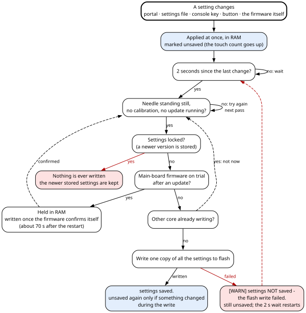
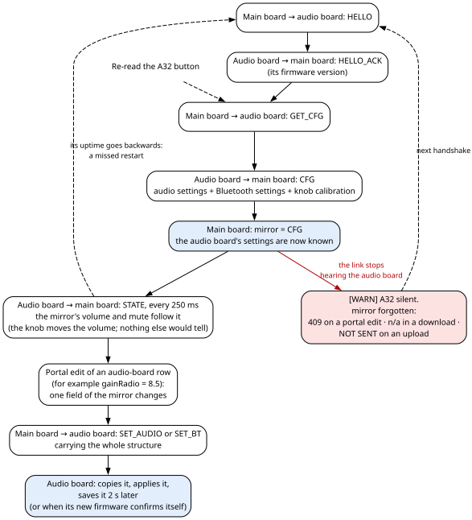
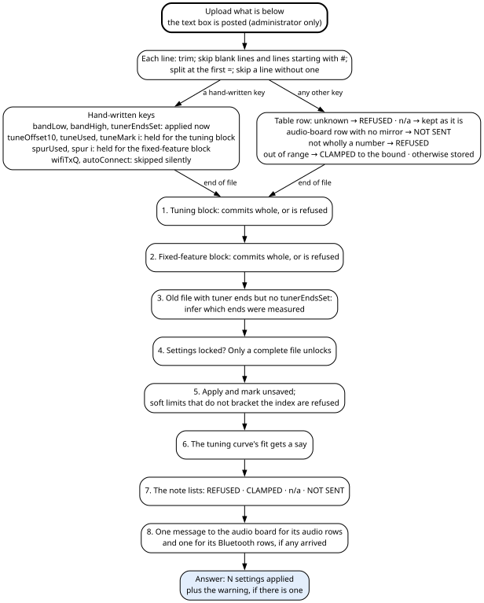

# 7. Settings

A **setting** is any adjustable value that must survive a power cut: the volume law, the gains, the clock
and panel brightness, the needle's motion, its soft limits and calibrations, the tuning curve, the
Bluetooth policy, the lamp levels. Each of the two boards keeps its own, in its own flash, and the main
board shows both sets on the web portal as if they were one.

This chapter explains where settings live, when a change reaches flash, what an update or a rollback does
to them, and how to back them up and restore them with the settings file. That file is the only undo.
Appendix A lists every setting of both boards, with its default and range.

## 7.1 What a setting is and where you change it

The **S3** (the main board) owns everything about the display, the lights, the needle and the tuning. The
**A32** (the audio board) owns everything about sound and Bluetooth. A person meets settings in four
places:

| Where | What it changes | Who may use it |
|---|---|---|
| **The web portal**, tabs **Audio**, **Display**, **Lights**, **Needle** and **Bluetooth** | Every setting that is one value with one range, shown as a slider, a box, a checkbox or a drop-down. Each tab also has buttons that change settings as a side effect (for example **Set low limit here**). | A guest: volume, mute and the five brightness levels (`brightOn`, `brightOff`, `panelTuning`, `panelIdle`, `panelOther`) — these settings; the guest's Bluetooth actions are separate (chapter 8, section 8.6.1). The administrator: everything. |
| **The settings file**, on the **System** tab: **Download**, and **Upload what is below** | Every portal setting, plus a few values that are not one number (the tuning samples, the fixed features, the fallback band). | The administrator only. |
| **The USB consoles** of both boards | A few values, by single keys. The cabinet is shut in normal use, so this is a bench tool. The main board's console is also reachable from the portal's **Console** tab (chapter 8). | Whoever holds the cable. |
| **The front volume knob** | The audio board's volume, directly. | Anyone. |

The firmware also changes some settings by itself: the saved shaft angle, the learned WiFi transmit power,
the automatic tuning samples, the index calibration's results, and the two clean-ups at start-up
(section 7.3.3).

**Why the guest gets those seven.** The portal's two roles are split by damage, not by secrecy. A guest
sees every value, but may move only what is obvious and reversible. Everything else changes what the
machine is.

**When a change takes effect.** At once. It is written to flash about **two seconds** later, once the
needle is standing still (section 7.3). Just after a firmware update of either board, the new firmware
runs **on trial** until it has confirmed itself, about a minute later (chapter 3, section 3.11). Until
then the board that was updated writes nothing, and the change waits in memory.

## 7.2 Where settings are stored

Both boards keep settings in **NVS** (non-volatile storage), the small key-value store that the chip's
software framework keeps in a flash partition. A **namespace** groups keys; a value can be a number, a
string, or a **blob** (a block of bytes). Neither board keeps settings in a file system.

| Board | Namespace | Key | Holds | In the settings file? |
|---|---|---|---|---|
| S3 | `amb3` | `cfg` | All the main board's settings, as one 220-byte blob. | Yes, except the few values listed in section 7.6.1. |
| S3 | `net` | `ssid`, `pass`, `ntp`, `tz` | The house WiFi network's name and passphrase, the time server, the time zone. | No. Changed on the portal's **Network** card; the main board's console `y` sets the WiFi name and passphrase only (chapter 8). |
| S3 | `auth` | `users` | The portal accounts: names, salted SHA-256 password hashes, administrator flags. | No. Changed on the portal's account cards (chapter 8). |
| A32 | `amb` | `audio` | The audio settings, one 15-byte blob. | Yes. |
| A32 | `amb` | `bt` | The Bluetooth settings, one 12-byte blob. | Yes. |
| A32 | `amb` | `potMin`, `potMid`, `potMax` | The volume knob's calibration, one 16-bit number each. | As a comment only; never read back. |

NVS sits at the same flash address on both boards, so stored settings survive a change of partition table.
What a USB upload, a full chip erase or an update over the air does to the flash is in chapter 3, section
3.5. The needle's remembered position is not a setting: it lives in memory that survives a software
restart but not a power cut (chapter 5, section 5.14).

> **Caution — set your own time zone.** The compiled network defaults include a time zone for the
> author's location. Change it for your build (chapter 8).

**What survives what.**

| What happens | Main-board settings | Audio-board settings |
|---|---|---|
| Power cut, or a restart, more than 2 s after the last change, with the needle still | Kept. | Kept, but mute is always off after a start, and the knob's first reading sets the volume (section 7.4.3). |
| Power cut within 2 s of a change, or while the needle is still moving | That change is lost; the old value is intact. | Within 2 s of a change: that change is lost; the old value is intact. The needle does not hold the audio board's save. |
| An update over the air of that board | Kept. Nothing is written during the new firmware's trial minute; a change made in that minute is lost if the power goes before confirmation. | The same. On the audio board a restart in that minute also loses it. |
| An update that adds main-board settings | Kept; the stored settings are converted, and the new ones start at their defaults (section 7.5.1). | — |
| An update that changes the size of the audio or Bluetooth structure | — | **That structure returns to its defaults.** The knob calibration survives. Download the settings file first (section 7.5.5). |
| A rollback after an update | The previous firmware finds its own settings, untouched. | The same. |
| Older firmware flashed over newer settings | **Locked**: the machine runs on defaults and writes nothing (section 7.5.4). | No lock; a structure of the wrong size returns to its defaults. |

**At start-up**, the main board:

1. reads its blob (or converts an older one, or uses the defaults, or locks);
2. runs two clean-ups once (section 7.5.3);
3. sets the tuner ends before it reads the saved shaft angle, so that the angle picks the right turn;
4. applies everything.

The audio board's settings reach the main board later, after the two boards greet each other on the link
(section 7.4.4). The audio board, at its own start-up:

1. asks whether its own firmware is on trial;
2. loads its defaults, its knob calibration and its two blobs;
3. turns mute off, and applies them.

Its first knob reading then sets the volume.

## 7.3 How a change is saved (the main board)

### 7.3.1 The rules

1. **A change applies at once**, in memory, and is marked **unsaved**.
2. **It is written two seconds after the last change.** Each new change restarts the wait. This wait (a
   **debounce**) exists because flash traffic is the one load that visibly disturbs the clock display.
   Without it, a slider dragged across its range would write on every pixel.
3. **It is written only while the needle stands still**: its speed exactly zero, no needle calibration
   running, and no main-board update being received. Writing to flash stops the chip's flash cache, and with
   it every piece of code that does not run from internal RAM, including the needle's step emitter. Measured
   during a write without this guard: 383 µs of step jitter and a display timing error of 1257 µs, against
   49 µs and 8 µs with it.
4. **Nothing is written while a newly updated main-board firmware is on trial.** Changes wait in memory,
   still unsaved, and the ordinary two-second save writes them on the first pass after the firmware has
   confirmed itself, about 70 s after its restart. A rolled-back firmware therefore never meets settings
   written by the firmware that replaced it. Chapter 3, section 3.11.5, tells the whole story.
5. **Nothing is written while the settings are locked** (section 7.5.4).
6. **A failed write is retried.** The settings stay unsaved, the two-second wait restarts, and the console
   prints `[WARN] settings NOT saved - the flash write failed.` A good write prints `settings saved.`
7. **A change that lands during a write stays unsaved**, whichever core made it, and is written on the
   next pass.



**Worked example: dragging a Lights slider.**

| Time | What happens | Unsaved? |
|---|---|---|
| 0.0 s | The portal sets `panelIdle` to 140. Applied at once. | yes |
| 0.4 s | The slider moves again, to 150. The two-second wait restarts. | yes |
| 2.4 s | Two seconds of quiet, but the needle is following the knob: wait. | yes |
| 3.1 s | The needle stops. One copy of all the settings is written; `settings saved.` | no |

### 7.3.2 The buttons that force a save

| Button | What it does |
|---|---|
| **Save settings now** (System tab, Machine card) | Writes at once, retrying until nothing is left unsaved. Answers "saved", or the reason it could not (section 7.3.4), shown as a refusal. |
| **Reboot the main board** (asks to confirm) | **While the main board's firmware is on trial:** restarts at once and answers `rebooting - this firmware was still on trial, so the previous firmware comes back`. Nothing was saved during the trial, so there is nothing to wait for, and this button stays the one way to undo a bad update. **Otherwise:** saves first. If the save is refused and the settings are not locked, it stops the needle and retries every 100 ms, up to 15 times. Still refused: the needle resumes and the answer is HTTP 409 `not rebooting - <why>`. **While locked**, the reboot goes ahead, since nothing would be written anyway. |
| The end of a main-board update | Saves, then restarts even if the save failed; the failure is printed on the USB console only. The new firmware then boots on trial. An upload sent while the running firmware is itself still on trial is refused before any of this (chapter 3, section 3.11.4). |

### 7.3.3 What the main board saves by itself

- **The shaft angle** (`lastAngle`), every 10 s when it has changed, and only while the angle sensor
  answers. It lets the next start-up choose the right turn of the tuning shaft (chapter 6).
- **The learned WiFi transmit power** (`wifiTxQ`), whenever the WiFi driver's value differs from the
  stored one (chapter 8, section 8.4).
- **Automatic tuning samples**, in slots 3 to 11 (chapter 6). They never touch the hand marks or the
  hand offset.
- **The index calibration's result**: the band, and the soft limits moved into the new frame
  (chapter 5, section 5.12).
- **The two clean-ups at start-up** (section 7.5.3).

All of these follow the same rules: two seconds of quiet, the needle still, not on trial.

### 7.3.4 Why "Save settings now" says no

A refused save gives one of five reasons:

| Reason | What to do |
|---|---|
| The stored settings are from a newer firmware. | See section 7.5.4. |
| The firmware is on trial; settings are written once it is confirmed. The portal shows `NOT saved yet - this firmware is on trial after an update; settings are written once it is confirmed (about a minute)`; the console shows `save held - this firmware is on trial; settings are written once it is confirmed.` | Wait about a minute. |
| The needle is moving, or a calibration or an update is running. | Wait for the needle to stop. |
| The flash write failed. | It retries by itself. |
| The settings kept changing while being written. | The ordinary save writes them once the changes stop. |

### 7.3.5 How it works inside

> **For firmware changes**
>
>
> For a firmware modifier. All of this is in `src/s3/main.cpp`.
>
> - **`settingsTouch()`** means "something changed". It records the time (`dirtyAt`) and atomically adds one
>   to the touch count `gTouchGen`. Every writer calls it **after** the change.
> - **`gSavedGen`** is the touch count that the last good write copied. **`settingsDirty()`** is
>   `gTouchGen != gSavedGen`. "Unsaved" is worked out from the two counts, not stored as a flag, so a change
>   that lands during a write, on either core, is never marked saved by that write.
> - **`writeSafe()`** is true only when the needle's speed is exactly 0, no needle calibration runs and no
>   main-board update is in progress.
> - **`settingsWrite()`** is the only function that writes the `amb3` blob:
>   1. refuse if the downgrade lock is set;
>   2. refuse, silently, while this firmware is on trial (`s3ImageOnTrial()`);
>   3. one writer at a time: an atomic exchange on a `busy` flag. The loser sets `gWriteBusy` and returns
>      false ("not now"), because the portal's reboot (core 0) and the main loop (core 1) could both open the
>      same storage handle;
>   4. read `gTouchGen` **before** copying;
>   5. copy the settings into a static 220-byte snapshot;
>   6. open `amb3` and write `cfg` from the snapshot, checking both results;
>   7. on failure: stay unsaved, restart the two-second wait, print the warning;
>   8. on success: `gSavedGen` = the count read in step 4; print `settings saved.`
> - **`settingsFlush()`** runs on every pass of the main loop: if unsaved, and 2000 ms since the last touch,
>   and `writeSafe()`, then `settingsWrite()`.
> - **`settingsForceFlush()`** ("Save settings now"; the portal calls it as `settingsFlushNow()`): nothing
>   unsaved returns true. Locked, on trial, or not `writeSafe()` return false. Otherwise it writes until
>   nothing is left, up to 40 attempts: if the other core is writing it waits 25 ms and tries again; a real
>   flash failure returns false; still unsaved after 40 attempts returns false. Its callers act on "true" at
>   once, so true must mean "nothing is unsaved".
> - **`gSaveWhy`** holds the reason for the last refusal, and `settingsSaveWhy()` hands it to the portal.
>
> In the worked example above, the touch count goes from 41 to 42 at 0.4 s while `gSavedGen` is 40; the
> write at 3.1 s reads 42 before copying and sets `gSavedGen` to 42.
>

## 7.4 The audio board's settings and the main board's mirror

The audio board **owns and saves** its settings. The main board keeps a **mirror**, a copy it reads from
the audio board, so that the portal shows what is actually in the machine rather than what it last asked
for. This section is the one place in the book that sets out how the audio board saves.

### 7.4.1 What the audio board stores and how it loads

It stores three things in the `amb` namespace: the audio structure, the Bluetooth structure, and the
three knob-calibration readings `potMin`, `potMid`, `potMax`.

At start-up it fills the compiled defaults, reads the three knob keys (defaults 60, 0 meaning "centre not
measured", and 3990), then reads each blob **only if its stored length equals the structure's size
exactly**. There is no conversion on this board: any change to either structure means that structure's
defaults. Last, **mute is forced off**: mute is never restored. A saved mute once made the set start in
silence with nothing on the front to say why.

### 7.4.2 How the audio board saves

- **The same two seconds.** A change marks the settings unsaved; two seconds after the last change the
  board writes both blobs and the three knob keys.
- **Every result is checked**: opening the store, and the byte count of each write. Only when all of them
  succeed is the change counted as saved, and `settings saved.` printed. On any failure the change stays
  unsaved, the two-second wait restarts, and `settings NOT saved - the flash write failed; retrying` is
  printed on the audio board's USB console and sent to the main board, whose console prints it as
  `[A32] ...`.
- **No motion guard.** The audio board drives no motor.
- **Nothing is written while a newly updated audio-board firmware is on trial.** Changes made meanwhile —
  from the portal, a knob calibration or the audio board's console — apply at once and wait in memory,
  still unsaved. The firmware confirms itself a minute after the main board's first greeting, or after five
  minutes if the main board never spoke, and never while its link self-test has failed (chapter 3, section
  3.11.2). **At that moment it writes what was held.** When that write succeeds it sends
  `settings changed during the trial are now saved`, which the main board's console prints next to
  `[A32] image confirmed (...)`. If that write fails, the ordinary failure path above takes over.
- **The hold is silent.** While it lasts the portal answers "ok" to an audio-board edit as usual: the main
  board keeps no flag for the audio board's trial, and sees it only as text in the audio board's start-up
  report (chapter 9). Only the log line at confirmation shows that anything waited.
- **Why the hold.** An audio-board update that changes the size of either structure cannot save its new
  layout before it has proved itself, so a rollback always finds blobs the previous firmware can read.
  **The cost:** a change made during the audio board's trial is lost if the power goes, or the audio board
  restarts, before confirmation.
- **Reboot the audio board** forces a save before the restart. If that write fails, the board restarts
  anyway and the change is lost. During a trial the forced save writes nothing, by design: a restart on
  trial is a rollback, so there is nothing to keep.
- **During an audio-board update**, mute is forced on and restored afterwards to what it was.
- **Bounds.** When it applies them, the audio board clamps the volume law to 1.0–4.0, the balance to
  −100…+100 and every gain to −60…+30 dB. Fade times are not clamped there; a fade time of 0 acts as 1 ms.
  The main board, the only remote sender, clamps every value first.
- **Who writes:** the main board's audio and Bluetooth messages (portal edits and file uploads), a knob
  calibration, and the audio board's console keys `+`, `-`, `m`, `t`, `T`, `p`, `P` and `c`.

### 7.4.3 The volume knob and the stored volume

The audio board reads the knob every 50 ms, maps the reading through its three-point calibration to the
volume scale 0–255, and writes the volume **without** marking the settings unsaved. The first reading after
every audio-board start always applies; later readings apply only when the raw reading has moved by at
least 24 counts. So:

- a volume set from the portal holds until the knob is next moved;
- the knob's position wins at every start;
- the knob-set volume reaches flash only when something else causes a save.

Chapter 10 describes the knob in full; Appendix A, section A.1, lists its calibration values.

### 7.4.4 The mirror



- **At every greeting** (the handshake, chapter 9), the main board asks the audio board for its settings
  and copies the answer: audio, Bluetooth and knob calibration. A board that restarted brings **its own**
  values back, rather than the main board's copy overwriting them. When the audio board's uptime in a
  status report goes backwards, the main board notices a restart the link missed and greets it again,
  which refreshes the mirror.
- **Status every 250 ms.** The audio board's status report carries its volume and mute, and the mirror
  follows them. The knob moves the volume; nothing else would tell the main board.
- **An edit sends the whole structure.** A change to one audio-board row edits that field of the mirror
  and sends the whole audio or Bluetooth structure. The audio board copies it, applies it and saves it two
  seconds later (or at confirmation, while it is on trial).
- **"Do not write a mirror we have never read."** Until the first answer arrives the mirror is all zeros.
  Every audio-board row is refused in that window: a push would have sent volume 0, gain 0, every lamp off
  and "not connectable", and the audio board would have saved them. The portal answers such an edit with
  HTTP 409, `the audio board is not answering - its settings cannot be changed now`.
- **Re-read the A32** (Audio tab) asks for the audio board's settings on demand.
- **The knob calibration is not a row.** The Audio tab's buttons **Pot: minimum**, **Pot: centre** and
  **Pot: maximum** tell the audio board to measure the knob itself (the median of nine readings), because
  the reading and the thing being calibrated must not live on opposite sides of a link.
- **Boards running different link versions** do not look like a dead wire: the main board counts the
  frames it drops and shows **BOARDS RUN DIFFERENT PROTOCOL VERSIONS - flash both** (chapter 9).

### 7.4.5 When the audio board falls silent

When the link, having greeted the audio board, stops hearing it, the main board **forgets its copy** of
the audio board's settings, with the rest of its audio-board state, and prints `[WARN] A32 silent.` From
then on, until the next greeting fetches the settings afresh:

- a portal edit of an audio-board row is refused with HTTP 409, `the audio board is not answering - its
  settings cannot be changed now`;
- a **Download** writes `n/a` for every audio-board row;
- an **Upload** names the audio-board rows under "NOT SENT - the audio board is not answering".

The same applies when the audio board has not answered since the main board started.

**Why.** A copy that counted as known after the audio board went quiet took portal edits into the mirror
only. Those edits were overwritten when the audio board came back, while the portal said "ok". And a
download wrote the stale copy.

## 7.5 Firmware updates and stored settings

### 7.5.1 How the main board converts older settings

The main board's settings blob begins with a header: a **magic number**, `0xA838`, that marks a blob with a
header, and the **settings version**, now 7. The structure follows three rules:

- Never reorder or remove a field. Add new fields at the end only.
- Every addition raises the settings version and adds a conversion step (a **migration**).
- An older blob is copied into the current structure, so its values survive and the new fields keep their
  defaults.

**Loading, step by step:**

1. **No blob:** `no stored settings - defaults in use.` The defaults run, and are written on the first
   change.
2. Read as many bytes as were stored, up to the current size, into a zeroed buffer. Size decides only how
   much may be read, **never which version the blob is**.
3. **Fewer than 100 bytes** (the size of the oldest layout): a warning, and the defaults.
4. **No magic number:** the blob is **version 1**, the layout from before the header existed (its first
   two bytes are the two brightness values). It is copied field by field.
5. **Version 7:** a straight copy, `settings loaded.`
6. **Version 6, 5, 4 or 3:** the old blob is copied up to where the first field that version did not have
   begins. The cut is the field's position, not the blob's length, because a new field can sit in the old
   structure's trailing padding (version 3 did exactly that). Converting version 4 also works out which
   tuner ends were measured (below).
7. **Version 2:** field by field, from the kept version-2 layout.
8. **The magic number, but any other version:** this firmware is older than the one that saved the blob.
   Defaults in memory, and the **downgrade lock** is set (section 7.5.4).

Every conversion marks the settings unsaved, so the converted blob is written back as version 7 about two
seconds later, once the needle is still and the firmware is confirmed. Each conversion prints one console
line saying what the new fields start as.

### 7.5.2 Version history

| Version | What it added |
|---|---|
| 1 | The layout without a header: the one that holds the first real needle calibration. 38 of its 39 fields carry across. The one that does not, `seekHsps`, was a deleted setting and is dropped. The index search only has to find the sensor, and the slow re-approach defines zero, so its speed never mattered. A setting that implies it matters is worse than none. |
| 2 | The magic number and version header; the layout that shipped the web portal. |
| 3 | `tuneHoldMs`, placed in version 2's trailing padding (still 100 bytes). |
| 4 | `dialLow`, `dialHigh`: the first addition that made the structure longer. |
| 5 | The tuning samples and their mask (`tuneUsed`), the hand offset `tuneOffset10`, and `tunerEndsSet`. A version-4 blob whose tuner ends differ from the placeholders 0 and 6023 is taken as proof of a hand measurement and gets `tunerEndsSet` = 3 (both ends). |
| 6 | `wifiTxQ`, and the fixed-feature list (`spurUsed` and 16 slots). |
| 7 | `ifOffset` (stored as `ifOffset20`), default 10.60 MHz. |

**The conversion from 6 to 7 changes behaviour on the first start.** Every station the firmware computes
moves down 0.1 MHz (what the readout shows and where the needle points, not the sound), because the firmware used to assume an IF of 10.70 MHz and now uses 10.60 MHz, the tube set's
fitted IF (Hardware Bible, chapter 13; chapter 6 explains the IF).

### 7.5.3 The two clean-ups at start-up

After loading, two checks run once:

- **Soft limits.** A stored pair that does not bracket the index at 0 (`posMin` above 0, `posMax` below 0,
  or crossed) cannot be real. It is replaced by the provisional pair −300…+300 half-steps and saved, and
  the console asks for a home, an index calibration and new limits (chapter 5, section 5.12). The index
  band's values are kept, because they are measured from the index.
- **Fixed features.** A count above 16, or any entry outside the window the tuning chip searches (77.2 to
  97.2 MHz), empties the list and saves the empty list. A truncated list is not a list.

Both run at start-up only, never while settings are being edited.

### 7.5.4 The downgrade lock

When the main board finds the magic number with a version it does not know, the firmware is older than the
one that wrote the blob. It **locks** the settings. While locked:

- the machine runs on **defaults** in memory: provisional soft limits, the default tuning line, the
  default brightness, and so on;
- nothing is written, so the newer settings on flash are never overwritten;
- **Download is refused**, with HTTP 409 and a sentence that the page shows instead of downloading. A file
  of defaults would look complete, and uploading it back would lift the lock and write defaults over the real
  calibration;
- the portal shows the pill **SETTINGS LOCKED - newer version stored**;
- **Save settings now** answers with the lock's reason.

**Two ways out:**

1. **Flash the newer firmware again.** It reads its own settings normally.
2. **Upload a complete settings file**, taken earlier. Complete means: all 38 main-board rows present and
   accepted; a tuning block that committed (`tuneUsed` present, the mark lines matching the mask, the
   offset readable); and a fixed-feature block that committed (`spurUsed` present, slots 0 to N−1 exactly).
   Audio-board rows, `bandLow`, `bandHigh` and `tunerEndsSet` are not required. Keys this firmware does not
   know (from a newer firmware's file) are refused and named, but do not block. On success the console
   prints `complete settings file uploaded - the newer stored settings will now be replaced.` and the
   next save writes version 7 over the newer blob. Otherwise the upload's note says
   `SETTINGS STILL LOCKED - a complete file is needed (N of 38 settings, no tuning marks, no fixed
   features); nothing was saved`. The values that did arrive are still applied in memory.

**Why a single line cannot lift the lock.** While locked, the settings in memory are defaults. Lifting the
lock on one line such as `volume=120` wrote the defaults for everything else over the newer blob two seconds
later.

A rollback cannot cause the lock: a new firmware writes nothing during its trial, so if it is rolled back
the previous one finds its own settings (chapter 3, section 3.11.5). Flashing an older firmware on purpose,
by cable or over the air, after a newer one has confirmed itself and saved, can.

### 7.5.5 Updates that change the audio board's settings

The audio board has no conversion. An update that changes the size of the audio or the Bluetooth
structure returns **every** setting in that structure to its default on the first start of the new
firmware; the knob calibration survives. Download the settings file before such an update and upload it
afterwards. The audio rows are sent once the main board has read the mirror. If the update came over the
air, the upload applies at once but is written only when the new audio-board firmware confirms itself,
about a minute after its first greeting. Should it be rolled back instead, the previous firmware finds its
own blobs untouched.

## 7.6 Backup and restore: the settings file

The **settings file** is the backup, and the only undo. It is plain text, one `key=value` per line, so that
it stays readable and repairable by hand when neither this firmware nor a browser exists.

### 7.6.1 The format, and the download

**Download** on the System tab's **Settings file** card (administrator only) saves the file as
`ambersong.txt`. Here is its shape (the values are illustrative):

```
# Ambersong settings
# firmware v.1.20260925T184108 (1a2b3c4)
# settings version 7
# saved 2026-09-25T18:45:00
# the audio board had not answered - its settings are n/a
volume=40
...
gainRadio=8.000
ifOffset=10.600
...
connectable=1
bandLow=881
bandHigh=1079
tuneOffset10=0
tuneUsed=7
tunerEndsSet=3
tuneMark0=-817,913
tuneMark1=120,985
tuneMark2=1043,1073
spurUsed=2
spur0=790
spur1=818
# potcal 61..1974..3988
```

| Line | What it is |
|---|---|
| `# firmware ...` | The build stamp and commit of the firmware that wrote the file (chapter 3). |
| `# settings version 7` | A comment only; not checked on upload. |
| `# saved ...` | Local time, written only when the clock is valid. |
| `# the audio board had not answered ...` | Written only while the main board holds no copy of the audio board's settings. |
| `volume=40` … `connectable=1` | One line per portal setting, 58 lines, in the portal's order. Settings stored as decimals, or stored scaled (gains, the volume law, the IF), are written with 3 decimals; every other setting as a whole number. Audio-board rows read `n/a` while the main board holds no copy. |
| `bandLow`, `bandHigh` | The fallback tuning line, in tenths of a MHz (chapter 6). |
| `tuneOffset10`, `tuneUsed`, `tunerEndsSet`, `tuneMark<i>` | The tuning calibration: the hand offset, the mask of used slots, which tuner ends were measured, and one `<shaft count>,<frequency × 10>` line per used slot. `tuneUsed` is **always** written, even when 0. |
| `spurUsed`, `spur<i>` | The fixed features: their count, then each one's oscillator frequency × 10, slots 0 to N−1. `spurUsed` is **always** written, even when 0. |
| `# potcal ...` | The knob calibration (minimum, centre, maximum), written only while the main board holds a copy; never read back. |

**Why `tuneUsed` and `spurUsed` are always written.** On upload, "replace the marks" and "replace the
list" hang on these keys. A backup taken before any marking can then undo the marking. Without the zero
line it would look like a file from before those features existed, and would leave the marks alone.

**Why `n/a` while the audio board is silent.** A file of the mirror's zeros, uploaded later, would push
volume 0, gains 0, every lamp off and "not connectable" to the audio board, which would save them.

**Not in the file:** the header's magic number and version (the version is a comment); `lastAngle` (live
state); `idxOnFwd` (zero by definition); `wifiTxQ` (the learned WiFi power; console only); the audio board's
unused `autoConnect` field; the WiFi network and time settings; the portal accounts; the knob calibration
(comment only); and every experiment (Appendix A, section A.6).

**Accounts and the WiFi passphrase are left out on purpose.** The file is a backup that gets copied, pasted
and kept anywhere; the house network's passphrase and the portal's password hashes stay on the machine. A
restore does not restore accounts. (Forgotten password: chapter 8.)

### 7.6.2 Uploading: the rules

Paste the file into the System tab's text box and press **Upload what is below** (administrator only; the
page waits up to 20 s for the answer).

> **Warning — an upload is a merge, not a replace.** A key absent from the file keeps its current value.
> Leaving a line out does not return a setting to its default. The only exceptions are the tuning block and
> the fixed-feature block, which replace the stored marks and list as a whole when they commit.



**Each line** is trimmed. Empty lines and lines that **start** with `#` are skipped; a `# comment` after a
value makes the value unreadable. The line is split at its first `=`; a line without one is skipped.

**Hand-written keys** (the ones that are not portal rows) follow their own rules:

| Key | Rule | On a bad value |
|---|---|---|
| `tunerEndsSet` | Whole number 0 to 3, applied at once. | REFUSED and named. |
| `bandLow`, `bandHigh` | Whole number 500 to 2000 (tenths of a MHz), applied at once. | REFUSED and named (refused, not clamped). |
| `tuneOffset10` | Whole number −200 to 200 (tenths of a MHz), **held** with the marks. | The whole tuning block is refused: `TUNING CALIBRATION REFUSED - the hand-offset line is unreadable; the stored calibration was kept`. |
| `tuneUsed` | A whole number, in decimal or as `0x` hexadecimal (a console dump once printed it that way), 0 to 0xFFFF; held. | Ignored, with no note of its own, and every mark line after it is skipped. With a `tuneOffset10` line in the file (every downloaded file has one), the block is then refused with a misleading "the file announced 0 and 0 parsed"; without one, nothing is said (chapter 12). |
| `tuneMark<i>` | Only after a `tuneUsed` line. `i` is a whole decimal 0 to 11 (`tuneMarkA` is **not** accepted); the value is `<shaft count>,<frequency × 10>`, the count within ±1 000 000 and the frequency 870 to 1085; held. | Skipped without a word; the mask check then refuses the block. |
| `spurUsed` | Whole number 0 to 16, held. | Spoils the fixed-feature block. |
| `spur<i>` | Only after `spurUsed`. `i` 0 to 15; the value 772 to 972 (tenths of a MHz, the oscillator window); no slot twice; held. | Spoils the fixed-feature block. |
| `wifiTxQ`, `autoConnect` | **Retired keys**: skipped whatever the value, not counted and not named, so a file saved by an older firmware uploads cleanly. | — |

A key starting with `tuneMark` or `spur` always belongs to its block; it is never treated as unknown.

**Why `tuneMarkA` is refused.** The console dump labels the hand slots A, B and C. A loose reading once took
`tuneMarkA` as slot 0, so mark A could silently receive another mark's numbers with the mask still agreeing.

**Portal rows**, checked in this order:

1. An unknown key: REFUSED.
2. The value `n/a` (any case): noted under "n/a in the file - kept as they are".
3. An audio-board row while the main board holds no copy: noted under "NOT SENT - the audio board is not
   answering".
4. A value that is not wholly a number: REFUSED. Blanks around it are trimmed, and one decimal comma is read
   as the point; `107,3` is 107.3.
5. Otherwise the value is bounded to the row's range. If that changed it by more than 0.0005, it is noted
   CLAMPED and stored at the bound.

Rows are written straight into the settings or the mirror, with no message per line.

**At the end of the file, in this order:**

1. **The tuning block.** It commits only if `tuneUsed` was seen, the marks that parsed match the mask
   exactly, and any offset line was readable. Then all 12 slots, the mask and (if present) the offset
   replace the stored ones together. Otherwise:
   `TUNING MARKS REFUSED - the file announced N and M parsed; the stored calibration was kept`. A file with
   no `tuneUsed` line (older than version 5) leaves the marks alone.
2. **The fixed-feature block.** It commits only if `spurUsed` was seen, no line spoiled it, slots 0 to N−1
   all arrived, and no two entries are closer than 0.3 MHz (the matcher's ±0.2 MHz would count them as
   one). Otherwise `FIXED-FEATURE LIST REFUSED - the stored one was kept`.
3. **Which tuner ends were measured**, worked out only for a file that has `calLow` or `calHigh` but no
   `tunerEndsSet` (files older than version 5). For each end, a value equal to the old placeholder (0 or
   6023) means "not measured", and anything else "measured". This is a convention of the file, not a claim
   about the shaft: a measured end that happened to equal a placeholder exactly would be read as
   unmeasured.
4. **The downgrade lock** check (section 7.5.4).
5. If any main-board value changed, everything is applied and marked unsaved. If the soft limits that came
   out differ from what the file asked, because the pair did not bracket the index:
   `SOFT LIMITS REFUSED (a..b does not bracket the index) - kept c..d`.
6. **The tuning curve gets a say.** Unless the tuning block was refused, and when marks are stored: if the
   resulting curve is refused or demoted, `after restore: <state>` is added. `calLow` and `calHigh` alone can
   do this, since they set the curve's domain (chapter 6).
7. **The four lists:** `REFUSED (unreadable or unknown): ...`, `CLAMPED to its range: ...`,
   `n/a in the file - kept as they are: ...`, `NOT SENT - the audio board is not answering: ...`. Each names
   up to five keys, each cut to 20 characters, then `, ...`. They come last so that the block refusals are
   never crowded out of the note, which holds 512 bytes.
8. **One message to the audio board** for its audio rows and one for its Bluetooth rows, if any landed.

**The answer.** The count is of accepted items: each accepted line, plus one per committed block. The page
shows `N settings applied`; when there is any note it shows the note as a warning instead, not in the
success colour, and then reloads the values. A file whose values are valid but wrong is applied and saved:
the upload is your act.

### 7.6.3 Worked example

With the audio board answering and no lock, this upload:

```
volume=999
posMax=abc
wn=10,5
nosuchkey=1
tuneUsed=7
tuneMark0=-817,913
tuneMark1=120,985
```

gives:

| Line | Result |
|---|---|
| `volume=999` | CLAMPED to 255, and sent to the audio board once, at the end. |
| `posMax=abc` | REFUSED: not a number. |
| `wn=10,5` | Accepted as 10.5 (the decimal comma). |
| `nosuchkey=1` | REFUSED: unknown. |
| `tuneUsed=7` and two marks | The mask announces three marks and two parse, so the whole tuning block is refused; the stored marks stay. |

The answer counts 2 settings applied, and the page shows the warning
`TUNING MARKS REFUSED - the file announced 3 and 2 parsed; the stored calibration was kept; REFUSED
(unreadable or unknown): posMax, nosuchkey; CLAMPED to its range: volume`. `wn` is saved about two seconds
later, once the needle is still.

### 7.6.4 Good habits

- Download the settings file before any update.
- Before an update that changes the audio board's structures, download first and upload afterwards
  (section 7.5.5).
- Keep the files: one taken before any tuning marks were made can undo the marking.

## 7.7 When it goes wrong

The last column is the fault's class on the recovery ladder (NOTE, DEFECT, BLOCKER), set out in *About
this book*.

| What you see | What happened | What the firmware does | What you do | Class |
|---|---|---|---|---|
| `[WARN] settings NOT saved - the flash write failed.`; Save and Reboot report it | A main-board flash write failed. | Stays unsaved, retries after 2 s. | Nothing. | NOTE |
| `[A32] settings NOT saved - the flash write failed; retrying` | An audio-board flash write failed. | Stays unsaved, retries after 2 s. A forced save before a commanded restart is not retried: the board restarts anyway. | Nothing, except before a restart. | NOTE; never exercised on the radio |
| A setting back at its old value after a power cut | The power went within 2 s of the change. | The old value is intact. | Make the change again. | NOTE |
| Changes gone after a power cut just after a main-board update | The power went during the trial minute; nothing is written then. | The flash still holds the settings from before the update. | Make the changes again. | NOTE |
| Audio changes gone after a power cut, or an audio-board restart, just after an audio-board update | The same, on the audio board; a restart on trial is also a rollback. | The flash still holds the audio settings from before the update. | Make the changes again. | NOTE |
| — | The power went during a write. | Relies on the storage library keeping the previous value when a write is interrupted. Whether it always does is library behaviour, not settled by this firmware, and never tested here. | — | NOTE |
| Some values of an upload present, others not, after a power cut | A background save caught a half-applied upload, and the power went within about two seconds (an accepted race, section 7.11.2). | Half the upload is on flash. | Upload the file again. | BLOCKER, accepted |
| **SETTINGS LOCKED - newer version stored**; Download refused | Older firmware over newer settings. | Defaults in memory, nothing written. | Flash the newer firmware, or upload a complete file (section 7.5.4). | DEFECT |
| A warning at start-up, and defaults | The stored blob is shorter than 100 bytes. | Defaults, no lock; saved on the first change. Never seen. | Upload a settings file. | BLOCKER |
| Settings that make no sense after a start-up, such as the needle's motion | The header was damaged so the magic number no longer matches. | Reads the blob as version 1 and saves it back as version 7. Whether the storage library's own checksums reject such a blob first, so that it reads as "no stored settings", is not known; never tested here. | Upload a settings file. | BLOCKER (in theory) |
| Soft limits back at ±300 hs; the console asks for a recalibration | The stored pair did not bracket the index. | Replaced and saved at start-up. | Home, calibrate the index, set the limits (chapter 5, section 5.12). | BLOCKER (guarded: the needle stays off the stops, but the limits must be captured again) |
| The fixed-feature list empty | A count or an entry was out of range at start-up. | Emptied and saved. | Learn them again with the tube set switched off (console `o`; chapter 6). | DEFECT |
| The machine behaves wrongly after an upload | The file held valid but wrong values. | Applied and saved: it is the user's act. | Upload a good file. | DEFECT |
| REFUSED notes, or a block refused | The file was truncated or damaged. | What arrived is merged; the tuning and fixed-feature blocks are refused unless complete; everything refused is named. | Upload the file again. | NOTE |
| `SOFT LIMITS REFUSED (a..b does not bracket the index) - kept c..d` | The file's soft-limit pair was invalid. | Keeps the old pair. | Correct the file. | NOTE |
| `the audio board is not answering - its settings cannot be changed now`; `n/a` in a download; NOT SENT on an upload | The audio board has not answered since the main board started. | Refuses audio-board rows. | Restore the link; the mirror arrives at the greeting (chapter 9). | NOTE; never exercised on the radio |
| `[WARN] A32 silent.`, then the same as above | The audio board fell silent after it had answered. | Forgets the mirror. | Restore the link; the next greeting fetches the settings again. | NOTE; never exercised on the radio |
| Nothing | The audio board restarted. | Greets it again; the mirror is refreshed from the audio board's flash. | Nothing. | NOTE |
| Audio and Bluetooth settings back at their defaults after an audio-board update | The update changed the size of a structure. | Uses that structure's defaults; saves them on the next change (after confirmation, for an update over the air). The knob calibration survives. | Upload a file downloaded before the update. | BLOCKER by design; avoidable by downloading first |
| Audio rows shown as `n/a`; audio-board changes do not hold | The two boards run builds of the same protocol version that do not match (a half-flashed pair). | The audio board ignores the settings messages; the main board never gets the audio settings; the radio plays on the audio board's stored settings. | Flash both boards. | BLOCKER: the audio board's settings cannot be changed until a firmware update |
| **BOARDS RUN DIFFERENT PROTOCOL VERSIONS - flash both**; console `s` shows `wrong-version N`; no radio or Bluetooth sound | The two boards run different protocol versions. | Every frame is dropped and counted: no handshake, so the audio board sleeps: no radio or Bluetooth sound (AUX does not pass through the audio board). | Update the main board first, over its own WiFi, to the audio board's protocol version; the reverse order cannot work (chapter 9, section 9.6.3). | BLOCKER: survives a power cycle once the audio board has confirmed its program |
| **Reboot the main board** answers `not rebooting - <why>` | A change was unsaved while the needle moved. | Stopped the needle, retried for 1.5 s, refused, resumed the needle. | Try again. | NOTE |
| A change gone after a main-board update | It was unsaved and could not be written when the update ended. | Restarted anyway; warning on the USB console only. | Make the change again. | NOTE |
| Nothing | A main-board update that raised the settings version was rolled back. | The previous firmware reads its own blob; no lock. | — | NOTE |
| Nothing | An audio-board update that changed a structure was rolled back. | The previous firmware reads its own blobs. | — | NOTE |
| Nothing | Flash wear. | Writes happen only on a change, two seconds after it, never during motion. The most frequent writer is the shaft angle, at most every 10 s and only after the dial moved. The storage spreads its entries across its pages. At a handful of writes per listening session, wear is not a practical concern (an estimate, not measured). | — | NOTE |

## 7.8 Design choices

- **One table describes every setting** and generates the portal's widgets, the bounding and both
  directions of the file. Four hand-kept copies drift apart; one table makes every setting affordable.
- **Roles split by damage, not secrecy.** A guest sees every value and moves only the obvious and
  reversible ones.
- **The machine bounds every value; the browser's limits are only a suggestion.** One bounding rule serves
  the portal and the file, and refuses NaN. A `posMax` of 30000 would drive the needle into its stop, and a
  second copy of the rule once let the portal store a choice of 99.
- **Numbers are read whole; one decimal comma counts as the point; anything else is refused.** The old
  reader took "107,3" as 107 and "" as 0, and the clamp then stored a bound: an IF of 10.00 MHz, a soft
  limit at the index.
- **Refused and clamped lines are named, in their own lists, last, and in a separate warning.** A partial
  apply reported as "41 settings applied" in green is false reassurance.
- **The main board's settings are versioned, add-at-the-end only, converted on load, and identified by their
  header, never their size.** Throwing everything away on a layout change is right for a bench rig and
  wrong for a machine somebody has spent an evening calibrating. And versions 1, 2 and 3 were all 100
  bytes.
- **Tuning samples are stored, not curve coefficients**, and the curve is refitted whenever settings are
  applied. Samples describe themselves and can be refitted by a better model without a conversion.
- **Writes wait two seconds and never happen while the needle moves.** A flash write stops everything
  outside internal RAM.
- **"Unsaved" comes from two counts; one writer at a time; the blob is written from a snapshot.** A stored
  flag cleared around the write lost changes that landed during it.
- **"Save settings now" tells the truth, and a reboot refuses to run over an unsaved change.** "Saved"
  followed by "rebooting" over a refused save was a data-loss path.
- **Neither board writes settings while its new firmware is on trial**, and a reboot during the trial
  goes through at once. A firmware that changes the layout would otherwise save it within seconds; rolled
  back, the previous firmware would find settings it cannot read. A reboot on trial is a rollback, so
  refusing it would only take away the one button that undoes a bad update.
- **A blob from a newer firmware locks all writes, refuses the download, and only a complete file lifts
  the lock.** Before the lock, the first automatic save wrote defaults over the newer blob; a one-line
  upload then did the same.
- **The audio board owns and saves its settings; the main board mirrors them**, refreshes the mirror at
  every greeting and never pushes a mirror it has not read. A restarted audio board must keep its own
  values; an unread mirror is all zeros.
- **When the audio board falls silent, the main board forgets the mirror.** Edits made into a stale mirror
  were silently lost.
- **The audio board counts a save only when every write reached flash, and retries a failure.** A flag
  dropped before the write said "saved" when nothing was.
- **`n/a` for the audio board's rows when it has not answered.** A file of zeros would silence the radio
  and switch off every lamp, and the audio board would save it.
- **Mute is never restored; the volume is, but the knob's first reading wins.** A saved mute made the set
  start in silence with nothing on the front to say why.
- **The audio board saves before a commanded restart**, except on trial. "Reboot the audio board" within
  two seconds of a change used to lose it.
- **The tuning marks, their mask and the hand offset commit as one unit; the two count keys are always
  written.** Wiping the marks on the first `tuneUsed` line let a truncated upload erase the calibration
  with its only backup; an offset belongs to the curve it corrected.
- **The hand offset is never erased automatically.** It is the user's calibration, made by ear (chapter 6).
- **`idxOnFwd` is not a row**: it is zero by definition, and an edited value once moved both soft limits
  into a stop. **The other three index-band values are rows**, so the file carries them: a restore onto
  blank flash left them at zero, and every index crossing then read as a slip.
- **`bandLow`/`bandHigh` are not rows but stay in the file.** Nothing reads them once two marks exist, but
  with no marks they are the live tuning, so a backup must keep them.
- **The WiFi transmit power is learned state**, stored but neither a row nor a file line (chapter 8).
- **`autoConnect` is no longer a row, but stays in the audio board's structure**, unread. A row that does
  nothing is a false control; removing the field would change the structure's size and reset every
  Bluetooth setting.
- **The IF is a setting, in 50 kHz steps.** Readings of 10.60 and once 10.65 MHz cannot be written in
  tenths, and the IF moves if the IF coils are realigned.
- **The settings file is plain text.** A restore is the only undo, so the backup must outlive the tools
  that wrote it.
- **Experiments are actions, never saved** (Appendix A, section A.6).
- **Credentials and accounts stay out of the file.** The file gets copied, pasted and kept anywhere;
  losing the accounts on a restore is the accepted trade.
- **No lock around the settings across the two cores.** The races left are microseconds wide, and the change
  would touch every writer.

## 7.9 Tried and rejected

> **For firmware changes**
>
>
> These were dead ends on this machine. They may not be dead ends on yours.
>
> - **Rejecting a stored blob on any change of size.** Any layout change silently replaced a calibrated
>   machine's settings with defaults.
> - **Deciding the version by the blob's size.** Versions 1, 2 and 3 were all 100 bytes, so the version-1
>   branch caught everything. Found by review, not by failure.
> - **Reading only a blob of exactly the current size.** It would have discarded every convertible blob from
>   version 4 on.
> - **Cutting the old blob at its stored length.** A new field can sit in the old structure's padding.
> - **A stored "unsaved" flag**, cleared before and then after the write. Changes that landed during a write
>   were marked saved and lost.
> - **A save that returned nothing** and printed "saved" regardless.
> - **Checking for corrupt soft limits while applying settings.** It fired mid-edit and overwrote what had
>   just been typed.
> - **Soft-limit ranges of −3000…0 and 0…3000.** They assumed a centred index; with clamping, the high limit
>   was silently unsettable while it was negative.
> - **Two copies of the bounding rule.** The second guarded only the file.
> - **`bandLow`/`bandHigh` as editable "Tuner reaches" rows.** The curve ignored them, so corrections typed
>   there were discarded.
> - **`idxOnFwd` as a row.** An edit moved both soft limits into a stop.
> - **`wifiTxQ` as a row in dBm with a scale of 0.25.** Two spellings of one key; a pasted dump line would
>   have read as four times the power.
> - **`wifiTxQ` in the settings file, pushed to the WiFi driver on upload.** It is learned state that nobody
>   sets.
> - **The `autoConnect` row** ("Chase the phone (not advised)"). Stored, shown, downloaded and uploaded, and
>   read by nothing.
> - **The console keys comma (`,`) and full stop (`.`)** for the needle's top speed. The full stop had no ceiling and bypassed the row's
>   bounds; the portal row does the job inside its range.
> - **Counting the mirror as known for the whole start** once the audio board had answered. A silent audio
>   board took edits into the mirror only, and a download wrote the stale copy.
> - **The audio board clearing its unsaved flag before writing, and ignoring the results.** A failed write
>   said "saved".
> - **Saving during a main-board trial**, with a written warning for whoever raises the settings version. A
>   rollback after such a save left the previous firmware locked on defaults.
> - **Saving during an audio-board trial**, with advice to download the file before any update that changes
>   a structure. A rollback would have left the previous firmware on defaults for that structure.
> - **Zeroing the hand offset on a hand mark, a drop, a clear or a requested sample.** It erased the user's
>   correction unasked.
> - **Wiping the marks on seeing `tuneUsed`, and applying `tuneOffset10` at once.** A truncated file erased
>   the calibration, or slid an offset onto the wrong curve.
> - **A lenient whole-number reader for the hand-written keys.** It answers 0 for garbage, and 0 is the
>   destructive value for `tuneUsed`, `spurUsed` and `tunerEndsSet`.
> - **One bit for both tuner ends.** One measured end declared both measured, and the curve then ran over a
>   range far wider than the shaft.
> - **Downloading zeros for a silent audio board.**
> - **Lifting the downgrade lock on any upload.**
> - **Saving the audio board's mute.** The set started in silence.
> - **Refusals inside the success message.** They were painted green.
>

## 7.10 Known limits

**Seen working on the radio:** the download; the upload; every conversion up to version 7; the main
board's trial hold (a portal reboot on trial rolled back with nothing saved); the audio board's trial hold
(a change made on trial was written only at confirmation, with its log line).

**Never exercised on the radio:** the `n/a` download and the 409 refusal of audio-board rows (they need the
audio board silent); the downgrade lock, and with it the complete-file unlock, the NOT SENT note and the
refused download; a failed audio-board save; an audio-board rollback with a change held in memory; a failed
write at the audio board's confirmation. Chapter 12 suggests how to test the silent audio board and the
lock.

**Known limits** (chapter 12 has the details and starting points for a fix):

1. **The audio board has no conversion.** An update that changes the audio or Bluetooth structure resets
   that structure to its defaults on its first start (section 7.5.5). A rollback no longer adds to this,
   but the forward update still does.
2. **A change made during either board's trial minute exists only in memory** until that firmware confirms
   itself; a power cut in that minute loses it, and on the audio board so does any restart. The audio
   board's hold is silent: the portal answers "ok" and nothing marks the change as waiting.
3. **The audio board's save before a commanded restart is not retried.** If that write fails, the change is
   lost.
4. **An audio-board edit made in the first 2 s after the audio board falls silent is accepted**, sent to
   nobody, and replaced by the audio board's own settings when it comes back: the refusal starts only once
   the silence has cleared the mirror.
5. **Changes made on the audio board's console** (the volume law, the knob calibration) do not refresh the
   main board's mirror. The next portal edit of any audio row sends the mirror's older volume law back.
   **Re-read the A32** refreshes it. Bench only.
6. **The knob-set volume is never marked unsaved**, so it reaches flash only when something else is saved;
   the knob's first reading replaces it at start-up anyway.
7. **An unreadable `tuneUsed` line has no note of its own** (section 7.6.2). The retired keys are skipped
   without a note, by design.
8. **Merge, not replace:** an upload cannot return a setting to its default by leaving it out, except the
   two blocks, through their count keys.
9. **The file has no checksum**, and its version line is only a comment. Old files work key by key.
10. **"Save settings now" does not re-check that the needle is still between its retries**; a write could
    start as the needle starts moving. The window is tiny.
11. **The page has no "unsaved" indicator.** The portal's state carries the lock, not the unsaved state.
12. **No lock around the settings across the two cores** (accepted; section 7.11.2).
13. **The console dump `D` is only partly a settings file.** Its first lines carry several `k=v` pairs
    each, which the upload refuses; its tuning, IF (`ifOffset=`) and fixed-feature lines match the file, and
    its `wifiTxQ` line is ignored.
14. **The main board's brightness keys `-` and `+` bypass the bounding rule**, with their own floor and
    ceiling.
15. **The `upVmax` range reaches 4000 hs/s**, far past the 1100 hs/s at which this needle still follows
    through the index (chapter 5).
16. **When an upload has a warning, the page shows only the warning**, not the "N settings applied" count.

## 7.11 Changing it safely

> **For firmware changes**
>
>
> The main board's settings code is in `src/s3/main.cpp` (the structure, loading, saving),
> `src/s3/settings_table.h` (the table, the file, the portal actions) and `src/s3/settings_api.h` (the row
> type); the audio board's is in `src/a32/main.cpp`; the shared structures are in `include/proto.h`.
>
> ### 7.11.1 The settings table
>
> Every portal setting is one row of the array `gSet[]` in `settings_table.h`. The row type `SettingDesc`,
> declared in `settings_api.h`:
>
> | Field | Meaning |
> |---|---|
> | `key` | The stable machine name, used by the file and the portal's data. It must never change. |
> | `label`, `unit` | What a person reads. |
> | `tab` | Which portal tab (`TAB_AUDIO` … `TAB_BT`; `TAB_SYSTEM` has no rows). Row order is screen order and file order. |
> | `store` | How the bytes are stored: `SU8`, `SU16`, `SI16`, `SI32`, `SF32` (unsigned or signed 8-, 16-, 32-bit whole number; 32-bit float). It must match the C type of the field `ptr` points at; **nothing checks this**. |
> | `kind` | How it is shown: `K_INT`, `K_BOOL`, `K_FLOAT`, `K_ENUM` (a choice; the choices are one comma-separated string, and the value is the index). |
> | `lo`, `hi`, `step` | The slider's range **and the hard clamp**, in shown units. |
> | `scale` | Stored value × scale = shown value. Gains are stored in tenths of a dB (scale 0.1), the volume law as gamma × 10 (0.1), the IF in 50 kHz steps (0.05). Whole numbers travel safely in a structure copied byte for byte across the link; the person still reads "+8.0 dB". |
> | `ptr` | The address of the live field, inside `cfg` (the main board's settings) or `a32cfg` (the mirror). |
> | `owner` | Who applies it: `OWN_S3`, `OWN_A32_AUDIO`, `OWN_A32_BT`. |
> | `admin` | 1 = administrator only. |
>
> There are **58 rows**: 38 owned by the main board, 10 by the audio board's audio side, 10 by its
> Bluetooth side. From this one table the firmware generates the description the browser draws
> (`/api/schema`), the current values (`/api/values`), the bounding done by `/api/set`, and both directions
> of the file. The page knows nothing about any particular setting. The browser caches the description
> against a tag made of the firmware version and the administrator bit, so it is fetched again only after a
> firmware change or a change of role. `settings_table.h` is included once, by `main.cpp`, after `cfg` and
> `a32cfg` are defined, because the rows point straight into them; `portal.cpp` sees only `settings_api.h`.
>
> **Reading, bounding and writing one value.**
>
> - **`settingGet(i)`** copies the stored bytes with `memcpy`, converts to float and multiplies by `scale`. It
>   never casts and dereferences the pointer, because the mirror is a packed structure (no padding) and some
>   16-bit members sit at odd addresses (`bt.lookTimeoutS` is at offset 17).
> - **`settingBound(d, v)`** is the only place a value is bounded; the portal and the file both call it. It
>   refuses a value that is not finite (NaN passes every comparison, and `"nan"` parses), forces a yes/no to 0
>   or 1, clamps a choice to its first…last, and clamps everything else to `lo`…`hi`.
> - **`settingSet(i, shown)`** bounds the value; refuses an audio-board row while the mirror has never been
>   read (`haveCfg` false); converts to stored units with `lroundf`; compares with the old bytes and writes
>   with `memcpy`; returns false if nothing changed. For `calLow` or `calHigh` it sets that end's bit in
>   `tunerEndsSet` (typing a tuner end counts as measuring it). Then it applies: a main-board row calls
>   `applySettings()` and `settingsTouch()`; an audio row sends the whole audio structure (`MSG_SET_AUDIO`); a
>   Bluetooth row the whole Bluetooth structure (`MSG_SET_BT`). Nothing in `settingSet` writes flash.
> - **`POST /api/set`** (`hSet()` in `portal.cpp`): sign-in required; 404 for an unknown key; 403 when a
>   guest touches an administrator row; 409 for an audio-board row while the mirror is not known; the value
>   must be wholly a number (`argNumber()`), else 400. It calls `settingSet`, reads the value back and
>   answers `{"ok":1,"v":<actual>}`, plus `"clamped":1` when the stored value differs from the request by more
>   than 0.0005, plus a `"warn"` with the tuning curve's state for `calLow` or `calHigh`. The page snaps the
>   widget to the returned value.
> - **`applySettings()`** (`main.cpp`) pushes every main-board value into its module: the display's
>   brightness target, the panel levels and timings, the needle's speeds, response, envelope, dwell,
>   microstepping, measuring speed, soft limits and index band, the tuner calibration, a refit of the tuning
>   curve, the printed dial, the fixed-feature list, and the WiFi transmit power. It then **writes back** the
>   soft limits that `Needle::setGeometry()` actually accepted, so the settings always equal what the needle
>   uses. It runs dozens of times a session, from both cores, so it must stay cheap, and running it twice
>   must change nothing.
> - **The file:** `settingsToText()` builds it and `GET /api/settings.txt` serves it; `POST /api/settings.txt`
>   calls `settingsFromText()`. The answer is `{"ok":1,"m":"N settings applied"}`, or
>   `{"ok":1,"m":...,"warn":<note>}`.
> - **The audio board:** `settingsDefaults()` fills the audio structure `cfgA` (`ProtoAudio`) and the
>   Bluetooth structure `cfgB` (`ProtoBtCfg`); `settingsLoad()`, `settingsTouch()`, `settingsFlush(force)` and
>   `settingsApply()` do what section 7.4 describes; `gImgOnTrial` and `gImgConfirmed` gate the flush;
>   `confirmImage()` writes what was held; `updateVolumePot()` reads the knob. The mirror on the main board is
>   `ProtoCfgAll a32cfg`: `ProtoAudio audio; ProtoBtCfg bt; uint16 potMin, potMid, potMax`.
>
> ### 7.11.2 Two cores
>
> The main board changes settings from two tasks:
>
> | Core | Task | What it writes |
> |---|---|---|
> | 0 | The portal task (`serverTask` in `portal.cpp`) | `/api/set`, the file upload, the actions (`tune.mark*`, `tune.clear`, `tune.drop`, `tune.nudge`, `tune.nudgeZero`, `needle.limitLow/High`, `needle.nudge`, `needle.tuneLow/High`, `rda.spurClear`, `sys.save`), the reboot and update-end saves. Each writes `cfg` or `a32cfg` and calls `applySettings()` from core 0. |
> | 1 | The main loop | `settingsFlush()`, the shaft-angle save, the `wifiTxQ` copy, tuning samples, index-calibration results, console keys, and the link handler writing `a32cfg` (the settings answer, and volume and mute from the status report). |
>
> **What protects the data:** the touch counts (a change on either core during a write is never marked
> saved); the single-writer flag; the snapshot (the blob written is one consistent copy); "touch after the
> change" everywhere; and the multi-field units (the tuning marks with their mask and offset; the
> fixed-feature list), which are read into local variables and committed in one step. `Link::send` may be
> called from both cores: the UART driver takes the whole buffer under one lock.
>
> **What is not protected, by decision:** there is no lock around `cfg` itself. The races left are
> microseconds wide: an upload half-applied at the instant a background save takes its snapshot, followed by
> a power cut within about two seconds; a hand mark and an automatic sample in the same microsecond; a
> soft-limit edit against a concurrent `applySettings()`.
>
> ### 7.11.3 What must stay true
>
> 1. The main board's `Settings` structure only grows at the end. Every addition raises `SETTINGS_VERSION`
>    and adds a cut-at-the-new-field conversion. The version comes from the header; size only limits the read.
> 2. Every `gSet` row's `store` code matches the C type of the field it points at. All access goes through
>    `memcpy` (the audio structures are packed).
> 3. `settingBound()` is the only bounding rule. Never add a second copy in a caller.
> 4. `settingsTouch()` is called **after** every change to `cfg` that must persist, from either core. A
>    change without it is lost at power-off.
> 5. `settingsWrite()` is the only writer of `amb3/cfg`. Nothing writes during motion, a calibration or an
>    update (`writeSafe()`).
> 6. Audio-board rows are never pushed before the mirror has been read; never export zeros for them.
> 7. A multi-field calibration commits as a unit or not at all. Count keys (`tuneUsed`, `spurUsed`) are
>    written even when zero.
> 8. Refusals reach the page in the `warn` field, never in the success message.
> 9. Hand-parsed keys use `strtol`/`strtof` and require the whole field to be consumed; never `toInt()` or
>    `toFloat()`.
> 10. `applySettings()` stays cheap, gives the same result when run twice, and writes back the accepted soft
>     limits.
>
> ### 7.11.4 Traps
>
> - **Version 1 is recognised by the absence of the magic number.** Do not add a size test.
> - **A new field may land in trailing padding:** the conversion's cut must be `offsetof` the new field.
> - **`CFG_SPURS` (16) is frozen into the layout.** `Rda::MAX_SPURS` must equal it; a `static_assert` in
>   `main.cpp` stops the build otherwise.
> - **The main loop copies the WiFi driver's transmit power into `cfg.wifiTxQ` on every pass.** Any path that
>   sets `wifiTxQ` must also push it to the driver (`applySettings()` does, through `Net::setTxPower()`), or it
>   is reverted at once.
> - **A retired key must stay in the upload's skip list** (`wifiTxQ`, `autoConnect`), or every old file
>   reports it as REFUSED.
> - **`calLow`/`calHigh` are rows and also feed the curve fit.** Writing them sets `tunerEndsSet` bits
>   (`settingSet`) or infers them (file). The values 0 and 6023 mean "not measured".
> - **`posMin`/`posMax` are validated by `Needle::setGeometry()`**, not by the row's range.
> - **The portal task runs on core 0**; anything that busy-waits there freezes the portal.
> - **`settingsDump()` is written by hand**; it is not generated from the table.
> - **In the file, `tuneUsed` must come before its `tuneMark` lines** and `spurUsed` before its `spur` lines.
> - **A version raise and the rollback.** This trap is closed on the main board because a firmware on trial
>   writes nothing, so a converted blob reaches flash only after the new firmware has confirmed itself. Keep
>   the trial check first in `settingsWrite()`; any other path that writes the `amb3` blob would reopen the
>   trap. On the audio board, keep the trial check in its `settingsFlush()` ahead of the write, never write
>   the `amb` namespace from anywhere else, and keep the flush in `confirmImage()`, or the changes held
>   during a trial are written only by the next change.
>
> ### 7.11.5 How to add a main-board setting
>
> 1. **Decide what it is.** A value that persists, is one number and has one range becomes a row. An
>    experiment becomes an action (Appendix A, section A.6). A list, a learned value, or several fields that
>    must commit together becomes a hand-written key (step 8).
> 2. **Add the field at the end** of `struct Settings` in `src/s3/main.cpp`, with its default as the
>    initializer. That default is what every existing machine gets on its first start with the new firmware.
>    Never insert, reorder, widen or remove. (To grow the fixed-feature list, add a second array.)
> 3. **Raise `SETTINGS_VERSION`** (7 to 8).
> 4. **Add a conversion** for the old version in `settingsLoad()`, next to the others:
>
>    ```cpp
>    if (ver == 7) {
>      size_t cut = offsetof(Settings, newField);
>      if (got < cut) cut = got;
>      memcpy(&cfg, blob, cut);
>      cfg.magic = SETTINGS_MAGIC; cfg.version = SETTINGS_VERSION;
>      gTouchGen++; dirtyAt = millis();      // boot, single-threaded
>      Con.println(F("  settings MIGRATED from version 7 - <newField> starts at <default>."));
>      return;
>    }
>    ```
>
>    The older conversions need no change: their cuts stop earlier, so the new field keeps its default. Never
>    decide on size.
> 5. **Add a row** to `gSet[]` in `settings_table.h` with `S_(...)` (or `E_(...)` for a choice): a key that
>    will never change, label, unit, tab, a `store` code matching the field's exact C type, kind,
>    `lo`/`hi`/`step` in shown units, `scale`, `&cfg.newField`, `OWN_S3`, and `admin` = 1 unless the value is
>    obvious and reversible. The row's position is its position on screen and in the file.
> 6. **Use it in `applySettings()`**: push it to its module. `settingSet()` already calls `applySettings()`
>    for every main-board row.
> 7. **Add it to `settingsDump()`** by hand.
> 8. **For a hand-written key instead of a row:** write it in `settingsToText()` after the rows; read it in
>    `settingsFromText()` before the table lookup (`settingFind()`), with whole-field parsing; decide whether a
>    bad value is refused (and named with `noteRefusedKey()`) or ignored; for a multi-field unit, read into
>    local variables and commit at the end; write a count key even when zero; add it to the dump byte for
>    byte as the file writes it.
> 9. **Decide how the downgrade lock treats it.** A new row is required by the complete-file check
>    automatically (every `OWN_S3` row). A hand-written key is required only if you add it to that check. A
>    file from the previous version lacks the new row and cannot lift a lock.
> 10. **Nothing in the page or `portal.cpp` changes**: the description is generated, and its cache tag changes
>     with the firmware version.
> 11. **Build both programs and test** (section 7.11.7).
>
> ### 7.11.6 How to add an audio-board setting
>
> 1. **Add the field at the end** of `ProtoAudio` or `ProtoBtCfg` in `include/proto.h`. This changes a
>    structure that travels on the link: a board running the other build rejects the audio, Bluetooth and
>    settings messages on their length, so flash both boards. `static_assert`s check that the structure still
>    fits the link's payload limit (1088 bytes).
> 2. **Do not raise `PROTO_VERSION` for an added field.** The rule is written in `include/proto.h` ("WHEN
>    PROTO_VERSION CHANGES"): a structure that changes size needs no raise, because the receiver refuses a
>    payload of the wrong length, so a mismatched pair loses only that message type and the link stays up.
>    Raise it only for a change the length check cannot see (same size, different layout or meaning). A raise
>    drops every frame of the other version, which costs the greeting and with it the route for updating the
>    audio board through the main board. Update the audio board first, through the main board, while the two
>    still match (chapter 9).
> 3. **Every setting in that structure resets** to its default on the first start, because the stored blob no
>    longer matches the structure's size (section 7.5.5). Download a settings file before the update and
>    upload it after.
> 4. **Give it a default** in `settingsDefaults()` and apply it in `settingsApply()` (both in
>    `src/a32/main.cpp`). Add any clamp the audio board itself needs when applying.
> 5. **Add a row** to `gSet[]` pointing at `&a32cfg.audio.newField` or `&a32cfg.bt.newField`, owner
>    `OWN_A32_AUDIO` or `OWN_A32_BT`, with a `store` code matching the field.
>
> ### 7.11.7 How to test a change
>
> Without the real machine where possible. Steps 2, 3 and 4 are also good checks after a restore.
>
> | # | Test | What to do | What to expect |
> |---|---|---|---|
> | 1 | Build | Build both programs. | Both succeed (check the exit code, chapter 3). |
> | 2 | Round trip | Download the file; upload it unchanged. | `N settings applied`, no warning. |
> | 3 | Refusals | Upload `posMax=abc`, `nosuchkey=1`, `volume=999`, `wn=10,5`. | REFUSED `posMax`, `nosuchkey`; CLAMPED `volume`; `wn` accepted as 10.5. |
> | 4 | Whole blocks | `tuneUsed=0x7` with only two `tuneMark` lines; the same for `spurUsed`. | `TUNING MARKS REFUSED ... announced 3 and 2 parsed`, stored marks unchanged; the fixed-feature list likewise. |
> | 5 | Soft limits | Upload `posMin=100`. | `SOFT LIMITS REFUSED`. |
> | 6 | Save path | Change a needle value while the needle moves and press **Save settings now**. | The motion refusal; once it stops, "saved". The console prints `settings saved.` about two seconds after a change. |
> | 7 | Conversion | Flash the new build over a board holding the previous version; compare `D` dumps before and after. | The `MIGRATED` line. Over the air: no `settings saved.` until the console prints `image confirmed`. |
> | 8 | Main-board trial hold | Right after a main-board update over the air, change a setting and press **Save settings now**; then **Reboot the main board**. | `NOT saved yet - this firmware is on trial ...`; then `rebooting - this firmware was still on trial, so the previous firmware comes back`. |
> | 9 | Audio-board trial hold | Right after an audio-board update over the air, change an audio-board row from the portal (a Bluetooth lamp level is harmless). | "ok"; no `settings saved.` on the audio board's USB console (if connected); a minute after the greeting, `[A32] settings changed during the trial are now saved` next to `[A32] image confirmed (a minute of running with the S3)`. Put the value back afterwards. |
> | 10 | Retired keys | Upload `wifiTxQ=60` and `autoConnect=1`. | No REFUSED note and no change. |
> | 11 | Downgrade lock (a bench board only) | Flash an older build by cable over a newer blob. | The pill; a 409 on Download; a partial upload that keeps the lock; a complete upload that lifts it. |
> | 12 | Silent audio board | Keep the link down when the main board starts, or cut it after the greeting. | `n/a` in the download, NOT SENT on upload, a 409 on a portal edit of an audio row. |
>
> On the real machine, flash only as chapter 3 says: identify the board first, never while someone is
> listening or looking, and with the pinned toolchain.
>
