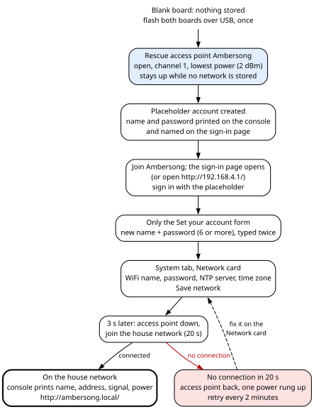
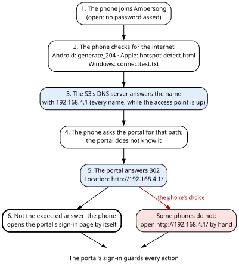
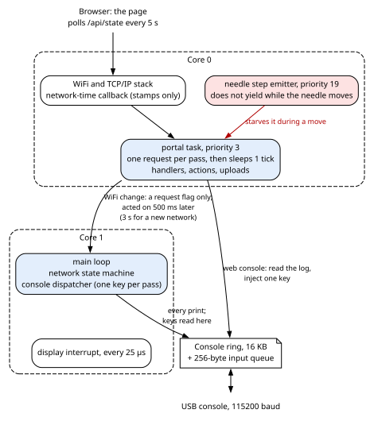
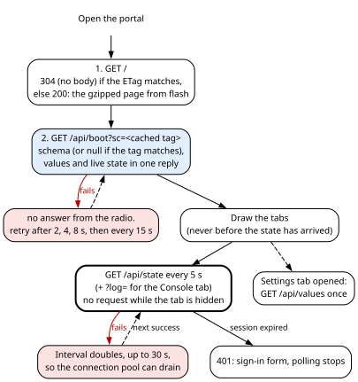

# 8. Network, web portal and console

When the cabinet is closed, the web portal is the only way into the machine. The radio has no
configuration buttons. The main board (the S3) joins the house WiFi and serves a password-protected web
page that shows everything the machine knows: a live dashboard, every setting and action, the settings
file, the user accounts, the network settings, firmware updates for both boards, and a live copy of the
S3's console that you can also type into.

If the S3 cannot reach the house network, it raises its own open WiFi network, the **rescue access
point**, and serves the same portal there while it keeps trying to go home. Nothing ordinary should ever
need the USB cable; the cable stays the last way in when everything else has failed. All the code in
this chapter runs on the S3.

## 8.1 Reaching the radio

| Where you are | Address |
|---|---|
| On the house network | The address the router gave the radio, or `http://ambersong.local/` |
| On the rescue access point `Ambersong` | `http://192.168.4.1/`, or `http://ambersong.local/`. Most phones open the sign-in page by themselves. |
| With the USB cable | The S3's console, on its native USB port at 115200 baud (section 8.9) |

The portal is plain HTTP on port 80. Sign in with an account (section 8.6). The S3 also takes its time of
day from the internet and corrects the audio board's battery clock with it (chapter 4, section 4.9).

Chapter 1, sections 1.3 and 1.4, has the short recovery steps when the portal will not open or the radio
has lost its network. This chapter explains them.

## 8.2 First-time setup

### 8.2.1 The builder checklist

The firmware ships with four values that are not yours. Set them before anything else.

| What | Why | Where |
|---|---|---|
| **Your portal account** | A blank board creates a **placeholder account** whose name and password are public: the console prints them and the sign-in page names them. Until the account stops being the placeholder, the portal refuses everything but the **Set your account** form, and that form asks you to replace both the name and the password (section 8.6.3). | On the portal, at the first sign-in (section 8.2.2). Do not compile your own credentials into the image; the first-login form is the place for them. |
| **Your time zone** | The default is `EST5EDT,M3.2.0,M11.1.0`: eastern North America, UTC−5, daylight time from the second Sunday of March to the first Sunday of November. | The Network card on the System tab (a POSIX TZ rule), or the default in `loadPrefs()` in `src/s3/net.cpp`. |
| **Your time server** | The default primary server is `pool.ntp.org`; `time.nist.gov` is the fixed second. | The Network card, or the same default in `loadPrefs()`. |
| **The `W` prompt's time zone** | The console's `W` clock prompt uses a fixed `EST5EDT` rule, whatever zone the portal holds, and leaves that rule in force afterwards (chapter 4, section 4.9). | `setClockInteractive()` in `src/s3/main.cpp`: put your own POSIX TZ string there, or read the one the network code holds. |

The rescue access point has no WiFi password, by design, so there is nothing to change there. What that
costs is in section 8.6.7.

### 8.2.2 From a blank board, step by step

A blank board has an empty **NVS** ("non-volatile storage", the ESP32's key-value store in flash). This
chapter uses two of its areas: `net` (the WiFi network, the time server and the time zone) and `auth`
(the portal accounts). The machine's own settings are stored elsewhere (chapter 7).

1. **Flash both boards over USB, once** (chapter 3, section 3.8). After that every update can go over
   the air, the audio board's included. The audio board has no reset line from the S3, so after its first
   flash it is reached only through the S3's relay.
2. **The S3 raises its rescue access point.** With no network name stored, it skips the join and raises
   the network `Ambersong` on channel 1 at once. The network is open: joining it asks for no password.
   With no network configured the retry loop never runs, so the access point stays up for as long as the
   board is powered.
3. **The portal creates the placeholder account.** It finds no account stored and creates the shipped
   placeholder administrator account. The console prints its name and password, and the sign-in form's "set
   your account" page names them too.
4. **Sign in and replace the placeholder.** Join `Ambersong`. On most phones the sign-in page opens by
   itself (section 8.3.3); otherwise open `http://192.168.4.1/`. Sign in with the placeholder. The portal
   now refuses everything except four addresses (section 8.6.3), and the page shows only a **Set your
   account** form. Choose a new name and a password of at least six characters, typed twice. Only then
   does the rest of the portal open. The form insists on a name other than the placeholder's, because an
   account that keeps the shipped name keeps half the shipped credentials. That rule is the page's: the
   radio itself would accept a new password alone. After the change the page drops its cached copy of
   the page layout (which carries the old name) and reloads.
5. **Give it the house network.** On the **System** tab, **Network** card, fill in the WiFi name, the
   WiFi password, the NTP server and the time zone. Press **Save network**. The S3 stores them, and
   **3 seconds later** it drops the access point and joins the house network by itself.
6. **On success** the console prints the network name, the address the router gave the radio, the
   received signal and the transmit power that worked. From then on the radio is at its house address or
   at `http://ambersong.local/`.
7. **On failure** (no connection within 20 seconds) the rescue access point comes back, the transmit
   power climbs one rung (section 8.4), and the house network is retried every 2 minutes.

**Without a browser**, the console key `y` sets the network over the USB cable: type the name, a space
and the password, on one line (section 8.9).

The rest of first-time setup (homing, the index band, the dial samples) is in chapters 5 and 6.

> **Warning — this whole path has never been run end to end on the real radio.** The placeholder gate has
> never armed on the author's unit, whose account is not the placeholder.

> **Caution — a blank board's access point transmits at the lowest power, 2 dBm.** The transmit-power
> ladder climbs only on failed joins, and a blank board has no network to fail on. On this machine an
> access point at 2 dBm was visible at 44 % but could not be joined. Stand close; if it still fails, set
> the network with `y` over the cable you just flashed with, or step the power with `B` (section 8.4).

## 8.3 How the radio stays on the network

Two terms first. The S3 is a **station (STA)** when it is a client of the house router, and an **access point
(AP)** when it is its own small network. It can be both at once on its one radio (**AP+STA**), but that is
the slow way (section 8.3.1).

**The rule behind all of it: the radio must never become unreachable.** A failed join ends on the rescue
access point; a forced access point ends; radio silence ends. Nothing reachable from the portal is
unbounded.

### 8.3.1 Joining the house network

- **It picks the strongest access point carrying the network's name**, after scanning every channel,
  not the first one heard. A house with a mesh node or an extender has several.
- **It takes a lone access point (one with nobody connected) down for the length of the attempt.** One radio cannot beacon an access
  point on channel 1 and at the same time hold the router's tight authentication round trip on another
  channel. Once, every retry for half an hour failed that way: the router was found, the authentication
  timed out. **If somebody is connected to the access point, it stays up** and the join runs in AP+STA,
  the slow way.
- **It gives each attempt 20 seconds.** Connected: the access point (if up) goes down, modem sleep is
  turned off, and the S3 starts its network name and network time (section 8.5). Not connected after
  20 s: the transmit power climbs one rung, the console prints
  `join failed at X dBm - trying Y dBm next time.`, and the rescue access point comes up.
- **Modem sleep stays off.** With power save on, the radio listens only at each beacon from the router,
  and connections took 0.5 to 1.0 s to open and page loads 4 to 19 s. With it off, a page took 1.1 s
  instead of 9.0 s. It costs about 80 mA, which does not matter on a set powered from the mains. The S3
  turns it off after it connects (asked before, the request is ignored) and asserts it again every
  5 seconds, because it once came back by itself after an update.
- **A lost link** prints `[WARN] wifi dropped.` and starts a new join at once.

### 8.3.2 The rescue access point

| Property | Value |
|---|---|
| Name | `Ambersong` |
| Security | Open: no WiFi password |
| Channel | 1 |
| Hidden | no |
| Devices at once | 2 at most: "a rescue hatch, not a hotspot" |
| Address | `http://192.168.4.1/` (the ESP32's default access-point address); also `http://ambersong.local/` |

**When it comes up.** At once and for good on a board with no network stored; 20 seconds after a failed
join; 20 seconds after the house link drops (the rejoin fails first); and on demand (section 8.3.4).

**Going home.** While the access point is up and a network name is stored, the S3 tries the house network
again every **2 minutes**. **If anyone is connected to the access point, the attempt is skipped**: a
retry would tear the access point down under the person using it to fix the settings. When nobody is
connected, the access point disappears for up to 20 seconds during the attempt; someone trying to join at
that moment must wait.

**What the console says.** When it raises the access point, the S3 asks the WiFi driver what it really
holds and prints either `raised and the driver confirms it` or `raised but THE DRIVER DOES NOT CONFIRM
IT`, then a line `open, no password   http://192.168.4.1/   channel 1   bssid …` (the BSSID is the access
point's own hardware address). If all three attempts fail:
`[FAIL] the access point will not start. Set the network over the cable with 'y', or reboot.`

**What it hears.** The S3 logs what happens on its access point: `[ap] started`, `[ap] stopped`,
`[ap] probe request heard, N dBm`, `[ap] a device ASSOCIATED` and `[ap] a device left`. A count of joined
devices cannot tell "nobody tried" from "somebody tried and failed"; these lines can. A probe request
heard while a phone scans nearby proves that the S3's receiver works on channel 1.

The cost of an open access point is in section 8.6.7.

### 8.3.3 The captive portal

A phone that joins a WiFi network checks whether it reaches the internet by fetching a known address.
Android asks for `generate_204`, Apple devices for `hotspot-detect.html`, Windows for `connecttest.txt`,
and so on. When the answer is not the one it expects, the phone concludes that the network wants a
sign-in and opens that page by itself. Two pieces make the S3 answer that way:

- **A DNS server** (the service that turns names into addresses). While the access point is up, it
  answers **every** name with the access point's own address, 192.168.4.1. It starts on the first pass
  after the access point comes up and prints `captive portal: every name now points at this radio.`. It
  stops as soon as the access point goes down (the radio went home, a join attempt took the lone access
  point down, or radio silence began). It never runs on the house network.
- **A catch-all redirect.** The portal answers any path it does not know with a redirect (HTTP 302). On
  the access point the redirect names `http://192.168.4.1/` in full, because the phone's check arrives
  under someone else's host name and a bare `/` would send it back to that host. On the house network it
  names `/`.

So the phone's check reaches the S3, asks for a path the portal does not know, is redirected to
`http://192.168.4.1/`, and the phone shows the portal's page. **Whether it opens the page is the phone's
choice**; some do not, and then you type the address. The portal's sign-in still guards every action.

### 8.3.4 Forcing the access point

The rescue hatch can be tested on purpose: the button **Raise the rescue access point** (System tab), or
the console key `Y`. The answer reads `raising the access point - join "Ambersong", then
http://192.168.4.1/`. The driver's confirmation appears on the console only, as `access point is up.` or
`[WARN] the access point did NOT come up - the driver holds no AP.`

A forced access point **holds for 10 minutes**, and longer while somebody is connected to it (the retry
skips while a client is on it and looks again every 2 minutes). Then the S3 goes home by itself. The hold
is bounded on purpose: an unbounded hold, reachable from the portal, would strand the machine off the
house network until a power cycle.

### 8.3.5 Radio silence

**WiFi off for 2 minutes** (System tab, action `sys.quiet`) turns the S3's WiFi fully off for a number of
seconds: 120 from the button, at most 600. The answer is `wifi off - it will return by itself`. When the
time is up the console prints `radio silence over - rejoining.` and the S3 rejoins by itself. It exists to
hear whether the S3's own 2.4 GHz transmitter is what breaks up the audio board's Bluetooth sound. During
radio silence the portal does not answer.

### 8.3.6 Worked example: the router is replaced

| Time | What happens |
|---|---|
| 00:00 | The link drops: `[WARN] wifi dropped.`. The S3 tries to join for 20 s and fails. |
| 00:20 | The transmit power climbs one rung, and `Ambersong` comes up. |
| 02:20 | Nobody is connected. The access point goes down and the S3 tries the house network for 20 s. It fails and climbs another rung. |
| about 02:40 | The access point is back. |
| 03:00 | A phone joins `Ambersong`. From now on every 2-minute retry is skipped. The sign-in page opens on the phone by itself (or open `http://192.168.4.1/`). |
| later | The user signs in, types the new network's name and password on the Network card, and presses **Save network**. |
| 3 s later | The S3 joins the new network, turns modem sleep off, starts its network name and network time, and drops the access point. The rung that connected is kept. |

### 8.3.7 How it works inside

This section is for anyone changing the network code; it names the functions and variables behind
sections 8.3.1 to 8.3.5.

> **For firmware changes**
>
> The state machine is `Net::loop()` in `src/s3/net.cpp`, called from the main loop on core 1, right after
> the link poll, on every pass. Its state is a handful of file-level variables: `gSta` (on the house
> network), `gApUp` (our access point is up), `joining` and `joinStart`, `lastTry` (the last attempt to go
> home), `pendingJoin` (a scheduled rejoin), `gForced` and `forcedAt` (a forced access point), `quietUntil`
> (radio silence), the request flags `gWantAp` and `gWantQuiet`, `gTxQ` (the transmit power in
> quarter-dBm), and the captive portal's DNS server `gDns` with its flag `gDnsUp`.
>
> **`begin()`** loads the `net` area (`ssid`, `pass`, `ntp`, `tz`), applies the time zone at once (so local
> time is right with no network at all), registers the WiFi event handler, calls `WiFi.persistent(false)`
> (the Arduino library must not keep a second copy of the credentials), sets the host name `ambersong`, and
> starts a join.
>
> **`startJoin()`** raises the access point instead if no name is stored. Otherwise it takes a lone access
> point down with `WiFi.softAPdisconnect(false)`, sets `WIFI_ALL_CHANNEL_SCAN` and
> `WIFI_CONNECT_AP_BY_SIGNAL`, sets the mode (`WIFI_AP_STA` if the access point stayed up, else
> `WIFI_STA`), re-applies the transmit power (every mode change resets it), calls `WiFi.begin()` and starts
> the 20-second clock.
>
> **`loop()`**, in this priority order on every pass:
>
> 0. **The DNS server follows the access point.** While `gApUp` is set it is started if not running, then
>    answers one waiting request; once `gApUp` clears it is stopped. This runs first, before any step below
>    can return.
> 1. A radio-silence request more than 500 ms old: carry it out, and return.
> 2. A force-AP request more than 500 ms old: carry it out, then print whether the driver really holds an
>    access point.
> 3. Radio silence running: return until it ends; then rejoin.
> 4. A scheduled rejoin now due: drop the station if joined, stamp `lastTry`, start a join.
> 5. Joining. Connected: `gSta` set; if the access point was up, `softAPdisconnect(true)` then
>    `WiFi.mode(WIFI_STA)`, a change from AP+STA that does not pass through "no mode"; modem sleep off with
>    `WiFi.setSleep(WIFI_PS_NONE)`; print the link, start mDNS and network time. Twenty seconds without a
>    link (`JOIN_MS`): climb one rung, raise the access point, stamp `lastTry`.
> 6. On the access point, with a name stored, more than 2 minutes since `lastTry` (`RETRY_MS`) and not
>    inside a forced hold: clear `gForced`, stamp `lastTry`; skip the attempt if anyone is connected,
>    otherwise start a join.
> 7. Was on the house network and lost it: print the warning and start a join.
> 8. On the house network, every 5 seconds: mark network time fresh if it has synchronised (chapter 4,
>    section 4.9), and assert `WIFI_PS_NONE` again.
>
> **`startAp()`**, the rescue access point:
>
> - `WiFi.disconnect(false, false)` (stop chasing the router, keep the radio on), 50 ms,
>   `WiFi.mode(WIFI_AP_STA)`, 100 ms. **It never passes through `WIFI_MODE_NULL`.** In arduino-esp32 core
>   2.0.17, going to "no mode" de-initialises the WiFi driver, and the next mode change re-initialises it
>   onto network-interface objects the library never destroyed (arduino-esp32 issue #7232). The symptom is
>   what this machine did for weeks: the access point's start event fires, `softAP()` returns true, and
>   nothing is on the air.
> - Up to 3 attempts of `WiFi.softAP()` with the name `Ambersong`, no passphrase, channel 1, not hidden,
>   at most 2 clients, 400 ms apart. The passphrase argument is `nullptr`, which makes the network open. **A `true` is not believed** unless `apReallyUp()` agrees: it asks
>   the driver whether its mode includes AP and whether its AP configuration holds a non-empty name.
>   `softAP()`'s return cannot answer that, because the library skips the driver call when the new
>   configuration is byte-identical to the old one and returns true anyway.
> - `WiFi.enableSTA(false)` (AP+STA to AP, with no de-initialisation on this path), then re-apply the
>   transmit power.
> - `esp_wifi_set_event_mask(0)`, so the driver reports probe requests (masked by default in ESP-IDF).
> - Print what the driver holds, then the `open, no password` line, and start mDNS.
>
> **The redirect** is the portal's handler for unknown paths (`server.onNotFound` in `Portal::begin()`,
> `src/s3/portal.cpp`). It names `/` when `Net::isSta()` is true, and otherwise `http://` plus
> `WiFi.softAPIP()`. The DNS server is the Arduino `DNSServer`, started as
> `gDns.start(53, "*", WiFi.softAPIP())`.
>
> **`forceAp()`** cancels any pending join, sets `gForced`, stamps `forcedAt` **and `lastTry`**, and raises
> the access point. Without the `lastTry` stamp the very next pass saw a retry overdue since boot, and the
> forced access point lived about one loop tick. The hold is `FORCE_HOLD_MS`.
>
> **`quiet(seconds)`** caps the time at 600 s, clears all state, calls `WiFi.disconnect(true, false)` and
> `WiFi.mode(WIFI_OFF)`. Unlike every other path in this file it does go through the driver's
> de-initialisation; that is its purpose, and it has never failed.
>
> **Portal requests only ask** (section 8.7.1): `Net::requestForceAp()` and `Net::requestQuiet()` set a flag
> and a timestamp, and `loop()` acts more than 500 ms later. A network change from the portal
> (`Net::setWifi()`) sets `pendingJoin` 3 s ahead.

### 8.3.8 Two diagnostics

The console key `i` prints the network state and two reports (section 8.9):

- **What the driver really holds:** the mode, the transmit power as the driver reports it, the country
  and channel plan, the access point's configuration read back, the beacon interval, the radio modes, the
  channel, and the access point's address and client count. It exists because, for months, "`softAP()`
  returned true" was the only evidence ever held that the access point transmitted. It adds
  `*** LOW - the transmitter is turned down ***` to any power under 10 dBm, although the ladder's lower
  rungs are normal (chapter 12).
- **A scan of every channel**, only when the S3 is not on the house network. It lists every network
  heard, marks those that carry the configured name, and gives channel, signal, security and BSSID. It
  tells apart three failures that look alike from the inside: "I cannot find the router", "I found it
  and it refuses me", and "there are three and I picked the far one". The scan holds the main loop for a
  few seconds.

## 8.4 Transmit power

The S3 **learns** the WiFi transmit power it needs, on a ladder of six rungs:

| Rung | Stored value (quarter-dBm) | Transmit power (dBm) |
|---|---|---|
| 1 (floor and default) | 8 | 2.0 |
| 2 | 20 | 5.0 |
| 3 | 28 | 7.0 |
| 4 | 34 | 8.5 |
| 5 | 44 | 11.0 |
| 6 (ceiling) | 60 | 15.0 |

**A failed join climbs one rung, and whichever rung connects is kept.** After the top rung the ladder
wraps back to the bottom. After the first success the walk normally never happens again.

**Why a ladder.** A join can fail for two opposite reasons: too much power (on this board the transmitter
then radiated nothing at all) or too little (a distant router). From the inside the firmware cannot tell
which, so it walks every rung. It starts at the bottom, because 2 dBm is ample for a router a few metres
away.

**The 15 dBm ceiling is a firmware choice**, measured on this machine: a forced access point at 20 dBm was
seen by no device for 90 seconds; at 15 dBm two devices saw it within 22 seconds, and a PC joined it and
signed in to the portal. The ceiling is held in the firmware because the fault is believed to be a
firmware problem. **The 2 dBm floor** is also a firmware value; the board once connected at 2 dBm when
every higher rung then in use radiated nothing.

**Where it is stored.** Not with the network settings but in the machine's settings, as `wifiTxQ`
(default 8), saved with the rest (chapter 7, section 7.3.3). It is **not** a portal setting and **not** in
the settings file; an old file's `wifiTxQ=` line is ignored on upload, so old backups still load cleanly.
Only the console reaches it:

- `B` steps it by hand along 60, 44, 34, 28, 20, 8, cycling, marks it for saving (it is written about
  2 s later) and prints what the driver applied.
  `B` keeps its own place in that list from boot, so its first press after a boot always gives 44
  (11 dBm), whatever the current rung.
- `D` prints it among the settings, in raw quarter-dBm, with a `#` line giving the dBm.

The rescue access point transmits at the learned rung. That is why a blank board's access point runs at
2 dBm (section 8.2.2).

> **For firmware changes**
>
> **How it works inside.** `applyTxPower()` in `src/s3/net.cpp` clamps `gTxQ` to 8..60 and hands it to
> `esp_wifi_set_max_tx_power()`. It is called after **every** WiFi mode change, because the driver does not
> carry the power across one. `TX_LADDER` holds the rungs; `ladderNext()` returns the rung above the rung
> nearest to the current value. At boot `applySettings()` pushes `cfg.wifiTxQ` into the network code; the
> main loop copies `Net::txPower()` back into the settings on every pass and marks them for saving, so the
> learned rung survives a power cut and the network code wins while it is hunting.

## 8.5 Network name and network time

**The network name (mDNS).** The radio answers as `ambersong.local`, advertising the service
`_http._tcp` on port 80. mDNS (multicast DNS) lets devices on the same network find it by that name
without a DNS server. It starts when the S3 joins the house network or raises its access point. The name
keeps answering after the S3 comes home from its rescue access point: in a test, it answered within 18 s
of the return and on every check after. No restart is needed.

> **For firmware changes**
>
> Inside, `startMdns()` does nothing while its flag `mdnsUp` is set. A lost link and radio silence clear
> the flag, so the next start runs `MDNS.begin()` again.

**Network time.** The S3 starts network time (SNTP) on every successful join, with the stored server and
`time.nist.gov` as the second. Saving the Network card stores the server and the time zone, applies the
zone at once, and restarts network time if the S3 is on the house network. Everything else about time —
what "fresh" means, the hourly correction of the battery clock, the time zone, the `W` prompt, the
battery-clock pills — is in chapter 4, sections 4.9 and 4.10.

## 8.6 Accounts, sign-in and security

The portal is built against one threat: "people in the house, and a guest who is curious". The portal protects
the machine from those, and no more. It uses **plain HTTP, with no encryption (TLS)**, on purpose: against
that threat model, TLS on an ESP32 costs more than it buys.

### 8.6.1 Roles

The split is about damage, not secrecy: a guest gets "the music and the lights, not the machine", and
sees everything.

| What the account can do | A normal account (guest) | The administrator |
|---|---|---|
| See every value | yes | yes |
| Volume and mute | yes | yes |
| Display brightness and the three panel-lamp levels | yes | yes |
| Bluetooth: play, pause, next, previous, disconnect, pair | yes | yes |
| Change their own password | yes | yes |
| The needle and its calibrations, gain staging, everything else that changes what the machine *is* | no | yes |
| The network, accounts, updates, the settings file, reboots | no | yes |
| The Console tab | no | yes |

### 8.6.2 Accounts and passwords

- **Four accounts at most**, each in its own slot. Slot 0 is the only administrator. It cannot be deleted or demoted; new
  accounts are always normal; nothing can promote one. A machine with no administrator would be a
  machine that needs a cable.
- **Names and passwords.** Passwords are at least 6 characters. A new user's name is 2 to 16 characters;
  a renamed account's, 1 to 16.
- **Changing a password.** Anyone may change their own (the old one is required). The administrator may
  change any other account's password without knowing the old one, so a guest's "I forgot mine" needs no
  cable. The page has no button for that; it is `POST /api/passwd` with the target slot `i`
  (Appendix B). From the page, a forgotten guest password is handled by removing the account and adding
  it again.
- **Passwords are stored hashed**, because anyone with a USB cable can read this flash and people reuse
  passwords on things that matter. Each is one pass of SHA-256 over an 8-byte random salt followed by the
  password.
- **Not in the settings file.** Restoring a settings file does not restore accounts, and the WiFi
  password lives only with the network settings.

### 8.6.3 The placeholder gate

While the signed-in account is still the shipped placeholder, the portal refuses every request with
HTTP 403 `{"e":"mustchg"}`, except four: `/api/boot`, `/api/state`, `/api/passwd` and `/api/logout`.
The page then shows only the **Set your account** form.

"Still the placeholder" means: the name is the placeholder's **and** the stored password is the
placeholder's. So a new password alone clears the gate, and so does a rename alone; the page asks for
both (section 8.2.2). The page learns about the gate from the live state (`mustchg`), not from the cached
page layout, because that cache is not refreshed when a password changes.

### 8.6.4 Sessions

- **Kept in memory only.** A restart of the main board signs everyone out. The front switch does not
  restart it; a portal reboot, a crash or unplugging the set does.
- **Four at once.** A fifth sign-in evicts the stalest session ("never refuse a login").
- **5 minutes idle, sliding.** Every request restarts the 5 minutes. The browser's cookie lives 24 hours,
  but the server's 5-minute rule is what governs.
- **The token** is 32 hexadecimal characters (128 random bits), in the cookie `amb`.

When a session expires, the next request answers 401, the page stops polling and shows the sign-in form.

### 8.6.5 Password guessing

Failures are counted per device address; four addresses are tracked. **From the 5th failure in a row**,
that address is locked out for 1 minute, then 2, 4, 8 and so on, doubling up to 64 minutes. While
locked, a sign-in answers HTTP 429 with the seconds left. A success clears the record. The code's
reasoning: "Five wrong guesses is a person who has forgotten; twenty is not."

### 8.6.6 A lost administrator password

Nothing on the portal can reset slot 0. There is no password reset on the front of the machine: the USB
socket is the recovery path. The console key `~` erases **all** portal accounts and restores the
placeholder; then sign in and set your account again (section 8.2.2). The web console can send `~` too,
but only from an administrator session that is still open, so in practice a lost administrator password
means the USB cable.

### 8.6.7 What the portal does not protect

Read this before you put a build like this on a network you share.

- **Plain HTTP.** Passwords and session cookies cross the WiFi unencrypted. On the house network the
  router's WiFi encryption at least covers the radio link.
- **The rescue access point is open.** On it nothing is encrypted at all. While it is up, the portal
  sign-in and the house WiFi password typed during a rescue cross the air in clear, and anyone within
  radio range can capture them. The access point is up only when the house network cannot be reached or
  when someone raises it by hand, and it closes when the radio gets home. The portal sign-in still guards
  every action on it. This is the price of a rescue network that needs no password at the moment you
  need it most.
- **Weak password hashing.** One SHA-256 pass with an 8-byte salt and no key stretching. The flash is not
  encrypted, so anyone with the USB cable can read the hashes.
- **No CSRF token.** Protection against a foreign web page making requests in your name rests on the
  cookie's `SameSite=Lax`.
- **The lockout tracks four addresses.** A fifth address takes over slot 0's record and resets it.
- **One administrator.** Losing its password needs the cable, and `~` erases every account.
- **The `y` prompt echoes the WiFi password** into the console log, readable by any administrator with the
  Console tab open, and onto USB.
- **The web console has the cable's power**, including `z` (erase the WiFi radio's RF calibration) and `~`
  (reset the accounts). It is administrator-only.

What is enforced instead: no anonymous access to any API, salted hashes, sessions in memory only, the
lockout, and no credentials in the settings file.

## 8.7 How the portal works inside

This section explains why the portal behaves as it does: why it slows while the needle moves, why it
stops answering when it gets too many connections, and how the page is built. The parts that name
tasks, functions and files are for anyone changing the firmware.

### 8.7.1 Tasks and cores

> **For firmware changes**
>
> 
>
> Chapter 2, section 2.4, has every task in one table; chapter 4, section 4.3, the rules for both cores.
> For the portal:
>
> | Part | Where it runs |
> |---|---|
> | HTTP server (`serverTask()`, `src/s3/portal.cpp`) | Its own task `portal`, **core 0, priority 3, 8192-byte stack**. One `handleClient()` per pass, then a sleep of one tick (`vTaskDelay(1)`). It serves only while the S3 is on the house network or its access point is up; during radio silence it idles. |
> | Network state machine (`Net::loop()`, `src/s3/net.cpp`) | The main loop, core 1. |
> | Console tee `Con` (`src/s3/console.cpp`) | Any task: a locked ring. |
> | Console dispatcher (`loop()`, `src/s3/main.cpp`) | The main loop, one character per pass. |
> | Network-time callback (`onSntpSync()`, `src/s3/net.cpp`) | The TCP/IP stack's task. It only stamps the time. |
> | Portal actions (`doAction()`, `src/s3/settings_table.h`) | The portal task, per request. |
> | The page | The browser. |
>
> **Why core 0.** Core 1 belongs to the display's multiplexing interrupt and the needle's timing. An early
> measurement showed that WiFi plus four parallel downloads on core 0 kept the display's worst slot error
> under 100 µs; the finished firmware measured 22 µs idle and 61 µs under eighteen hammering requests. The
> asynchronous web server library was never tried on this machine.
>
> **Why it sleeps one tick every pass.** The portal's loop sleeps one tick each pass so the rest of core 0
> gets its turn.

**The cost: the portal is starved while the needle moves.** The needle's step emitter runs on core 0 at
priority 19 and does not yield during a move. The portal was measured unreachable 36 % of the time while
the needle tracked the knob, and one 933 kB update took 293 s. This is accepted: nobody should need the
portal while tuning. Stop the needle, or wait. Keep the needle at rest during an audio-board
update, because the portal task relays it (chapter 12 has a starting point for a fix).

> **For firmware changes**
>
> **The cross-task rule: a handler never changes the WiFi mode itself.** A handler runs on core 0; the
> network state machine on core 1. When a handler once raised the access point itself, it raced the network
> loop and tore down the very link its answer still had to travel on. So the two actions that touch the
> radio, `net.forceAp` and `sys.quiet`, only *ask*: they set a flag and a timestamp, and the network loop
> carries the request out **more than 500 ms later**, so the answer leaves first. A network change from the
> Network card is deferred the same way, by **3 seconds**.

**Not under the task watchdog.** The portal task is not watched by the S3's 15-second task watchdog
(chapter 4, section 4.11): a flash write legitimately blocks it, and the upload watchdog (section 8.7.3)
covers a stalled upload. Nothing catches a portal task that hangs for good; unplug the set.

### 8.7.2 The connection budget

This is the rule that shapes everything the page does. The server is the Arduino core's synchronous
`WebServer`, and it handles **one connection at a time**. Each HTTP connection, once closed, leaves a
**TCP control block** (the network stack's record of a connection) waiting about a minute in the state
called TIME_WAIT, against a pool of roughly sixteen. About twenty to forty quick connections use up the
pool. The radio then stops accepting connections, **while ping stays perfect** (ping does not use that
pool), and it recovers after a minute or two of silence.

A dashboard polled once a second could never have worked: about sixty outstanding blocks against a pool
of sixteen. Worse, the old page kept polling at the same rate while its polls failed, so the pool never
drained and the fault looked permanent. The test that settled it was the cheapest one: stop touching the
machine, then try once. After 3 minutes without traffic the first request answered in 1.07 s; 20
back-to-back requests all succeeded; the next 19 all died. Modem sleep, an over-eager socket reaper and
core-0 starvation had each been blamed first; each was a real defect worth fixing, and none was the cause.
At the new pace, about 60 connections a minute became about 12, and the polls measured afterwards all
answered in 0.35 to 3.1 s.

So the page works like this:

- **A page load is two requests:** the page itself (usually answered 304, "not modified", with no body),
  then `/api/boot`, which returns the page layout, the values and the live state in one reply.
- **The page layout is cached in the browser.** The page describes every setting it draws from a
  **schema** sent by the radio (section 8.7.4). The browser keeps the last schema in
  `localStorage['amb.sc']` and offers its tag as `/api/boot?sc=<tag>`. The tag is the firmware version
  plus the administrator bit (`FW_VERSION-0` or `-1`); if it still matches, the radio answers `"sc":null`,
  and about 11 kB becomes about 3 kB. Every new build changes the tag. The administrator bit is in it so
  that a guest signing in on a browser an administrator used can never inherit the administrator's
  cached page.
- **Polling:** `/api/state` every **5 seconds**. After a failure the interval doubles, up to **30
  seconds**, so a used-up pool can drain. No request while the browser tab is hidden. Polling stops on a
  401, so a half-typed password is not wiped by a redrawn sign-in form.
- **The console rides the state poll** (`/api/state?log=`), with no connection of its own.
- **Settings tabs** fetch `/api/values` when opened, not on a timer.
- **Every request has a deadline** of 12 seconds, covering the body as well as the headers (20 s for a
  settings upload; none for firmware uploads). "Headers, then stall" is what this machine does when it
  has run out of control blocks.
- **The page never renders nothing.** If `/api/boot` fails, it shows `no answer from the radio.` and
  retries after 2, 4 and 8 seconds, then every 15 seconds. An earlier page simply gave up when its first
  request timed out, and "it loads but doesn't show anything" was that line exactly.
- **Nothing is drawn before the state has arrived, and drawing never throws.** The first page drew before
  it had any state; the first paint read a field of the still-empty state, threw an error, and everything
  after it (the first poll, the timer) never ran. The page rendered once, blank, forever. A dashboard that
  throws is a dashboard that stops.
- **Anyone scripting against the radio** must stay at about one request every few seconds.

### 8.7.3 Request handling

The server checks every request the same way. The first three points below are for anyone changing
the server; the rest explain answers you may see.

> **For firmware changes**
>
> - **Who may ask.** Every API handler starts with `requireLogin()`, which answers 401 `{"e":"login"}` when
>   there is no valid session, so a forgotten check fails closed. It also enforces the placeholder gate, in
>   **one place**: "a rule enforced in fifteen places is a rule with fourteen chances to be forgotten". Only
>   these are anonymous: `GET /` (the page), `POST /api/login`, `POST /api/logout`, `GET /favicon.ico`, and
>   the redirect for unknown paths. The two firmware-upload handlers do not use `requireLogin()` and repeat
>   the session, administrator and placeholder checks themselves (chapter 3, section 3.10.1).
> - **The silent-socket reaper.** Browsers open spare connections in advance. `WebServer` accepts one and
>   waits up to 5 seconds (`HTTP_MAX_DATA_WAIT`, fixed inside the library) for a request that never comes,
>   while real requests queue behind it; sign-ins took 15 seconds. So after every `handleClient()`, the
>   server task closes the connection it is holding if it has been open **3 seconds** (`IDLE_SOCKET_MS`)
>   with nothing to read. The reaper is off while an upload runs, because an upload has quiet moments. With
>   it (then at 750 ms) a cold sign-in went from 4.8 s to 0.12 s, and three parallel requests from 10, 16
>   and 19 s to about 1.1 s each. No curl test could have found this, because curl opens exactly one
>   connection.
> - **The upload watchdog.** `otaWatchdog()` runs every pass. If an upload is flagged and nothing has
>   arrived for **15 seconds**, it releases the machine: for the S3's own image it aborts the update and
>   lets the needle and display run again; for the audio board's relay it aborts the relay. `WebServer` does
>   not reliably report an upload that died with its connection.

- **Numbers in requests** must be one finite number, the whole string; one decimal comma is read as a
  point ("107,3" is 107.3). Anything else is refused. Clamping and checks live in the machine, never only
  in the browser.
- **Unknown paths** answer 302 (section 8.3.3). `/favicon.ico` answers 204, no content.
- **Counters for "portal dead, ping alive".** The console `s` prints the portal's `loops` (server task
  passes), `served` (requests served) and the task's free stack in bytes. **Frozen loops** mean the task
  is starved; **climbing loops** mean the fault is in accepting connections.

### 8.7.4 The page: built once, served from flash

The page lives inside the firmware, so it never falls out of step with the program that serves it. How it
is built and served matters only to someone changing it.

> **For firmware changes**
>
> The page is one self-contained file, `data/portal.html`: inline CSS, one `<script>` block, no external
> files. At every build, `scripts/page.py` checks that its script parses, gzips it and writes it into the
> program as `src/s3/page_gz.h`, with an **ETag** (a version label that browsers send back to ask "has this
> changed?"). Chapter 3, section 3.4, describes the script. There is no filesystem: nothing to upload
> separately and nothing that can fall out of step with the firmware serving it.
>
> **Why compress at build time.** The uncompressed page took 0.7 to 3.6 s per load on a one-connection
> server. The ESP32's ROM can decompress but not compress, and compressing at run time would trade one cost
> for another. The page is about 35 kB of HTML and about 13 kB compressed.
>
> **Serving.** If the request's `If-None-Match` header carries the ETag, the answer is 304 with no body.
> Otherwise 200, with the ETag, `Cache-Control: no-cache, must-revalidate` (the browser always asks, so a
> firmware update is never hidden behind a stale page) and `Content-Encoding: gzip`, straight from flash.
> The server collects only two request headers, `Cookie` and `If-None-Match`.
>
> **The page is driven by the schema.** It knows no setting by name except `volume` and `muted` (the Now
> tab's music card). It draws whatever the schema lists for each setting: key, label, unit, tab, kind, low,
> high, step, read-only flag and choices. Kind 1 is a checkbox, kind 3 a drop-down, anything else a slider
> with a number box. Adding a setting is one row in `src/s3/settings_table.h`; that row also gives the
> setting its clamping and its line in the settings file (chapter 7, section 7.11.1). Its scale is why a
> value can travel between the boards as an integer (tenths of a dB, say) while a person reads "+15.0 dB".
>
> **A change** posts `/api/set`. The stored value in the reply, possibly clamped, is written back into every
> widget with that key. Volume and mute follow the physical knob through the live state, except while their
> slider has focus.
>
> **Action buttons** are one list in the page (`ACTIONS`): per tab, a label, an action, a value and an
> administrator-only flag. A value of `?` means "ask": the station marks ask for the frequency, and the
> drop-sample button for a slot number. A comma typed in the answer becomes a point.

## 8.8 What the page shows

**Tabs**, in order: **Now** (the dashboard and the music card), then the schema's tabs **Audio**,
**Display**, **Lights**, **Needle**, **Bluetooth** and **System**, then **Console** (administrator only),
then **Account**. Appendix E maps every tab, card and button to the call it makes.

**Header pills.** The header shows the link to the audio board, the needle homed, network time fresh, the
clock, the network (its name and signal, or "access point"), the address, and red warnings when something
needs attention. Chapter 1, section 1.13, lists every pill and what it means.

**Toasts** are the message strip. An acknowledgement shows for 2.6 seconds in amber. A refusal or a
warning shows for **12 seconds in red**. A refusal often arrives on a 200 answer carrying a `warn` field
(portal actions, the tuner ends, the settings upload), and the page paints it red. Earlier
versions showed several refusals in the success colour; this rule stops that.

**The Network card** (System tab, administrator):

- **Save network stays disabled until the form has been filled from the radio.** A failed prefill once
  let one click save three empty fields and drop the house network.
- **A blank password field keeps the stored password.** The radio never sends the password back.
- **Saving always resends the network name**, so changing only the time server or the time zone also
  makes the radio leave and rejoin its network 3 seconds later.
- The answer is `network saved - the radio joins it in a few seconds`. An empty name is refused:
  `the network name is empty`.

**Firmware uploads** show a progress bar. **Reboot the main board** asks for confirmation first, and on
success the page shows only "rebooting", whatever the radio answered (chapter 12).

## 8.9 The console, over USB and the web

The S3 has one text console. Every key is a command. The full key list is in Appendix D; chapter 1,
section 1.2, shows how to start.

**Two ways in, one console.** The console is the S3's native USB port, the USB-C socket on the back panel,
at 115200 baud. Every byte the S3 prints goes both to the USB port and into a **16 KB ring** in memory,
which the portal's **Console** tab reads. Keys typed on the Console tab are queued and read as if typed on
USB. The audio board's lines reach the same console through the link, prefixed `[A32]`.

**Why a web console.** With no cable there is nothing to unplug from a closed cabinet, and no second
ground connection between a PC and the machine. The USB socket's ground is the machine's DC-side ground,
which sits on mains earth, not on the tube radio's chassis; a PC plugged into it adds a second path to
earth (Hardware Bible, chapter 5).

**Sending from the web: one key per send.** The S3 reads one character per pass of its main loop, and
**every character is a command**. Before this rule a typed word ran as a string of commands: "status" ran
`t`, `a` and then a 200-half-step jog that ignores the soft limits, and any word with a `z` erased the RF calibration. The portal now
refuses anything longer than one key (`one key at a time - each character is its own command`), **except
while a prompt is reading a line**, when up to 128 characters go through. The portal appends Enter to
every send; the console ignores it. After a send, the page polls once early, 900 ms later.

**Reading from the web.** The page asks for the console's new bytes on its 5-second state poll, at most
4096 bytes each time, oldest first. It keeps the last 60 000 characters and inserts
`[... older output was overwritten before it could be shown ...]` or `[... the main board restarted ...]`
when it sees a gap.

**Line prompts.** Two keys read a whole line:

| Key | Asks for | Gives up after this long with no key typed |
|---|---|---|
| `y` | `name <space> password` of the house network. Stores them and rejoins 3 s later. A blank line cancels. | 60 s |
| `W` | Local time, `YYYY-MM-DD HH:MM:SS` (chapter 4, section 4.9). | 40 s |

Each wait restarts at every character typed, so a prompt can stay open longer while someone types. While a prompt waits, **the main loop is held**: the clock
display freezes, the network state machine does not run, and the S3 sends nothing on the link, so the
audio board, which treats two seconds of silence as "amplifier down", mutes. Both prompts keep the S3's
watchdog fed, so a prompt left open does not restart the board. When a prompt returns, the rest of the
line is discarded, so the tail of an over-long line can never run as one-key commands (where an `m` or a
`c` would overwrite a calibration and a `j` would jog 200 half-steps, ignoring the soft limits). The `y` prompt's buffer fits the
longest legal pair: a 32-character name, a space and a 63-character password.

> **Caution — `y` echoes what you type, the password included**, into the console ring that the Console
> tab shows, and onto USB.

**The live index monitor `l`** prints the index sensor about every 250 ms for up to 60 seconds. It ignores
Enter (the portal sends one after every key), stops on any other key, and keeps the audio board awake by
pinging it on every pass (chapter 5).

**The network keys** belong to this chapter:

| Key | What it does |
|---|---|
| `i` | Joined, or `OWN ACCESS POINT`; the network's name, the radio's address and signal; portal up or down, sessions, network time fresh or stale; access-point clients; the driver report; and, only when not on the house network, a scan of every channel (section 8.3.8). It prints `OWN ACCESS POINT` whenever the S3 is not joined, also while joining or during radio silence (chapter 12). |
| `y` | Set the house network (line prompt, above). |
| `Y` | Raise the rescue access point now; it holds 10 minutes, longer while someone is on it, then goes home. |
| `~` | Erase **all** portal accounts and restore the placeholder (section 8.6.6). |
| `z` | Erase the WiFi radio's RF calibration in flash and reboot. A transmitter diagnosis; it touches none of the radio's own calibrations. |
| `B` | Step the transmit power (section 8.4). |

**What the console does not show.** Anything not written through the console object, including the
ESP-IDF framework's own log lines. Those, brownout reports included, go to the S3's UART0, not to its USB
console, so silence on the USB console proves nothing about them.

> **For firmware changes**
>
> **How it works inside.** `Con` (`class ConsoleTee`, `src/s3/console.cpp`) owns the USB port; it is the
> only file that touches the real `Serial`. The output ring is `LOG_CAP` = 16384 bytes, and `gSeq` counts
> every byte ever written. Input comes first from a 256-byte injection queue (`IN_CAP`) fed by the portal,
> then from USB. One spinlock guards both rings and is held only for memory copies; the USB write happens
> outside it, because it can wait on the host. `write()` reports the full length even when no USB host took
> anything, so a machine with only the portal attached is not treated as failing.
>
> - **Reading:** an administrator's page with the Console tab open asks `/api/state?log=<next byte
>   number>`. The reply gains `"log":{"from":F,"next":N,"t":"..."}`, built by `copySince()`: the oldest
>   bytes since `F` first, newlines escaped, other control characters dropped. A `from` older than the ring,
>   or from the future (the S3 rebooted under an open page), resyncs to the oldest byte held.
> - **Writing:** `POST /api/cons` with `k=<text>`; the server appends a newline and injects it. More than one
>   character is accepted only while `Con.lineWanted` is true, which only the `y` and `W` prompts set. When
>   a prompt returns, `drainLine()` discards input up to the end of the line, within a 50 ms window.
> - **Blocking keys:** the prompts and `l` call `wdtFeed()` while they wait; `l` also sends a link ping each
>   pass. The `i` scan blocks for a few seconds without feeding, well under the watchdog's 15 seconds.
> - **One help list,** `commandList()`, printed by `?`, at the end of every `s`, and at boot.

## 8.10 Updating from the portal

Both boards are updated from the **System** tab's **Firmware** card: **Update the main board** and
**Update the audio board**, each a file picker with a progress bar. Chapter 3 is the home of updating:
what both upload endpoints check first (section 3.10.1), the main board's update (3.10.2), the relay to
the audio board (3.10.3), the trial and the rollback (3.11), and a full walk-through (3.12).

What to remember from the portal's side:

- **The answer can lie.** A successful update reboots, and the reboot can beat the HTTP reply, so the page
  may report failure for an update that worked. Check the **running** line on the System tab afterwards.
- **Only the administrator**, and not while the account is still the placeholder.
- **A wrong file is refused before anything is written:** the two pickers sit side by side and the two
  builds look alike. For the main board the wrong-chip reason reaches only the console; the page shows
  "flash" (chapter 12).
- **During an update of the main board** the needle stops and the display goes dark; the sound keeps
  playing. **During an update of the audio board** the sound stops; the needle and display carry on.
- **No second main-board update during the trial minute**, and **Reboot the main board** during that
  minute rolls back at once (chapter 3, section 3.11).
- **Keep the needle still** during an audio-board update (section 8.7.1).

**Which version am I running?** The **running** line on the System tab shows the main board's version and
commit stamp, `v.1.<stamp> (<hash>)`. The audio board's version is only on the console. Chapter 3,
section 3.13, explains both.

## 8.11 When it goes wrong

The last column is the fault's class on the recovery ladder (NOTE, DEFECT, BLOCKER), set out in *About this
book*, and whether the path has ever run on the radio.

| What you see | What happened | What the firmware does | What you do | Class |
|---|---|---|---|---|
| The radio is off the house network; `Ambersong` appears | Wrong WiFi password stored: no connection within 20 s. | Raises the rescue access point; climbs one transmit rung per failure (all six, wrapping); retries every 2 minutes. | Join `Ambersong` (open; the page opens by itself on most phones, otherwise `http://192.168.4.1/`) and fix it on the Network card (type the new password; blank keeps the old), or console `y`. | NOTE: heals once the setting is fixed, no cable. The access point's return after a failed join, on the current retry path, has never run on the radio. |
| `[WARN] wifi dropped.`; the access point appears | The router is off or was replaced. | Rejoins; access point after 20 s; retries every 2 minutes, never while someone is on the access point. | Wait, or fix it through the access point (section 8.3.6). | NOTE |
| `the network name is empty` | An empty network name was submitted. | Refuses (HTTP 400). The page cannot save before its form is filled. | — | NOTE |
| `[FAIL] the access point will not start ...` | The driver did not confirm the access point after 3 attempts. | Nothing more. | USB console: `y`, `i`, `B`, `z`; or reboot. | BLOCKER if nothing radiates at all (USB only) |
| The join fails and the access point is not seen | The transmitter is set above what the board can radiate. | The ladder climbs and wraps to 2 dBm; the top rung is capped at 15 dBm. | Wait for the ladder; or `B` over USB. | NOTE |
| The radio goes home on its own | A forced access point's hold expired with nobody on it. | Goes home after 10 minutes. | Nothing. | NOTE |
| The phone joins `Ambersong` but no page opens | The phone decides whether to open the page. | The DNS server and the redirect keep answering. | Open `http://192.168.4.1/` by hand. | NOTE. A phone opening the page by itself has not yet been seen on this radio. |
| No `captive portal: ...` line on the console | The DNS server failed to start. | Tries again on every pass while the access point is up; the portal still answers at its address. | Open `http://192.168.4.1/` by hand. | NOTE; never seen |
| A blank board's access point cannot be joined | No network name, so no failed join to climb the ladder: it stays at 2 dBm. | Nothing. | Move closer; or `y` / `B` over USB. | NOTE when moving closer works; BLOCKER only if nothing but the USB console helps |
| The portal is dead but the radio answers ping | The pool of connection records is used up. | The page backs off to 30 s so the pool drains. | Close every tab on the radio, wait 1 to 2 minutes, try once. `s` shows `loops` and `served`. | NOTE |
| The portal is slow while the needle moves | The step emitter holds core 0. | Nothing; accepted. | Stop the needle, or wait. | NOTE |
| `no answer from the radio.` | `/api/boot` failed. | Retries after 2, 4, 8, then every 15 s. | Wait. | NOTE |
| The sign-in form comes back | The session expired (401). | Shows the sign-in form; stops polling. | Sign in. | NOTE |
| Sign-in refused with a wait | Five failures from one device (429). | Locked for 1 to 64 minutes, doubling. | Wait. | NOTE. Never run beyond its first steps. |
| The administrator's password is lost | — | Nothing on the portal can reset slot 0. | USB console `~` (erases **all** accounts, restores the placeholder). | BLOCKER for the administration: only the USB console's `~` recovers it; the radio keeps playing |
| A main-board upload stops part-way | The connection aborted, or 15 s without data. | Aborts; the needle and display come back once the needle's stop has landed; the old program stays in its slot. | Upload again. | NOTE |
| An audio-board upload stops part-way | As above. | The upload watchdog aborts the relay. A relay failure mid-stream sends no abort, and the audio board stays muted about 20 s until its own timeout (accepted as harmless). | Upload again. | NOTE |
| The upload is refused at once | The wrong file was picked: its chip number does not match. | Refused before anything is written. | Pick the other file. | NOTE |
| The page says the update failed, but it worked | The reboot beat the reply. | — | Check **running** on the System tab. | NOTE |
| `not rebooting - <why>` | **Reboot the main board** with an unsaved change that cannot be saved (program confirmed). | Stops the needle, retries the save for 1.5 s; then refuses (409) and lets the needle resume. | Fix the cause, press again. | NOTE |
| The previous program is back after **Reboot the main board** (the radio answers `rebooting - this firmware was still on trial, so the previous firmware comes back`; the page shows only "rebooting") | **Reboot the main board** while the new program is on trial. | No save attempted; restarts; the bootloader returns to the previous program. | Upload the new build again if it was good. | NOTE; by design, seen working |
| `the audio board is not answering - its settings cannot be changed now` | An audio-board setting was edited while the audio board is silent. | Refuses (409). | Wait for the audio board to answer (chapter 9). | NOTE; never exercised |
| The settings download is refused | Settings are locked: the firmware is older than the saved settings. | Refuses (409); the page says why. | Flash the newer firmware (chapter 7, section 7.5.4). | NOTE; never exercised |
| `one key at a time - each character is its own command` | A word was typed in the web console with no prompt waiting. | Refuses (400). | Send single keys. | NOTE |
| `console busy` | The console's input queue is full (256 bytes). | Refuses (503). | Wait. | NOTE |
| The display freezes, the sound mutes | A `y` or `W` prompt is waiting. | The main loop is held until the line ends, or until 60 s (`y`) or 40 s (`W`) pass with no key typed; the watchdog stays fed, so the S3 does not restart. | Finish the line, or send a blank line. | NOTE; accepted |
| The portal is gone for up to 10 minutes after **WiFi off** | Radio silence. | WiFi off, then rejoins by itself. | Wait. | NOTE |
| `[FAIL] proto self-test - this image will NOT be confirmed; ...` | A broken main-board build. | Boots as usual (display, needle, link, WiFi, portal); never confirms the program. | Sent over the air: **Reboot the main board**, and the previous program returns (an upload is refused while it is on trial). Flashed by USB: it is not on trial; upload a good build. | DEFECT; never exercised |
| The image line adds `an earlier update was ROLLED BACK` | The new main-board program hung or crashed on trial; the watchdog or the crash reset it. | The bootloader returns to the previous program. | Upload a fixed program. | NOTE; seen working |
| A new main-board program runs but never confirms | No network, or the portal task is stuck. | Stays on trial and keeps running; a later reset rolls it back. | **Reboot the main board** if the portal answers; otherwise unplug and replug. | BLOCKER; never exercised |
| `this firmware is still on trial - retry in a minute` | A main-board upload was sent during the trial. | Drops the bytes; refuses (409). | Wait for `image confirmed` (about 70 s after boot), then upload again. | NOTE |

## 8.12 Design choices

- **A synchronous web server in its own task on core 0.** It was the one arrangement measured harmless to
  the display.
- **Plain HTTP, no TLS.** Against a household threat model, TLS on an ESP32 costs more than it buys;
  instead: no anonymous API, salted hashes, sessions in memory, lockout, no credentials in the settings
  file.
- **Roles split by damage, not secrecy.** A guest gets the music and the lights, not the machine, and sees
  everything.
- **Sessions expire after 5 idle minutes, sliding.** A requirement of the author's.
- **No password reset on the front of the machine.** The USB console's `~` is the recovery path.
- **A public placeholder account with a hard first-login gate.** The firmware is published, so no real
  credentials can be compiled in.
- **The gate has no "must change" field in the account record**, because the record's size is its length
  in flash and a new field would discard every stored account; and it is not carried in the cached page
  layout, where it would never clear.
- **One choke point, `requireLogin()`, for sign-in and the gate.** One rule in one place cannot be
  forgotten in the fifteenth handler; the two upload handlers are the only exceptions and repeat the
  check.
- **The page is gzipped at build time, given an ETag and served from flash, with no filesystem.** Load time
  was the page's size; there is no compressor in ROM; a separate filesystem image can fall out of step
  with the firmware.
- **The build fails if the page's script does not parse.** A duplicate declaration once shipped and killed
  the page on the radio.
- **The page is generated from one settings table.** Adding a setting is one row; four hand-edited places
  per setting would drift.
- **The connection budget:** polls every 5 s backing off to 30 s, none while hidden; a two-request page
  load; the console on the state poll; the favicon answered 204. All because of the pool of about sixteen
  connection records.
- **Silent sockets are closed after 3 s, never during an upload.** Speculative browser sockets made
  15-second sign-ins.
- **Modem sleep off after connecting, and asserted again every 5 s.** Measured: page 9.0 s to 1.1 s, state
  4.1 s to 0.3 s, connection set-up 0.5–1.0 s to 15–80 ms. The 80 mA it costs does not matter on a mains
  set.
- **The radio must never become unreachable:** a rescue access point plus a background retry, reachable
  from the portal. A fault in the rescue access point is fixed, not recorded as an observation.
- **Never take the WiFi driver through "no mode" while the access point or the station must survive, and
  believe the driver, not `softAP()`'s return.** The core's de-initialisation bug and the library's
  identical-configuration shortcut.
- **A forced access point holds 10 minutes, then goes home by itself.** An unbounded hold would strand the
  machine off the house network.
- **A lone access point is taken down for a join attempt, and kept if someone is on it.** One radio cannot
  hold the router's authentication while beaconing on another channel.
- **The retry waits while anyone is on the access point.** Otherwise the settings form dies every two
  minutes in exactly the case the access point exists for.
- **Transmit power is learned on an ascending, wrapping ladder from 2 to 15 dBm, and only the console
  reaches it.** A join can fail from too much power or too little; a settings row once wrote 2.000 where
  the dump wrote 8, quadrupling the power on a paste.
- **Portal handlers only request WiFi changes; the network loop acts 500 ms later (3 s for a network
  change).** No cross-core race, and the answer leaves first.
- **Network time is fresh only within 4 hours of a real synchronisation.** "Later than 2020" stayed true
  forever (chapter 4, section 4.9).
- **The time zone is a POSIX rule, applied once.** The C library handles daylight saving; the display code
  used to force the zone on every redraw, which would have overridden the portal's.
- **mDNS is not restarted when the S3 comes home from its access point.** Tested: the name answered
  without it.
- **Request numbers are parsed whole, one decimal comma accepted, non-finite values refused.** "107,3" was
  stored as 107, and "nan" passed every clamp (`posMin=nan` would have been a soft limit that does not
  limit). The clamp is one function used by both the portal and the settings file: "a rule written twice
  is a rule that will be enforced once".
- **Refusals travel on a 200 with a `warn` field and are painted red for 12 s.** Refusals shown in the
  success colour for 2.6 s were missed, repeatedly.
- **A reboot refuses rather than lose an unsaved change**, and a refused reboot lets the needle resume.
  "Change something, press Reboot" lost the change.
- **The settings download is refused while settings are locked.** RAM then holds defaults, and a round
  trip would overwrite the real calibration.
- **One console object for two audiences, `Con`, not a redefined `Serial`.** `Serial` is a core macro, and
  redefining it depends on include order.
- **One key per web-console send, except while a prompt reads a line.** Typed words ran as strings of
  commands.
- **A prompt discards the rest of its line, and the `y` buffer fits the longest legal pair.** An over-long
  line's tail ran as one-key commands.
- **The live index monitor `l` works from the web console.**
- **The `W` prompt keeps its fixed eastern-time rule, with a note for builders.** The rule belongs to this
  build's location.
- **The `y` prompt may hold the main loop until 60 s after the last key typed, mute the audio board meanwhile, and echo the
  password.** Judged not to cause meaningful harm in realistic use.
- **The rescue access point is open.** It is for someone whose radio has lost its network; a passphrase to
  find and type is one more obstacle at that moment. Its cost is in section 8.6.7.
- **The rescue access point is a captive portal.** A person rescuing the radio should not have to know
  `192.168.4.1` either. The DNS server runs only with the access point, so nothing changes on the house
  network.
- **The portal starving while the needle moves is accepted.** Nobody should need the portal while tuning;
  whether to change it is undecided.
- **Upload safety: a chip check, a 15-second inactivity watchdog, and the needle stopped and the display
  darkened only for the S3's own image.** Two side-by-side pickers; dead connections do not always report an abort.
- **The S3's own image runs on trial, and nothing is saved during the trial** (chapter 3, section 3.11).
- **An edit of an audio-board setting is refused while the audio board is not answering.** Without its
  answer the edit would go nowhere, read back as 0, and be overwritten when it came back (chapter 7,
  section 7.4.5).

## 8.13 Tried and rejected

> **For firmware changes**
>
> These failed **here**, on this machine, with this toolchain. They may work elsewhere.
>
> - **Once-a-second dashboard polling, at the same rate while failing.** It used up the connection pool;
>   the radio stopped accepting connections while ping stayed perfect.
> - **Four requests per page load** (page, schema, values, state). Replaced by `/api/boot`.
> - **Settings tabs refreshed every 10 s.** Replaced by a refresh when the tab opens.
> - **A page that drew before it had any state, and a start-up that gave up silently** when its first
>   request timed out. The first left the page blank forever; the second showed nothing and never retried.
> - **A separate console poll.** Replaced by the log riding on `/api/state`.
> - **A 750 ms silent-socket reaper.** Once power save came back and round trips passed a second, it killed
>   real requests and cut off the only route in.
> - **Turning modem sleep off before connecting.** Ignored, because connecting re-applies power save.
> - **An uncompressed page, and a 302 for the favicon** (the browser downloaded the page twice).
> - **A stale second copy of the page** in the source, unreferenced. Deleted.
> - **A stack counter named in words that reported bytes**, so it over-read the portal task's headroom by
>   four.
> - **The first access-point start:** it ignored `softAP()`'s return, called it in the same breath as the
>   mode change, and pinned no channel. The access point was claimed and never seen.
> - **`WiFi.disconnect(true, false)` at the head of the access-point start, and `softAPdisconnect(true)` on
>   the retry path.** Both went through "no mode" and de-initialisation; the access point then broadcast
>   nothing.
> - **Believing `softAP()`'s return and printing "is up".** For months, nothing was on the air.
> - **Raising the forced access point inside the HTTP handler, with an immediate "verified" answer.** It
>   raced the network loop and tore down the link the answer needed.
> - **A forced access point that did not stamp its last try.** It lived one loop tick.
> - **Transmit power as a typed setting, 20 dBm as the top rung, and transmit power as a settings-file
>   line.** All removed; an old file's line is ignored.
> - **Console keys `,` and `.`** for the needle's up-leg top speed. `.` had no ceiling. The portal's
>   `upVmax` row does the job inside its bounds (chapter 5).
> - **A drop-sample prompt that asked for a frequency.** It now asks `Which sample slot to drop (0-11)?`.
> - **"Network time fresh" meaning "the clock is past 2020".**
> - **The author's real credentials compiled into the image.**
> - **Multi-character web-console sends.**
> - **A second help list printed at boot**, which drifted from the real keys.
> - **A console read that returned the newest bytes**: it dropped the head of any burst over 4 KB.
> - **The library's `toFloat()` for request numbers**: it read "107,3" as 107 and accepted "nan".
> - **The `sys.sddly` portal action.** It sent the radio to full volume. Do not restore it (chapter 10).
> - **The "channel lock" theory** of the AP+STA join failure. Checked against the ESP-IDF documentation and
>   wrong: in AP+STA the station's channel wins, and the access point moves to it, announcing a channel
>   switch.
> - **The "core 0 starvation" theory** of "portal dead, ping alive". The cause was the connection pool.

## 8.14 Known limits

**Seen working on the radio:** the network name after a return from the access point (11 checks out of
11); a portal reboot during a main-board trial, which brought the previous program back; both boards
updated over the air, on trial and then confirmed; the open access point and its DNS server from the S3's
side (driver confirmed, `open, no password`, `captive portal: every name now points at this radio.`,
probe requests heard), with the S3 home by itself about 10 minutes later. An earlier test, on an older
retry path, had a PC join the access point and sign in.

**Never exercised on the radio:**

- the rescue access point coming back after a **failed** join on the current retry path;
- a phone joining the open access point and opening the sign-in page by itself;
- the placeholder gate and the whole first-time path of section 8.2.2;
- the settings download refused while locked;
- the lockout beyond its first steps, the "full" answer when adding a fifth account, and session eviction
  with more than four browsers;
- the refusal of an audio-board setting while the audio board is silent, and the two battery-clock pills
  in a real fault.

**Known limits:**

1. The security limits of section 8.6.7: plain HTTP, the open access point, one hash pass, no CSRF token,
   four tracked addresses, one administrator, `y` echoing the password.
2. Whether a phone opens the sign-in page is the phone's choice.
3. The portal is starved while the needle moves.
4. `y` and `W` hold the main loop, and the audio board mutes while they wait.
5. `W` uses a fixed `EST5EDT` rule and ignores the portal's time zone (section 8.2.1).
6. A change made in the minute a main-board program is on trial is lost if the power goes in that minute.
7. A blank board's access point runs at 2 dBm (section 8.2.2).
8. While retrying from the access point, the access point disappears for up to 20 seconds every 2
   minutes, if nobody is connected to it.
9. Radio silence still goes through the WiFi driver's de-initialisation (it has never failed).
10. The ESP-IDF framework's own log lines never reach the web console.
11. The WiFi workarounds depend on arduino-esp32 core 2.0.17 internals (the soft-AP shortcut, the
    mode-change branches, `HTTP_MAX_DATA_WAIT`). The toolchain is pinned to `espressif32@7.0.1`; a core
    update must re-check all of them.

**Small issues left as they are** (chapter 12 has each, with a starting point for a fix):

- A main-board upload refused during the trial also prints the updater's "No Error" line on the console.
- A main-board upload refused for the wrong chip gives its reason on the console only; the page shows
  "flash".
- Saving the Network card always rejoins, even for a time-zone change alone.
- A portal-raised access point is confirmed on the console only.
- `B`'s first press after a boot sets 11 dBm, whatever the current rung.
- `i` calls the lower ladder rungs "LOW", and prints `OWN ACCESS POINT` whenever the S3 is not joined.
- **Reboot the main board** shows only "rebooting" on the page.

## 8.15 Changing it safely

> **For firmware changes**
>
> ### 8.15.1 What must stay true
>
> 1. **The radio must never become unreachable.** A failed join ends in `startAp()`; a forced access point
>    ends; radio silence ends. Nothing reachable from the portal may be unbounded.
> 2. **Never pass the WiFi driver through `WIFI_MODE_NULL`** while the access point or the station must
>    survive: no `WiFi.disconnect(true, …)` and no `softAPdisconnect(true)` from a single-interface mode.
>    Only `quiet()` does it, on purpose.
> 3. **Believe the driver, not return values** (`apReallyUp()`, `driverReport()`).
> 4. **Re-apply the transmit power after every WiFi mode change** (`applyTxPower()`).
> 5. **HTTP handlers never change the WiFi mode or tear down the link**; they request, and `Net::loop()`
>    acts after its grace.
> 6. **Every API handler starts with `requireLogin()`.** A new two-callback handler must repeat the session,
>    administrator and placeholder checks in both callbacks.
> 7. **Do not add fields to `User`** (`name[17]`, `salt[8]`, `hash[32]`, `admin`, `used`): its size is the
>    flash record's length, and every stored account would be discarded.
> 8. **Stay inside the connection budget:** no new periodic requests; ride on `/api/state`.
> 9. **Refusals reach the page as refusals** (`warn` on a 200, or an error status), never as a plain
>    acknowledgement.
> 10. **Clamping and checks live in the machine**, not in the browser (`argNumber()`, `settingBound()`, the
>     clamps in `doAction()`).
> 11. **Web console: one key per send unless `Con.lineWanted`.** A new line prompt sets `lineWanted` while
>     it reads, clears it, and calls `drainLine()` after.
> 12. **A console loop that blocks must ping the audio board** (`MSG_PING`), or the audio mutes after 2 s.
>     It must also feed the loop watchdog (`wdtFeed()`) if it can wait longer than the 15-second timeout. A
>     bounded wait well under 15 s (the `i` scan) need not.
> 13. **Everything the S3 prints goes through `Con`**; only `console.cpp` touches `Serial`.
> 14. **The server task yields every pass** (`vTaskDelay(1)`).
> 15. **The reaper stays off while an upload runs (`gOta`)**, and `gOta` is cleared before the settings
>     flush on the S3 upload's success path (the save refuses while an upload is flagged).
> 16. **`mustchg` stays out of the schema** (the schema is cached by tag).
> 17. **While the S3 image is on trial, nothing is written and a reboot is never refused**
>     (`settingsWrite()`, `hReboot()`): the reboot is how a bad update is undone.
> 18. **The page draws nothing before it has state, and its paint code never throws on a missing field.** A
>     throw in the first paint stops the whole page.
> 19. **An edit of an audio-board row needs the audio board's answer** (`a32CfgKnown()` in `hSet()`); a new
>     path that pushes audio-board settings must check it too.
> 20. **The captive portal's DNS server lives and dies with the access point** (`gDns` in `Net::loop()`). It
>     must stop the moment `gApUp` clears and must never run on the house network, where it would answer
>     the house's names with 192.168.4.1. A new path that raises or drops the access point must keep `gApUp`
>     in step, because the DNS server follows it.
> 21. **On the access point the catch-all redirect names the access point's address in full**
>     (`http://192.168.4.1/`), not `/`: the phone's check arrives under another host name.
>
> ### 8.15.2 Traps
>
> - Edit `data/portal.html`, never `src/s3/page_gz.h`. The header is regenerated on every `pio run -e s3`;
>   it is committed, so a page change shows as a large diff there. Commit both.
> - Install `esprima` into PlatformIO's own Python (`pip install esprima` in its virtual environment), or
>   the script check silently degrades to a warning and a broken page can ship. The check covers only the
>   first `<script>` block; keep one.
> - The page is written without a single backslash (it uses `String.fromCharCode(10)` for a newline): the
>   editing tools have halved these backslashes before. Keep it so, and check escapes in C
>   strings byte by byte (as `jsonEscLog()` was).
> - The ETag changes only when the HTML does, and the page is served `no-cache`, so browsers fetch a changed
>   page by themselves; there is nothing to clear by hand.
> - `WebServer::client()` returns a copy; stopping the copy works because it shares the socket.
> - `i` blocks for seconds when the S3 is not on the house network (it scans). Expected.
> - In AP+STA the station's channel wins and the access point moves to it; do not pin the station to
>   channel 1.
> - Silence on the USB console proves nothing about ESP-IDF's own errors (they go to UART0).
> - The audio-board relay puts about 2.1 kB of frame buffers on the portal task's stack.
>
> ### 8.15.3 How to test a change
>
> 1. **Build:** `pio run -e s3`. Look for `portal script: N bytes, parses cleanly` and
>    `portal page: X bytes -> Y gzipped …, etag …`. Both environments should build with no new warnings.
> 2. **Flash:** identify the S3 by its MAC address before any USB flash, and pass the port explicitly
>    (chapter 3, section 3.7). Before an over-the-air update, confirm that the address you are sending to is
>    this radio.
> 3. **Wireless updates are for a machine that is working, not for one that is being worked on.** Three
>    images were once pushed over the air into a machine that could not be observed; one failed part-way and
>    left a build whose own socket reaper then blocked the fix. Have a portal you trust before you let it
>    overwrite firmware.
> 4. **curl proves the machine; only a browser proves the page.** Two portal faults were invisible to curl:
>    a page that threw before its first poll, and speculative sockets.
> 5. **Scripts:** sign in once with `POST /api/login`, keep the cookie, and stay at one request every few
>    seconds. Keep the credentials in environment variables, never in the script. Updates go as a multipart
>    upload to `/api/ota/s3` or `/api/ota/a32`.
> 6. **Checks used on the radio:**
>
>    | Check | Expected |
>    |---|---|
>    | `GET /api/schema` with no session | 401 |
>    | A normal account sets `volume`, sends `bt.pause` | 200 |
>    | A normal account sets `taper`, sends `needle.home`, fetches the settings file | 403 |
>    | `posMax=99999` | Clamped to the row's maximum |
>    | `showTuning=99` | Clamped to 2 |
>    | `posMin=nan` | Refused; the stored value is unchanged |
>    | The settings file | Scaled values in shown units: `gainRadio=15.000`, not 150 |
>    | "status" typed in the web console | 400 |
>
> 7. **The rescue access point** — with someone at the radio and the USB cable at hand, because a failed
>    access point strands the radio until a cable is attached:
>    1. Press **Raise the rescue access point**.
>    2. On the Console tab, watch for `raised and the driver confirms it`, `open, no password`,
>       `captive portal: every name now points at this radio.` and `[ap] probe request heard`.
>    3. Join from a phone (force a rescan; no password is asked). **Expect the sign-in page to open by
>       itself**; if it does not, open `http://192.168.4.1/`. Sign in.
>    4. Expect the radio home about 10 minutes after the last device leaves.
>    5. After it goes home, check that the DNS server stopped: a name looked up on the house network must not
>       answer 192.168.4.1.
>
>    Still owed: the failed-join path (store a wrong password, someone at the radio) and the phone opening
>    the page by itself.
> 8. **Transmitter questions:** `i` (the driver report and a scan), `B` (step the power), `z` (erase the RF
>    calibration and reboot).
> 9. **After any update**, confirm the running version on the System tab.
