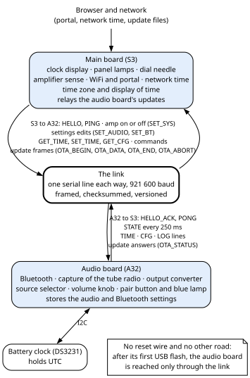
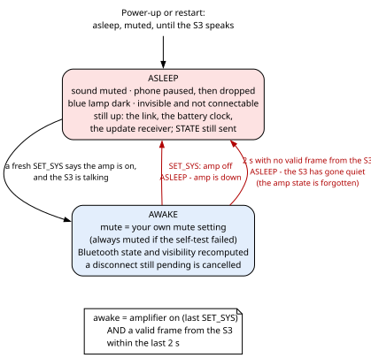
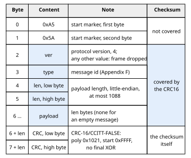
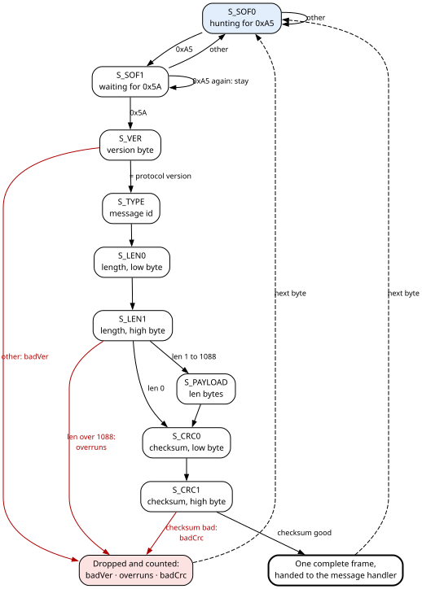
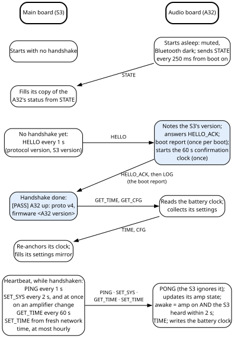
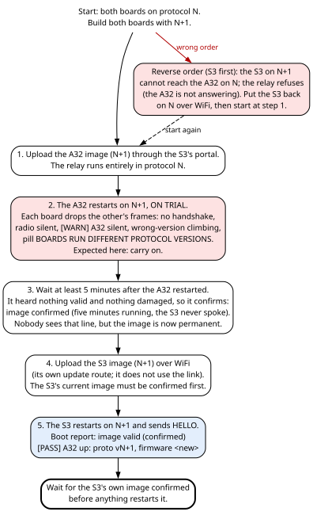

# 9. The audio board and the link between the boards

Ambersong has two computers. The **S3**, the main board, runs everything you see; the **A32**, the
audio board, runs everything you hear. They talk over one serial line, **the link**, and everything that
has to cross from one half of the machine to the other goes through it: the time of day, whether the
amplifier is on, every audio and Bluetooth setting the portal edits, the A32's live state for the portal,
and the A32's own firmware updates. When the link works, the listener sees nothing of it. When the S3
stops talking, the A32 goes silent on purpose within two seconds, so that a dead main board is obvious.

This chapter covers how the A32 starts and runs, the link and its protocol, and how to read the link's
health. Updating the A32 and its trial are in chapter 3; time keeping and the battery clock's pills in
chapter 4; the A32's settings and the S3's copy of them in chapter 7; the sound itself in chapter 10.

## 9.1 Two computers and the wire between them



The A32 is a classic ESP32, and the S3 an ESP32-S3 (Hardware Bible, chapter 4, section 4.1). The A32
also talks to the real-time clock chip, the DS3231, which this book calls **the battery clock**.

The table shows what each board owns and how the other board learns it. The `MSG_…` names are the
link's messages (section 9.7; Appendix F lists them all).

| Thing | Owner | How the other board learns it |
|---|---|---|
| Time of day, in UTC | the battery clock on the A32; network time on the S3 corrects it | `MSG_TIME` (A32 to S3), `MSG_SET_TIME` (S3 to A32) |
| Time zone, and the display of time | the S3 | never sent: everything on the link is UTC |
| Amplifier on or off | the S3 senses it | `MSG_SET_SYS` (S3 to A32) |
| Audio and Bluetooth settings | the A32 stores them in its own flash | the S3 keeps a read-only copy, the **mirror** (`MSG_CFG`), and pushes edits (`MSG_SET_AUDIO`, `MSG_SET_BT`) |
| Source, volume, Bluetooth state, meters, diagnostics | the A32 | `MSG_STATE`, every 250 ms |
| The A32's firmware image | uploaded to the S3's portal | relayed to the A32 over the link (`MSG_OTA_*`) |

**The one fact behind most of this chapter.** There is no reset wire from the S3 to the A32 (Hardware
Bible, chapter 4), and the A32's firmware has no wireless update of its own. After its first USB flash,
the only way to reach the A32 from outside the cabinet is through the link.

What the listener notices:

- **A dead S3 is obvious.** When the S3 stops talking, the A32 goes silent within 2 seconds: no radio or Bluetooth sound (AUX does not pass through the A32),
  Bluetooth closed, blue lamp dark (section 9.4).
- **A frozen A32 restarts itself** within 15 seconds (section 9.2.3).
- **An A32 update** fades the sound out, takes about a minute, and restarts the A32 on the new program,
  which then runs on trial (section 9.8).

## 9.2 How the audio board starts and runs

### 9.2.1 Start-up, step by step

Each step sits where it does for a reason.

| Step | What happens | Why here |
|---|---|---|
| 1. The task watchdog | Set to 15 s, with a restart (panic) on expiry; the main loop's task is put under it. | Start-up runs on that same task, so from this line on any hang, including a Bluetooth start that never returns, ends in a restart. Whether the watchdog took is shown in the boot report (section 9.3). |
| 2. The program's state | Asks the bootloader's records whether this program is on trial. | The answer becomes the label in the boot report (the labels are in chapter 3, section 3.11.1). A program flashed by USB is never on trial. |
| 3. The USB console | Opens at 115 200 baud and prints a banner with `FW_VERSION` and `FW_COMMIT`. | This console needs a cable and the cabinet is normally shut, so the lines that matter are also sent to the S3 later. |
| 4. Inputs and settings | Sets up the source selector, the volume knob and the blue lamp; loads the stored settings (chapter 7, section 7.4.1). | Chapter 10 describes these. |
| 5. The battery clock | Starts its I2C bus and reads it once. The local console prints `DS3231 responding, time valid` or `time INVALID (lost power)`, and the chip's temperature. | Only on the A32's own console. |
| 6. The protocol self-test | Encodes a status frame, feeds it back byte by byte through a decoder, checks the type, the length and a byte-exact round trip, then flips one bit and requires the checksum to reject the frame. | "A checksum that has never been seen to fail is not known to work." |
| 7. Audio | Starts the audio engine and applies the settings. | Chapter 10. |
| 8. Bluetooth | Configures and starts the Bluetooth audio receiver, applies its transmit power, and starts **invisible** to phones. | Chapter 10. |
| 9. The link | Registers the message handler, then opens the link with its pins given explicitly. | After Bluetooth: bringing it up earlier was considered and dropped (section 9.11). |
| 10. Source and mute | Reads the selector once, sets the source, and works out the mute. | This sets the rule that the A32 is **asleep**, and so muted, until the S3 speaks (section 9.4). |
| 11. Start-up time | Records how long start-up took, for the boot report. | On this radio it took about 1.1 s. |

**A failed protocol self-test does not stop the A32.** It marks the build as broken (`protoBroken`) and
carries on, so the link and the update receiver still come up and a good build can be sent over the air.
While the mark is set, the sound stays muted, Bluetooth stays closed, and every 10 s the A32 says
`proto self-test FAILED - muted, BT closed, awaiting OTA` on its console and to the S3. Such a build is
never confirmed, so one that came over the air is rolled back by the next reset (chapter 3, section
3.11.7). Only a broken build can fail the test.

### 9.2.2 The main loop

> **For firmware changes**
>
> The A32's main loop does, in this order, on every pass:
>
> 1. Reads the link.
> 2. Decides **asleep or awake** (section 9.4), before anything that depends on it.
> 3. The blue lamp.
> 4. The settings save, two seconds after the last change (chapter 7, section 7.4.2).
> 5. Any Bluetooth disconnect still pending.
> 6. The source selector, every 50 ms.
> 7. **The update give-up:** an update with no accepted data for 20 s is abandoned, with the reason
>    `the S3 stopped sending`.
> 8. **The trial check:** whether a program on trial has earned confirmation (chapter 3, section 3.11.2).
> 9. The `protoBroken` announcement, every 10 s while it applies.
> 10. The volume knob.
> 11. The Bluetooth state, and the refresh of its visibility.
> 12. The pair button.
> 13. **One status message (`MSG_STATE`) every 250 ms**, sent whether or not the S3 has ever answered.
> 14. The console lines of the zero-data watch, and the A32's own USB console keys (chapter 10).

### 9.2.3 The watchdog

A **task watchdog** is a timer that restarts the chip when a watched task stops checking in. The A32's
is set to **15 s, with a restart on expiry**, as the very first line of start-up, and it watches the main
loop's task. The Arduino core feeds it once per pass of the main loop.

- **Start-up must finish in 15 s**, because it runs on the watched task.
- **15 s leaves room** for the Bluetooth start, and for the longest legitimate wait inside one pass of the
  loop: the image check at the end of an update.
- **The idle check of core 0 moves to 15 s too.** The framework already watched core 0's idle task, at
  5 s; the timeout is shared, so setting 15 s changes both.

Without it, a frozen loop or a Bluetooth start that never returned went unnoticed, and the portal's
**Reboot the audio board**, which is a message on the link, cannot be read by a frozen loop.

## 9.3 Reading the audio board's boot report

The A32's own console needs a cable. So at every start-up the A32 sends one line, its **boot report**, to
the S3, at the **first HELLO** (the S3's greeting, section 9.7) it receives from it. The S3 prints it on its console (also on the
portal's **Console** tab) with an `[A32]` prefix:

```
[A32] boot: commit <hash>, reset reason 3, setup 1066 ms, image ON TRIAL (rollback armed), watchdog on
```

| Field | Meaning |
|---|---|
| `commit` | The source the running program was built from: the short git hash, with `-dirty` when tracked files had uncommitted changes, or `nogit` (chapter 3, section 3.13). |
| `reset reason` | Why the chip last started: **1** power-on, **3** software restart (what an update or **Reboot the audio board** produces), **4** crash (panic), **6** task watchdog, **9** brown-out. The number is the ESP32 framework's reset-cause code (`esp_reset_reason()`); these five are the ones this book records. The framework has others: the external reset pin, the interrupt watchdog, other watchdogs, deep sleep, unknown. The main board's console `s` prints its own last reset reason by name, from the same list (chapter 4, section 4.10). |
| `setup` | How long start-up took, in ms. |
| `image` | The trial state: `ON TRIAL (rollback armed)`, `valid`, `NEW - this bootloader has no rollback` or `not tracked (USB flash)`; it reads `valid (confirmed)` once the program has confirmed itself (chapter 3, section 3.11.1). |
| `watchdog` | `on`, or `OFF` if the watchdog did not take. |
| ending | ` - an earlier update was ROLLED BACK`, when the bootloader has marked a program slot invalid. |

This line is how a rollback or a watchdog restart becomes visible without the USB cable. A rollback
caused by a hanging test program read, in full:

```
[A32] boot: commit <hash>, reset reason 6, ... image valid, watchdog on - an earlier update was ROLLED BACK
```

**Once per A32 start-up.** If the S3 restarts later and shakes hands again, the report is not repeated.

**The version is not in this line.** It follows at the handshake, as `[PASS] A32 up: proto v4, firmware
<version>`; the two lines together name both the program and its source.

**Other lines the A32 sends**, all printed by the S3 as `[A32] ...`:

- the confirmation result: `image confirmed (...)`, or `image confirm FAILED (err N) - retrying`;
- `settings changed during the trial are now saved` (chapter 3, section 3.11.5);
- `proto self-test FAILED - muted, BT closed, awaiting OTA`, every 10 s (section 9.2.1);
- a failed settings save, printed as `[A32] settings NOT saved - the flash write failed; retrying`
  (chapter 7, section 7.4.2);
- a Bluetooth disconnect that did not land.

## 9.4 Awake and asleep

The A32 has one rule, checked on every pass of its main loop:

```
awake = amplifier on  AND  a valid frame from the S3 within the last 2 s
```

- **Amplifier on** is the last amplifier state the S3 sent (`MSG_SET_SYS`).
- **A valid frame from the S3** means HELLO before the handshake, PING and SET_SYS after it (section 9.7).
  A frame is one message on the link (section 9.6). Frames from
  the S3 are the only ones that keep the A32 awake.

The A32 acts only on a **change** between the two states, not on every pass: running the teardown on
every pass would send a disconnect for ever.



**Falling asleep** (the amplifier switched off, or 2 s without a valid frame from the S3):

1. The A32's console prints `ASLEEP - amp is down` or `ASLEEP - the S3 has gone quiet`.
2. If the S3 is the reason, the A32 **forgets the amplifier state**. It must not wake on the S3's last
   "amp on", which may be stale: the amplifier may have been switched off while the S3 was restarting.
   It stays asleep until a fresh SET_SYS says the amplifier is on.
3. The phone is paused and then disconnected, the sound muted, the blue lamp darkened, and the radio
   made invisible and not connectable to phones.

**Waking** (amplifier on and the S3 talking): any disconnect still pending from the last 250 ms is
cancelled, the mute is worked out again, and the Bluetooth state and visibility are recomputed.

**The mute is a state, not an event.** Every place that could change it works it out from one rule:

```
muted = (self-test failed)  OR  (asleep)  OR  (your own mute setting)
```

An earlier version muted when the A32 fell asleep while four other places unmuted. Turning the source
knob while the S3 was dead brought the sound back, and the alarm vanished.

**Asleep is not off.** The link, the battery clock and the update receiver stay up: they are what the S3
needs from the A32, and the only reason for it to be awake at all. The A32 keeps sending its status. The
audio clocks keep running; asleep is a mute, not a stop.

**What the listener sees**

| Event | What happens |
|---|---|
| Power-up | A brief silence until the S3 has shaken hands and sent its first "amp on". Accepted. |
| The S3 restarts (its own update, a portal reboot, a crash) | Within 2 s: the sound fades out, the phone is dropped, the blue lamp goes dark. When the S3 is back and says the amplifier is on, the A32 wakes. The phone must reconnect. |
| The link cable fails in one direction | If the S3-to-A32 direction is cut: the same as an S3 restart, for as long as the fault lasts. Either way, the board whose receiving direction is cut reports the link as silent on its console (`link SILENT rx 0` on the S3). |

**Why.** The author wants an unreachable S3 to be known: the radio then does not work at all, with no
sound, no clock, no lights. (AUX does not pass through the A32, so a source on AUX still plays.) The costs are accepted and written down so that nobody "fixes" them: an S3
restart or a long S3 update silences the radio mid-listen, and every power-up has a short dead moment.
The rule earned its place on its first real fault, the day after it was written: one direction of the
link failed at a connector, the A32 never learned that the amplifier was on, so it slept, and the whole
front of the radio said something was wrong. The firmware before the rule would have played on.

**The S3's side of the bargain.** Anything that stops the S3's main loop must keep the A32 fed. The
console prompts read the link while they wait; the live index monitor (console `l`) also sends a PING
on each pass. The WiFi prompt `y` can still hold the S3's loop until 60 s after the last key typed, which puts the A32 to
sleep meanwhile; that is left as it is, judged harmless in real use. Chapter 4, section 4.11 lists the
prompts that hold the loop.

## 9.5 The link, and how to read its health

**The line.** A UART on `Serial2` on both boards, at **921 600 baud, 8 data bits, no parity, one stop
bit, no flow control**. The firmware uses S3 GPIO13 to send and GPIO14 to receive, and A32 GPIO27 to send
and GPIO26 to receive (Appendix I); the cable is in the Hardware Bible, chapter 10, section 10.12. The
baud rate is the firmware's own choice, and the cable carries it: every frame is checksummed, and the
counters show a clean link (`crc 0`). Each board receives into a 4096-byte buffer.

**Where to read it.** The S3's console `s` prints a `link` line; the portal's status carries the same
counts.

| Status field | Meaning |
|---|---|
| `linkrx` | Valid frames received from the A32. |
| `linktx` | Frames sent to the A32. |
| `linkcrc` | Frames received with a bad checksum. |
| `linkver` | Frames dropped because they carry another protocol version. |
| `hello` | The handshake is done. |
| `astate` | A valid status report from the A32 is in hand. |

A healthy pair reads, for example:

```
  link       : alive  rx 489  crc 0  wrong-version 0
```

During a protocol mismatch it reads (the count is an example):

```
  link       : SILENT  rx 0  crc 0  wrong-version 412  <- the boards run different protocol versions: flash both
```

**How to read it**

| The link line shows | It points at |
|---|---|
| `alive`, `rx` climbing, `crc 0`, `wrong-version 0` | A healthy link. |
| `SILENT`, `rx 0`, `wrong-version 0` | The wiring or the power of the link (Hardware Bible, chapter 10). |
| `rx` climbing and `crc` climbing with it | The quality of the signal. |
| `wrong-version` climbing | The other board is talking, but was built with another protocol version. The portal shows the pill **BOARDS RUN DIFFERENT PROTOCOL VERSIONS - flash both** while there is no handshake. What to do: section 9.6.3. |
| `alive`, and `wrong-version` above 0 but not climbing | A mismatch that has been fixed. The count runs from the S3's start-up, so it stays above zero until the next S3 restart; the pill goes away at the handshake. |

**Only the S3 shows a mismatch.** The A32 counts dropped frames too, but prints the count nowhere; its own
USB console `s` shows only `link SILENT rx 0`. The A32's `s` shows the link, the frames received, and
whether it is awake and why.

## 9.6 Frames, the decoder and versions

This section describes the link's wire format. You need it only to change the protocol or to decode the
link with an analyser; section 9.6.3, on the two version numbers, is for everyone.

### 9.6.1 The frame

> **For firmware changes**
>
> The link is a **binary protocol**: every message travels as one **frame**, with a start marker, a
> version byte, a type, a length, the payload and a checksum.
>
> 
>
> - **The start marker**, `0xA5 0x5A`, is not covered by the checksum: it is there to find the start of a
>   frame again after damage, not data.
> - **The version byte** is the protocol version, currently **4**. A frame with any other value is dropped
>   by the decoder and counted as wrong-version.
> - **The type** is the message id (Appendix F lists them all).
> - **The length** is the payload's, little-endian, at most **1088 bytes**: a 1024-byte update chunk plus
>   room for its header.
> - **The checksum** is a 16-bit CRC with polynomial 0x1021, initial value 0xFFFF and no final XOR,
>   computed bit by bit over the version, type, length and payload, and sent little-endian. This is the
>   variant usually called CRC-16/CCITT-FALSE: the ASCII string `123456789` gives 0x29B1. It is computed
>   bit by bit, not from a table, because "a 512-byte table would buy nothing and cost cache the display
>   ISR wants."
> - **Payloads are packed structures, copied byte for byte.** Both ends are little-endian processors of the
>   same family built by the same compiler, so this shortcut works. If a third kind of device ever joins
>   the link, the encoding must become byte by byte.
> - **A frame that would not fit is not sent at all.** The encoder returns a length of 0 and writes
>   nothing, so "a caller that ignores the return value still cannot emit a torn frame".
>
> **Worked examples** (bytes in hexadecimal, as sent):
>
> ```
> PING, empty payload:         A5 5A 04 03 00 00 61 17
> PONG, empty payload:         A5 5A 04 04 00 00 F1 92
> TIME, 8-byte payload:        A5 5A 04 21 08 00 | 80 3B B1 6A  01  64  00 00 | 17 8E
>                                                  unixUtc       valid tempC4 reserved
>                                                  1790000000    1     100 = 25.00 °C
>                                                  (2026-09-21 14:13:20 UTC)
> ```
>
> **Frame sizes.** Each frame is 8 bytes of overhead plus its payload:
>
> | Message | Frame, bytes |
> |---|---|
> | HELLO, HELLO_ACK | 33 |
> | STATE | 138 |
> | CFG | 41 |
> | TIME, SET_TIME | 16 |
> | SET_AUDIO | 23 |
> | SET_BT | 20 |
> | SET_SYS | 12 |
> | OTA_STATUS | 46 |
> | OTA_DATA | up to 1038 |
> | empty messages | 8 |
>
> At 921 600 baud the line carries about 92 kB/s. A full update frame takes about 11.3 ms, and the A32's
> status reports cost about 550 bytes per second.
>
> ### 9.6.2 The decoder
>
> The decoder takes **one byte at a time**, so it can be fed straight from the serial port with no
> assumption that frames arrive whole.
>
> 
>
> - **A second `0xA5` while waiting for `0x5A`** keeps the decoder waiting for `0x5A`: it may be the real
>   start of a frame whose predecessor was cut short.
> - **After the last checksum byte the decoder always hunts again from the next byte.** It does not go back
>   and rescan the bytes inside a frame that failed. A damaged length byte can therefore hide what follows
>   it for a while (section 9.10).
> - **A payload is copied into its structure only if its length is exactly that structure's size.** The
>   frame has already passed its checksum, so a length that does not match means the two builds disagree
>   about the structure: a version skew, not noise. A partial copy would be worse than none.
> - **One-byte commands** are checked by length (two bytes for `MSG_CLK_PAIR`), and update data frames are
>   read at fixed offsets (Appendix F).

### 9.6.3 Version numbers on the link

- **The protocol version** (`PROTO_VERSION`, 4) is the wire format. It travels as the version byte of every
  frame, and a frame with another value never gets past the decoder. Version 2 is when the audio settings
  gained their fades; what changed at 3 and 4 was not recorded (Appendix F).
- **The firmware version** (`FW_VERSION`, `v.1.<stamp>`) names the build. It travels in HELLO and
  HELLO_ACK, so each console can say which build the other board runs. A break in the wire format is the
  protocol version's job, not the firmware version's.
- **The commit stamp** (`FW_COMMIT`) is shown next to the version but **never sent** in the handshake: the
  handshake's version field is 24 bytes, and widening it would itself be a protocol change.

Chapter 3, section 3.13 has all four version numbers and where to read each.

**When the two boards run different protocol versions.** Neither board can then pass a single frame to the
other. There is no handshake and the A32 sleeps, so neither the radio nor Bluetooth plays; AUX does not pass
through the A32 and still does. The main board shows it with the pill
**BOARDS RUN DIFFERENT PROTOCOL VERSIONS - flash both** and with `wrong-version` climbing in console `s`
(section 9.5). The pill says "flash both", but only one order works:

1. **Update the S3 first, over its own WiFi** (chapter 3, section 3.10.2), with a build of the A32's
   protocol version. Its own update route does not use the link, so it still works.
2. Once the two versions match, the handshake comes back and the A32 can again be updated through the S3.

Updating the A32 first cannot work while the versions differ: the relay through the S3 needs the link, and
it refuses with `the A32 is not answering`. If the A32's new program is still on trial, unplugging the set
also works: the reset rolls the A32 back to its previous program. No USB cable is needed either way.

## 9.7 Handshake and heartbeat

The S3 drives the conversation; the A32 answers.



1. **From its start-up on**, the A32 sends its status (STATE) every 250 ms, unprompted. The S3 fills its
   copy of the A32's status from it.
2. **Until it gets an answer**, the S3 sends HELLO every second, carrying its protocol version and
   firmware version.
3. **The A32 answers HELLO_ACK** with its own versions. At the first HELLO of its start-up it also sends
   its boot report (section 9.3) and starts the one-minute clock of its trial (chapter 3, section 3.11.2).
4. **On HELLO_ACK** the S3 prints `[PASS] A32 up: proto v4, firmware <A32 version>`, and asks for the time
   (GET_TIME) and the settings (GET_CFG). The answers, TIME and CFG, set its clock (chapter 4, section 4.9)
   and fill its settings mirror (chapter 7, section 7.4.4).
5. **The heartbeat**, for as long as the handshake stands:
   - PING every second; the A32 answers PONG, which the S3 ignores;
   - SET_SYS every 2 seconds, and at once when the debounced amplifier state changes;
   - GET_TIME every 60 seconds;
   - SET_TIME when network time is fresh, at most once an hour.

**Which frames keep which side alive.** The S3 counts the A32 as alive while frames arrive from it, and
the A32 sends STATE four times a second, so PONG is not needed. The A32 counts the S3 as alive only on
frames **from** the S3.

**When the S3 starts over.** It drops the handshake, forgets the A32's status, and goes back to HELLO
every second when:

| Cause | The S3's console |
|---|---|
| Nothing valid has arrived from the A32 for 2 s. The S3 also forgets its copy of the A32's settings (chapter 7, section 7.4.5). | `[WARN] A32 silent. Clock and needle keep running.` |
| The A32's millisecond count went backwards in a STATE frame: the A32 restarted faster than the 2-second rule could notice. Values near the count's 49.7-day wrap are ignored, and the count must fall back by more than 5 s, which tolerates reordering. | `[WARN] the A32 restarted - handshaking again.` |
| An A32 update has ended, successful or not confirmed, so that the version shown is the one the A32 comes back with. | the update's own messages (chapter 3, section 3.10.3) |

**What the handshake checks.** The S3 refuses a HELLO_ACK of the wrong size, with
`[FAIL] HELLO_ACK size - version skew`. It also compares the protocol numbers, but a frame with another
protocol version never reaches that check; a protocol mismatch shows instead in the wrong-version count
(section 9.5).

> **For firmware changes**
>
> **What the S3 does with each message from the A32**
>
> | Message | What the S3 does |
> |---|---|
> | HELLO_ACK | Checks its size, notes the A32's versions, marks the handshake done, prints, asks for the time and the settings. |
> | STATE | Copies it into its picture of the A32 and runs the restart test. Copies the volume and mute into the settings mirror, because the knob moves the volume and the A32 does not resend its settings when it does. |
> | TIME | Re-sets the S3's clock if the time is valid (chapter 4, section 4.9). |
> | CFG | Fills the settings mirror; the A32's settings are now known. |
> | OTA_STATUS | Fills the answer the update relay is waiting for (section 9.8). |
> | LOG | Prints it as `[A32] <text>`. |

**A status report that does not fit this build.** If a STATE frame passes its checksum but has the wrong
length, the S3 drops its picture of the A32's status and prints, once per start-up:

```
[WARN] the A32's STATE frame does not match this build. Flash BOTH MCUs. Audio is unaffected - only telemetry stops.
```

The portal then shows the pill **AUDIO BOARD SENDS NO STATE**: the two boards are talking, but the audio
board's status reports do not fit this build. Flash both boards. If the audio board stops talking
altogether, the `link` pill turns red instead. Showing the last values instead would report a
measurement that was not taken.

## 9.8 Updating the audio board, and its trial

The whole procedure, its messages on the page, its figure and every refusal are in chapter 3, section
3.10.3; the trial, confirmation and rollback of both boards in chapter 3, section 3.11. This section adds
only what happens on the link.

> **For firmware changes**
>
> **The messages.** The S3 relays the uploaded file over the link, 1 KB per frame, storing nothing:
>
> | Message | Direction | Carries |
> |---|---|---|
> | `MSG_OTA_BEGIN` | S3 to A32 | size and checksum, both 0, and the S3's **own** firmware version |
> | `MSG_OTA_DATA` | S3 to A32 | the absolute offset, the length, and up to 1024 bytes |
> | `MSG_OTA_END` | S3 to A32 | the CRC32 of the whole image |
> | `MSG_OTA_ABORT` | S3 to A32 | nothing; sent for a wrong chip, an unanswered END, an aborted upload, or 15 s of upload silence |
> | `MSG_OTA_STATUS` | A32 to S3 | the bytes committed so far, the state (1 receiving, 3 ok, 4 failed), the updater's error number, and a short text |
>
> - **Size and checksum are 0 at the start** because the S3 is passing on an upload it has not finished
>   receiving. The whole-image CRC32 travels in END; both sides compute it over exactly the bytes committed.
>   An END with a checksum of 0 skips the comparison.
> - **Offsets are absolute, and the answer is a byte count.** A frame that arrives twice is ignored, one
>   that arrives early is refused, and every answer carries the number of bytes actually committed. The
>   answer carries no frame identity, so the S3 reasons only in byte counts; a late answer from an earlier
>   try reads as "send again", which is harmless.
> - **The S3 starts over the handshake after every A32 update**, so the next HELLO_ACK shows the version the
>   A32 came back with.
> - **Each frame waits** for its answer, and each answer for a flash write, so the line's speed is not the
>   limit: the relay runs at about 16 KB/s.

**Why the A32 waits 400 ms before its first flash write.** Writing and erasing flash stalls all code that
is not in internal RAM, and the audio engine is not; it would tear rather than pause. So the A32 mutes
through its normal fade-out first, and the update sounds like a change of source. The mute is seen at the
next audio block (at most 5.8 ms); the fade-out takes `fadeOutMs` (150 ms by default); then the output's
8 DMA buffers drain (46.4 ms). That is about 200 ms in all, and 400 ms covers a fade-out of up to about
340 ms. When the wait runs short, the flash write freezes the audio task mid-drain and the output
hardware sends exact zeros: a click through the amplifier at the start of the update.

> **Caution — the wait is fixed, and `fadeOutMs` is not.** The portal accepts a fade-out of up to
> 5000 ms, and any fade-out above about 340 ms makes every audio-board update start with a click. Set it
> lower.

> **For firmware changes**
>
> **The trial, as it touches the link.** The details are in chapter 3, section 3.11; these points matter to
> anyone changing the link:
>
> - The one-minute clock starts at the **first HELLO** the new program receives.
> - The five-minute fallback confirms a program only if **nothing** has ever arrived: no valid frame and no
>   damaged one. Frames of another protocol version are counted only as wrong-version, which the fallback
>   does not look at. The procedure for changing the protocol relies on this (section 9.14.5).
> - A program whose protocol self-test failed is never confirmed.
> - While a program is on trial and not yet confirmed, `MSG_OTA_BEGIN` is refused, before anything is muted.
>   The Arduino updater writes the slot directly and does not go through the framework's own "refuse while
>   pending" check, so this refusal in the A32's message handler is the only guard.

## 9.9 The battery clock on the audio board

How the S3 keeps time, the three sources of time, the time zone and the battery clock's two portal pills
are in chapter 4, sections 4.9 and 4.10. This section covers the A32's side.

The battery clock is a DS3231 module on the A32's own I2C bus (the module, its battery and its wiring:
Hardware Bible, chapter 4, section 4.7). The firmware addresses it at **0x68**, on GPIO22 (data) and
GPIO21 (clock), at **100 kHz**, a speed the firmware chose. Starting the bus enables the ESP32's internal
pull-ups on those two pins.

**Everything in the chip and on the link is UTC.** The S3 applies the time zone, because it has network
time and the portal.

> **For firmware changes**
>
> **Reading the clock:**
>
> 1. The seven time registers from 0x00 (BCD, 24-hour, the year counted from 2000).
> 2. The status register 0x0F. Its bit 7 is **OSF**, the oscillator-stopped flag, which the chip sets when
>    its oscillator has stopped, for example after losing both main power and its battery.
> 3. The temperature registers 0x11 and 0x12, in quarter degrees.
> 4. Conversion to a Unix time, with the time zone pinned to UTC around the conversion (the conversion
>    function works in local time).
>
> The read counts as failed only when the time registers themselves give no answer.

The time is **valid** only when all three hold:

```
valid = (time later than 1600000000, September 2020)  AND  (the status register answered)  AND  (OSF clear)
```

A status register that did not answer counts as **not** valid. That is the safe direction: the S3 keeps
its own clock and only declines to re-set it from this one reading. The first spare byte of the time
message carries the OSF bit itself.

**Why OSF matters.** A DS3231 whose oscillator stopped keeps counting from wherever it was, so after a
power loss it reports a date that is plausible and wrong. Plausibility cannot catch that; OSF can. OSF
stays set until the time is written, and that is the point: "a clock that stopped and was never set
since IS wrong."

**Writing the clock:** the time in 24-hour form with the weekday, then the status register is read,
changed and written back with **OSF cleared**. That clear is what makes the time trustworthy again. The
first SET_TIME, from network time or typed by hand, clears it, and from then on the chip reports valid
again.

**The A32's two handlers.**

- **GET_TIME:** reads the chip and answers TIME. If the chip does not answer, the A32 prints a warning on
  its own console and **sends nothing**. Silence is therefore the S3's only sign of a clock that does not
  answer, and it shows the pill **BATTERY CLOCK NOT ANSWERING** (chapter 4, section 4.10). The GET_TIME
  sent at the handshake is not timed, so that pill can take up to about a minute after a handshake to
  appear.
- **SET_TIME:** writes the time to the chip. The incoming `valid` and `tempC4` fields are ignored.

The S3 uses neither the temperature nor the OSF copy.

## 9.10 When it goes wrong

The A32 is powered whenever the set is plugged in: its 5 V supply is taken before the front switch
(Hardware Bible, chapter 5), so the front switch does not restart it. **A "power cycle" of the A32 means
unplugging the set.**

The last column is the fault's class on the recovery ladder (NOTE, DEFECT, BLOCKER), set out in *About
this book*.

| What you see | What happened | What the firmware does | What you do | Class |
|---|---|---|---|---|
| A restart; the boot report shows reset reason 6 | The A32's main loop or start-up froze, on a confirmed program. | The watchdog restarts it after 15 s. | Nothing, if it does not recur. A hang at every start-up, before the link comes up, is a boot loop only USB can fix. | NOTE; BLOCKER if it recurs at every start-up |
| `- an earlier update was ROLLED BACK` | A new program crashed or hung at start-up, while on trial. | The bootloader starts the previous program. | Nothing needed. | NOTE |
| After an A32 update the radio stays silent, and no handshake completes | The new program boots and hears frames, but never completes the handshake. | Stays on trial; the A32 is asleep. Nothing on the link can restart it. | Unplug the set: the reset rolls it back. | BLOCKER |
| `proto self-test FAILED - muted, BT closed, awaiting OTA` every 10 s | A new program failed its protocol self-test. | Muted, Bluetooth closed; the link and the update receiver stay up. Never confirmed, so an upload is refused while it runs. | Sent over the air: **Reboot the audio board** from the portal, or unplug the set; the reset rolls it back. Flashed by USB (not on trial): upload a good program through the portal. | DEFECT if the link still carries the reboot; BLOCKER (unplug) if not; never exercised on the radio |
| `that image is not for the audio board (wrong chip) - nothing was written` | The file was built for another chip, such as the S3. | ABORT; the A32 restores your mute setting. | Upload the right file. | NOTE |
| An update fails with the updater's error 8 (magic byte) | The file is not an ESP32 program at all. | The A32 gives up and restores your mute setting. | Upload the right file. | NOTE |
| `crc mismatch` or `end failed` | Damage in transit. | A frame with a bad checksum is sent again; damage found at the end gives up the update. | Upload again. | NOTE |
| `the A32 did not confirm the update - check its version once it reconnects` | The answer to END was lost. | ABORT, a new handshake. | Read the version at the next handshake (`[PASS] A32 up: ...`). | NOTE |
| `A32: still on trial - retry in 1 min (err 0)` | A second update inside the trial minute. | Refused before any mute. | Wait a minute. | NOTE |
| The upload stops partway; the sound stays off until the A32 gives up | The browser, the WiFi or the S3 stopped mid-stream. | The A32 gives up after 20 s with no data and restores your mute setting; the S3 aborts after 15 s with no upload activity. The old program stays. | Upload again. | NOTE |
| `image confirm FAILED (err N) - retrying` | The confirmation write failed. | Retries every 10 s; updates refused meanwhile. | Nothing, if a retry lands. | NOTE |
| A good new program is gone after a power cut or a reboot | A reset during its trial minute. | Rolled back. | Upload it again. | NOTE |
| Nothing; `crc` counts one more | One damaged frame. | Dropped and counted. | Nothing. | NOTE |
| The A32 falls asleep for up to about 80 s, then wakes by itself | A damaged length byte (a value up to 1088): the decoder swallows up to 1090 following bytes before it hunts again. From the S3, about 14 bytes per second arrive after the handshake. | Asleep, then awake again. | Nothing. | NOTE |
| Within 2 s the sound fades out, the phone is dropped, the blue lamp goes dark | The S3 went silent: its restart, its own update, a crash. | Asleep; the amplifier state forgotten; STATE still sent. | Nothing: it wakes when the S3 is back and says the amplifier is on. | NOTE (deliberate) |
| `[WARN] A32 silent. Clock and needle keep running.` or `[WARN] the A32 restarted - handshaking again.` | The A32 went silent, or restarted quickly. | The S3 drops the handshake and its picture of the A32's status (and its settings mirror after 2 s of silence); the portal shows the A32's fields as unknown; the S3's clock keeps running from its last setting; HELLO every second. | Nothing. | NOTE |
| `link SILENT` on one or both boards | The link cable is faulty, in one or both directions. | As above, on the side that hears nothing. | Hardware: Hardware Bible, chapter 10, section 10.12. | — |
| `[WARN] A32 silent` and the `link` pill red, yet the sound plays on; the needle parks | Only the audio-board-to-main-board direction of the link fails: a wiring fault. | After 2 s without a frame the main board drops the handshake, the audio board's state and its copy of the audio-board settings. The source counts as AUX (the needle parks); the clock runs on the main board's own count; audio-board edits are refused; the main board sends only HELLO each second (SET_SYS, PING and GET_TIME stop). The audio board still receives those HELLOs, so it stays awake on the last amplifier state it was told: the sound plays on, and it never learns the amplifier went off. | Nothing in the firmware: everything recovers by itself when the line works again. The fault is in the wiring: Hardware Bible, chapter 10, section 10.12. | NOTE; a wiring fault; never seen on the radio |
| `the A32's STATE frame does not match this build. Flash BOTH MCUs.`; pill **AUDIO BOARD SENDS NO STATE** | The status layout differs between the two builds. | The S3 shows the A32's status as unknown; warns once. The sound is not affected. | Flash both boards. | NOTE |
| No radio or Bluetooth sound; `rx 0` with `wrong-version` climbing; pill **BOARDS RUN DIFFERENT PROTOCOL VERSIONS - flash both** | The two programs have different protocol versions. | Every frame dropped at the decoder, on both sides: no handshake, the A32 asleep, the relay refuses (`the A32 is not answering`). | Update the S3 over its own WiFi to the A32's protocol version (section 9.6.3). If the A32 is still on trial, unplugging the set also works: it rolls back. | BLOCKER (survives a power cycle once the A32 is confirmed) |
| `[WARN] the DS3231 has no valid time yet.` at each reading; pill **BATTERY CLOCK LOST ITS TIME - check its battery** | The battery clock's oscillator stopped (OSF set). | The S3 does not re-set its clock from it. | Nothing with a network: the next fresh network time fixes it. Otherwise set the time with the console `W`. If it comes back after every power cut, check the module's battery. | NOTE with a network; DEFECT without |
| Pill **BATTERY CLOCK NOT ANSWERING** | The battery clock does not answer; a time request went unanswered for 5 s while the A32 is alive. | A warning on the A32's console. The S3 still takes network time. | Hardware: Hardware Bible, chapter 4, section 4.7. | — |
| HTTP 409 `the audio board is not answering - its settings cannot be changed now`; `n/a` in a settings download | The S3 has no copy of the A32's settings: never read, or the A32 went silent. | Refuses the edit. | Wait for the handshake. | NOTE; never exercised on the radio |
| `[A32] settings NOT saved - the flash write failed; retrying` | An A32 settings write fell short. | Stays unsaved; retried 2 s later. | Nothing, if a retry lands. A change is lost only if the A32 restarts before one does. | NOTE; never exercised on the radio |
| Settings changed during the A32's trial are gone | The trial ended in a reset: a rollback, **Reboot the audio board**, a power cut. | Nothing was written during the trial; the previous program finds its settings as it left them, in the layout it knows. | Set them again once a program is confirmed. | NOTE (by design) |
| Nothing | An A32 update that changed the layout of its stored settings was rolled back. | Nothing was written during its trial, so the previous program loads its own settings normally. | Nothing. | NOTE |

## 9.11 Design choices

- **A framed, checksummed, versioned binary protocol, not lines of text.** The link carries firmware, so
  a damaged byte must be caught, not installed; both boards print to their own consoles, and a framed
  link cannot be confused by a stray log line; and the S3 updates the A32, so the two will sometimes run
  mismatched builds.
- **No way to open the link without naming its pins, and the receive buffer sized before the port
  opens.** The serial port's default pins on the classic ESP32 include the A32's audio frame clock, and
  the buffer size is ignored once the port is open.
- **Packed structures, copied byte for byte.** Both ends are the same kind of processor and compiler; the
  shortcut is recorded, with the condition that ends it.
- **The status report grows by appending fields, without a new protocol version.** An older peer's report
  then has the wrong length and is refused, so a half-updated machine loses only its telemetry and keeps
  its sound. A version change would drop every frame, which costs the handshake, which puts the A32 to
  sleep, and the A32's update travels over this same link. "The graceful failure is the correct one here,
  not the loud one."
- **A new message id needs no version change; a retired id is never reused.** An older peer ignores an
  id it does not know, and an old S3 that still sends a retired id is ignored, "the safe direction". New
  diagnostics got their own block, 0x4n, rather than a number that would have worked only by luck of
  direction.
- **The A32 sleeps whenever the amplifier is off or the S3 is silent.** An unreachable S3 must be known;
  the costs are accepted (section 9.4).
- **When the A32 falls asleep because the S3 went quiet, it forgets the amplifier state.** The S3's last
  "amp on" may be stale; waking on it unmuted into an amplifier that might be off.
- **A failed protocol self-test degrades the A32 instead of halting it.** A halt before the link came up
  made an updated program that failed it unreachable without opening the cabinet. "A halt protects
  nothing that a mute does not." The cheapest failure the test guarded, a payload too big for a frame,
  became a compile-time error.
- **Rollback for A32 updates, and a task watchdog on its main loop.** The bootloader supported rollback,
  but the core marked every program valid before start-up, so a program that crashed or hung at boot
  needed USB. The watchdog turns a hang into the reset that rollback needs, and restarts a frozen loop
  that nothing on the link can reach.
- **The watchdog is 15 s, with a restart, armed as the first line of start-up.** It must cover a
  Bluetooth start that never returns, and leave room for the image check at the end of an update.
- **A trial program is confirmed 60 s after the first HELLO, with a five-minute fallback only when nothing
  at all was received, a retry every 10 s after a failed confirmation, no update while on trial, and a boot
  report that names the watchdog state and any earlier rollback.** A
  handshake a second after start-up proves nothing about waking, Bluetooth or playback; a broken link
  that still produces frames must stay on trial; and writing over the fallback program during a trial
  would leave nothing to fall back to.
- **The link comes up after Bluetooth, as before.** The link is serviced only in the main loop, so opening
  it earlier in start-up would not reach a hang in the Bluetooth start; rollback and the watchdog cover
  that need.
- **The update relay: 1 KB frames, each answered with the committed byte count, absolute offsets, the
  image streamed with its CRC32 in END, the sound muted and given 400 ms before the first write, and the
  S3's needle not stopped.** Section 9.8 and chapter 3, section 3.10.3 give the reasons.
- **END must be answered; the S3 starts the handshake over after every A32 update and whenever the A32's
  millisecond count goes backwards; an unanswered END aborts and says to check the version; the wrong-chip
  reason reaches the page.** A lost END
  was once reported as success while the A32 kept its old firmware, and the S3 went on showing the old
  version.
- **The END wait reads the clock once per pass.** Two readings could straddle the 4 s limit, and the
  subtraction would wrap to about 49 days.
- **A relay that fails partway sends no ABORT.** Not considered worth changing: the A32's own 20 s
  give-up ends it.
- **The decoder does not rescan the inside of a failed frame.** The consequence (section 9.10) was judged
  acceptable, and has never been seen.
- **The battery clock is valid only while its oscillator-stopped flag is clear, and writing the time
  clears it.** After a power loss the chip reports a plausible, wrong date. A set flag is shown on the
  portal; most probably the battery clock's battery, or the module itself, is at fault.
- **UTC everywhere below the S3; the S3 owns the time zone; network time corrects the battery clock, and
  the battery clock holds the time when there is no network.** Local time in the chip would make the
  hour after a daylight-saving change ambiguous and the hour before it happen twice.
- **The A32 owns and saves its settings; only a write that reached flash counts; the S3 keeps a mirror and
  refuses to push while it has none.** Chapter 7, section 7.4 gives the reasons.
- **Reboot the audio board saves pending settings first, skipping the 2-second wait.** A reboot within
  two seconds of a change used to restart before the write, and the change came back as the old value.
- **The A32 writes no settings while its program is on trial.** Chapter 3, section 3.11.5.
- **The S3's WiFi prompt may hold its loop, and so put the A32 to sleep, until 60 s after the last key typed.** Judged to cause
  no meaningful harm in real use.
- **The S3 gets the same rollback and watchdog treatment** (chapter 3, section 3.11, and chapter 4, section
  4.11). A build whose protocol self-test failed is never confirmed, on either board.

## 9.12 Tried and rejected

> **For firmware changes**
>
> These were dead ends on this machine. They may not be dead ends on yours.
>
> - **A text protocol:** rejected when the protocol was written, for the reasons in section 9.11.
> - **Opening the A32's serial port without naming its pins:** it took the audio frame-clock pin, and the
>   sound failed later with no obvious cause. Now impossible.
> - **0xA5 0xA5 as the start marker:** set aside for 0xA5 0x5A when the protocol was written.
> - **A table-driven CRC:** the bit-by-bit CRC is fast enough, and the table would take cache the display
>   interrupt wants.
> - **Halting the A32 on a failed self-test:** an updated program that failed it was unreachable.
> - **The self-test as the only guard against oversized payloads:** replaced by compile-time checks.
> - **`MSG_ADC_CLOCK` (0x1C):** cut the converter's clock pin to silence the input. Retired once the output
>   converter took its clock from the same pin: cutting it became a clock error at the output, not a mute.
> - **`MSG_SD_DELAY` (0x41):** a remote write to the audio output's delay register. It sent the radio to
>   full volume (of its four positions, only 0 played correctly), and a build that still carried it was
>   judged unsafe. Its last road, a key on the A32's USB console, was removed too; only the read-back
>   remains, in the status report and on the A32's status line (chapter 10).
> - **An A32 settings save that ignored its own result:** a failed write read as saved.
> - **An A32 that saved settings during its trial,** with advice to export a settings file first: replaced
>   by holding every write until confirmation.
> - **A settings mirror that outlived the A32's silence:** portal edits went nowhere and were overwritten
>   when the A32 came back, and a download wrote the stale copy.
> - **A protocol mismatch that looked like a dead wire:** the dropped frames were counted but shown nowhere,
>   so a half-updated pair read `SILENT, rx 0`, exactly like a broken cable.
> - **An A32 that plays on when the S3 is silent** (the link's health displayed, never acted on): replaced
>   by the awake rule, at the author's request.
> - **Waking on the S3's last known amplifier state:** could wake unmuted into an amplifier that was off.
> - **A 250 ms wait before the first flash write:** no margin while the output chain was briefly 16 buffers,
>   and a risk of a click; 400 ms since, kept when the chain went back to 8.
> - **A 5 s wait for the answer to BEGIN:** failed consistently; 20 s since.
> - **Ignoring the answer to END:** a lost END was reported as "image sent" while the A32 kept its old
>   firmware.
> - **A 48-character error buffer on the S3:** cut the messages short; 96 since.
> - **Restoring "unmuted" after a failed update:** it unmuted a set the user had muted. The user's own
>   mute setting is restored now.
> - **The core's default of trusting every updated program:** a program that crashed at start-up needed
>   USB.
> - **Confirming a trial program at the first handshake:** the handshake came before Bluetooth and
>   playback, so a crash there was already "good". It lasted one afternoon.
> - **An unconditional five-minute confirmation:** restricted the same evening to "nothing heard".
> - **Bringing the link up before Bluetooth:** useless (section 9.11).
> - **Battery-clock validity by plausibility alone:** a DS3231 that had lost power reported a plausible,
>   wrong date, and the S3 adopted it.
> - **Reading the Bluetooth transmit power back in every status report:** coincided with an A32 restart the
>   moment Bluetooth started page-scanning. The value is now read back once, when it is set.

## 9.13 Known limits

- **Any reset during the trial minute rolls a good program back:** a power cut, **Reboot the audio
  board**, or a crash in that minute. A settings change made in that minute goes with it.
- **A program that failed its protocol self-test is never confirmed.** Sent over the air, it stays on
  trial, refuses any new update, and is rolled back by the next reset. Its own message, "awaiting OTA",
  is true only for a program flashed by USB, which is not on trial.
- **An A32 program built with the wrong protocol version confirms itself after five minutes**, because
  frames of another version count only as wrong-version. Section 9.14.5 relies on this; the flip side is
  that such a program, built by mistake, becomes permanent, and the S3 must then be updated to match it.
  The S3 shows the mismatch.
- **A protocol mismatch is shown only on the S3's side** (section 9.5).
- **With the A32 absent from start-up, the S3 has no clock even with network time.** The S3 sets its clock
  from TIME, from `W`, or when it passes network time on to the battery clock, and that last step waits
  for the handshake.
- **An edit to an A32 setting just before the A32 goes silent can still be lost:** the refusal starts only
  once 2 s of silence have cleared the S3's mirror.
- **Setting the A32's watchdog also changes core 0's idle check** from 5 s to 15 s.
- **The S3's "PROTOCOL MISMATCH" check in its HELLO_ACK handler can never fire;** the wrong-version count
  does that job.
- **The A32's version is in no portal field;** it appears only on the S3's console (`[PASS] A32 up: ...`).
- **The battery clock's year is two digits from 2000;** the chip's century bit is ignored.
- **`- an earlier update was ROLLED BACK` stays in every boot report** until the next update.
- **The A32's forced save before Reboot the audio board is tried once;** if that write fails, the board
  restarts and the change is lost.
- **The S3's portal task shares core 0 with the needle's step emitter.** While the needle moves, the
  portal is starved, and the relay runs on the portal task: this is the likely cause of four A32 update
  failures seen during bring-up. Keep the needle at rest during an A32 upload (chapter 8).
- **The S3 does not halt on its own failed self-test** either: it runs on, and its program is never
  confirmed (chapter 3, section 3.11.7).

**Seen working on the radio:** the trial state, the refusal of a second update on trial, the
confirmation, a real rollback caused by a watchdog restart of a hanging test program (reset reason 6),
updates of both boards over the air, each on trial and then confirmed, with the S3's link line at
`crc 0 wrong-version 0`, and the A32's settings hold during a trial.

**Never exercised on the radio:** the five-minute "the S3 never spoke" confirmation; the degraded
self-test mode, and with it the rule that such a build is never confirmed; a settings download while the
A32 is silent (`n/a` rows) and the 409 refusal of an edit then; the wrong-version count and pill with a
real mismatch (they have only read 0); the battery-clock pills in a real fault; a failed A32 settings
save.

## 9.14 Changing it safely

> **For firmware changes**
>
> ### 9.14.1 What must stay true
>
> 1. The protocol and link files are shared by both builds. Any change to a message structure means
>    rebuilding and updating **both** boards; know in advance which side loses what while they differ
>    (section 9.14.5).
> 2. Prefer appending fields (a length mismatch costs only that message) and new message ids (ignored by
>    old peers, no version change). The rule written in the protocol file: a new message id, no change; a
>    structure whose size changes, no change, because a wrong length is refused and the mismatched peer
>    loses only that message type; a change the length check cannot see (same size, different layout or
>    meaning), change `PROTO_VERSION`. Change it only by the procedure in section 9.14.5.
> 3. Keep every payload structure in the compile-time size checks, and keep the three offset checks if you
>    touch the update data structure (Appendix F).
> 4. Never reuse a retired id (0x1C, 0x41). Put new S3-to-A32 diagnostics in 0x4n.
> 5. Open the link with explicit pins, and set the receive buffer before the port is opened.
> 6. The mute is a state: every new path that changes it goes through `applyMute()`, and
>    `protoBroken || !awake` stays in it.
> 7. Only frames **from** the S3 keep the A32 awake. Do not block the S3's main loop for more than about
>    1.5 s without reading the link and sending a PING.
> 8. The update receiver stays reachable in every degraded mode (asleep, self-test failed). Add no halt
>    before the link is opened on the A32.
> 9. `verifyRollbackLater()` keeps returning true, and confirmation happens only after the new program has
>    done its real work (woken, Bluetooth, audio). Do not call `esp_ota_mark_app_valid_cancel_rollback()`
>    earlier. Keep the on-trial refusal in the `MSG_OTA_BEGIN` handler: it is the only thing that stops an
>    update being written over the fallback program.
> 10. Start-up finishes in under 15 s, and so does any single pass of the main loop (the update's image
>     check, delays).
> 11. The battery clock: UTC only; valid requires OSF clear; writing the time clears OSF.
> 12. The S3 refuses portal pushes of A32 settings while it has no mirror (`haveCfg` false), and clears
>     `haveCfg` whenever it declares the A32 silent.
> 13. A settings save, on either board, counts as done only when the write reached flash.
> 14. Nothing reaches the A32's stored settings (namespace `amb`) while its program is on trial: every write
>     goes through `settingsFlush()`, which returns early on trial, and `confirmImage()` writes what was
>     held. A new path that writes `amb` directly would reopen the rollback trap.
>
> ### 9.14.2 Traps
>
> - **The default pins.** On the classic ESP32, `Serial2`'s default pins are GPIO16 and GPIO17, and the
>   firmware uses GPIO17 as the audio frame clock (`A32_I2S_LRCK`). A bare `Serial2.begin(baud)` would
>   silently take that pin, and the sound would fail much later with no obvious cause. That is why
>   `Link::begin()` has no form without pins.
> - **The buffer size before `begin()`.** The core ignores `setRxBufferSize()` once the port is running and
>   keeps its 256-byte default. That is enough for control frames, which is why the first version seemed
>   to work, but 1 KB update frames at 921 600 baud overflow it.
> - **Two writers on the S3.** The S3 writes the link from its main loop on core 1 and from the portal task
>   on core 0 (the update relay). Frames do not interleave because each frame goes out in one `write()`
>   call, and the core's serial write holds a lock for the whole call. Keep it that way.
> - **A wrong length is refused silently.** A structure grown on one side looks like "telemetry stopped",
>   not like a wire error: the checksum passes.
> - **A packed field cannot bind to a reference;** copy through local variables (the STATE builder does).
> - **`mktime()` works in local time.** Pin `TZ=UTC0` around it on the A32 (`rtc.h` does).
> - **The update's answer has no frame identity.** Reason about it only in byte counts.
> - **The 400 ms wait is fixed.** If you raise `fadeOutMs` above about 340 ms, or deepen the audio output's
>   DMA chain, raise the wait in the `MSG_OTA_BEGIN` handler to match (section 9.8).
> - **A successful relay does not mean the new program stays.** It may still roll back within the minute.
>   Check for `[A32] image confirmed` and the version at the next handshake.
>
> ### 9.14.3 Where the code is
>
> | File | What is in it |
> |---|---|
> | `include/proto.h` | Message ids, payload structures, constants, `protoEncode()`, the decoder `ProtoFramer::feed()`, the compile-time checks. Shared by both builds. |
> | `include/link.h` | The `Link` class and `protoSelfTest()`. Shared by both builds. |
> | `include/pins.h` | Every pin either program uses (Appendix I). |
> | `src/a32/main.cpp` | The A32's `setup()` and `loop()`, `onMessage()`, `serviceWake()`, `applyMute()`, `bootReport()`, `confirmTick()`, `confirmImage()`, `settingsFlush()`, `verifyRollbackLater()`. |
> | `src/a32/rtc.h` | `Rtc::begin()`, `Rtc::read()`, `Rtc::write()`. |
> | `src/s3/main.cpp` | The S3's link keepalive block in `loop()`, its `onMessage()`, the relay (`a32OtaBegin()`, `a32OtaChunk()`, `otaSendFrame()`, `a32OtaEnd()`), `nowEpoch()`, `limitMonitor()`, `setClockInteractive()`. |
> | `src/s3/portal.cpp` | `hOtaA32End()`, `otaWatchdog()`, and `hSet()`'s refusal through `a32CfgKnown()`. |
>
> **The `Link` class**, a thin wrapper around a hardware serial port and the decoder:
>
> | Member | What it does |
> |---|---|
> | `begin(port, rxPin, txPin, baud)` | Sets a 4096-byte receive buffer, then opens the port. There is no version without pins. |
> | `poll()` | Reads every available byte into the decoder. On each complete, valid frame: stamps the receive time, counts it, calls the handler. Never blocks. |
> | `send(type, payload, len)` | Encodes the frame into a stack buffer and writes it with one `write()` call. Refuses, and counts it, if the payload is too big. |
> | `peerAlive()` | A valid frame within the last 2000 ms. |
> | `notePeerHello()` | Stores the other board's version string and protocol number. |
> | `rxCount()`, `txCount()`, `badCrc()`, `badVer()` | Valid frames in, frames out, frames with a bad checksum, frames with another protocol version. |
>
> ### 9.14.4 How to test a change
>
> - At start-up, both boards print `[PASS] protocol v4, state frame 138 bytes, CRC rejects damage`.
> - The S3's console `s`: the link line shows alive or SILENT, the frames received, the checksum errors and
>   the wrong-version frames; a healthy pair reads `crc 0 wrong-version 0`. The portal's status:
>   `linkrx`, `linktx`, `linkcrc`, `linkver`, `hello`, `astate`, and `rtc` for the battery clock.
> - The A32's own console (USB, on the bench): `s` shows the link, the frames received, and whether it is
>   awake and why.
> - After any A32 update, the S3's console should show, in order: `[A32] boot: ... image ON TRIAL (rollback
>   armed), watchdog on`, then `[PASS] A32 up: proto v4, firmware <new>`, then 60 s later `[A32] image
>   confirmed (a minute of running with the S3)`. A second update inside that minute must be refused.
> - To check the settings hold, change an audio-board setting in the portal during that minute (for
>   example the blue lamp's `btLedOff`, from 255 to 254, then back): the A32 must write nothing until it
>   confirms, then print `[A32] settings changed during the trial are now saved`.
> - The rollback itself needs a deliberately bad program: one whose main loop spins for ever, or one that
>   crashes when it wakes. Relay it, then look for `reset reason 6` and `- an earlier update was ROLLED
>   BACK` in the next boot report. Keep a USB cable at hand in case the bad program does something the
>   watchdog cannot catch.
> - Identify a board with certainty before flashing it, by USB or over the air (chapter 3, section 3.7).
>
> ### 9.14.5 Changing the protocol version
>
> A change of `PROTO_VERSION` is a hard wall: two boards with different values cannot exchange a single
> frame, including the update frames the A32 depends on. The A32 can be updated only through the S3, while
> the S3 can be updated over its own WiFi, which does not use the link. So **there is exactly one order that
> works over the air.**
>
> **Before you start, ask** whether the change can be made by appending fields or adding message ids
> instead. Both keep a half-updated machine playing.
>
> 
>
> Start with both boards on protocol N. Build both boards with N+1.
>
> 1. **Upload the A32 program (N+1) through the S3's portal.** The relay runs entirely in protocol N, since
>    both boards are still on N; the content of the image does not matter to it.
> 2. **The A32 restarts on N+1, on trial.** It drops every frame from the S3 at the decoder and counts them
>    as wrong-version; its counts of valid frames and of damaged frames stay at 0. There is no handshake:
>    the A32 is asleep and the radio silent. The S3 sees nothing valid either: `[WARN] A32 silent`, HELLO
>    every second. Its console `s` shows `wrong-version` climbing (the A32's STATE frames now carry N+1),
>    and the portal shows **BOARDS RUN DIFFERENT PROTOCOL VERSIONS - flash both**. That is expected here:
>    carry on.
> 3. **Wait at least 5 minutes after the A32 restarted.** It finds no HELLO, no valid frame and no damaged
>    one, and confirms: `image confirmed (five minutes running, the S3 never spoke)`. Nobody sees that line,
>    because the S3 drops it, but the program is now permanent.
> 4. **Upload the S3 program (N+1) over WiFi**, by the S3's own update route. The S3's current program must
>    already be confirmed: an S3 update sent while the S3 is on trial is refused.
> 5. **The S3 restarts on N+1 and sends HELLO.** The A32 answers. Its boot report, the first it has sent
>    this start-up, should read `image valid (confirmed)`, followed by
>    `[PASS] A32 up: proto vN+1, firmware <new>`.
> 6. **Wait for the S3's own `image confirmed`** before anything restarts it; otherwise it rolls back to N
>    while the A32 stays on N+1. The S3 confirms about 70 s after start-up, once its network and portal are
>    up, and does not need the A32 for it.
>
> **Why the five-minute fallback makes this possible.** The fallback confirms a program that has heard
> nothing valid and nothing damaged, and frames of another protocol version count only as wrong-version.
> So an A32 updated first confirms itself after five minutes of hearing only the old S3, and a later reset
> (a power cut, say) no longer takes it back to N. If the S3 is updated before those five minutes are up,
> the A32 instead confirms 60 s after the new S3's first HELLO, and that works too. The risk on that shorter
> path is a reset of the A32 before it confirms: it would roll back to N while the S3 is already on N+1, the
> mismatch would be the other way round, and the relay could not reach the A32. You would then put the S3
> back on N over WiFi and start again. Waiting the five minutes removes that case.
>
> > **Warning — the reverse order does not work.** An S3 on N+1 cannot reach an A32 on N: the A32 drops its
> > frames, the handshake never happens, and the relay refuses with `the A32 is not answering`. Put the S3
> > back on N over WiFi, then follow the order above.
