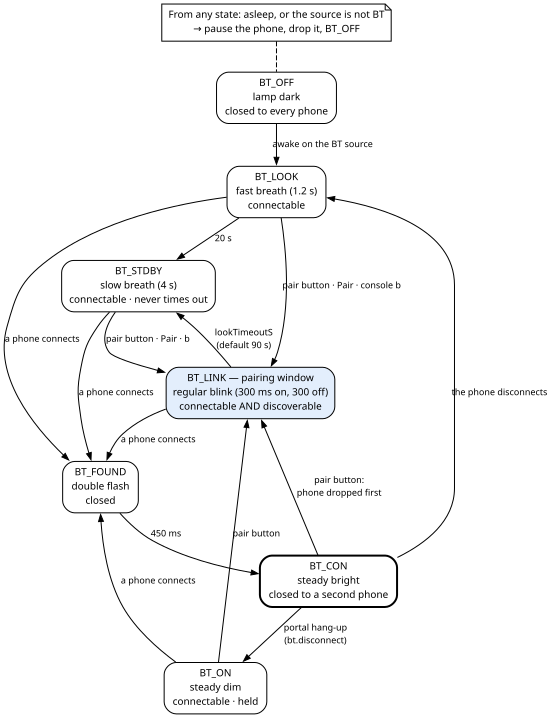

# 10. Sound and Bluetooth

The A32, the audio board, makes the sound of the radio. It is a classic ESP32-WROOM-32, a separate chip
from the ESP32-S3 that runs the rest of the radio. It plays the tube radio's audio, digitised and played
back, or music streamed from a phone over Bluetooth, and it stays silent on AUX. Phone music needs
Bluetooth *Classic*, which the ESP32-S3 does not have; that is why this job runs on a second chip.

This chapter covers the sound path, the volume, the sources, Bluetooth and its blue lamp, the A32's
tight memory, what it reports, and the **pops**: loud clicks that took two weeks to tame and that a
change to the clock pins cut by about 150 times. The A32's start-up, its awake and asleep states and the
link to the S3 are in chapter 9. Its updates and its trial and rollback are in chapter 3. How it saves
its settings is in chapter 7, section 7.4. Appendix A lists every audio and Bluetooth setting, Appendix G
the compiled constants and the experiments, and Appendix H the pop hunt in full.

> **Specific to this build — adapt.** The gains, the channel order, the volume curve and the knob
> calibration here suit this tube set, this amplifier and this speaker set. Adapt them to yours.

How the converters, the volume knob, the source selector, the pair button and the blue lamp are wired is
in the Hardware Bible, chapters 6 and 9. This chapter states in place the few hardware facts it needs.

## 10.1 What you hear

1. **Three sources, picked by the front selector.** **RADIO** is the tube radio's audio, digitised and
   played back. **BT** is music streamed from a phone. **AUX** is an analogue input that never passes
   through the A32, so on AUX the A32 stays silent.
2. **Turning the selector** fades the old source out quickly (150 ms) and brings the new one in gently
   (1 s).
3. **The front volume knob** sets the level along a curve that suits the ear. It acts on RADIO and BT
   only, never on AUX. Radio and Bluetooth come out equally loud at the same knob position.
4. **Bluetooth is invisible** unless the selector is on BT and the amplifier is on. A phone that paired
   before can reconnect by itself, from the phone. A new phone needs the pair button, which makes the
   radio visible for 90 seconds. **The radio never calls a phone.**
5. **The blue lamp** on the front tells the Bluetooth state (section 10.7.6).
6. **When the amplifier is off, or the S3 stops talking**, the A32 sleeps: it plays nothing, the lamp
   goes dark and Bluetooth closes (chapter 9).
7. **During an A32 update** the sound stops while the A32 writes its flash. The needle and the clock
   keep working (chapter 3, section 3.10.3).
8. **A reboot or an update of the A32 makes one pop of its own**: the audio clocks stop, the DAC goes to
   standby, and it restarts.

**Words used in this chapter.** These terms recur from here on.

| Term | Meaning |
|---|---|
| **I2S** | A serial bus for audio samples. **BCK** (bit clock) ticks once per bit. **LRCK** (word select) toggles once per frame and says which channel the bits belong to. **Data** lines carry the bits, most significant bit first. |
| **Slot** | One channel's share of a frame. Here each frame has two 32-bit slots. |
| **MCLK** | The master clock, a faster reference that some converters need. The converters here call their MCLK input **SCK**. |
| **Full duplex** | One I2S peripheral sends (to the DAC) and receives (from the ADC) at the same time, on shared BCK and LRCK. |
| **DAC / ADC** | Digital-to-analogue converter (the output) and analogue-to-digital converter (the radio input). |
| **DMA** | Direct memory access. The I2S driver keeps a chain of RAM buffers that the hardware plays out or fills by itself; the CPU only keeps the chain topped up. DMA buffers must sit in a special part of internal RAM. |
| **APLL** | The ESP32's audio PLL, a clock generator that can make 11.2896 MHz exactly. |
| **A2DP, SBC, PCM** | The Bluetooth profile for streaming stereo music. The phone compresses the music with the **SBC** codec; the Bluetooth library decodes it to 16-bit samples (**PCM**). |
| **AVRCP** | The Bluetooth remote-control profile that goes with A2DP: play, pause, next, and the phone's volume slider. |
| **Bluedroid** | The Bluetooth stack inside Espressif's framework. It runs its own task on core 0. |
| **Connectable, discoverable** | The two halves of the **scan mode**. Connectable: a phone that already knows the radio can connect. Discoverable: the radio shows up in a phone's list of new devices. |
| **Bond, pairing** | The stored keys that let a phone that paired once reconnect later. |
| **dBFS** | Decibels relative to digital full scale. 0 dBFS is the loudest sample possible. |
| **Q16, Q24** | Fixed-point numbers. In Q16, 65 536 means 1.0. In Q24, 16 777 216 means 1.0. |
| **RMS, peak** | The average power of the signal, and its largest single sample. |
| **Underrun** | Bluetooth audio ran out in the middle of a block. |
| **LEDC** | The ESP32's PWM peripheral, used here for the blue lamp. |

## 10.2 The audio path


- **RADIO.** The tube radio's audio goes to the ADC, which sends 24-bit samples to the A32 over I2S. The
  A32 sums the two channels to mono, applies the radio gain, then the fade, the volume and the balance,
  and sends the result over I2S to the DAC.
- **BT.** The phone streams SBC-compressed music over A2DP. The Bluetooth stack decodes it into a ring
  buffer. The A32 takes samples from the ring, applies the Bluetooth gain, and then the same fade,
  volume and balance.
- **AUX.** The A32 sends digital zeros to the DAC. AUX audio reaches the amplifier without passing
  through the A32.

**The amplifier adds its inputs together; it does not choose between them** (Hardware Bible, chapter 6,
section 6.7). So on AUX the A32's only job is to send zeros. The front selector switches no audio: it only
tells the A32 which source you chose.

## 10.3 The audio interface (I2S)

### 10.3.1 Installed once, never touched again

The A32 installs its I2S driver once, at start-up. It is never reinstalled, reconfigured, stopped or
re-pinned. Changing source is only a choice of where the next block of samples comes from: ordinary code,
with no driver calls.

**Why.** The two paths want different drivers. The Bluetooth library, left to itself, wants a
transmit-only, 16-bit driver with no MCLK. The radio path needs full duplex, 32-bit slots and an MCLK for
the ADC. Reinstalling the driver at every source change, while the Bluetooth stack still holds a
reference to it, is the kind of fault that crashes the chip in ways that are hard to trace. So the
firmware installs the superset once and keeps it. This is also why the platform is pinned (chapter 3,
section 3.3): the next Arduino core retires this I2S driver.

### 10.3.2 The configuration

Both converters follow the A32's clocks as I2S slaves (Hardware Bible, chapter 6, section 6.2). The table
gives the I2S driver's settings, field by field, for anyone changing or porting the driver.

> **For firmware changes**
>
> | Field | Value | Why |
> |---|---|---|
> | Port | `I2S_NUM_0` | |
> | Mode | master, transmit and receive | The ESP32 makes the clocks; both converters follow them. |
> | Sample rate | 44 100 Hz | Fixed. There is no resampler. |
> | Bits per sample | 32 | The ADC sends 24-bit samples in standard I2S format. They arrive most significant bit first at the top of a 32-bit slot, so the raw word is already at full scale. |
> | Channel format | `I2S_CHANNEL_FMT_RIGHT_LEFT` | |
> | Frame format | `I2S_COMM_FORMAT_STAND_I2S` | Standard (Philips) I2S: data starts one bit after the LRCK edge. |
> | Interrupt | level 1 | |
> | DMA buffers | 8 buffers of 256 frames | 46.4 ms of audio per direction (section 10.8). |
> | `use_apll` | true | See below. |
> | `tx_desc_auto_clear` | true | If the CPU falls behind, the driver sends zeros instead of replaying old audio. |
> | `fixed_mclk` | 44 100 × 256 = 11.2896 MHz | BCK is 64 × 44 100 = 2.8224 MHz. |

After installing the driver, the firmware sets the pins, sets the **clock-pad drive to 3** (section 10.10) and starts the audio
task. The pins: MCLK on GPIO0, BCK on GPIO18, LRCK on GPIO17, data to the DAC on GPIO4, data from the ADC
on GPIO19.

**Why the APLL stays on.** The MCLK on GPIO0 feeds both converters' SCK inputs. The DAC switches off its
own internal clock generator when it is given an external SCK. The APLL is the only ESP32 clock that makes
11.2896 MHz exactly, and BCK and LRCK are divided from that same clock, so the ratio SCK:LRCK is exactly
256 by construction. Without the APLL the divider runs from a 160 MHz clock that cannot make 44 100 Hz
exactly, a worse clock for both parts. Do not "try" turning it off.

**Why MCLK is on GPIO0.** The classic ESP32 can put the I2S master clock only on GPIO0, 1 or 3. GPIO1 and
3 are the USB console. So GPIO0 must never be taken away from the I2S peripheral: that would stop the
clock of both converters at once.

**If installation fails**, the A32 prints a `[FAIL]` line on its USB console and does not start the audio
task. The radio is then silent, and only the A32's USB console says why.

### 10.3.3 Keeping the Bluetooth library off I2S

The Bluetooth library used here (ESP32-A2DP) normally owns the I2S driver. Here it must not. Three
guards make that structural, and each was added after a real bug.

> **For firmware changes**
>
> The rule behind all three: "make it impossible, do not make it a rule to remember."
>
> 1. **The stream-reader flag** (`a2dp.set_stream_reader(a2dpStream, false)`). The library hands the
>    decoded samples to the firmware, and the `false` tells it not to write I2S itself.
> 2. **An empty output object** (`a2dp.set_output(nullOut)`, a `NullA2dpOutput` whose every method is
>    empty). The flag does not stop everything: the library calls its output's `set_sample_rate()` whether
>    or not output is enabled, and the library's default output then reconfigures the driver. The moment a
>    phone started streaming, that call turned the firmware's driver into a 16-bit transmit-only one.
>    Bluetooth then played at full scale and garbled, ignoring the volume; the channels swapped; and the
>    radio stayed dead afterwards. The empty object has no way to reach I2S at all.
> 3. **A no-op volume control** (`a2dp.set_volume_control(&noVol)`, the library's
>    `A2DPNoVolumeControl`). The library's AVRCP volume scales the sample buffer in place, one line before
>    it calls the stream reader, and the flag does not stop it. At a phone slider of 1/127 that is a divide
>    by about 2048, with truncation. With the no-op control the library cannot touch the samples. The
>    phone's volume is still read as information and published as `avrcpVolume`. The firmware's own curve
>    is the only volume law in the machine.
>
> The firmware uses the library's plain sink class (through a subclass, section 10.15.5), not the "queued"
> variant. The plain class starts no I2S task of its own, so the decoded samples arrive directly on the
> Bluetooth task.

### 10.3.4 Channel order

The firmware puts the **right** channel in the first I2S slot (slot 0) and the **left** in slot 1, the
reverse of the usual convention. Every frame it writes is `{right, left}`. It does so because on this
machine that order gave correct stereo.

> **Caution — check the channel order on your build.** This is an adjustment for this machine, not a fact
> about the parts. The author knows that the amplifier-to-speaker side is correct; the A32-and-DAC side
> was never tested on its own. A left/right test track played over Bluetooth is still to be played.

There is no portal switch to swap the channels; one is listed as a possible improvement (chapter 12).
Until then, swapping them is a firmware change in the audio task, where the Bluetooth path, the balance
and the meters all take slot 0 as the right channel.

## 10.4 Inside the audio board

Sections 10.4.1 and 10.4.2 list the A32's tasks and buffers, for anyone changing the audio code. Section
10.4.3 follows one block of audio through the A32, and explains the meters the portal shows.

### 10.4.1 Tasks and cores

> **For firmware changes**
>
> | Who | Core | Priority | What it does |
> |---|---|---|---|
> | Audio task (`audioTask()` in `src/a32/audio.cpp`) | 1 | 6 | Reads or fetches one block, processes it, writes it to I2S. Stack 4096 bytes. |
> | Bluetooth task (Bluedroid) | 0 | the stack's own | Decodes SBC and hands the samples to the ring (`a2dpStream()` → `Audio::pushBt()`). |
> | Arduino main loop (`loop()` in `src/a32/main.cpp`) | 1 | 1 | The link to the S3, sleep and wake, source and volume reading every 50 ms, the Bluetooth states, the lamp, the 250 ms state message to the S3, the USB console. |
>
> Core 0 belongs to the Bluetooth stack. Sharing a core between SBC decoding and a real-time audio loop
> invites dropouts, so the audio task sits on core 1.
>
> **The audio task never waits on a timer, and must not.** Its pacing is free. On RADIO, reading a block
> waits until a full block has been captured. On BT and AUX, writing a block waits while the DMA chain is
> full. **The audio task also never prints:** serial output from a priority-6 real-time task causes the
> dropouts it would be trying to report. Anything worth saying is announced later from the main loop.
>
> ### 10.4.2 Buffers
>
> | Buffer | Size | Notes |
> |---|---|---|
> | One block (`BLOCK`) | 256 frames | One pass of the audio task, about 5.8 ms. |
> | `inBuf`, `outBuf` | 2 KB each | 256 frames × 2 slots × 4 bytes, static. |
> | `btBuf` | 1 KB | |
> | Bluetooth ring (`RING_FRAMES`) | 8192 frames of two 16-bit samples, 32 KB, static | Absorbs about 186 ms of jitter. Bluetooth delivers audio in bursts; the radio path is paced by the ADC and needs no ring. |
> | DMA chain | 8 × 256 frames per direction, 32 KB in all | 46.4 ms per direction (section 10.8). |
>
> **The ring needs no lock.** It has one writer (the Bluetooth task) and one reader (the audio task). The
> writer publishes the new head with a release store; the reader reads the head with an acquire load and
> publishes the new tail with a release store. The chip is an in-order CPU and the ring sits in uncached
> RAM, so missing barriers had never caused harm; the code adds them anyway, because "correct by luck is
> not correct". The writer must never block the Bluetooth task, so **a full ring drops the newest samples**
> instead of waiting.

### 10.4.3 One block through the audio task


Each pass does four things.

**1. The source-change handshake.** If a new source is waiting and `muteOnChange` is on, the fade
envelope's target goes to 0. When the envelope reaches exactly 0, the task switches to the new source,
and the envelope rises again. So a change is: fade out, switch in silence, fade in. With `muteOnChange`
off the task switches at once, with no fade. With no change waiting, the target is 0 if muted and 1.0
otherwise.

**2. Get the samples.**

- **RADIO.** Read one block. With `monoSum` on (the default), each frame becomes
  `m = (slot0 + slot1) / 2`, sent to both slots. Both ADC channels carry the same mono radio signal
  (Hardware Bible, chapter 6, section 6.4), so the sum gains about 3 dB of signal-to-noise: the signal
  adds up, the converter noise does not. The result is multiplied by the radio gain (`gainRadioQ16`)
  with saturation; a saturated sample sets the `clip` flag. With `monoSum` off the two slots are kept
  apart.
- **BT.** Take 256 frames from the ring; missing frames are filled with zeros. Each 16-bit sample is
  shifted left 16 bits to full 32-bit scale, then multiplied by the Bluetooth gain (`gainBtQ16`). The
  **underrun** counter counts only a *partial* fill: audio was flowing and ran out mid-block, and the
  zero-fill made a click. An empty ring means nothing is streaming and is not counted. (A first version
  counted empty blocks too and ran at a few hundred per second, which made it useless.)
- **AUX.** The block is set to zero.

**3. Emit.** The same code runs for every source.

- **Volume**, **balance** and the **envelope** (section 10.5). Each sample becomes
  `sample × envelope² × volume × balance`.
- **Meters.** The **peak** meter reads the very end of the chain, so it moves with the knob. It is read and
  reset by the 250 ms state message, in tenths of a dBFS. It uses 64-bit arithmetic: a 32-bit version could
  never register the loudest possible sample (negating the most negative 32-bit value gives itself back),
  so it under-read exactly during a full-scale event. That fix made the meter trustworthy as evidence in
  the pop hunt. The **RMS** meter is measured after the source gain and before the volume, so the knob
  does not move it. That is what let the radio and Bluetooth gains be matched once for every volume.
  Peaks cannot do that job: FM stations are limited hard and music is not.
- **Diagnostics**, all off by default, applied in this order: the constant-DC word (replaces every
  sample), the low-bit output mask, the zero-data floor, the sign-extended tail. Appendix G describes each.
- **Zero-data witness.** A copy of the DAC's own zero-data detector. The DAC mutes its output by itself
  after 1024 frames of zero data (Hardware Bible, chapter 6, section 6.5). The witness counts each time
  the DAC would enter and leave that mute, on what is actually about to go out. It counts a word as zero
  when its top 24 bits are zero, on the reading that the DAC resolves 24 bits of a 32-bit slot; the
  datasheet does not say whether it keeps the bottom 8.
- **I2S fault latches.** The peripheral's raw interrupt bits that the driver does not service are OR-ed
  into `i2sSticky`, which is never cleared.
- **Stall detector.** If more than 23.22 ms (one zero-data window) passed since the previous write, the
  task counts a stall and records its length and time.

**4. Write** the block to I2S, waiting while the DMA chain is full.

## 10.5 Volume, knob, fades, mute and gains

### 10.5.1 The knob is a sensor

The front volume knob is a position sensor, not an audio part. It turns a potentiometer whose wiper the
A32 reads on GPIO35, over its full 0–3.3 V swing, with the ESP32's own ADC (not the radio's converter) at
its widest input range (11 dB attenuation) (Hardware Bible, chapter 9, section 9.4).

**Reading.** Every 50 ms the A32 makes two throw-away conversions, then takes the median of five. The raw
reading is mapped through a **three-point calibration** (minimum, centre, maximum): each half of the
travel is its own straight line, and the centre reading maps to 128 of 255 by construction. The
calibration exists because, measured on this set, the knob at its mechanical centre read 215 of 255 with
only the two ends calibrated. A **deadband** of 24 ADC counts (about 0.6 % of travel) stops the volume
trembling at rest.

Three rules follow from "the knob is a sensor":

- **The first reading after the A32 starts always applies.** The knob's position *is* the stored state.
- **The knob does not store the volume.** Nothing needs storing (chapter 7, section 7.4.3).
- **The portal can also set the volume.** That value holds until the knob moves by more than the
  deadband. The portal action `sys.pot 0` makes the A32 ignore the knob altogether; it is an experiment
  and is not kept across a reboot.

**Calibrating the knob.** On the portal's **Audio** tab (administrator), turn the knob to its minimum and
press **Pot: minimum**, to its mechanical centre and press **Pot: centre**, to its maximum and press
**Pot: maximum** (actions `pot.min`, `pot.ctr`, `pot.max`). The A32's USB console keys `p`, `c` and `P` do
the same. For the portal buttons the A32 measures the knob itself, with the median of nine readings,
because the reading and the thing being calibrated must not sit on opposite sides of a link. The three
readings are stored on the A32; Appendix A lists their defaults.

**The fallback.** If the stored calibration is implausible — the maximum not more than 64 counts above
the minimum — the A32 falls back to the compiled defaults 60 and 3990, with no centre point. They are
roughly this set's knob ends, held as a starting point until the knob is calibrated.

> **Warning — calibrate the knob before anything else.** A stored calibration of 930, 927 and 933 was
> implausible, so the firmware silently used its defaults, which had nothing to do with that knob. The
> volume was pinned near 18 of 255 (about −62 dB, the DAC near −77 dBFS; the volume law in force that day
> is not recorded), with the amplifier turned up to match: "every fault arrives 62 dB louder than it should". That is a safety issue, not a quality one.

### 10.5.2 The volume law

`volQ16 = (volume / 255)^gamma × 65 536`, where gamma is the setting `taper` divided by 10, clamped to
1.0–4.0.

| Gamma | At half travel | Character |
|---|---|---|
| 1.0 | — | linear amplitude |
| 2.0 | −12 dB | |
| **2.5 (default)** | **−15 dB** | |
| 3.0 | −18 dB | |
| about 3.3 | — | behaves like a real audio-taper potentiometer |

The power is computed only when the volume or gamma changes, once per block, never per sample. **The new
gain takes effect as a step at a block boundary; it is not ramped.** That is harmless for a hand on a
knob. The "volume watch" counts these steps (`gsteps`) and records the smallest and largest gain applied,
because the volume reading once wandered by itself, between 17 and 20, during the pop hunt.

### 10.5.3 Balance

`balance` runs from −100 to +100; negative moves the sound to the left. The other side is scaled by
`65 536 − |balance| × 655`. At ±100 the far side is about −65 dB, **not silent**.

### 10.5.4 Fades

The fade **envelope** is a Q24 number, stepped **every sample** and **squared** before use. A linear
amplitude ramp does not sound like a fade: it rushes up and then sits there. Q24 is needed because Q16
cannot express a one-second fade (the step rounds to 1, which gives 1.49 s).

The defaults are **1000 ms in and 150 ms out** (`fadeInMs`, `fadeOutMs`). The reasons given are
"a gentle arrival, not a jumpscare" and "leaving should be quick - you turned the knob". A value of 0 ms
is treated as 1 ms, so a source change can never wait forever for a silence that never comes.

A fade-out longer than about 340 ms makes every A32 update start with a click, because the update's mute
wait is fixed (chapter 3, section 3.10.3).

### 10.5.5 Mute

**Mute is a function of state.** The A32 computes

```
mute = protoBroken  OR  not awake  OR  muted
```

and every place that can change any of the three recomputes it. `muted` is the user's mute; **awake** is
chapter 9's rule (amplifier on, and the S3 heard within 2 seconds); `protoBroken` means the firmware's
link self-test failed at start-up, and such a build stays up, muted and invisible to phones, so that it can
be replaced over the air (chapter 3, section 3.11). **The one deliberate exception** is the start of an
A32 update, which forces the mute directly; an update that gives up restores the user's mute, not
"unmuted" (chapter 3, section 3.10.3).

Why computed: in the first version, falling asleep set the mute and four other places cleared it without
looking at sleep. Turning the source knob while asleep, because the S3 had died, then brought the sound
back, and the author's chosen alarm — silence when the S3 is gone — vanished.

**Mute is never stored.** It is forced off at every start of the A32 (chapter 7, section 7.4.1). A stored
mute once booted the set silent, with nothing on the front of the radio to say why.

**Mute is always software.** Muting means writing zeros. No A32 pin reaches the DAC's hardware mute
input: the DAC module holds it un-muted by itself, and GPIO16 is unused (Hardware Bible, chapter 6,
section 6.5).

**The I2S clocks keep running while asleep.** Asleep is a mute, not a stop.

### 10.5.6 Gains

The compiled defaults are **+8.0 dB for the radio** (`gainRadio`) **and −7.0 dB for Bluetooth**
(`gainBt`). They were measured with the RMS meter:

- **Radio.** At 0 dB the radio read RMS −29.9 dBFS with peaks to −14.0 dBFS. +8 dB puts its peaks near
  −6 dBFS and its RMS near −22 dBFS. The old +15 dB clipped at the gain stage, which means at every volume.
- **Bluetooth.** A −14 dBFS RMS pink-noise reference played from a PC at full volume arrived at about
  −15 dBFS. −7 dB lands it within about 1 dB of the radio, so changing source does not change loudness.

The A32 clamps any gain to −60 to +30 dB. The radio gain suits the tube radio's output with the tube
set's own volume control at about one eighth of its travel (Hardware Bible, chapter 6, section 6.8). A
different tube-set level needs a different radio gain. The author set the amplifier's ceiling by ear with
the A32 at full volume, and kept these values.

## 10.6 Changing source

The A32 reads the front selector on GPIO36 every 50 ms. It first makes three throw-away conversions,
because GPIO36 reads high for a while after another channel of the ESP32's own ADC has been sampled (78 counts of residue,
measured). Then it takes the median of five.

| Raw reading | Source | Voltage on GPIO36 (Hardware Bible, chapter 9, section 9.3) |
|---|---|---|
| below 424 | AUX | 0 V |
| 424 to 2470 | BT | 0.81 V |
| 2471 or above | RADIO | 3.3 V |

The thresholds live in `pins.h` as `A32_MODE_THRESH_AUX_BT` and `A32_MODE_THRESH_BT_RADIO`.

On a change the A32 does, in order:

1. If the old source was BT, it **pauses the phone and then drops it** (section 10.7.3).
2. It hands the new source to the audio task, which ramps across (section 10.4.3).
3. It recomputes the mute, the Bluetooth state and the scan mode.

The fade exists because a change of source without a ramp is an audible thump through a valve amplifier.
The selector is an on-off-on switch whose centre position, off, reads 0 V through 22 kΩ, which is AUX.
So a turn from RADIO to BT, or back, can pass through AUX on the way.

**At start-up** the A32 reads the selector once and sets the source before its main loop first runs. The
audio task starts on AUX, at volume 0, muted, until the settings and the first knob reading are applied.

The S3 learns the source from the A32's state message and shows AUX while the link is down (chapter 9).

## 10.7 Bluetooth: who may connect, and when

### 10.7.1 The policy

Three rules have been in the code from the start:

- a phone that wanders into range must not latch on its own;
- a phone that has connected before may reconnect on demand, from the phone;
- the button is for devices that have not connected before.

They give exactly one arrangement:

| Situation | Connectable | Discoverable |
|---|---|---|
| Not on the BT source, or asleep | no | no |
| On BT, idle | yes | no |
| Pairing window open (after the button) | yes | yes, until the window closes |
| A phone is connected | no | no |

All of it depends on being **awake**. Both chips are powered whenever the set is plugged in; without the
awake gate, a phone could connect at 3 a.m. and quietly send its audio into a radio that is off. **The
radio never calls a phone**: automatic reconnection is switched off in the library. No second phone can
call in behind the first while one is connected.

In full, the A32 is connectable only when all of these hold: the setting `connectable` is on, it is
awake, the source is BT, its link self-test passed, and no phone is connected. It is discoverable only
when it is connectable and the pairing window is open. With `connectable` off, Bluetooth is closed
entirely, the pairing window included.

### 10.7.2 The states



The state (`btState`) is published to the S3 and shown by the blue lamp.

| State | Lamp | Entered when | Left when |
|---|---|---|---|
| `BT_OFF` | dark | asleep, or the source is not BT | awake on BT → `BT_LOOK` |
| `BT_LOOK` | fast breath | entering BT, or a connection ended | after 20 s → `BT_STDBY` |
| `BT_STDBY` | slow breath | from `BT_LOOK`, or when the pairing window closes | held; never times out |
| `BT_LINK` | regular blink | the pair button, the portal's **Pair** (`bt.pair`), A32 console `b` | after `lookTimeoutS` (default 90 s) → `BT_STDBY` |
| `BT_FOUND` | double flash | a phone connected | the lamp moves itself to `BT_CON` after 450 ms, and the published state follows |
| `BT_CON` | steady bright | from `BT_FOUND` | the phone disconnects → `BT_LOOK` |
| `BT_ON` | steady dim | portal hang-up (`bt.disconnect`) | held, like `BT_STDBY` |

`BT_LOOK`, `BT_STDBY` and `BT_ON` have the same scan mode: connectable, not discoverable. Only `BT_LINK`
is discoverable. "Looking" is a message from the lamp; the radio never sends a page to a phone.

### 10.7.3 Letting a phone go

**Disconnect entirely, but pause first.** Whenever the radio lets a phone go, it sends an AVRCP pause (if
`pauseOnLeave` is on) and drops the phone 250 ms later, without blocking. The pause matters: tearing down
A2DP under a phone that thinks it is playing left its media app "playing into nowhere", a real dead end
seen on this radio. Leaving BT drops the phone entirely; staying connected while the selector was
elsewhere gave "the phone showed connected, play appeared to work, and nothing came out".

**A disconnect is only a request**; the library confirms it later, on the Bluetooth task. The A32 holds
the requested state while it waits, so the pair button pressed with a phone connected ends in the pairing
window, as it should. If the disconnect has not landed after 3 s, the A32 stops waiting and sends
`BT: the disconnect did not land - still connected` to its USB console and to the S3. The lamp then shows
connected.

**Stray phones.** If a phone is connected while the A32 is asleep or off the BT source, the A32 sends it
away by the same pause-then-drop path, at most once every 3 s. The rule is "nothing connects at night",
not merely "nothing can".

### 10.7.4 The pair button and the other controls

**The pair button** is on GPIO25, active low, with the pin's internal pull-up. No capacitor is drawn on
it (Hardware Bible, chapter 9, section 9.2), so the debounce is the firmware's: a press counts on
**release**, and only after the button was held for more than 30 ms. It acts **only on the BT source**.
A press drops whoever is connected first, then opens the pairing window. In the author's words:
"Otherwise a second phone can pair behind the first and it stops being obvious which one is in charge".

**Portal actions** (Appendix C): guest `bt.play`, `bt.pause`, `bt.next`, `bt.prev`, `bt.disconnect`
(graceful, ends in `BT_ON`) and `bt.pair`; administrator `bt.forget`, which removes every stored pairing.
`bt.pair` opens the window only on the BT source, but the portal answers "pairing window open" on any
source (chapter 12).

**Sample rate.** If a phone negotiates a rate other than 44 100 Hz, the A32 only warns on its USB
console. There is no resampler, so such a stream plays at the wrong pitch.

### 10.7.5 Transmit power

At start-up, after Bluetooth starts and before the first scan mode lets the radio transmit (as
Espressif's framework requires), the A32 sets the Bluetooth controller's power range: a floor of 0 dBm and
a ceiling of `btTxLevel`, which defaults to 0 dBm. The stock range is 0 to +3 dBm. The floor stays at
0 dBm unless the ceiling is set lower, because a low floor lets the controller run near its margin and
raises retransmissions.

The portal action `sys.bttx 0..5` (−12 to +3 dBm, down only) changes the ceiling; `sys.bttx 5` restores
stock. It is not stored, so every start is at 0 dBm. The controller's own readback (`bttx`, `bttxmin`)
is taken once, when the value is set. The ceiling was a pop mitigation: transmit bursts are the largest
current step the board makes. **Its effect on the pops was never measured.** It was kept as it is.

### 10.7.6 The blue lamp

The lamp's pattern for each state is the author's specification, implemented as written. It is driven
by LEDC channel 0 at 2 kHz, 8-bit.

| State | Pattern |
|---|---|
| OFF | off, and actively driven off |
| ON | steady, 64/255 |
| LOOK | breath 32 → 255 → 32 over 1200 ms |
| STDBY | breath 8 → 120 → 8 over 4000 ms |
| FOUND | 150 ms on, 150 off, 150 on, then CON by itself |
| CON | steady, 180/255 |
| LINK | 300 ms on, 300 ms off, repeating |

- **Active low.** The lamp is on GPIO33 with its anode on the supply, so the pin sinks its current
  (Hardware Bible, chapter 9, section 9.2). A brightness B is written as 255 − B.
- **"Off" is driven high**, not left as an input, because an input pin's leakage lights the LED faintly in
  a dark room.
- **Breathing uses a raised cosine**, because a linear ramp reads to the eye as a fast rise and a long dim
  tail.
- **Each state has a scale** of 0–255 (the settings `btLedOff` … `btLedLink`, default 255, "exactly as
  specified"). OFF ignores its scale.
- **FOUND always resolves**: the lamp moves itself to CON after 450 ms, and the published state is read
  back from the lamp, so the two share one clock.
- **Full drive.** At the default scale of 255 the lamp is driven **fully on** (the pin held low for the
  whole PWM period) for 300 ms of every 600 ms in LINK, at the top of every LOOK breath, and for both
  150 ms flashes of FOUND. That is the author's specification, kept on purpose. It was judged safe for this lamp's
  drive; that reasoning is not recorded in this book. A lower per-state scale lowers the drive.

## 10.8 Memory: the audio board's tightest limit

> **Caution — do not spend RAM on the A32 without measuring first.** The A32 has about 24 KB of heap
> really free. Asking for 32 KB more once made it impossible to update, and only a USB cable brought it
> back.

**The figure.** About 24 KB is really free: the Bluetooth library's own report of the free heap, printed
on the A32's USB console at start-up, read 23 620 bytes. It was measured once, with that day's build,
and has not been re-measured since.

**The incident.** The DMA chain was once raised from 8 to 16 buffers, to ride out audio-task freezes of
tens of milliseconds. The driver allocates the same chain for transmit and receive, so that cost another
32 KB of DMA-capable internal RAM, more than was free. Then:

- every update was refused: the updater returned false with error code 0, which means its own 4 KB
  allocation had failed, on a chip seconds out of reset;
- phones and a PC could not connect over Bluetooth;
- the chip crashed once.

There is no way to reset or reflash the A32 from the S3: no reset or boot-mode wire runs between them
(Hardware Bible, chapter 4). Only a USB flash back to 8 buffers recovered it; an over-the-air update of
the very same image, refused six times in a row before, was then accepted. The change had been shipped
because the heap figure then in view read about 231 KB and "never moved" (231 748 before, 231 740 after).
That was the wrong instrument (below). The conclusion drawn: "a radio that cannot be updated without
opening the cabinet is worse than one that clicks when the audio task is starved."

**The arithmetic.** Each DMA buffer is 256 frames × 8 bytes = 2 KB.

| Chain | Per direction | Both directions | Audio held |
|---|---|---|---|
| 8 buffers (the firmware's) | 16 KB | 32 KB | 46.4 ms per direction |
| 16 buffers (the incident) | 32 KB | 64 KB, 32 KB more | twice as much |

Every millisecond of chain depth costs about 0.35 KB per direction, **about 0.7 KB per millisecond in
total**, whether it is bought with more buffers or longer ones (the driver caps one buffer at 4092
bytes). Longer buffers differ only in how the memory fragments, not in how much they take. The 32 KB
Bluetooth ring is static memory and already inside the budget.

**Which number to trust.**

| Number | What it is |
|---|---|
| The portal's `heap` field | The **S3's** own free heap. It says nothing about the A32; no A32 heap figure reaches the portal at all. |
| The A32 console `s` line | `ESP.getFreeHeap()`, the free internal heap in general, which is not what a plain allocation or a DMA allocation can get. |
| The Bluetooth library's "Available Heap" lines at start-up | The A32's `esp_get_free_heap_size()`. The only place it is printed. |
| The largest free DMA block | Printed by nothing today. |

So the ~24 KB is the only recorded figure. **To read the free heap yourself**, connect a USB cable to the
A32's own USB port (read the Danger in chapter 3, section 3.8 first) and restart it: the Bluetooth library prints its "Available Heap" lines while
Bluetooth starts. The largest free DMA block needs a build that prints it. Section 10.15.2 says what to do
before spending RAM.

## 10.9 What the audio board reports

Every 250 ms the A32 sends a state message to the S3, which shows it on the portal. The fields for this
chapter:

| Portal key | Meaning |
|---|---|
| `under` | Bluetooth underruns (partial fills only) since the A32 started. |
| `ring` | The ring's high-water mark since the last read. |
| peaks, `clip` | The peak level per channel since the last read, in tenths of a dBFS; the clip flag. |
| `rmsl`, `rmsr` | RMS after the source gain, before the volume. |
| `zarm`, `zrel`, `zsince`, `zlong`, `zmute`, `zfloor` | The zero-data witness: entries, releases, time since the last release, longest mute, muted now, floor on. |
| `i2sraw` | The I2S fault latches, sticky since start-up. |
| `stalls`, `stallus`, `stlast`, `stlastus` | Audio-task stalls longer than 23.22 ms. |
| `praw`, `pmin`, `pmax`, `pjump`, `vsteps`, `vjump`, `vjms`, `gsteps`, `gmin`, `gmax`, `upot` | The volume watch: knob readings, their extremes and largest jump, volume steps, applied gain steps and range, knob in use. |
| `dindrv`, `sddly`, `tail`, `clkdrv`, `mclkdrv`, `bckdrv`, `lrckdrv` | Pad drives and registers, read back from the hardware. `clkdrv` = 255 means the three clock pads disagree. |
| `dctest`, `dcword` | The constant-DC diagnostic. |
| `a32ms` | The A32's uptime. |
| `bttx`, `bttxmin` | The Bluetooth transmit power range as the controller reported it. |

**Every readback comes from the hardware** — the pad, the register, the controller — never from a copy of
what the firmware thinks it wrote. That rule paid for itself once: a test script's portal session had
expired, its commands were silently refused, and only the pad readback showed that the setting had never
moved.

**`i2sraw` = `0x092A` is normal.** Most of its bits latch in normal running. On this radio it read
`0x092A` (2346) at every read, across starts and through the heaviest popping on record: bits 1, 3, 5, 8
and 11, which are `tx_put_data`, `rx_rempty`, `tx_rempty`, `in_done` and `out_done`, most likely set at
start-up. `rx_wfull` and `rx_rempty` are expected on BT and AUX, where nothing reads the receive chain and
it overflows by construction. So a steady `i2sraw` is not a fault, and it gave no evidence of a transmit
fault when pops happened. The A32's console `s` decodes the bits by name.

**Only the A32's USB console shows** the Bluetooth stack's heap figure, the `[ZDD]` lines the A32 prints
when the witness sees a release or a stall, and the text of update errors.

## 10.10 Pops: what was found, and what is still open

Appendix H tells the hunt in full, with every test and number and the method for counting pops. This is
the summary.

**What a pop is.** A loud, short click through the speakers, at irregular times, on RADIO and on BT,
never on AUX. Any A32 volume other than 0 produces them.

**What it is not.** Each of these was excluded by a measurement: the Bluetooth branch (RADIO popped the
same way); the S3, its WiFi and the link (the S3 powered off: no change); the firmware's arithmetic (the
peak meter never above −118.4 dBFS through 60 s of popping); every linear stage in the firmware, the
underrun click included (a phone volume a hair above zero brought the pops back at full loudness); the
DAC's zero-data mute (`zrel` did not move through 8 minutes of pops); the volume reading (knob ignored,
still popping); audio-task stalls (`stalls` frozen, `under` at 0 during pops); the DAC's clock-error mute
(a streamed tone passed through 37 pops almost unchanged); the needle motor, the FM tuner chip, the 5 V
supply, the tube set, the box fan, the earth, a mains filter, the room and the amplifier. Mains noise conducted on the
same circuit is a contributor, not the cause.

**What the pops look like.** Pop sizes fell on a ladder of binary weights (¼, ½, ⅝, ¾, 1 and 3/2 of a
main size), and the pops survive a constant word on the data line: they do not need the data to change,
but a near-zero word never showed them. That reads as the DAC mis-reading a few of the top bits of single
words, not as noise added in the analogue path.

**What cut them: clock-pad drive 3.** At start-up the firmware sets the MCLK (GPIO0), BCK (GPIO18) and
LRCK (GPIO17) pads to drive strength 3, the strongest of the ESP32's four, instead of the power-on 2.

| Clock-pad drive | Condition | Window | Pops |
|---|---|---|---|
| 2 | 220 Hz tone over A2DP, one-minute alternation | 936 s | 52 (3.33/min) |
| 3 | same run, alternating windows | 932 s | 0 above −35 dBFS |
| 3 | tone at −30 dBFS over A2DP, floor on | 45.1 min | 1 (0.022/min) |
| 3 | constant word `0xFF000000`, A2DP streaming | 90.0 min | 0 (upper bound about 0.03/min) |

The alternation's stratified exact test gave p = 2.8e-16, with all 15 pairs the same way. Drive 3 cut the
pops **about 150 times in the measured conditions**.

**What it is.** A **margin fix, not a root cause.** The offered story is a hypothesis; no oscilloscope
has ever seen an edge. It runs like this. GPIO0 drives two converter clock inputs down a harness stub.
The DAC's fallback clock recovery is off while it has an external SCK. A stiffer edge stops a marginal
sampling instant latching the wrong bit. At 354 ns per bit, the question is edge quality, not timing. Drive 3 says the DAC
was latching wrong bits on a marginal edge, not why the edge was marginal. The drive setter cannot stop
MCLK by accident: GPIO0 is an RTC-capable pad, and the framework writes only the pad's drive field; the
pad's function select is a separate bit.

**What it cost.** At drive 3 the radio path was once heard as distorted, "like people lightly talking
through kazoos"; at drive 2 it sounded right but the pops came back "like full-on popcorn". Both were
reproduced by changing `sys.clkdrv` and nothing else. Since then drive 3 has been judged to work with no
apparent consequences, and there is nothing to gain from drive 2. **Drive 3 stays the default.**
`sys.clkdrv` stays in the firmware so that drive 2 against 3 can be tested again, or drive 2 put back,
without a reflash.

**Hardware changes along the way** (Hardware Bible, chapters 4 and 6): the DAC's master-clock wiring was changed
early in the hunt, and the pops went away for nine days; decoupling capacitors were fitted; ferrite
cores and new audio cables went on later. After the ferrites the author heard no pops, even before the
cable changes. No instrumented pop count exists after the cable changes.

**Still open.**

- **The root cause** is not known. Drive 3 is a margin fix.
- **A burst of 183 pops a minute** (932 in 5.1 minutes, drive 2, RADIO, A32 volume 8), 55 times the
  earlier drive-2 rate, is unexplained. Five conditions differed from the earlier runs and none was
  isolated. The decoupling capacitors fitted shortly before may be part of the cause; untested.
- **The "kazoo" distortion** was judged by ear only; no recording of it exists, so it and the pops were
  never put on one scale. It has not been measured since the cable changes.
- **Why the A32 once rebooted** during the hunt is not known.
- **No waveform has ever been seen**; there was no oscilloscope. The firmware cannot see a DAC-side clock
  error; no telemetry exists for it.
- **Every measured rate is from the Bluetooth path**, because that is what was streamed: a limit of the
  evidence, not a property of the fault. No drive-3 measurement with Bluetooth idle exists.
- **Two tests were designed and never run**: driving MCLK and the BCK/LRCK pair apart (`sys.clkpair`), and
  a volume swing (A32 volume 47 against 94 with a tone streaming) to tell a fixed wrong code at the DAC
  from an error proportional to the sample.

## 10.11 When it goes wrong

The last column is the fault's class on the recovery ladder (NOTE, DEFECT, BLOCKER), set out in *About
this book*.

| What you see | What happened | What the A32 does | What you do | Class |
|---|---|---|---|---|
| Updates refused (the updater's error 0), phones cannot connect | RAM spent past the ~24 KB free, for example 16 DMA buffers. | Refuses every update. | Reflash by USB; nothing else reaches it (section 10.8). | **BLOCKER** (USB only) |
| Silence, or the radio at **full volume** | A future change writes the data-line output delay (or the BCK/LRCK out-delays) with audio live. Nothing in the current firmware can. | Nothing: it cannot see it. 1 or 3: silence; 2: full volume through the amplifier. | Turn the amplifier down, then make the change set the delay back to 0; only 0 plays correctly. The speakers are at risk (section 10.15.3). | **BLOCKER** (harm) |
| Wrong or missing sound after `sys.dindrv` 0 or 1 | The data-line drive was set to 0 or 1. | The line may mis-decode for long stretches. | Set 2 or 3, or reboot the A32. | DEFECT |
| Silence from start-up; `[FAIL]` on the A32's USB console | The I2S driver failed to install. | No audio task. | Reboot the A32; if it persists, reflash. | DEFECT |
| Silence; the link, the portal and the lamp work | The audio task is blocked for good (no known cause). The A32's loop watchdog does not watch it. | Nothing. | **Reboot the audio board** from the portal. | DEFECT |
| A click; `stalls` rises | The audio task was starved for more than 46.4 ms. | The chain drains; zeros go out. | Nothing. | NOTE |
| Music at the wrong pitch | The phone negotiated a rate other than 44.1 kHz. | A USB warning only. | Nothing in the firmware; there is no resampler. | NOTE |
| Rare drops or underruns in a long stream | The phone's clock drifts against the local 44.1 kHz. | The ring slowly fills (drops) or empties (underruns). | Nothing. | NOTE |
| Silence, lamp dark, Bluetooth closed | The S3 was silent for more than 2 s. | Sleeps: mute, Bluetooth closed, forgets the amplifier state. | Nothing: it wakes when the S3 speaks and says the amplifier is on (chapter 9). | NOTE (by design) |
| The volume does not follow the knob's travel | The stored knob calibration is implausible (maximum no more than 64 counts above the minimum). | Falls back to 60 / 3990, no centre. | Recalibrate (section 10.5.1). | BLOCKER (guarded: the knob runs on 60 / 3990) |
| The knob maps wrongly | The stored calibration is plausible but wrong. | Nothing. | Recalibrate. | BLOCKER |
| `BT: the disconnect did not land - still connected`; the lamp shows connected | A disconnect request never landed within 3 s. | Warns on USB and to the S3. | Nothing. | NOTE |
| A phone connects while the radio is off or on another source, then drops | A phone connected while asleep or off BT. | Pauses and drops it, retried every 3 s. | Nothing. | NOTE |
| Silent, invisible to phones; `proto self-test FAILED - muted, BT closed, awaiting OTA` every 10 s | The firmware's link self-test failed at start-up. | Muted, Bluetooth closed; the link and the update receiver stay up; never confirmed. | If it arrived over the air: **Reboot the audio board**, which rolls it back (an update is refused while it is on trial). If flashed by USB: update to a good program (chapter 3, section 3.11). | DEFECT |
| Silence for up to 20 s after an update stopped mid-transfer | No frame from the S3 for 20 s. | Gives up and restores the user's mute. | Nothing. | NOTE |
| Every A32 update starts with a click | `fadeOutMs` is above about 340 ms. | Nothing. | Set it lower (chapter 3, section 3.10.3). | NOTE |
| The pair button blinks the lamp, but no phone finds the radio | `connectable` is off. | Bluetooth fully closed. | Turn it on. | NOTE (by design) |
| Audio settings back at their defaults after an update | The stored settings had another size. | Defaults apply. | Set them again from the portal (chapter 7, section 7.4). | BLOCKER by design; avoidable by downloading the settings file before the update (chapter 7, sections 7.5.5 and 7.6.4) |
| `settings NOT saved - the flash write failed; retrying` | A settings write to flash failed. | Keeps the change unsaved, warns, retries 2 s later. | Nothing. | NOTE; never exercised on the radio |
| A change made during the A32's trial is gone after a restart | The restart rolled the program back. | Held the change in RAM. | Set it again (chapter 3, section 3.11). | NOTE (by design) |
| `the audio board is not answering - its settings cannot be changed now` (HTTP 409) | A portal edit of an audio row while the A32 is silent. | — | Wait for the handshake, then edit again (chapter 7, section 7.4.5). | NOTE; never exercised on the radio |
| A pop | Nothing the firmware can see. | Nothing. | Count them (Appendix H); see section 10.10. | NOTE; root cause open |

## 10.12 Design choices

- **I2S is installed once, full duplex, and never reconfigured; the Bluetooth library never reaches I2S.**
  The two paths need incompatible drivers, and reinstalling under the Bluetooth stack risks hard faults.
  The library leaked into I2S through its sample-rate call and into the samples through its volume
  control, so both doors are shut by empty objects rather than flags.
- **APLL on, a fixed 256 × 44 100 Hz MCLK on GPIO0, and GPIO0 never detached from I2S.** Both converters
  take their master clock from GPIO0, and only the APLL makes 11.2896 MHz exactly.
- **The radio's two channels are summed to mono.** Both carry the same signal; the sum gains about 3 dB
  of signal-to-noise.
- **The right channel goes in slot 0.** On this machine that order gave correct stereo; another build
  must check it (section 10.3.4).
- **Fades are asymmetric, 150 ms out and 1000 ms in, on a squared per-sample Q24 envelope.** Leaving a
  source is a deliberate act; arriving should be gentle. A linear ramp does not sound like a fade.
- **The volume curve is a portal setting, gamma 2.5, and the knob is calibrated at three points.** The
  right curve depends on the amplifier and can only be settled by ear. The knob's raw reading is not
  proportional to rotation, so no curve applied afterwards could fix it; a centre point does.
- **The knob is a sensor: the first reading applies, and the volume is not stored.** The knob's position
  is the stored state; coming up at a stored volume the knob disagrees with repeats the silent-boot
  failure.
- **The knob calibration lives on the A32**, because the A32 takes the readings: the reading and the
  thing being calibrated must not sit on opposite sides of a link.
- **Radio gain +8 dB, Bluetooth gain −7 dB.** Measured with the RMS meter, so both sources are equally
  loud at every knob position and the radio does not clip before the volume.
- **Mute is software only, computed from state, never stored.** No pin reaches the DAC's mute input; a
  mute toggled at events was undone by other code paths; a stored mute booted the set silent.
- **Bluetooth is invisible unless awake and on BT; the radio never initiates; only the firmware's own
  policy writes the scan mode.** Those are the three rules, and "nothing connects at night".
- **The Bluetooth library is pinned to one commit** (chapter 3, section 3.3). The visibility rule
  depends on the library's internals, and an unpinned library changes under the build without warning.
- **Pause the phone, then disconnect, whenever the radio lets a phone go.** A phone torn down mid-play
  leaves its app playing into nowhere.
- **The pair button drops the connected phone first.** Otherwise a second phone can pair behind the
  first and it is no longer obvious which one is in charge.
- **The blue lamp is driven fully on in LINK, at the top of LOOK and in FOUND.** That is the author's
  specification at the default scale of 255. Why it is safe for this lamp is not recorded (section 10.7.6).
- **A Bluetooth transmit ceiling of 0 dBm at start-up.** A pop mitigation: transmit bursts are the
  largest current step the board makes. Never measured.
- **Clock pads at drive 3 from start-up.** About 150 times fewer pops in the measured conditions; drive 3
  works with no apparent consequences, and there is nothing to gain from drive 2.
- **The DMA chain stays at 8 buffers.** 16 buffers took 32 KB the chip did not have; updates and
  Bluetooth failed.
- **Nothing in the firmware writes the I2S transmit output delays**; only the readback `sddly` remains.
  Why: written with audio live, the data-line delay sent the radio to **full volume** through the valve
  amplifier at position 2 and silenced it at 1 and 3; only 0 plays correctly, and the firmware cannot
  detect a wrong one. The full danger warning is in section 10.15.3.
- **Experiments are actions, never stored, and the remote DC word is chosen by index only.** A stored
  experiment gets its result blamed on something else later; nothing louder than −42 dBFS can be sent
  remotely (Appendix G).
- **The A32 sleeps when the amplifier is off, and S3 silence counts as amplifier off** (chapter 9).
- **A failed update restores the user's mute, not "unmuted"** (chapter 3, section 3.10.3).
- **The retired `autoConnect` byte stays in the stored Bluetooth structure, unread; its portal row is
  gone.** It did nothing, since the radio never calls a phone, and removing it would change the
  structure's size, which the A32 rejects (Appendix A).

## 10.13 Tried and rejected

> **For firmware changes**
>
> These were dead ends on this radio. They may not be dead ends on yours.
>
> | Approach | The idea | What happened here | What is left in the firmware |
> |---|---|---|---|
> | Letting the Bluetooth library own I2S | the library's normal way | it reconfigured the driver the moment a phone streamed: full scale, garbled, channels swapped, radio dead | the three guards (section 10.3.3) |
> | Reinstalling the driver at each source change | one driver per path | the kind of fault that crashes the chip in ways hard to trace | installed once |
> | The integer clock divider | MCLK from the 160 MHz clock | cannot make 44 100 Hz exactly | APLL on |
> | Underrun theory | the pop is the ring's zero-fill click | pops stayed full size at a tiny phone volume; a linear stage cannot do that | underrun counter kept (partial fills only) |
> | WiFi or coexistence theory | the S3's WiFi disturbs Bluetooth | S3 powered off: no change | — |
> | Draining the receive half on every source | read the idle receive chain on BT and AUX so it cannot disturb transmit | RADIO, which reads it, popped the same | receive free-runs on BT and AUX by design |
> | ADC master-clock toggle | detach GPIO0 from I2S to silence the ADC | a hazard once the DAC also took its clock from GPIO0; it also had two bugs: a null pin table that selected the built-in DAC pins, so the toggle worked exactly once, and a floating clock input | removed; its message is ignored. To silence the ADC, mute its samples |
> | Data-line framing | activity at the word boundary makes the DAC lose framing | the DAC's fallback clock recovery it blamed was switched off by the clock-wiring change; the pops later came back on constant words | superseded |
> | Output low-bit mask | zero the bottom bits so the data line is still at the boundary | never confirmed by ear; a `k` sweep fixed nothing on RADIO; widths 2 to 15 bits never tested one by one; it cannot touch the next word's sign bit that opens every slot | off; A32 console `k` only |
> | Hardware mute held high on GPIO16 | stop a floating mute input | no change; the pin reached nothing | removed |
> | Weaker data-line drive | slow the "aggressor" edge | no result recorded that it helped; 0 and 1 risk mis-decoding | `sys.dindrv` |
> | Data-line output delay (and the BCK/LRCK out-delays) | walk the data edge off the frame clock; once written up as a "free" knob | only 0 plays correctly (section 10.15.3). Keeping it on the USB console behind a warning was rejected too | nothing writes it; readback `sddly` only |
> | Zero-data mute release | the DAC's own analogue mute releases with a step | `zrel` did not move through 8 minutes of pops | witness kept; floor off, `sys.zfloor` |
> | Volume-step theory | block-boundary gain steps from a jittery knob reading | knob ignored, `gsteps` frozen, still popped | volume watch kept |
> | Sign-extended tail | the data line never moves across a word boundary | blind on-off-on-off test: no change in rate or size | off, `sys.tail` |
> | DAC clock-error mute | pops are the DAC muting on a clock error | a streamed tone passed through 37 pops almost unchanged (median −0.3 dB) | — |
> | One fixed-size sign-bit flip | every pop is the same flip | 20 of 31 pops had the opposite polarity (p ≈ 0.15); sizes spread over 19.1 dB | — |
> | Stall–Bluetooth link | stalls are caused by Bluetooth | 13 stalls in about 33 minutes with Bluetooth idle | stall counter kept |
> | Deeper DMA chain (16 buffers) | ride out audio-task stalls | broke updates and Bluetooth (section 10.8) | back to 8. Longer buffers, or a count raised only as far as the largest free DMA block allows, were named but never tried; both cost the same RAM per millisecond |
> | DAC system clock grounded, internal PLL from BCK (TI's advice for clicks on a sibling DAC) | let the DAC make its own clock | that was this radio's wiring before the clock change, when the pops were harder; not re-tried | — |
> | Clock drive split (`sys.clkpair 23`) | MCLK at 2, BCK/LRCK at 3, to keep both good halves | never run; drive 3 was kept | `sys.clkpair` |
> | Clock-pad drive 2 | the power-on default | about 150 times more pops in the measured conditions | `sys.clkdrv` can put it back |
> | Storing the mute | restore the user's mute at start-up | booted the set silent, with nothing on the front to say why | mute forced off at start-up |
> | The first fade ramp, in Q16 | advanced per sample | finished in 0.18 ms: a hard cut heard as a jump-scare | squared Q24 envelope |
> | A fixed logarithmic volume law | one curve for every amplifier | the right curve depends on the amplifier | gamma setting |
> | Storing the volume | come up at the last volume | repeats the silent-boot failure | the knob is the state |
> | +15 dB radio gain | more radio level | clipped at the gain stage, at every volume | +8 dB |
> | Matching radio and Bluetooth by peaks | equal peaks | FM is limited hard and music is not | RMS meter |
> | Letting the library write the scan mode | the library's normal way | the radio sat connectable and discoverable on RADIO, on AUX and asleep after every hang-up, source change or sleep | policy override (section 10.15.5) |
> | Staying connected outside BT | keep the phone across source changes | "the phone showed connected, play appeared to work, and nothing came out" | pause, then drop |
> | Capping the lamp's drive below full | a gentler drive | rejected; the specification is kept | per-state scale |
>
> The constant-DC diagnostic is kept on purpose: `0xFF000000` is the proven popper and `0x00FF0000` its
> matched silent control.

## 10.14 Known limits

**Seen working on the radio:** drive 3 at start-up, read back as 3 from all three pads after a cold
power cycle.

**Never run on the real radio:**

- the channel order from the A32 and the DAC (a left/right test track over Bluetooth);
- Bluetooth invisibility on RADIO, checked with a phone; it must also be run after any library change;
- an A32 settings write that fails, and its retry;
- the portal's refusal of an audio-board edit while the A32 is silent;
- `sys.clkpair`;
- the Bluetooth transmit-power A/B: the 0 dBm start-up ceiling is unproven;
- a drive-3 measurement with Bluetooth idle;
- the volume-swing test (section 10.10);
- a phone negotiating 48 kHz;
- `connectable` off;
- a long session measuring clock drift between a phone and the local 44.1 kHz (there is no rate
  adaptation; the 186 ms ring absorbs only jitter).

**Limits by design.**

1. **No resampler, no equaliser.** The path is bit-exact apart from gain, volume, balance and the fades. A
   digital equaliser on the A32 could only ever cover RADIO and BT, because AUX never passes through the
   A32; the one point that catches all three sources is analogue, after the amplifier's summing
   (chapter 12).
2. **The audio task is not watched by the A32's loop watchdog.** A wedged audio task leaves the loop, the
   link and the portal alive, so **Reboot the audio board** fixes it.
3. **The I2S clocks run even while asleep.** They may be the source of a fixed comb of spurs the FM tuner
   chip sees at multiples of 2.8224 MHz (harmonics 28 to 34 match within one sweep step). That is a
   hypothesis; the one-variable test (stop I2S for about 90 s during a sweep) needs a small A32 hook that
   was never written (chapter 12).
4. **No A32 heap figure reaches the portal**, and no key prints the reliable one on demand (section 10.8).
5. **`sys.bttx` resets at every start**, like every experiment, so the start-up value is always 0 dBm.
6. **The `autoConnect` byte** is kept and read by nothing.
7. **A reboot or an update of the A32 makes one pop of its own.**
8. **The stall click.** The audio task is sometimes frozen for 23 to 111 ms. The cause was never measured;
   a flash write with the cache off is the leading guess. It is not fixed, because a deeper chain costs RAM
   the chip does not have (section 10.8).
9. **The blue lamp is driven fully on** for 300 ms of every 600 ms in LINK, at the top of every LOOK
   breath and in both FOUND flashes, by the author's choice.

**Small known issues, left as they are** (chapter 12 has the details):

1. **The update's mute wait is a fixed 400 ms**; a fade-out above about 340 ms makes every update start
   with a click (chapter 3, section 3.10.3).
2. **The portal's `bt.pair`** sends a message named `MSG_BT_LOOK`, but opens the pairing window
   (`BT_LINK`). It opens it only on BT, yet the portal answers "pairing window open" on any source.
3. **The A32's console `s`** reads and resets the peak meter (with its clip flag) and the ring high-water
   mark, so the portal misses those values for one period. It also clears the I2S latches, but the portal
   reads `i2sSticky`, which nothing clears. Prefer the portal for those values.

## 10.15 Changing it safely

> **For firmware changes**
>
> ### 10.15.1 What must stay true
>
> 1. **Never reinstall, reconfigure, `i2s_set_clk`, `i2s_stop` or re-pin I2S after `Audio::begin()`.**
> 2. **Keep both `set_output(nullOut)` and `set_volume_control(&noVol)`, and the stream-reader flag.**
> 3. **Never detach GPIO0 from the I2S peripheral. Never turn the APLL off.**
> 4. **The audio task never delays, never prints, and blocks only in the I2S calls. `pushBt()` never
>    blocks.**
> 5. **Mute only through `applyMute()`**, which sets
>    `Audio::setMute(protoBroken || !awake || cfgA.muted)`. The start of an update is the one deliberate
>    exception.
> 6. **The scan mode is written only by `applyScanMode()`.** Never call the library's
>    `set_discoverability()`, which writes the mode directly.
> 7. **Do not change the ESP32-A2DP pin without re-testing invisibility** with a phone: on RADIO, on AUX,
>    asleep, after a portal hang-up and after a source change, check that the radio does not appear in the
>    phone's list of new devices. Check first that every library path that writes the scan mode still goes
>    through the virtual `set_scan_mode_connectable()` (section 10.15.5).
> 8. **Do not update the platform** (`espressif32@7.0.1`; chapter 3, section 3.3).
> 9. **Slot 0 carries the right channel on this machine.** On another build, play a left/right test track
>    before trusting it.
> 10. **New `ProtoState` fields go at the end**, so a version mismatch truncates rather than shifts.
>     `PROTO_VERSION` is deliberately not raised for such an append, because a raised version loses the
>     handshake, and with it the update relay to the A32 (chapter 9). New message ids are backward
>     compatible.
> 11. **Readbacks come from the hardware, never from a copy.**
> 12. **Read-and-reset counters** (`getPeaks()`, `getRms()`, `btRingFill()`) should have one reader: the
>     250 ms state message. Today the console `s` also reads `getPeaks()` and `btRingFill()`.
>     `i2sFaults()` is read and cleared by the console `s` alone; the state message sends `i2sSticky`
>     instead. `zeroWatch()`, `gainWatch()` and `i2sSticky` are monotonic and safe to read anywhere.
> 13. **`i2sFaults()` clears only the bits the driver does not service** (masked against `int_ena`). An
>     earlier version cleared everything and could lose the driver's buffer-done events, blocking the audio
>     task forever.
>
> ### 10.15.2 The heap and the update wait
>
> **Before spending any RAM on the A32**, read `esp_get_free_heap_size()` and
> `heap_caps_get_largest_free_block(MALLOC_CAP_DMA)` on the A32's USB console. No key prints them today
> (console `s` prints only `ESP.getFreeHeap()`; the library's start-up lines give only the first), so add
> the print in the same build, and do not trust the ~24 KB for a build that has grown since. Budget about
> 0.7 KB of DMA RAM per millisecond of chain depth. A +32 KB request was fatal once and only USB recovered
> it (section 10.8).
>
> **The update wait.** The A32 mutes and waits a fixed 400 ms before it writes its flash (chapter 3,
> section 3.10.3), because writing flash freezes code that is not in IRAM, the audio task included. If the
> fade and the DMA chain have not finished by then, the driver swaps in zeros mid-chain: a level step at
> the DAC, a click. The budget is at most 5.8 ms to see the mute, plus `fadeOutMs` (150 ms by default),
> plus the chain (46.4 ms): about 202 ms. The wait covers a fade-out of up to about 340 ms; `fadeOutMs` can
> be set up to 5000 ms. **If you raise `fadeOutMs` above about 340 ms, or deepen the DMA chain, raise the
> 400 ms wait in `OTA_BEGIN` to match.**
>
> ### 10.15.3 Hazards
>
> > **Danger — never write the I2S transmit output delays with audio live: one position sends the radio
> > to full volume.** The register `tx_sd_out_delay` shifts the data line in time. Swept live on this
> > radio, position 2 sent it to **full volume** through the valve amplifier; positions 1 and 3 silenced it;
> > only 0 plays correctly. Every I2S transmit out-delay — `tx_sd_out_delay`, `tx_ws_out_delay` and
> > `tx_bck_out_delay` — mis-frames the DAC, and the firmware cannot detect it. The speakers survived, but
> > they are at risk. Nothing in the current firmware writes any of them: the portal action and the A32 console key
> > that once did were removed, and only the readback `sddly` remains. If one is ever needed again:
> > amplifier down, mute, set, then un-mute at a known low level.
>
> - **Data-line drive 0 or 1, or any clock drive below 2, can mis-clock for long stretches.** The clock
>   setter clamps to 2–3; the data-line setter (`sys.dindrv`) does not. Use it with someone present and the
>   amplifier down.
> - **Verify a flash by something only the new build can say** (its version string, the A32's uptime
>   resetting), not by a value the previous build already published.
>
> ### 10.15.4 Traps
>
> - The volume gain steps at block boundaries; it is not ramped.
> - `muteOnChange` off switches sources with no ramp: a thump.
> - `setFades(0, …)` becomes 1 ms, on purpose.
> - Balance ±100 is about −65 dB, not silence.
> - The zero-data witness counts the DAC's idea of zero (the top 24 bits), not the firmware's.
> - With the sign-extended tail on, a word of 1 to 255 followed by a non-negative word becomes exact zero.
>   It matters only if the tail is ever turned on.
>
> ### 10.15.5 How the scan-mode policy is enforced
>
> **`applyScanMode(force)`** is the only function that writes the scan mode:
>
> ```
> connectable  = cfgB.connectable && awake && source == BT && !protoBroken && !btConnected
> discoverable = connectable && btState == BT_LINK
> ```
>
> It remembers what it last wrote and returns early unless the result changed or `force` is set.
>
> **The library writes the scan mode by itself**, on the Bluetooth task, at the pinned version: it calls
> `set_scan_mode_connectable(true)` on every disconnect and once more when the stack comes up, and
> `set_scan_mode_connectable(false)` on every connect. Its "true" means connectable *and* generally
> discoverable. The stack-up call is only queued when Bluetooth starts, so it lands after the firmware has
> applied its own mode. Because `applyScanMode()` had cached "invisible" and none of those writes changed
> the policy, the radio once sat connectable and discoverable on RADIO, on AUX and asleep after every
> hang-up, source change or sleep.
>
> **The fix is a subclass.** `PolicyA2dpSink` overrides the library's virtual
> `set_scan_mode_connectable(bool)` so that it only sets `scanDirty = true`. The main loop then calls
> `applyScanMode(true)` after `updateBtState()`, which re-derives the mode from the firmware's own state and
> writes it past the cache. The flag is cleared before the write, so a change that lands during the write
> is caught on the next pass. `scanDirty` starts true, so the start-up write happens in any case.
> `onConnState()` sets it again after updating `btConnected`, so at least one pass sees the new connection
> state. This depends on the library's internals — that `set_scan_mode_connectable` is virtual and that
> every scan-mode write goes through it — which is why the library is pinned.
>
> **Bluetooth timing races, already handled; do not undo them.**
>
> - `btDropping` is set **before** `a2dp.disconnect()`, because the callback that clears it runs on another
>   task and could otherwise land first. While it is set, the connected branch of `updateBtState()` holds
>   the requested state instead of promoting it back to `BT_FOUND`. `onConnState()` clears it when the
>   disconnect lands; after `BT_DROP_TIMEOUT_MS` (3 s) `updateBtState()` clears it and warns. A stale flag
>   is swept first thing in `updateBtState()`.
> - `scanDirty` is cleared before the write; `onConnState()` sets it again after `btConnected`.
> - The wake edge cancels a pending sleep disconnect (otherwise the phone is dropped 250 ms after waking
>   and the lamp goes dark while awake) and clears the stray-phone timer (`strayDropAt`).
> - `updateBtState()` reads `BtLed::state()` back to publish the lamp's own move from `BT_FOUND` to
>   `BT_CON`.
>
> ### 10.15.6 Where things are
>
> | What | Where |
> |---|---|
> | I2S set-up, the clock-pad drive, the audio task, the ring, meters, witnesses, diagnostics | `src/a32/audio.cpp`, `src/a32/audio.h` (`Audio::begin()`, `audioTask()`, `pushBt()`, `popBt()`) |
> | The blue lamp | `src/a32/btled.cpp`, `src/a32/btled.h` (`BtLed::update()`) |
> | The three guards, Bluetooth states, scan mode, disconnects, sleep and wake, source, knob, mute | `src/a32/main.cpp` (`setup()`, `updateBtState()`, `applyScanMode()`, `gracefulDisconnect()`, `serviceDisconnect()`, `updateSource()`, `readSource()`, `updateVolumePot()`, `potRotation()`, `applyMute()`, `applyBtTxPower()`) |
> | Selector thresholds and pins | `include/pins.h` |
> | State message and timing constants | `include/proto.h` |
>
> **How to count pops**, if they come back, is in Appendix H.
