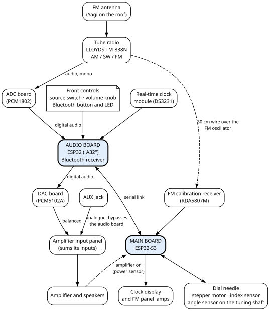

# 1. What Ambersong is

Ambersong is a vintage vacuum-tube radio, a LLOYDS TM-838N AM, shortwave (SW) and FM set, joined to
modern audio and control electronics. The tube radio still makes the sound when you listen to the radio.
Two small ESP32 boards beside its chassis turn that sound into digital audio, run a clock, and move the
dial needle with a motor. They also add Bluetooth and an auxiliary input. This chapter shows how the pieces fit together before
the rest of the book takes them one at a time.

## 1.1 The machine at a glance

Everything sits in one wooden cabinet: the tube radio's original chassis, the two boards, the converters,
the amplifier with its speakers, and the power supplies. Chapter 3 describes the cabinet.

The table names each part, says what it does, and gives the chapters that cover it.

| Part | What it does | Chapter |
|---|---|---|
| **Tube radio** (LLOYDS TM-838N) | Receives AM, SW and FM and makes the radio's audio. Its output transformer, loaded by a 7.5 Ω resistor, feeds the ADC board (below). | 13 |
| **Main board** (ESP32-S3) | Drives the clock display, the dial-needle motor and its index sensor, reads the angle sensor on the tuning shaft and the FM calibration receiver, dims the FM panel lamps, and senses when the amplifier is on. | 4, 7, 8, 9 |
| **Audio board** (ESP32, "A32") | Takes the radio's digital audio from the ADC, receives Bluetooth, and sends the chosen source to the DAC. Reads the source switch, the volume knob, the Bluetooth button, and the real-time clock; lights the Bluetooth LED. | 4, 6, 9 |
| **ADC board** (analogue-to-digital converter, PCM1802) | Turns the tube radio's audio into digital audio for the audio board. | 6 |
| **DAC board** (digital-to-analogue converter, PCM5102A) | Turns the audio board's digital audio back into an analogue signal for the amplifier. | 6 |
| **Amplifier and speakers** | A powered speaker pair's amplifier, with its two speakers. Its input panel adds up everything plugged into it. | 12 |
| **Clock display** | Four seven-segment digits and a colon, built for this front panel. | 7 |
| **Dial needle** | The radio's original brass needle, moved by a stepper motor, not by the dial cord. A magnet on its mount passes a Hall-effect index sensor, the needle's position reference. | 8 |
| **Angle sensor** (AS5600) | Reads the angle of the tuning capacitor's shaft through a magnet on the shaft. | 8 |
| **FM calibration receiver** (RDA5807M) | A small FM receiver chip, the main board's instrument for calibrating the dial. Its antenna is a 30 cm wire inside the radio's cage, bent over the tube radio's FM oscillator. | 8 |
| **Real-time clock module** (DS3231) | Keeps the time for the audio board. | 4 |
| **FM antenna** | A three-element Yagi on the roof, built for this machine, on the radio's antenna input. | 11 |

The two boards talk to each other over one **serial link**: two signal wires and a ground, in a shielded
cable (chapter 10).

## 1.2 The sound path

The front **source switch** picks one of three sources: RADIO, BT (Bluetooth) or AUX. Each one reaches
the speakers by its own path.

| Source | Path to the speakers |
|---|---|
| **RADIO** | tube radio → its output transformer, loaded by a 7.5 Ω 5 W resistor → shielded cable → ADC → audio board → DAC → amplifier input panel → amplifier → speakers |
| **BT** | a paired Bluetooth device → audio board → DAC → amplifier input panel → amplifier → speakers |
| **AUX** | AUX jack → amplifier input panel → amplifier → speakers |

**AUX is analogue and bypasses the audio board entirely.** It never goes through the DAC. On AUX the
audio board stays silent, and nothing it does can change AUX loudness or mute it.

**The radio feed is mono.** One side of the radio's output reaches the ADC; the ADC's left and right
inputs are fed from the same point (chapter 6).

**The amplifier's input panel sums its inputs; it does not choose between them.** The DAC reaches it
through its balanced input. The AUX jack reaches the amplifier's input panel, which sums it with the
other inputs; the run is not drawn. If two of them carry sound at once, you hear both.

**Three volume controls are in the chain.** Chapter 6, section 6.8, sets out all three.

- The **tube radio's own**, kept at about one eighth of its travel.
- The front **volume knob**. The audio board reads it, so it acts on RADIO and BT only.
- The **amplifier's own**, reached only from the back.

## 1.3 The control side

The **main board** runs everything you see move or light: the clock digits and colon, the dial needle,
and the four FM panel lamps. A printed front knob, on a printed shaft extension, turns the tube radio's
original tuning knob, which drives the dial cord and the tuning capacitor; nothing mechanical joins it to
the needle. The angle sensor reads the capacitor's shaft, and the main board moves the needle to match.
The FM calibration receiver is the main board's instrument for calibrating the dial. How the firmware uses these sensors is in the Firmware Gospel.

The **audio board** reads the front controls (source switch, volume knob, Bluetooth button), lights the
Bluetooth LED, and keeps the real-time clock.

A small **amplifier power sensor**, an optocoupler lit by the amplifier's supply, tells the main board when
the front power switch has turned the amplifier on (chapter 9).

## 1.4 The power at a glance

One mains inlet feeds the whole machine. A **5 V supply** runs whenever the cord is plugged in. It
powers both boards and everything digital. The 3.3 V parts on the audio side run from the audio board's
own 3.3 V output. The **front power switch** turns on only the amplifier's ±20 V supply and the tube
radio. So the clock keeps running with the switch off, and **mains is still present inside the cabinet**.

Chapter 2 lists the dangers. Chapter 5 follows the power from the inlet to every board and explains the
four grounds.

## 1.5 The front panel at a glance

From the front you reach the tuning knob, the volume knob, the source switch, the power switch and the
Bluetooth LED, which is also the Bluetooth button. You also see the clock display and the four FM panel
lamps. On the FM panel the needle shows the rough FM position against a blackened brass plate. What the
needle shows on AM and SW is not recorded. Chapter 3, section 3.2, lists each one; where each sits on the
panel is not recorded.
