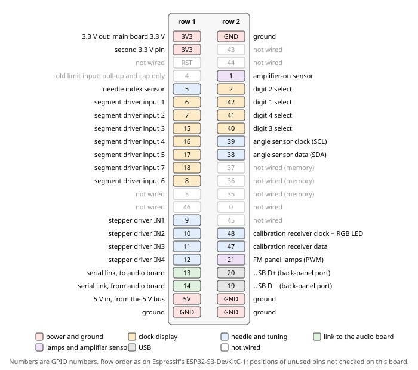

# 4. The two microcontroller boards

Two ESP32 development boards run the machine. The **main board**, an ESP32-S3, runs everything you see
move or light: the clock display, the dial needle and its sensors, the FM calibration receiver and the
panel lamps. The **audio board**, an ESP32 called "A32", handles the sound, Bluetooth, the front controls
and the real-time clock. This chapter gives each board's identity, every pin it uses, the small parts
around those pins, the back-panel USB-C ports and the real-time clock module. What the firmware does with
each pin is in the Firmware Gospel.

## 4.1 The boards

Both are development boards: a module on a small board with pin headers and USB. The table gives what
each one is, so you can identify it.

| | Main board | Audio board |
|---|---|---|
| **Also written** | S3 | A32 |
| **Board marking** | ESP32-S3 N16R8 YD-ESP32-23 2022-v1.3 | FCC IDL 2BB77-ESP32-32X (exactly as marked) |
| **Module** | marked ESP32-S3-N16R8, FCC ID 2AD6X-ESP32S3N16R8 | meant to carry an ESP32-WROOM-32E; whether it matches that module is not established |
| **Chip** | ESP32-S3 (QFN56), revision v0.2 | ESP32-D0WD-V3, revision v3.1; dual core, 240 MHz |
| **Radio** | Wi-Fi, Bluetooth LE | Wi-Fi, Bluetooth |
| **Flash** | 16 MB, quad; flash voltage 3.3 V, set by eFuse (a one-time setting burned into the chip) | 4 MB; flash voltage 3.3 V, set by a strapping pin (a pin the chip reads at power-up) |
| **PSRAM** (extra memory) | 8 MB, inside the chip | — |
| **Crystal** | 40 MHz | 40 MHz |
| **USB** | the chip's own USB port (USB-Serial/JTAG); USB ID `303A:1001` | a Silicon Labs CP210x USB-to-serial bridge; USB ID `10C4:EA60` |
| **On-board LED** | an RGB LED on GPIO48 | — |

The main board is compatible with Espressif's ESP32-S3-DevKitC-1 in firmware, and pin-compatible with it
for every pin this machine uses. The pins it does not use have not been checked. Neither module's maker has
been identified (Appendix C).

## 4.2 Main board pin map

The table lists every main-board pin this machine uses. *Signal* is the name on the drawings. *Cable*
names the cable's connectors as on the cable sheet (chapter 10); an arrow joins a cable's two ends.

| Pin | Signal | What it does | Connects to | Cable |
|---|---|---|---|---|
| GPIO1 | `GPIO1` | Amplifier-on input | The output transistor (collector) of the optocoupler in the amplifier power sensor. 10 kΩ pull-up to the main board's 3.3 V. Low when the amplifier is on. | `S3_PWR_DET` → `POWER_DET` |
| GPIO2 | `GPIO2` | Digit 2 select | Input 2 of the digit driver, then the P-channel MOSFET that switches digit 2 | `S3_DIGIT` → `DIGIT_IN` |
| GPIO4 | `GPIO4` | Nothing (old limit-switch input) | 10 kΩ pull-up and 0.1 µF to ground. Wired to the main board's `S3_LIMITS` socket, but its contact is not carried in the cable. | — |
| GPIO5 | `GPIO5` | Needle index | The output of the Hall-effect index switch (A3144). 10 kΩ pull-up to the main board's 3.3 V and 0.1 µF to ground at the pin. | `S3_LIMITS` → `LIMIT` |
| GPIO6 | `GPIO6` | Segment drive 1 | Segment driver input 1 | `S3_DISPLAY` → `DISPLAY_IN` |
| GPIO7 | `GPIO7` | Segment drive 2 | Segment driver input 2 | same |
| GPIO15 | `GPIO15` | Segment drive 3 | Segment driver input 3 | same |
| GPIO16 | `GPIO16` | Segment drive 4 | Segment driver input 4 | same |
| GPIO17 | `GPIO17` | Segment drive 5 | Segment driver input 5 | same |
| GPIO8 | `GPIO8` | Segment drive 6 | Segment driver input 6 | same |
| GPIO18 | `GPIO18` | Segment drive 7 | Segment driver input 7 | same |
| GPIO9 | `GPIO9` | Stepper coil drive | Stepper driver input IN1 | `S3_STEPPER` → `STEPPER_IN` |
| GPIO10 | `GPIO10` | Stepper coil drive | Stepper driver input IN2 | same |
| GPIO11 | `GPIO11` | Stepper coil drive | Stepper driver input IN3 | same |
| GPIO12 | `GPIO12` | Stepper coil drive | Stepper driver input IN4 | same |
| GPIO13 | `S3_to_A32` | Serial link, transmit | The audio board's GPIO26 | `S3_UART` → `A32_UART` |
| GPIO14 | `A32_to_S3` | Serial link, receive | The audio board's GPIO27 | same |
| GPIO19 | — | USB D− | The board's own USB port, which reaches a back-panel USB-C port (section 4.6) | — |
| GPIO20 | — | USB D+ | The same | — |
| GPIO21 | `GPIO21` | FM panel lamps, dimming | Through 100 Ω to the gate of the lamps' MOSFET (chapter 9) | `S3_FM_LED` → `FM_LED_IN` |
| GPIO38 | `GPIO38` | Angle sensor data (SDA) | 10 kΩ pull-up to the main board's 3.3 V at the pin, then 220 Ω in series, then the AS5600's SDA | `S3_TUNER` |
| GPIO39 | `GPIO39` | Angle sensor clock (SCL) | 10 kΩ pull-up to the main board's 3.3 V at the pin, then 220 Ω in series, then the AS5600's SCL | `S3_TUNER` |
| GPIO40 | `GPIO40` | Digit 3 select | Input 3 of the digit driver | `S3_DIGIT` → `DIGIT_IN` |
| GPIO41 | `GPIO41` | Digit 4 select | Input 4 of the digit driver | same |
| GPIO42 | `GPIO42` | Digit 1 select | Input 1 of the digit driver | same |
| GPIO47 | `GPIO47` | Calibration receiver data (SDIO) | The RDA5807M's SDIO. No pull-up resistors. | `S3_RDA` → `RDA_I2C` |
| GPIO48 | `GPIO48` | Calibration receiver clock (SCLK) | The RDA5807M's SCLK. No pull-up resistors. **Also drives the board's own RGB LED.** | `S3_RDA` → `RDA_I2C` |
| 3V3 | `S3_3V3` | The main board's 3.3 V output | The pull-ups above; the angle sensor and the FM calibration receiver, through their cables. Not joined to the 3.3 V bus. | `S3_TUNER`, `S3_3V3` → `RDA_3V3` |
| 3V3 (the second one) | — | Nothing | Nothing is wired to it. Both 3V3 pins are the same on-board 3.3 V rail. | — |
| 5V | `5VDC` | Power in | The 5 V bus | 5 V bus → `S3_5VIN` |
| GND | `GND` | Ground | The DC ground | with the 5 V cable |

**Not used:** GPIO0, GPIO3, GPIO35, GPIO36, GPIO37, GPIO43, GPIO44, GPIO45, GPIO46, and the reset pin
(RST). GPIO35 to GPIO37 are taken by the 8 MB PSRAM and cannot be used, according to Espressif's datasheet.

**Digit numbering.** Digit 1 is the rightmost digit, the units of minutes; digits 2, 3 and 4 run to its
left. The digit pins are therefore not in number order: GPIO42, GPIO2, GPIO40 and GPIO41 select digits 1
to 4. Which segment each segment drive lights is in chapter 7.

**The amplifier-on input.** The optocoupler's output transistor pulls GPIO1 to ground while the
amplifier's supply lights its LED; the pull-up holds GPIO1 high otherwise. Chapter 9 describes the sensor.

**Pins with a second job on the chip.** Some used pins have other duties on the ESP32-S3; Appendix A lists
the chip's limits.

| Pins | Other duty on the chip | Here |
|---|---|---|
| GPIO19, GPIO20 | USB D− and D+ of the chip's own USB port | used for USB only |
| GPIO39 to GPIO42 | the chip's JTAG debug interface | used for the angle sensor clock and three digit selects |
| GPIO0, GPIO3, GPIO45, GPIO46 | strapping pins, read at power-up | not used |

## 4.3 Audio board pin map

The table lists every audio-board pin this machine uses, with the same columns as section 4.2. The two
converters are the ADC and the DAC (chapter 6).

| Pin | Signal | What it does | Connects to | Cable |
|---|---|---|---|---|
| GPIO0 | `A_IO0A`, `A_IO0D` | Master clock (SCK) for both converters | Two 33 Ω resistors at the pin, one per converter: `A_IO0A` to the ADC's SCK, `A_IO0D` to the DAC's SCK | `A32_I2S` (chapter 10, section 10.15) |
| GPIO4 | `A_IO4` | Audio data to the DAC (DIN) | The DAC's DIN, with a 100 kΩ pull-down to ground | `A32_I2S` |
| GPIO17 | `A_IO17` | Word clock (LRCK) | The LRCK of both the ADC and the DAC | `A32_I2S` |
| GPIO18 | `A_IO18` | Bit clock (BCK) | The BCK of both the ADC and the DAC | `A32_I2S` |
| GPIO19 | `A_IO19` | Audio data from the ADC (DOUT) | The ADC's DOUT | `A32_I2S` |
| GPIO21 | `A_IO21` | Real-time clock, clock line (SCL) | The clock module's SCL | `A32_RTC` → `RTC_I2C` |
| GPIO22 | `A_IO22` | Real-time clock, data line (SDA) | The clock module's SDA | `A32_RTC` → `RTC_I2C` |
| GPIO25 | `A_IO25` | Bluetooth button | One side of the button; the other side is on ground. **Active low:** pressing it pulls the pin to ground. No pull-up resistor is drawn; the firmware uses the chip's internal one. | `A32_BT_LED` → `BT_LED` |
| GPIO26 | `S3_to_A32` | Serial link, receive | The main board's GPIO13 | `A32_UART` → `S3_UART` |
| GPIO27 | `A32_to_S3` | Serial link, transmit | The main board's GPIO14 | same |
| GPIO33 | `A_IO33` | Bluetooth LED | The LED's cathode; its anode is on 3.3 V (`A_3V3`). **Active low:** the pin lights the LED by pulling low. No series resistor is drawn. | `A32_BT_LED` → `BT_LED` |
| GPIO35 | `A_IO35` | Volume knob | The wiper of the front volume knob, a potentiometer with its ends on 3.3 V (`A_VDC`) and ground | `A32_VOL` → `VOLUME` |
| GPIO36 | `A_IO36` | Source switch | Through 1 kΩ to the source switch's resistor ladder; 0.1 µF to ground at the pin. Reads 3.3 V on RADIO, 0.81 V on BT, 0 V on AUX. | `A32_SWITCH` → `LISTENER` |
| 3V3 | `A_3V3` | The audio board's 3.3 V output | Feeds the 3.3 V bus (`A_VDC`) | `A32_3V3` |
| 5V | `5VDC` | Power in | The 5 V bus | 5 V bus → `A32_5VIN` |
| GND | `GND` | Ground | The DC ground | with the power cables |

**Not used:** GPIO1, GPIO2, GPIO3, GPIO5, GPIO6 to GPIO11, GPIO12, GPIO13, GPIO14, GPIO15, GPIO16,
GPIO23, GPIO32, GPIO34, GPIO39, and the enable pin (EN). GPIO6 to GPIO11 belong to the module's flash
memory. GPIO34 and GPIO39 are not joined to GPIO36 or to each other on this board. An older comment in the
firmware's pin file says these three pins were measured continuous; that comment is stale.

**One clock, two names.** `A_IO0A` and `A_IO0D` are both the audio board's GPIO0. Each converter gets its
own 33 Ω series resistor, fitted at the audio board's pin; the two names only make each converter's
wiring read clearly. Chapter 6 explains the audio bus.

**GPIO36 is the selector signal only.** On AUX the audio itself never reaches the audio board. The
source switch, its ladder and the firmware's thresholds for the three levels are in chapter 9, section 9.3.

**GPIO34, GPIO35, GPIO36 and GPIO39 are input-only** on this chip. The volume knob (GPIO35) and the
source switch (GPIO36) use two of them (Appendix A).

## 4.4 Main board support parts

These are the small parts fitted around the main board's pins, and why each is there.

| Pin | Parts | Why |
|---|---|---|
| 3V3 | 0.1 µF and 10 µF to ground | decoupling of the main board's 3.3 V |
| 5V | 100 µF and 0.1 µF to ground | decoupling of the 5 V input |
| GPIO1 | 10 kΩ pull-up to the main board's 3.3 V | the optocoupler only pulls the line low |
| GPIO4 | 10 kΩ pull-up to the main board's 3.3 V, 0.1 µF to ground | left from the old limit switch; the pin goes nowhere else |
| GPIO5 | 10 kΩ pull-up to the main board's 3.3 V, 0.1 µF to ground | the Hall switch's output only pulls low; the pull-up sets its high level at 3.3 V |
| GPIO38, GPIO39 | 10 kΩ pull-up to the main board's 3.3 V at the pin, then 220 Ω in series toward the sensor | the angle sensor's two-wire bus |
| GPIO47, GPIO48 | none | the calibration receiver's bus has no external pull-ups |

Wattage is not recorded for any of these pull-up or series resistors.

The shields of the `S3_LIMITS` and `S3_TUNER` cables are on `GND` at the main board. The GPIO4 and
GPIO5 capacitors return to the `S3_LIMITS` cable's ground and shield contact.

**Firmware text that disagrees.** Two items in the firmware's pin file describe this board differently.
A comment speaks of "4.7k pull-ups to S3_3V3"; the angle sensor's pull-ups are 10 kΩ. A define,
`S3_LIMIT_RIGHT 4`, names GPIO4, but no firmware code uses it, and GPIO4 goes nowhere beyond its socket.
In both cases the hardware stated here is right.

## 4.5 Audio board support parts

These are the small parts fitted around the audio board's pins, and why each is there.

| Pin | Parts | Why |
|---|---|---|
| 3V3 | 0.1 µF, 10 µF and 10 µF to ground | decoupling of the 3.3 V that feeds the 3.3 V bus |
| 5V | 0.1 µF and 100 µF to ground | decoupling of the 5 V input |
| GPIO0 | two 33 Ω in series, at the pin, one per converter | one clock line for each converter |
| GPIO4 | 100 kΩ to ground | pull-down on the DAC's data input |
| GPIO36 | 1 kΩ in series from the ladder; 0.1 µF to ground on the pin side | filters the source switch's level |
| GPIO36 ladder | 22 kΩ from the ladder node to ground; 68 kΩ in the BT leg | sets the three levels (chapter 9) |

The 22 kΩ and 68 kΩ ladder resistors are **on the audio board**, not at the switch. How they and the
other parts in this table are mounted at the audio board is not recorded. Where the 100 kΩ pull-down sits
along the DAC data line is not recorded.

## 4.6 The back-panel USB-C ports

The back panel has two USB-C sockets, one for each board. Each passes all four USB wires straight
through to its board's USB-C connector: the 5 V power wire (VBUS), D−, D+ and ground. Each socket's other
three ground pins are joined together. Nothing else on the sockets is recorded, including the USB-C
configuration pins (CC).

| Back-panel port | Goes to |
|---|---|
| main (P2) | the main board's own USB port: the chip's USB-Serial/JTAG, USB ID `303A:1001` |
| audio (P1) | the audio board's USB-C: the CP210x USB-to-serial bridge, USB ID `10C4:EA60` |

How the firmware uses the ports is in the Firmware Gospel.

> **Caution — two power sources.** VBUS reaches each board from the back panel while the 5 V bus also
> feeds the board's 5V pin. Espressif's guides treat these as mutually exclusive ways to power the board
> (chapter 2, section 2.5).

## 4.7 The real-time clock module

The real-time clock is a **DS3231 module of the common ZS-042 style**, read by the audio board. The same
module carries an **AT24C32 EEPROM** at I2C address 0x57, and a **CR2032** backup cell. Most modules of
this kind carry such a cell, but not all, so a replacement module may not. Whether the module charges its
cell is not recorded.

The table shows how the module is wired.

| Module connection | Goes to | Cable |
|---|---|---|
| VCC | the 3.3 V bus (`A_VDC`) | `A32_VDC` pin 1 → `RTC_3V3` pin 1 |
| GND | DC ground | `A32_VDC` pin 2 → `RTC_3V3` pin 2 |
| SDA | audio board GPIO22 (`A_IO22`) | `A32_RTC` → `RTC_I2C` |
| SCL | audio board GPIO21 (`A_IO21`) | `A32_RTC` → `RTC_I2C` |

The pin numbers are the cable sheet's. The cable sheet uses the name `A32_VDC` for a second jack with the
opposite pin order (chapter 5, section 5.5).

The module's I2C socket (`RTC_I2C`) is a 4-pin JST with only two pins connected, SDA and SCL. Which
physical positions are the two unused ones is not recorded. The signal cable's shield ends on ground at the
audio board only.

The DS3231's datasheet limits are not included in this book.

## 4.8 When something is wrong

Find what you see in the left column; the right column says what to check.

| You see | Check |
|---|---|
| The main board's RGB LED is lit brightly | Nothing: it is normal. GPIO48 drives both that LED and the calibration receiver's clock. |
| The needle cannot find its index | The index switch on GPIO5: its cable (`S3_LIMITS` → `LIMIT`), its 5 V supply, and the 10 kΩ pull-up. GPIO4 on the same socket goes nowhere and is not the fault. |
| The angle sensor does not answer | The `S3_TUNER` cable, the main board's 3.3 V on it, and the two 220 Ω series resistors and 10 kΩ pull-ups at GPIO38 and GPIO39. |
| The calibration receiver does not answer | The `S3_RDA` signal cable and the `S3_3V3` power cable to the receiver. Its bus has no pull-up resistors; that is as built. |
| The two boards do not talk | The `S3_UART` cable: main board GPIO13 to audio board GPIO26, audio board GPIO27 to main board GPIO14, and its ground. |
| The clock forgets the time when the cord is pulled | The module's CR2032 backup cell. |
| A board is dead while the other runs | Its own 5 V cable from the bus (`S3_5VIN` or `A32_5VIN`), and its polarity at both ends. |
