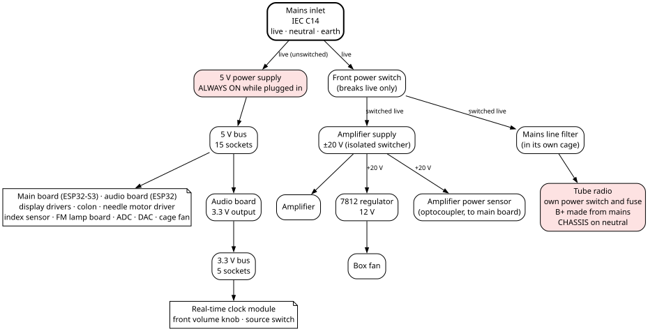
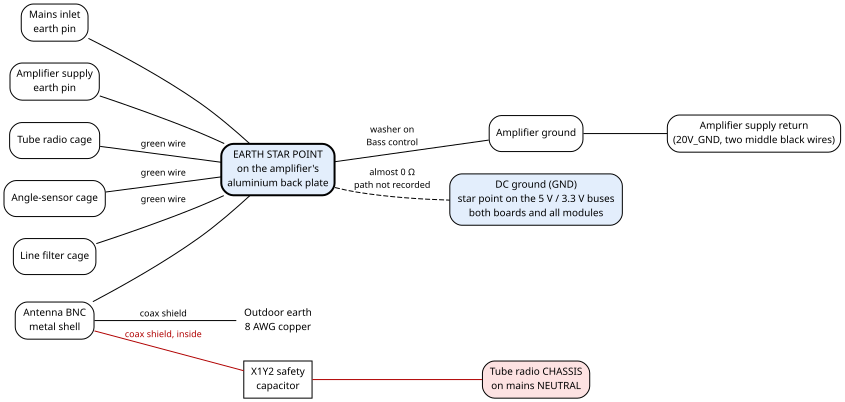

# 5. Power, earth and grounds

This chapter follows the power from the wall socket to every board. It also explains the four
different "grounds" in the machine. One of them, the tube radio's chassis, sits on mains neutral, so read
section 5.3 before you touch anything.

> **Danger — mains inside the box.** The front power switch does **not** remove mains from the
> cabinet. The 5 V power supply is always live while the cord is plugged in. The tube radio's metal
> chassis sits on mains **neutral**, and it is never joined to Earth. **Unplug the cord before you open
> the cabinet.** Chapter 2 lists every live point.

## 5.1 The power at a glance

Mains enters through one socket: a standard **IEC C14 inlet**, the same kind as a computer's. It is the
inlet that came on the amplifier's aluminium back plate, at the back of the cabinet. From there the
power splits in two:

- **Before the front power switch:** the **5 V power supply**. It runs whenever the cord is plugged in.
  It feeds the 5 V bus, which powers both microcontroller boards and everything digital.
- **After the front power switch:** the **amplifier's ±20 V power supply**, and the **tube radio**
  (through the mains line filter). Switching the front switch off silences the radio and the
  amplifier, but not the clock or the computers.

The table shows where each part takes its power from, and when it is on.

| What | Where its power comes from | On when |
|---|---|---|
| 5 V power supply | mains live, before the front switch | the cord is plugged in |
| Both microcontroller boards, display, needle motor, sensors, DAC, ADC, cage fan | the 5 V bus | the cord is plugged in |
| 3.3 V parts (real-time clock module, front volume knob, source switch) | the audio board's own 3.3 V output | the cord is plugged in |
| Amplifier's ±20 V supply | mains live, after the front switch | the front switch is on |
| Amplifier, box fan, amplifier power sensor | the ±20 V supply | the front switch is on |
| Tube radio | mains live after the front switch, through the line filter | the front switch is on **and** the radio's own power switch is on |

## 5.2 The mains side

The table follows the mains wiring point by point, from the inlet to the tube radio.

| Point | What it is |
|---|---|
| **Mains inlet** | IEC C14, three pins: live, neutral, earth. |
| **Front power switch** | A single-pole on/off toggle on the front panel. It breaks **only the live wire**, and only to the amplifier supply and the tube radio. The mains to it uses a connector type found nowhere else in the cabinet, so no other cable can be plugged into it by mistake. |
| **Live, always on** | Inlet live → 5 V power supply, and → the input side of the front switch. |
| **Live, switched** | Front switch output → amplifier supply, and → line filter → tube radio's live terminal. |
| **Neutral** | Inlet neutral → 5 V power supply, amplifier supply, and line filter → tube radio's neutral terminal. |
| **Mains line filter** | An external EMI filter between the switched mains and the tube radio. It took the place of two of the radio's original coils, which were removed by accident. It sits under its own small Faraday cage (section 5.4). |
| **Fuses** | No fuse is recorded on the machine's mains side; the tube radio has its own 0.75 A fuse (chapter 2, section 2.4). |

The ratings of the front power switch and of the line filter are not recorded. Neither is the 5 V power
supply's make, model or current rating.

**The tube radio has no isolation transformer.** Its circuit common — the metal chassis and every part
connected to it — is wired straight to mains neutral. It sits near 0 V only while the wall socket's live
and neutral are the right way round, and **nothing in the machine checks that.** The radio also makes
its high-voltage supply (B+) by rectifying the mains directly (chapter 13), and that supply is present
whenever the radio is on.

## 5.3 The four grounds

The machine has four ground names, kept different on purpose. They are not four separate grounds.
Three of them, Earth, the DC ground and the amplifier supply return, are all joined. The fourth, the
radio chassis, is joined to none of them. The table says what each one is
joined to.

| Name in this book | Also written | What it is | Joined to |
|---|---|---|---|
| **Earth** | `Earth` | The mains protective earth, from the inlet's earth pin. | The amplifier supply's earth pin, all three Faraday cages, the antenna connector's metal shell, and the amplifier's aluminium back plate, whose earth star point carries **the amplifier's ground** (below). The DC ground and the amplifier supply return are on it too. |
| **DC ground** | `GND` | The common return of everything on the 5 V and 3.3 V side: both microcontroller boards, the display, the motor, the sensors, the ADC and DAC. | All its wires meet at one star point: the ground pins of the 5 V and 3.3 V buses, and from there reach the amplifier's ground (below), so it is on Earth at almost 0 Ω. By which path it reaches the amplifier's ground is not recorded. |
| **Amplifier supply return** | `20V_GND` | The middle (0 V) output of the amplifier's ±20 V supply. | The amplifier's ground, through the supply's two middle black wires (section 5.6), and so Earth. Also the amplifier power sensor's LED cathode, the box-fan regulator's return and the box fan's −. |
| **Radio chassis** | `CHASSIS` | The tube radio's circuit common. **On mains neutral.** | Mains neutral only. It is not joined to Earth, to the Faraday cages, to the DC ground, or to the amplifier supply return. The antenna's shield reaches it only through one safety-rated capacitor (section 5.4). |

**How the three are joined.** Earth, `GND` and `20V_GND` are all joined. The amplifier's ground sits on
the earth star point of its aluminium back plate, through a washer on the Bass pot (the amplifier's bass
control). This joint is part of the amplifier's original design; it is not on any drawing. The amplifier
supply's ground wires, the two middle black ones (`20V_GND` on the drawings), go to that amplifier ground.
The DC side's `GND`, both boards and the rest, reaches that same amplifier ground and so Earth, at almost
0 Ω. By which path the `GND` buses reach the amplifier's ground is not recorded.
The amplifier supply itself is insulated from the plate by plastic screws and standoffs, and the
amplifier's volume and treble controls do not touch the plate. `CHASSIS` is joined to none of them.

**The amplifier power sensor.** The sensor is an optocoupler. Its LED is lit from the amplifier supply
(the `20V_GND` side) and its transistor is read by the main board (the `GND` side). Inside the sensor no
wire joins the two sides; the "amplifier is on" signal crosses by light. The two returns are still joined
outside it, as described above. The sensor itself is in chapter 9.

## 5.4 Earth, cages and the antenna

The three **Faraday cages** shield the noisiest or most sensitive parts:

| Cage | What it covers | How it is built |
|---|---|---|
| Tube radio cage | the whole tube radio, well clear of it | A PLA box lined with aluminium tape, covered with Kapton tape. A cage fan on the 5 V bus blows air into it. |
| Sensor cage | the magnetic angle sensor on the tuning shaft (AS5600) | Built the same way. The sensor is mounted on the cage's base, clear of the aluminium and copper tape. |
| Line filter cage | the mains line filter | Kapton tape over the circuit, then aluminium tape, then Kapton again. |

Each cage is earthed the same way: a stranded **green** wire, held against the aluminium by copper tape
with conductive adhesive.

**The antenna.** The FM antenna's coax arrives at the antenna connector, a BNC on the back panel. The
connector's shell, and so the coax shield, is on **Earth**. Outside, an 8 AWG stranded copper run goes
from the antenna's grounding block to a lug on the meter base (chapter 11). Inside, the shield reaches
the radio's **chassis** only through one capacitor: a safety-rated X1Y2 type inside the tube radio.

## 5.5 The 5 V and 3.3 V buses

All the low-voltage power is shared out from two **star-point buses**: rows of small 2-pin JST XH
sockets, held in their own small PLA cases. Devices plug their power cables into these sockets. Each
socket carries power on one pin and DC ground on the other. Every ground pin is the same wire: this is
the "single star point" of the DC ground.

| Bus | Positions | Fed from | What runs on it |
|---|---|---|---|
| **5 V bus** | 15 sockets | the 5 V power supply | main board (ESP32-S3), audio board (ESP32), clock display colon, display driver board, needle motor driver, needle index sensor, FM panel-lamp board, ADC board, DAC board, cage fan |
| **3.3 V bus** | 5 sockets, plus the two jacks named for the audio board (`A32_VDC`, `A32_3V3`) on the same wire; where those two sit is not recorded | the **audio board's own 3.3 V output** | the same 3.3 V wire also feeds the real-time clock module, the front volume knob and the source switch; which of them plug into bus sockets is not recorded |

The 3.3 V bus is fed from the audio board's 3.3 V pin, which is decoupled there by one 0.1 µF and two
10 µF capacitors. The main board's own 3.3 V output does not go to the bus. It feeds only the two parts
on its own cables: the FM calibration receiver (RDA5807M) and the angle sensor (AS5600).

**Two jacks named `A32_VDC`.** The cable sheet gives the name `A32_VDC` to two different jacks, and draws
them with opposite pin orders:

| Jack named `A32_VDC` | Pin 1 | Pin 2 | Its cable goes to |
|---|---|---|---|
| the real-time clock's supply | `A_VDC` (3.3 V) | `GND` | the clock module's `RTC_3V3` |
| the audio board's 3.3 V cable | `GND` | `A_3V3` (3.3 V) | the audio board's `A32_3V3` |

The pin numbers are the cable sheet's and settle nothing physical. Which 3.3 V jacks are bus positions and
which are on the audio board is not recorded.

> **Caution — the two `A32_VDC` jacks.** As drawn, the two jacks named `A32_VDC` carry 3.3 V and ground on
> opposite pins. The name alone does not tell which of the two jacks a cable belongs to.

> **Caution — the colon's power cable.** The **5 V cable to the clock display's colon** has its
> polarity reversed at the `COLON_IN` side, compared with the other 5 V cables.

A JST XH socket is rated 3 A, for wire from 30 to 22 AWG.

## 5.6 The amplifier supply and the box fan

**The amplifier supply** is the one that came with the amplifier: an isolated mains switching supply,
measured at **±19.33 V with no load**. It reaches the amplifier on four wires:

| Wire colour | Carries |
|---|---|
| red | +20 V |
| black (the two middle wires) | 0 V, the amplifier supply return |
| yellow | −20 V |

These colours are the author's reading, not verified inside the supply. The two middle black wires go
to the amplifier's ground (section 5.3). The same supply also feeds the box fan and the amplifier power
sensor, from its +20 V output.

**The box fan** sits at the top of the back panel and blows air **out** of the cabinet. Fresh air comes
in through two small louvred PLA vents at the other two ends of the back panel's inverted T. The fan
runs on 12 V, made from the +20 V output by an LM7812 regulator. It therefore turns only while the
front switch is on. The regulator's parts:

| Part | Value |
|---|---|
| Regulator | LM7812, input from +20 V, output 12 V |
| Input capacitors | 0.1 µF and 100 µF, to the supply return |
| Output capacitors | 0.1 µF and 100 µF, to the supply return |
| Protection diode | one diode across the 12 V output; its type and which way round it is fitted are not recorded |

The fan harness has two 2-pin plugs: **FAN_IN** brings +20 V and its return, and **FAN_OUT** takes
12 V and its return to the fan. Which board they sit on is not recorded.

**The cage fan** is a small 5 V fan screwed to the tube radio's Faraday cage, blowing air into it. It
plugs into the 5 V bus, so it runs whenever the cord is plugged in.

The size and make of the two fans are not recorded.

## 5.7 When something is wrong

Find what you see in the left column; the right column says what to check.

| You see | Check |
|---|---|
| Nothing at all works: no clock, no sound | The cord and the wall socket. The 5 V supply has no switch; if it is dead, everything digital is dead. |
| Clock and needle work, but no sound from radio or amplifier | The front power switch. Then the amplifier supply: +20 V on the red wire, −20 V on the yellow. |
| Radio silent but Bluetooth plays | The tube radio's own power switch, and its fuse (chapter 13). |
| One board or module dead, the others fine | Its own power cable to the bus, and the polarity at both ends. |
| Box fan stopped while the radio plays | The FAN_IN and FAN_OUT plugs, then 12 V at the regulator's output. |
