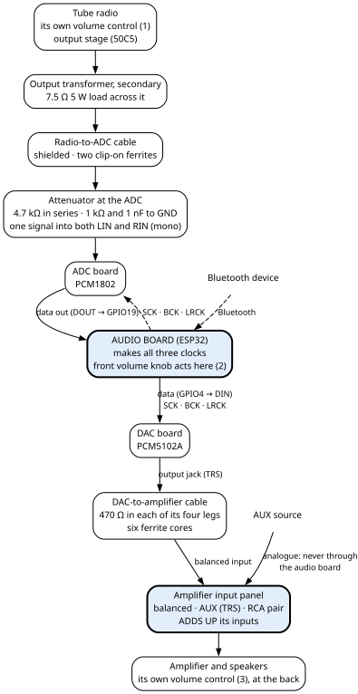
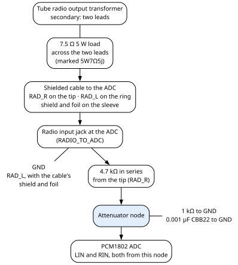

# 6. The audio chain

This chapter follows the sound from each source to the amplifier. The tube radio's audio is turned into
digital audio by an ADC (analogue-to-digital converter) and passed through the audio board. A DAC
(digital-to-analogue converter) then turns it back into an analogue signal. Bluetooth joins at the audio
board. AUX, the analogue input you plug a cable into, goes straight to the amplifier. When the sound is
missing, distorted or noisy, this chapter tells you which piece to look at.

What the audio board's firmware does with the sound (sample rate, volume, muting, source changes) is
in the Firmware Gospel, chapter 10.

## 6.1 The path at a glance

The machine has three sources, and each takes its own road:

| Source | What carries it | Converted by |
|---|---|---|
| **RADIO** | the tube radio's output transformer → the radio-to-ADC cable → the audio board | the ADC, then the DAC |
| **BT** | Bluetooth → the audio board | the DAC |
| **AUX** | an analogue run to the amplifier's input panel | nothing: it never reaches the audio board |

Every source ends at the **amplifier's input panel**, which adds up whatever reaches it (section 6.7).
The amplifier and its speakers are in chapter 12.

## 6.2 The digital audio bus (I2S)

**I2S** is a simple way to send digital audio between chips over a few wires: a **bit clock** (BCK)
that ticks once per data bit, a **word clock** (LRCK) that marks left and right samples, one **data**
line per direction, and a **master clock** (SCK) that the converters run their insides from.

**The audio board makes all three clocks.** The ADC runs in slave mode: it takes its clocks from
outside. The DAC is given its master clock. So neither converter makes its own timing. Both converters
share the same bit clock and word clock, so they always run at the same rate.

The table gives each clock and data line, from the audio board's pin to each converter's pin:

| Signal | Audio board pin | ADC (PCM1802) pin | DAC (PCM5102A) pin | Notes |
|---|---|---|---|---|
| Master clock | GPIO0 | SCKI, as `A_IO0A` | SCK, as `A_IO0D` | One pin, two branches, each through its own 33 Ω at the audio board's pin |
| Bit clock | GPIO18 (`A_IO18`) | BCK | BCK | shared |
| Word clock | GPIO17 (`A_IO17`) | LRCK | LRCK | shared |
| Data from the ADC | GPIO19 (`A_IO19`) | DOUT | — | |
| Data to the DAC | GPIO4 (`A_IO4`) | — | DIN | 100 kΩ pull-down to ground |

`A_IO0A` and `A_IO0D` are the same GPIO0. They carry two names only so that each converter's wiring
reads clearly (chapter 4, section 4.3). GPIO0 is also one of the chip's strapping pins, read at
power-up (Appendix A).

All of these signals travel in one shielded harness from the audio board. The harness splits into an
ADC branch and a DAC branch. The shield is on ground at the audio board end only. Chapter 10, section
10.15, gives it wire by wire.

## 6.3 The ADC (PCM1802)

The **ADC** (analogue-to-digital converter) is a PCM1802 on a small module board. It turns the tube
radio's audio into digital samples for the audio board.

**Power.** The module's 5V pin is on the 5 V bus, through its own cable (chapter 10, section 10.25),
with 100 µF and 0.1 µF to ground. The module has its own 3.3 V pin, named `P_3V3` on the drawing. Only
one thing is wired to that pin: the FMT0 setting pin (below).

> **Caution — two unconnected nodes share the name `P_3V3`.** The module's own 3.3 V pin is named
> `P_3V3`, and only FMT0 is wired to it. The drawing also uses the same name, `P_3V3`, for a separate
> label that carries two other setting pins (PDWN and FSYNC, below); that label appears on no other
> drawing and is not joined to the module's pin. The name alone does not tell you which node you are
> looking at.

**Setting pins.** The PCM1802 is configured by tying pins high or low. The table gives each pin, what
it is tied to, and what that means by the datasheet (Appendix A).

| Pin | Tied to | Meaning |
|---|---|---|
| MODE0, MODE1 | ground | **Slave mode:** the clocks come from the audio board |
| FMT1 | ground | with FMT0 high: **I2S, 24-bit** |
| FMT0 | the module's own 3.3 V pin (`P_3V3`), and nothing else | high (see FMT1) |
| OSR | ground | oversampling ×64 |
| BYPAS | ground | high-pass filter **on**: DC is cut from the input |
| PDWN (power-down, active low) and FSYNC (frame sync) | joined together, as drawn, on the separate `P_3V3` label. That label goes nowhere else, and it is not joined to the module's own 3.3 V pin. | see below |

By the chip's datasheet, PDWN, BYPAS, OSR, FMT0, FMT1, MODE0 and MODE1 have internal pull-downs (about
50 kΩ). In slave mode the PCM1802 sends data only while FSYNC is high, and it runs only while PDWN is
high. These are facts about the chip. On the fitted module the converter runs, so PDWN is not held low.
How the module itself ties PDWN and FSYNC is not recorded.

**Data and clocks** reach the module on a 6-pin header: data out, bit clock, word clock and master
clock; two of its pins are unused. Its pin order is in chapter 10, section 10.15.

## 6.4 The tube radio into the ADC

**The load.** The tube radio's output transformer has a two-lead secondary. In the original set it fed
the radio's speakers; here it feeds the ADC. A **7.5 Ω 5 W resistor** sits across the two leads as the
transformer's load (it is marked 5W7Ω5J). The transformer's primary belongs to the radio's output stage, a
50C5 tube (chapter 13).

**The cable.** The two secondary leads, `RAD_L` and `RAD_R`, run in a shielded cable to the **radio
input jack at the ADC** (J51, `RADIO_TO_ADC`), on a three-pole (TRS: tip, ring, sleeve) plug:

| Plug contact | Carries |
|---|---|
| tip | `RAD_R`, one transformer lead |
| ring | `RAD_L`, the other transformer lead |
| sleeve | the cable's shield and foil |

**Tip and ring are interchangeable:** which transformer lead goes to which does not matter. Two clip-on
ferrite cores sit on this cable, one near the transformer and one near the ADC. How the wires end at the
transformer is not recorded. Chapter 10, section 10.22, has the cable and the cores.

**The jack's output side.** Toward the ADC, the jack's sleeve and ring are on ground and its tip goes
into a **4.7 kΩ** resistor. So `RAD_L` goes to ground, with the cable's shield and foil, and `RAD_R`
goes through the 4.7 kΩ.

**The attenuator.** The 4.7 kΩ leads to the attenuator node. From that node a **1 kΩ** resistor and a
**0.001 µF CBB22 capacitor** (C59) go to ground. The node feeds **both** the ADC's left input (LIN) and its right input (RIN).

**The radio feed is mono.** One signal reaches both ADC inputs.

## 6.5 The DAC (PCM5102A)

The **DAC** (digital-to-analogue converter) is a PCM5102A on a small module board. It turns the audio
board's digital audio, from the radio or from Bluetooth, back into an analogue signal.

**Power.** The module's VIN is on the 5 V bus. Its 5 V lead joins the audio harness's DAC branch
(chapter 10, section 10.15). At VIN there are three capacitors to ground, all fitted: **100 µF**,
**10 µF ceramic** and **0.1 µF**.

**Data input.** The DAC's DIN is the audio board's GPIO4, with a **100 kΩ pull-down** to ground. Where
that resistor sits along the line is not recorded (chapter 4, section 4.5).

**Setting pins.** Like the ADC, the DAC is configured by tying pins high or low:

| Pin | Tied to | Meaning |
|---|---|---|
| FLT | ground | normal-latency filter |
| DEMP | ground | de-emphasis off |
| FMT | ground | I2S format |
| XSMT (soft mute) | pulled up to 3.3 V on the module itself | un-muted. Nothing outside the module reaches it. |

The module's own 3.3 V pin (A3V3) is not connected to anything. The audio board's GPIO16 is unused: no
wire runs from it to the DAC.

The firmware's pin file still defines `A32_PCM5102_XSMT` as 16, and the audio board's code sets GPIO16 as
an output and drives it high. Since GPIO16 is not wired and XSMT is pulled up on the module, that code
drives nothing. The hardware stated here is right; the firmware text is stale.

**The DAC mutes itself on silence.** By its datasheet, after 1024 word-clock periods of zero data on both
channels (21 ms at 48 kHz) the PCM5102A puts its output in full analogue mute (Appendix A).

**Output.** The module has a three-pole (TRS: tip, ring, sleeve) output jack:

| Jack contact | Carries |
|---|---|
| tip | left output (OUTL) |
| ring | right output (OUTR) |
| sleeve | the DAC's analogue ground (AGND) |

## 6.6 From the DAC to the amplifier

A plug in the DAC's output jack feeds a short cable to the **balanced input** on the amplifier's input
panel. A balanced input takes each channel on two wires, a plus and a minus, plus a ground. The cable
puts a **470 Ω resistor in each of its four signal legs**. The two on the plus legs are at the DAC end.
Each amplifier input is fed like this:

| Amplifier input | Comes from |
|---|---|
| `AMP_L+` | the plug's tip (left output), through 470 Ω |
| `AMP_R+` | the plug's ring (right output), through 470 Ω |
| `AMP_G` | the plug's sleeve (DAC analogue ground), directly |
| `AMP_L-` | the plug's sleeve, through its own 470 Ω |
| `AMP_R-` | the plug's sleeve, through its own 470 Ω |

So each minus leg is the DAC's ground seen through 470 Ω. The cable is under 12 inches long and carries
**six ferrite cores**, three at each end. Each end has one HDMI-type sleeve, one small toroid and one
large toroid, and the cable passes once through each. Chapter 10, section 10.21, gives the cable and the cores;
chapter 12 gives what was measured at the amplifier's input.

**What was observed.** A frying noise was heard at the amplifier. It went away when this cable was
unplugged at the amplifier, and almost went away when it was unplugged at the DAC.

Separately, once the clip-on ferrites were on the radio-to-ADC cable, no pops were audible. That was
before the 470 Ω resistors on the plus legs and this cable's HDMI-type ferrite sleeves were added.

Whether the frying noise is gone now is not recorded, and neither is the reason for adding the 470 Ω
resistors and the ferrite cores to this cable.

## 6.7 The AUX path and the amplifier's input panel

**AUX is analogue and bypasses the audio board entirely.** It never goes through the ADC or the DAC.
The AUX jack reaches the amplifier's input panel, which sums it with the other inputs; the run is not
drawn. Where the AUX jack sits is not recorded. On AUX the audio board sends silence to the DAC. Nothing
the audio board does can change the AUX loudness or mute it.

**The front source switch only tells the audio board which source you chose** (chapter 9, section 9.3).
It does not switch any audio.

**The input panel adds up its inputs; it does not choose between them.** It has three inputs:

| Input | What reaches it | With nothing plugged in |
|---|---|---|
| **Balanced** (L+, L−, ground, R−, R+) | the DAC, by the cable of section 6.6: RADIO and BT | not grounded |
| **AUX** (TRS jack) | see below | grounded |
| **RCA pair** | nothing recorded | grounded |

Because the run from the AUX jack is not drawn, this book does not say which of the panel's inputs it
lands on. Nothing is recorded on the RCA pair.

If two inputs carry sound at the same time, you hear both. On RADIO or BT, anything playing into AUX is
still heard.

## 6.8 The three volume controls

Three volume controls sit in the chain, one at each stage. Their numbers match the figure in
section 6.1:

| No. | Control | Where | Acts on |
|---|---|---|---|
| 1 | The tube radio's own volume control | on the tube radio | RADIO only, before the ADC. In normal use it sits at about **one eighth** of its travel; above that, the sound is too loud further down the chain. |
| 2 | The front **volume knob** | front panel; read by the audio board (chapter 9, section 9.4) | RADIO and BT, inside the audio board. **Not AUX.** |
| 3 | The amplifier's own volume control | on the amplifier's board, reached only from the back | everything. It **does not reach silence** at its minimum. |

The front knob is not the amplifier's volume control: it is read digitally by the audio board and does
nothing to the analogue audio. The amplifier's own control is a B10k dual-gang potentiometer
(chapter 12).

## 6.9 When something is wrong

| You see | Check |
|---|---|
| No radio sound, but Bluetooth plays | The radio side only. The tube radio itself: its power switch and its own volume control (chapter 13). The radio-to-ADC cable and its plug in the radio input jack. The ADC branch of the audio harness and the ADC's 5 V cable (chapter 10, sections 10.15 and 10.25). By the chip's datasheet, PDWN and FSYNC must both be high for the ADC to send data (section 6.3). |
| No sound from RADIO or BT, but AUX plays | The DAC side. The DAC branch of the audio harness and its 5 V lead (chapter 10, section 10.15), the DAC-to-amplifier cable, and the front volume knob. |
| No sound from any source | The amplifier: the front power switch and the amplifier supply (chapter 5), and the amplifier's own volume control. |
| Two sources heard at once | Normal: the input panel adds its inputs. Unplug whatever is playing into AUX. |
| Radio sound too loud further down the chain | The tube radio's own volume control: keep it near one eighth of its travel. |
| A frying noise at the amplifier | The DAC-to-amplifier cable: its four 470 Ω resistors and its ferrites. Unplugging it at the amplifier tells you whether it is the path. |
| The amplifier is never fully silent | Normal: its volume control does not reach silence at its minimum. |
