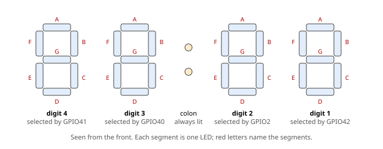
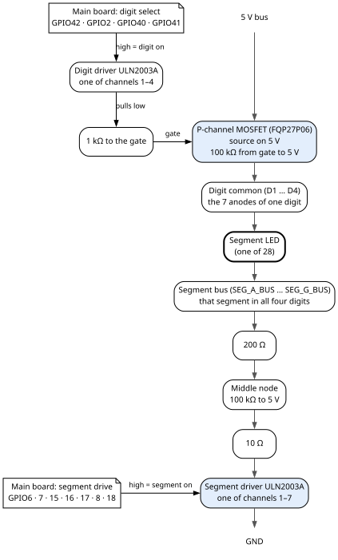

# 7. The clock display

The clock display shows the time on the front panel: four seven-segment digits and a colon, made for
this front panel from single LEDs. The display is called the Leditron. The main board drives it through
a small driver board. This chapter
gives the digit numbering, which LED is which segment, how each digit and segment is switched, and the
colon's own simple circuit.

What the main board shows on the display, and how fast it switches the digits, is in the Firmware
Gospel, chapter 4.

## 7.1 The display at a glance

**Digit numbering.** Digit 1 is the **rightmost** digit, the units of minutes. Digits 2, 3 and 4 run to
its left. The main board selects them with GPIO42, GPIO2, GPIO40 and GPIO41, in that order. So the
select pins are not in number order. This order is exact: it is the order the firmware drives, and the
order the drawings show (section 7.4).

**What it is made of.** Each segment is one LED: 28 segment LEDs in all, seven per digit. In each digit
the seven LEDs share one **common anode** (their plus side) and each has its own cathode. The colon is
one more LED with its own supply (section 7.6).

The display is built from four parts:

| Part | What it does |
|---|---|
| **Four digits** | Seven segment LEDs each, on an 8-pin header: pins 1 to 7 are the cathodes of segments A to G, pin 8 is the common anode. |
| **Display bus board** | It takes the seven segment lines and the four digit commons from the driver board, and shares them out on four 8-pin digit outputs. It also carries the colon's supply. It sits in its own printed case. |
| **Display driver board** | A perfboard that switches the digits and the segments: one ULN2003A for the four digit selects, four P-channel MOSFETs, and one ULN2003A for the seven segments. |
| **Colon** | One LED with a 33 Ω resistor and a variable resistor, fed straight from the 5 V bus. |

A **ULN2003A** is a chip of seven switches to ground (Darlington transistor pairs). When an input is
driven high, its output pulls down toward ground. It accepts the main board's 3.3 V logic directly.

## 7.2 How it is driven

The four digits share the **seven segment lines**: segment A of every digit is on one wire, segment B on
another, and so on. Each digit has its **own common**, switched to 5 V by its own MOSFET. A segment LED
lights only when its digit's common is on 5 V **and** its segment line is pulled low.

So, to show four different numbers, the main board lights one digit at a time and changes the segment
lines between digits, fast enough that all four look lit. In short:

| To light | The main board drives high |
|---|---|
| a digit | that digit's select pin (section 7.4) |
| a segment of that digit | that segment's drive pin (section 7.5) |

## 7.3 The segment map

This table gives, for each segment: the main board pin that drives it, its pin on every digit's 8-pin
header, and which LED is that segment in each digit.

| Segment | Drive pin | Header pin on each digit | LED in digit 1 | LED in digit 2 | LED in digit 3 | LED in digit 4 |
|---|---|---|---|---|---|---|
| A | GPIO6 | 1 | D1 | D24 | D17 | D10 |
| B | GPIO7 | 2 | D3 | D27 | D20 | D13 |
| C | GPIO15 | 3 | D5 | D28 | D21 | D14 |
| D | GPIO16 | 4 | D6 | D26 | D19 | D12 |
| E | GPIO17 | 5 | D4 | D23 | D16 | D9 |
| F | GPIO8 | 6 | D2 | D22 | D15 | D8 |
| G | GPIO18 | 7 | D7 | D25 | D18 | D11 |
| common anode | — | 8 | all seven | all seven | all seven | all seven |

The LED references (D1 to D28) are only there to find a LED on a drawing. Do not confuse them with the
four digit commons, whose signal names are `D1` to `D4` (section 7.4).

Each digit's header plugs into its own 8-pin socket, pin for pin: pin 1 of all four sockets is the
segment A line, pin 2 the segment B line, and so on to pin 7; pin 8 of each socket is that digit's own
common. The display bus board's four 8-pin digit outputs carry the same signals on the same pin numbers.
Whether those outputs are the sockets the digits plug into is not recorded (chapter 10, section 10.34).

## 7.4 The digit drivers

Each digit's common anode is switched to 5 V by a **P-channel MOSFET** (FQP27P06). One ULN2003A, the
digit driver, sits between the main board's select pins and the four MOSFET gates. Each digit has its
own channel. The table is the chain as drawn:

| Digit | Select pin | Digit driver input | Drives | Digit common |
|---|---|---|---|---|
| 1 (rightmost) | GPIO42 | 1 | the first MOSFET | `D1` |
| 2 | GPIO2 | 2 | the second MOSFET | `D2` |
| 3 | GPIO40 | 3 | the third MOSFET | `D3` |
| 4 (leftmost) | GPIO41 | 4 | the fourth MOSFET | `D4` |

**One channel, step by step:**

1. The select pin drives the digit driver's input.
2. The driver's output (`PFET1` to `PFET4`) goes through a **1 kΩ** resistor to the MOSFET's gate.
3. A **100 kΩ** resistor pulls the gate up to 5 V, the MOSFET's source. With the select pin low, this
   holds the MOSFET off.
4. With the select pin high, the driver pulls the gate low, the MOSFET turns on, and its drain puts 5 V on
   the digit's common.

**Per digit**, a **0.1 µF** and a **10 µF** capacitor go from the 5 V at the MOSFET's source to ground.

The digit driver's ground pin is on the DC ground. Its COM pin (the common of its built-in protection
diodes) is not connected, and its channels 5 to 7 are unused.

The digit order itself is certain (section 7.1). The drawing does not settle where along the physical
chain, from select pin to digit, the wiring sets that order, and it is not recorded. The author believes
it is at the digit driver board.

## 7.5 The segment drivers

The second ULN2003A (the segment driver) pulls each segment line low. Each segment has its own channel:

| Segment | Drive pin | Segment driver input | Segment line |
|---|---|---|---|
| A | GPIO6 | 1 | `SEG_A_BUS` |
| B | GPIO7 | 2 | `SEG_B_BUS` |
| C | GPIO15 | 3 | `SEG_C_BUS` |
| D | GPIO16 | 4 | `SEG_D_BUS` |
| E | GPIO17 | 5 | `SEG_E_BUS` |
| F | GPIO8 | 6 | `SEG_F_BUS` |
| G | GPIO18 | 7 | `SEG_G_BUS` |

**Each channel** runs: driver output → **10 Ω** → a middle node → **200 Ω** → the segment line. The
middle node has its own **100 kΩ** to 5 V, which holds the line high (segment off) while the driver is
off. The seven channels are fully separate: seven lines, one 100 kΩ each.

The segment driver's ground pin is on the DC ground. Its COM pin is not connected.

## 7.6 The colon

The colon is not switched by either board. It is lit whenever the 5 V bus is on.

Its circuit, in order: **5 V → 33 Ω → the colon LED → a variable resistor → ground.** The variable
resistor sits at the colon module. It is glued at **1.5 kΩ**.

The colon has its own 2-pin power cable from the 5 V bus, `COLON_IN`. It is the one 5 V cable whose
polarity is reversed at the `COLON_IN` side (chapter 5, section 5.5).

## 7.7 Boards and cables

The display hangs on seven cables. Chapter 10 draws each one wire by wire.

| Cable | From → to | Carries | Cable page |
|---|---|---|---|
| `S3_DISPLAY` → `DISPLAY_IN` | main board → driver board | the seven segment drive pins | section 10.5 |
| `S3_DIGIT` → `DIGIT_IN` | main board → driver board | the four digit select pins | section 10.8 |
| 5 V bus → `DRIVERS_5VIN` | 5 V bus → driver board | the driver board's 5 V and ground | section 10.26 |
| `DIGIT_OUT` → `DRIVER_IN` | driver board → display bus board | the four digit commons `D1` to `D4`; one shielded cable over two plugs | section 10.27 |
| `DISPLAY_OUT` → `LEDITRON_IN` | driver board → display bus board | the seven segment lines | section 10.28 |
| 5 V bus → `COLON_IN` | 5 V bus → display bus board | the colon's 5 V and ground, **reversed at `COLON_IN`** | section 10.23 |
| colon output | display bus board → colon | the two colon LED leads | section 10.34 |

## 7.8 When something is wrong

| You see | Check |
|---|---|
| One segment dark in all four digits | That segment's channel: its drive pin, its segment driver channel, the 10 Ω and 200 Ω, its 100 kΩ, and its wire in the segment-line cable (`DISPLAY_OUT` → `LEDITRON_IN`). |
| One segment dark in one digit only | That segment's LED (section 7.3), and its pin on that digit's 8-pin header. |
| One whole digit dark | That digit's select chain: its select pin, its digit driver channel, the 1 kΩ, the MOSFET, its wire in the digit-rail cable, and pin 8 of the digit's header. |
| All digits dark, colon lit | The driver board's 5 V cable (`DRIVERS_5VIN`), then the main board itself (chapter 4). The digits also go dark while the main board takes a firmware update (Firmware Gospel). |
| All digits and the colon dark | The 5 V bus and the 5 V supply (chapter 5). |
| Colon dark, digits fine | The colon's cable, and its polarity at `COLON_IN`; the 33 Ω, the variable resistor and the colon LED. |
| Digits in the wrong places after a rebuild | The digit order is GPIO42, GPIO2, GPIO40, GPIO41 for digits 1 to 4, rightmost first. Check each select pin's chain against section 7.4. |
