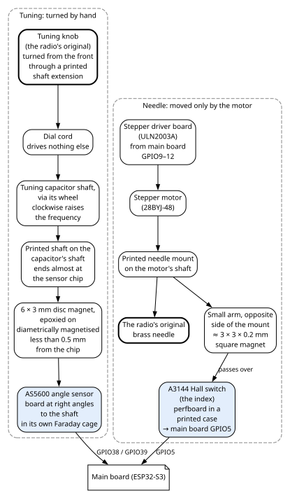

# 8. Dial, needle and tuning sensors

The tuning knob and the dial needle are not joined. A printed front knob, on a printed shaft extension,
turns the tube radio's original tuning knob, which drives the dial cord and the tuning capacitor as it
always did. A magnetic angle sensor reads that capacitor's shaft, and a small stepper motor moves the
needle to match. A magnetic index switch gives the needle its one fixed reference point. A small FM
receiver chip serves as the instrument that calibrates the dial. This chapter describes that hardware:
the parts, how they are mounted, and how they are wired.

What the main board does with them (homing, following the knob, the calibration) is in the Firmware
Gospel: chapter 5 for the needle, chapter 6 for tuning and calibration.

## 8.1 The mechanics

**Tuning.** A printed front knob, on a printed shaft extension, turns the tube radio's original tuning
knob. The original knob drives the dial cord, and the dial cord turns the tuning capacitor's shaft through its
wheel. The cord drives nothing else. **Turning the knob clockwise raises the frequency.** The printed
shaft extension is for tuning only.

**The angle sensor's magnet.** Another printed shaft, the angle sensor's own, extends the tuning
capacitor's shaft almost to the angle sensor's chip. A disc magnet is epoxied to its end. The sensor's
board stands at right angles to the shaft, with the shaft's axis through the centre of the chip
(section 8.4).

**The needle.** The tube radio's original brass needle sits on a printed mount on the stepper motor's
shaft. The motor alone moves it; it has never been on the dial cord.

**The index.** A small arm on the opposite side of the same mount carries a tiny magnet. As the needle
moves, the magnet passes over the index Hall switch (section 8.3).

The angle sensor sits under its own earthed Faraday cage (chapter 5, section 5.4).

## 8.2 The stepper motor and its driver

The needle motor is a **28BYJ-48** stepper motor. It is driven by a ULN2003A on a driver board; the
motor's own lead plugs into the 5-pin socket that comes on the common ULN2003A boards. A ULN2003A is a
chip of seven switches to ground (chapter 7, section 7.1). The four coil lines run like this:

| Main board pin | Driver input | Driver output | Motor socket pin | Coil, as named on the drawing |
|---|---|---|---|---|
| GPIO9 | IN1 | OUT1 | 1 | coil 4 |
| GPIO10 | IN2 | OUT2 | 2 | coil 3 |
| GPIO11 | IN3 | OUT3 | 3 | coil 2 |
| GPIO12 | IN4 | OUT4 | 4 | coil 1 |
| — | COM | — | 5 | motor common, on 5 V |

**Power.** The driver board takes 5 V and ground from the 5 V bus on its own 2-pin cable
(`STEPPER_5VIN`). The ULN2003A's COM pin, the common of its built-in protection diodes, and the motor's
common (socket pin 5) are both on 5 V. A **0.1 µF** and a **47 µF** capacitor go from that 5 V to
ground. The ULN2003A's ground pin is on the DC ground. Its channels 5 to 7 are unused.

The step sequence, speeds and microstepping are the firmware's (Firmware Gospel, chapter 5).

## 8.3 The index sensor (A3144) and its magnet

The **index** is the needle's only position reference. It is an **A3144 Hall-effect switch**: a sensor
whose output switches on when a magnet comes close enough.

| What | Detail |
|---|---|
| **Where** | On a small perfboard in its own printed case, under the path of the needle mount's small arm. |
| **Magnet** | A square neodymium magnet, about 3 × 3 mm and 0.2 mm thick, on the arm. Which pole faces the A3144 is not recorded. |
| **Supply** | 5 V from the 5 V bus, with a **0.1 µF** capacitor across the sensor's supply. |
| **Output** | Main board **GPIO5**. A **10 kΩ** pull-up to the main board's 3.3 V and a **0.1 µF** capacitor to ground sit at the main board's pin. |

**How it switches.** The A3144's output is open-collector: it can only pull the line low. By its
datasheet, it pulls low when the magnetic field rises above its operate point, and lets go when the field
falls below its release point. The pull-up sets the high level at 3.3 V, the main board's own level,
even though the sensor runs on 5 V.

**Pins** (datasheet, viewed from the branded side): 1 supply, 2 ground, 3 output. On the sensor's cable
(`LIMIT`): wire 1 is 5 V to the supply pin, wire 2 is ground, wire 3 is the output to GPIO5.

**Replacing it.** The A3144 is discontinued; its maker names the **A1104** as the replacement
(Appendix A).

The main board's GPIO4, an old limit-switch input, is on the same main board socket but goes nowhere
(chapter 4, section 4.2).

## 8.4 The angle sensor (AS5600)

The **AS5600** is a magnetic angle sensor: a chip that reads the direction of a magnet spinning above
it. It reads the tuning capacitor's shaft, through the magnet on the printed shaft that extends that shaft
(section 8.1).

| What | Detail |
|---|---|
| **Magnet** | A 6 × 3 mm disc neodymium magnet, epoxied to the end of the printed shaft that extends the capacitor's shaft. **It must be diametrically magnetised** (its north and south poles on opposite sides of the disc, not on its faces). Less than **0.5 mm** from the chip. |
| **Mounting** | Its board at right angles to the tuning capacitor's shaft, with the shaft's axis through the centre of the chip; the printed shaft reaches almost to the chip. Inside its own Faraday cage, on the cage's base, clear of the aluminium and copper tape. |
| **Supply** | The main board's own 3.3 V (`S3_3V3`) and ground. Not the 3.3 V bus. By the datasheet, the chip's VDD5V and VDD3V3 pins must be tied together for 3.3 V operation (Appendix A); whether the fitted module does so is not recorded. |
| **Direction pin (DIR)** | On ground. By the datasheet, the reading then increases clockwise. |
| **Analogue output (OUT)** | Not connected. |
| **Bus** | I2C, a two-wire bus: data (SDA) and clock (SCL). |

Each bus line has a series resistor and a pull-up:

| Sensor pin | Main board pin | Parts |
|---|---|---|
| SDA | GPIO38 | **220 Ω** in series; **10 kΩ** pull-up to the main board's 3.3 V at the main board's pin |
| SCL | GPIO39 | the same: 220 Ω in series, 10 kΩ pull-up at the pin |

The AS5600 answers at I2C address 0x36 (Appendix A). Its cable (`S3_TUNER`) carries ground with the
shield, 3.3 V, SDA and SCL; the shield is on ground at the main board end. The connector at the sensor end
is not recorded.

## 8.5 The FM calibration receiver (RDA5807M)

The **RDA5807M** is a single-chip FM receiver on a small module board. Here it plays no audio: it is the
main board's instrument for calibrating the dial. Its antenna wire listens to the tube radio's own FM
oscillator. That oscillator runs one IF (the radio's intermediate frequency, 10.6 MHz) below the
station.

| What | Detail |
|---|---|
| **Bus** | Data (SDIO) on main board **GPIO47**, clock (SCLK) on **GPIO48**. **No pull-up resistors**: that is as built. GPIO48 also drives the main board's own RGB LED (chapter 4, section 4.2). |
| **Address** | The fitted chip answers at I2C address **0x11**. Its datasheet documents only 0x10. |
| **Supply** | The main board's own 3.3 V (`S3_3V3`) and ground. Across the supply, at the module: **100 µF** electrolytic, **10 µF** ceramic and **0.1 µF** ceramic. |
| **Unused pins** | The clock input (RCLK), both audio outputs (LOUT, ROUT), and IO1 and IO2 are not connected. |
| **Antenna** | A **30 cm** length of wire inside the tube radio's Faraday cage, bent in a U over the radio's FM oscillator section. |
| **Antenna plug** | The module reaches the wire through a 2 × 3 pin grid, so the module can be unplugged from its antenna there during a repair. |

On the receiver's signal cable the shield ends at the **receiver** end, on ground, and is left open at
the main board: the reverse of most cables (chapter 10, section 10.3).

## 8.6 Cables

The dial hardware hangs on seven cables. Chapter 10 draws each one wire by wire.

| Cable | Carries | Cable page |
|---|---|---|
| `S3_STEPPER` → `STEPPER_IN` | GPIO9 to GPIO12 to the driver's IN1 to IN4. The pin order reverses end to end; follow the signal names. | section 10.6 |
| 5 V bus → `STEPPER_5VIN` | the motor driver's 5 V and ground | section 10.24 |
| motor lead → motor socket | the motor's four coils and its common | section 10.32 |
| `S3_LIMITS` + 5 V bus → `LIMIT` | the index sensor's output, ground and 5 V; one harness that joins a bus jack | section 10.9 |
| `S3_TUNER` | the angle sensor's ground, 3.3 V, SDA and SCL | section 10.10 |
| `S3_3V3` → `RDA_3V3` | the calibration receiver's 3.3 V and ground | section 10.2 |
| `S3_RDA` → `RDA_I2C` | the calibration receiver's SDIO and SCLK | section 10.3 |

## 8.7 When something is wrong

| You see | Check |
|---|---|
| The needle never moves | The motor driver board's 5 V cable, the stepper input cable, and the motor's lead in its socket. |
| The needle moves erratically or the wrong way | That each of GPIO9 to GPIO12 reaches IN1 to IN4 in order, by signal name, and that the motor lead is in its socket the right way. |
| The needle cannot find its index (the firmware reports NEEDLE FAULT; Firmware Gospel, chapter 5) | The index sensor: its 5 V from the bus jack on its harness, its cable to GPIO5, the 10 kΩ pull-up, and the magnet on the needle mount's arm. |
| The needle does not follow the knob | The angle sensor: its cable, the main board's 3.3 V on it, the two 220 Ω resistors and the two 10 kΩ pull-ups. Then the magnet: diametrically magnetised, and within 0.5 mm of the chip. |
| The calibration receiver does not answer | Its two cables. It answers at 0x11, not the 0x10 of its datasheet. Its bus has no pull-ups; that is as built. |
| The receiver answers but finds no signal | Its antenna wire, the 2 × 3 pin grid it plugs through, and the wire's place over the radio's FM oscillator. The tube radio must be on. |
