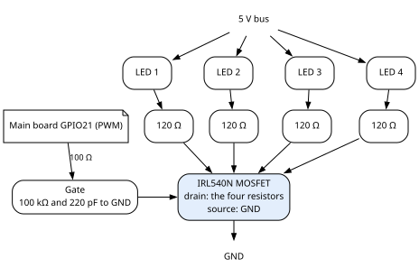
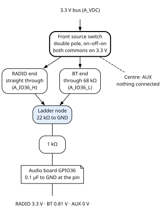
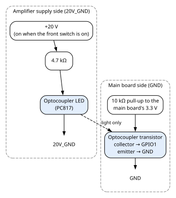

# 9. Front-panel controls and lamps

The front panel carries the controls you touch and the lamps you see. The main board dims the four FM
panel lamps and senses when the amplifier is switched on. The audio board reads the source switch, the
volume knob and the Bluetooth button, and lights the Bluetooth LED. This chapter gives the circuit
behind each one. Chapter 3, section 3.2, lists them; where each sits on the panel is not recorded. The
tuning knob is in chapter 8.

What the firmware does with these controls (dimming, pairing, the volume law) is in the Firmware Gospel:
chapter 4 for the lamps, chapter 10 for the audio board's controls. The source switch's thresholds are
given here, in section 9.3.

## 9.1 The FM panel lamps

The four FM panel lamps are LEDs, dimmed together by the main board. The main board dims them with
**PWM** (pulse-width modulation): GPIO21 switches the lamps on and off very fast, and the share of
"on" time sets the brightness. The lamp circuit is:

| Part | Value | What it does |
|---|---|---|
| LED anodes | on 5 V | all four, from the 5 V bus |
| LED resistors | **120 Ω**, one per LED | each LED's cathode returns through its own resistor. The value was chosen for maximum brightness control. |
| MOSFET | **IRL540N** | its drain takes the four resistors, its source is on ground. A logic-level MOSFET: its gate threshold is 1 to 2 V (Appendix A). |
| Gate resistor | **100 Ω** | from GPIO21 to the gate |
| Gate pull-down | **100 kΩ** to ground | holds the lamps off while GPIO21 is not driven |
| Gate capacitor | **220 pF** to ground | across the pull-down |

Wattage is not recorded for any resistor in this circuit.

The lamps light and dim with the PWM.

A comment in the firmware's pin file still speaks of "680 ohm on the 5 V rail". The lamp resistors are
120 Ω; the comment is stale.

**The panel-lamp board.** The MOSFET and its parts sit on a small board of their own. It has three
connections:

| Connector | Carries | Cable page |
|---|---|---|
| `FM_LED_IN`, 3 pins | GPIO21 from the main board (shielded, shield on ground at the main board end), and 5 V and ground from a 5 V bus jack | section 10.11 |
| 5 V out (`5VOUT`), 2 pins | as drawn, pin 1 on the board's 5 V and pin 2 on the four LED anodes; whether the two are one conductor or have a part between them is not recorded | section 10.33 |
| lamp returns, 4 pins | the four LED cathodes, each to its own 120 Ω on the board | section 10.33 |

## 9.2 The Bluetooth button and LED

On the front panel, **one part is both the Bluetooth LED and the Bluetooth button.** Both sides are
**active low**: pressing the button pulls its pin to ground, and the audio board lights the LED by
pulling its pin low. Each side has its own audio board pin:

| Side | Audio board pin | Wiring |
|---|---|---|
| Button | GPIO25 (`A_IO25`) | between the pin and ground. No pull-up resistor is drawn; the firmware turns on the chip's internal one. |
| LED | GPIO33 (`A_IO33`) | anode on the audio board's 3.3 V (`A_3V3`), cathode to the pin. No series resistor is drawn. Whether the LED part has a resistor of its own is not recorded. |

One 4-wire cable, with no shield, carries 3.3 V, GPIO33, ground and GPIO25 to the front panel. Its pin
order crosses from one end to the other (chapter 10, section 10.14).

## 9.3 The source switch

The front **source switch** chooses RADIO, BT or AUX. It is a double-pole, on–off–on switch: RADIO and
BT at the two ends, AUX in the centre. **It switches no audio.** It only puts one of three voltages on
the audio board's GPIO36, and the audio board picks its source from that. AUX audio never passes
through the audio board at all (chapter 6, section 6.7).

**The ladder.** A resistor ladder turns the switch position into one of three voltages on one pin:

- Both of the switch's commons are on the 3.3 V bus (`A_VDC`).
- At one end, one pole connects 3.3 V **straight** to the ladder node (the leg named `A_IO36_H`).
- At the other end, the other pole connects 3.3 V through **68 kΩ** to the ladder node (`A_IO36_L`).
- The two remaining end contacts are not connected.
- A **22 kΩ** resistor holds the ladder node to ground.
- The node reaches GPIO36 through **1 kΩ**, with **0.1 µF** to ground on the pin side.

Each position puts its own voltage on the pin:

| Position | What reaches the node | Voltage on GPIO36 |
|---|---|---|
| **RADIO** (one end) | 3.3 V directly | **3.3 V** |
| **BT** (other end) | 3.3 V through 68 kΩ, against the 22 kΩ to ground | **0.81 V** |
| **AUX** (centre, off) | nothing; the 22 kΩ pulls the node down | **0 V** |

The 22 kΩ and 68 kΩ ladder resistors are **on the audio board**, not at the switch, and the 0.1 µF is
at the audio board's pin.

**The thresholds.** The audio board's firmware reads GPIO36 in counts of its analogue input and sorts the
reading like this. These numbers are one of the few facts this book takes from the firmware.

| Reading on GPIO36 | Source chosen | Measured in that position |
|---|---|---|
| below 424 counts | **AUX** | 0 counts (0 V) |
| from 424 up to 2470 counts | **BT** | 848 counts (0.81 V) |
| 2471 counts and up | **RADIO** | 4095 counts (3.3 V) |

**The wiring.** Two cables meet on a small source-switch board, which is wired on to the switch. One
comes from the audio board, and one from a 3.3 V jack. Which of the 3.3 V jacks are on the audio board
and which are bus positions is not recorded.

| Cable | Carries | Cable page |
|---|---|---|
| `A32_SWITCH` | the two legs, `A_IO36_L` and `A_IO36_H`, in a shielded cable (shield on ground at the audio board end only) | section 10.20 |
| `A32_VDC_LISTENER` | 3.3 V (`A_VDC`) to the switch's commons | section 10.20 |

No ground wire goes to the switch.

## 9.4 The front volume knob

The front **volume knob** turns a potentiometer read by the audio board. It is **not** the
amplifier's volume control, which is reached only from the back (chapter 6, section 6.8). The knob does
nothing to the analogue audio: the audio board reads its position and sets the volume digitally, so it
acts on RADIO and BT only, never on AUX. The potentiometer (RV4) is drawn as B10K. Its three pins go
to:

| Potentiometer pin | Goes to |
|---|---|
| one end | the 3.3 V bus (`A_VDC`) |
| wiper | the audio board's **GPIO35** (`A_IO35`), an input-only pin |
| other end | ground |

Two cables meet in the potentiometer's 3-pin connector (`VOLUME`). One carries the wiper, shielded, with
the shield on ground at the audio board end only. The other carries 3.3 V and ground (chapter 10,
section 10.13). The knob itself is a printed part (Appendix D).

## 9.5 The amplifier power sensor

The main board needs to know when the front power switch has turned the amplifier on. A small board
tells it, through an **optocoupler** (PC817): an LED and a light-sensitive transistor in one package,
with no electrical path between them. Its two sides are wired like this:

| Side | Wiring |
|---|---|
| **LED** | +20 V from the amplifier supply → **4.7 kΩ** → the LED's anode; the LED's cathode → the amplifier supply return (`20V_GND`) |
| **Transistor** | collector → main board **GPIO1**, with a **10 kΩ** pull-up to the main board's 3.3 V; emitter → DC ground (`GND`) |

**How it reads.** The +20 V exists only while the front power switch is on (chapter 5). Then the LED
lights, the transistor conducts, and GPIO1 reads **low**. With the amplifier off, the pull-up holds
GPIO1 **high**. Inside the sensor no wire joins its two returns, `20V_GND` and `GND`; outside it they are
joined, as Earth, `GND` and `20V_GND` all are (chapter 5, section 5.3).

**Pins** (datasheet): 1 anode, 2 cathode, 3 emitter, 4 collector.

Its cable to the main board carries GPIO1 and ground, shielded, with the shield on ground at the main
board end (chapter 10, section 10.7). What the firmware does when the amplifier goes on or off is in the
Firmware Gospel.

## 9.6 When something is wrong

| You see | Check |
|---|---|
| The FM panel lamps never light | The panel-lamp board's cable: 5 V and ground from its bus jack, and GPIO21. Then the MOSFET, and the 5 V lead to the LEDs. |
| One FM panel lamp dark | That LED, its 120 Ω, and its return lead to the board. |
| The Bluetooth button does nothing | Its wires to GPIO25 and to ground in the Bluetooth cable. |
| The Bluetooth LED never lights | 3.3 V (`A_3V3`) and GPIO33 in the Bluetooth cable, and the LED's polarity. |
| The radio picks the wrong source | The voltage on GPIO36 in each position: 3.3 V, 0.81 V, 0 V. Then 3.3 V on `A32_VDC_LISTENER`, the two legs in `A32_SWITCH`, and the 68 kΩ and 22 kΩ on the audio board. |
| The volume knob does nothing | The wiper cable to GPIO35, and 3.3 V and ground on the knob's other cable. On AUX this is normal: the knob never acts on AUX. |
| The main board does not see the amplifier come on | GPIO1 should read low with the amplifier on and 3.3 V with it off. Check +20 V at the sensor board, the 4.7 kΩ, and the sensor's cable. |
