# 10. Cables and harnesses

Every board, sensor and control in the machine is joined to the others by a cable that plugs in at
both ends. This chapter draws each of those cables, wire by wire, so that you can test one, trace a
fault to it, or make a replacement. It is the only chapter that draws the cables themselves, wire by
wire; other chapters draw circuits.

## 10.1 How to read the cable pages

Most of this chapter follows the **cable sheet**: the drawing that defines the important and less
evident cables of the machine. Sections 10.2 to 10.36 each describe one cable, or a few wires that
belong together. Every page uses
the same headings in the same order, so you always know where to look. A heading is left out when there
is nothing under it: a cable that uses all its pins has no *Not used*, for example.

| Heading | What it tells you |
|---|---|
| **Carries** | What the cable is for: the signals or the power on it, and as much of the circuit at each end as you need to understand them. |
| **Shape** | How the cable is built: how many wires, whether it is shielded, the connector at each end with its name on the cable sheet, and whether the pin numbers cross from one end to the other. |
| *(drawing)* | The cable, drawn by signal name with the cable sheet's pin numbers. How to read it is at the end of this section. |
| **Wire by wire** | A table with one row per wire: the pin at one end, the signal, what it is, and the pin at the other end. A dash (—) means that the wire has no pin at that end. Where two cables meet in one connector, each cable has its own table. |
| **Shield** | Where the shield and foil end, or "none". A missing ground wire is noted here too, with where the board gets its ground instead. |
| **Not used** | Pins that carry no wire. |
| *(notes and cautions)* | Anything else you must know before you work on the cable: a warning box, parts built into the cable, ferrite cores. |
| **If it fails** | What you see when a wire in this cable breaks. Section 10.37 turns this round: it goes from what you see to the cable to check. |

The cables in sections 10.29 to 10.36 are not on the cable sheet. Their pages are short, and they draw
only what is recorded.

**Pin numbers are the cable sheet's.** The cable sheet numbers each connector's pins from the top of
the connector's symbol, as that symbol is defined in the drawing's parts library: pin 1, pin 2, and so on. That number is
**not** a number moulded on the connector. The order of the contacts inside a real connector is not
recorded, so a pin number says nothing about where a wire sits in the real connector: **each wire is
identified by its signal name, not by its position.** Where this chapter says that pins cross or run in
opposite order, it speaks of that numbering only, not of the real connector.

**Signals are named as on the cable sheet.** The names you will meet:

| Name | What it is |
|---|---|
| `GPIOn` | In a signal name, pin n of the main board (ESP32-S3, "S3"). In the text, "the audio board's GPIOn" is pin n of the audio board, whose signal names are `A_IOn`. |
| `A_IOn` | Pin n of the audio board (ESP32, "A32") |
| `5VDC` | The 5 V bus (chapter 5) |
| `S3_3V3` | The main board's own 3.3 V output |
| `A_VDC`, `A_3V3` | The audio side's 3.3 V: the audio board's 3.3 V output, shared out by the 3.3 V bus. The two names are one rail. |
| `GND` | DC ground |
| `CABLE S/FTP` | The cable's shield and foil (below) |

**The shield rule.** Where it is possible and useful, the cables are twisted pairs, shielded, foiled, or
both. A shielded cable here is S/FTP: a braided shield (S) and a foil (F) around twisted pairs (TP).
`CABLE S/FTP` on a pin means that the cable's shield and foil end on that pin, joined to ground on that
board, and are **left unconnected at the cable's other end**, unless the page says otherwise. Where a pin
reads `GND + CABLE S/FTP`, both a ground wire and the shield end there.

**Length and labels.** Every cable inside the cabinet is under 14 inches: long enough to service the box with
its panels open and nothing unplugged. Each cable is marked at both ends, with a name that makes its job
evident or with its name on the cable sheet.

**What is not recorded.** For the cables in this chapter, these are not recorded: wire colours (only
the amplifier supply's four are recorded, as the author's reading, section 10.30), which side is pin 1, the connector housings,
each cable's exact length and route, and the contact order inside a connector.

**Connectors.** The 5 V bus jacks are JST XH; their rating is in chapter 5, section 5.5. Some connector
types are used for one cable only, so that no cable can be plugged where it would break something. The
mains feed to the front power switch is one of them.

**In the drawings**, each connector box gives its name, its pins and, at the bottom, what it belongs to.
The middle box is the cable. Each of its lines follows one wire, left to right: the connector, pin and
signal at one end, written `connector:pin:signal`; the wire's number and its signal; then the
connector, pin and signal at the other end, written the same way. It repeats what the end boxes show,
so that you can follow one wire along one line. `+ S` means the cable has a shield. A pin marked `(not used)` carries no wire. A wire
that ends in the cable box with no connector after it goes to an end that is not recorded.

### All the cables

This table lists every page in the chapter. In the **Wires** column, "+ shield" means that the cable is
shielded. A second "+" adds the wires of another cable or connector described on the same page.

| Section | Cable | From → to | Wires | Carries |
|---|---|---|---|---|
| 10.2 | FM receiver power | main board → FM calibration receiver | 2 | 3.3 V and ground |
| 10.3 | FM receiver control | main board → FM calibration receiver | 2 + shield | control bus (I2C) |
| 10.4 | Main board 5 V | 5 V bus → main board | 2 | 5 V and ground |
| 10.5 | Segment drive | main board → display driver board | 7 | which segments light |
| 10.6 | Needle motor control | main board → needle motor driver | 4 | the four coil signals |
| 10.7 | Amplifier power sensor | main board → power sensor board | 2 + shield | "amplifier is on" |
| 10.8 | Digit select | main board → display driver board | 4 | which digit lights |
| 10.9 | Needle index sensor | main board and 5 V bus → index sensor | 2 + shield, + 1 | sensor output, ground, 5 V |
| 10.10 | Tuning angle sensor | main board → angle sensor | 4 + shield | 3.3 V, ground, control bus (I2C) |
| 10.11 | Panel-lamp control | main board and 5 V bus → panel-lamp board | 1 + shield, + 2 | lamp brightness, the board's 5 V |
| 10.12 | Board link | main board ↔ audio board | 3 + shield | serial link both ways, ground |
| 10.13 | Front volume knob | audio board and 3.3 V → volume knob | 1 + shield, + 2 | knob position, 3.3 V, ground |
| 10.14 | Bluetooth button and LED | audio board → front panel | 4 | button and LED |
| 10.15 | Audio harness | audio board → ADC and DAC; 5 V bus → DAC | 6 + shield, + 2 | digital audio, the DAC's 5 V |
| 10.16 | Clock module power | 3.3 V jack → real-time clock module | 2 | 3.3 V and ground |
| 10.17 | Clock module control | audio board → real-time clock module | 2 + shield | control bus (I2C) |
| 10.18 | Audio board 5 V | 5 V bus → audio board | 2 | 5 V and ground |
| 10.19 | Audio board 3.3 V | audio board → 3.3 V jack | 2 | the audio board's 3.3 V output |
| 10.20 | Source switch | audio board and 3.3 V → source-switch board | 2 + shield, + 1 | the RADIO / BT / AUX position |
| 10.21 | DAC to amplifier | DAC board → amplifier input | 3 at the plug, 5 at the amplifier | analogue audio, balanced |
| 10.22 | Radio to ADC | tube radio's output transformer → ADC | 2 + shield | the radio's audio, mono |
| 10.23 | Colon 5 V | 5 V bus → display bus board, for the colon | 2 | 5 V and ground, **reversed at `COLON_IN`** |
| 10.24 | Motor driver 5 V | 5 V bus → needle motor driver | 2 | 5 V and ground |
| 10.25 | ADC 5 V | 5 V bus → ADC board | 2 | 5 V and ground |
| 10.26 | Driver board 5 V | 5 V bus → display driver board | 2 | 5 V and ground |
| 10.27 | Digit rails | display driver board → display bus board | 4 + shield | each digit's switched 5 V |
| 10.28 | Segment buses | display driver board → display bus board | 7 | the seven segment lines |
| 10.29 | Box-fan harness | amplifier supply → fan regulator → box fan | 2 + 2 | +20 V in, 12 V out |
| 10.30 | Amplifier supply wires | amplifier supply → amplifier | 4 | ±20 V and ground |
| 10.31 | USB | back panel → each board's USB port | 4 each | USB, straight through |
| 10.32 | Needle motor lead | needle motor driver → needle motor | 5 | four coils and their common |
| 10.33 | Panel-lamp leads | panel-lamp board → the four FM lamps | 1 + 4 | 5 V out, four returns |
| 10.34 | Inside the clock display | display bus board → colon and digits | 2; 8 per digit | the colon LED, the digits |
| 10.35 | FM receiver antenna and the antenna coax | — | — | the calibration receiver's antenna wire; the FM antenna's coax (neither drawn as a cable) |
| 10.36 | Mains and earth wiring | — | — | see chapter 5 |

## 10.2 FM receiver power — main board to FM calibration receiver

**Carries:** the main board's own 3.3 V (`S3_3V3`) and ground to the FM calibration receiver, an
RDA5807M FM receiver chip on its own small module.

**Shape:** one 2-wire cable, with a 2-pin connector at each end: `S3_3V3` at the main board, `RDA_3V3`
at the receiver board. The pins cross in the cable sheet's numbering: pin 1 at one end is pin 2 at the
other.

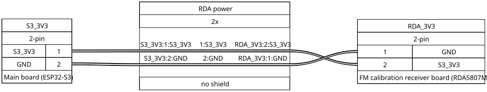

**Wire by wire.**

| Main board end, pin | Signal | What it is | Receiver end, pin |
|---|---|---|---|
| 1 | `S3_3V3` | The main board's 3.3 V output | 2 |
| 2 | `GND` | Ground | 1 |

**Shield:** none.

**If it fails:** the receiver loses its power and stops answering the main board.

## 10.3 FM receiver control — main board to FM calibration receiver

**Carries:** the two-wire control bus (I2C, a clock line and a data line) between the main board and
the FM calibration receiver: `GPIO47` is the data line, `GPIO48` the clock line. Neither line has an
external pull-up resistor.

**Shape:** one shielded cable with two wires. A 2-pin connector `S3_RDA` at the main board, a 3-pin
connector `RDA_I2C` at the receiver board; the third pin takes the shield.

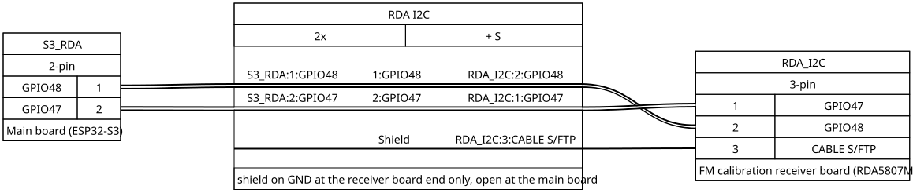

**Wire by wire.**

| Main board end, pin | Signal | What it is | Receiver end, pin |
|---|---|---|---|
| 1 | `GPIO48` | Clock line (the receiver's SCLK) | 2 |
| 2 | `GPIO47` | Data line (the receiver's SDIO) | 1 |
| — | `CABLE S/FTP` | Shield and foil | 3 |

**Shield:** at the receiver end, unlike most cables here. The shield and foil are joined to ground at
the **receiver board end**, on pin 3. They are left unconnected at the main board end, whose connector
has only two pins. There is no ground wire: the receiver's ground comes on its power cable (section
10.2).

**`GPIO48` also drives the main board's own RGB LED**, so that LED is lit while the machine runs.

**If it fails:** the main board can no longer talk to the receiver.

## 10.4 Main board 5 V — 5 V bus to main board

**Carries:** 5 V and ground from the 5 V bus to the main board's 5 V pin.

**Shape:** one 2-wire cable, from a 2-pin jack on the 5 V bus to `S3_5VIN` on the main board. Which bus
jack it uses is not recorded.

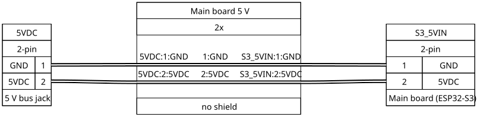

**Wire by wire.**

| 5 V bus jack, pin | Signal | Main board end, pin |
|---|---|---|
| 1 | `GND` | 1 |
| 2 | `5VDC` | 2 |

**Shield:** none.

**If it fails:** the main board goes dead: no clock display, no needle, no panel lamps. The audio board
has its own 5 V cable (section 10.18).

## 10.5 Segment drive — main board to display driver board

**Carries:** the seven signals that choose which segments of the clock display light. Each one drives
one input of the segment driver on the display driver board, a ULN2003A (a chip of seven transistor
switches that sink current to ground). Each segment line is shared by all four digits.

**Shape:** one 7-wire cable, pin for pin: `S3_DISPLAY` at the main board, `DISPLAY_IN` at the driver
board.

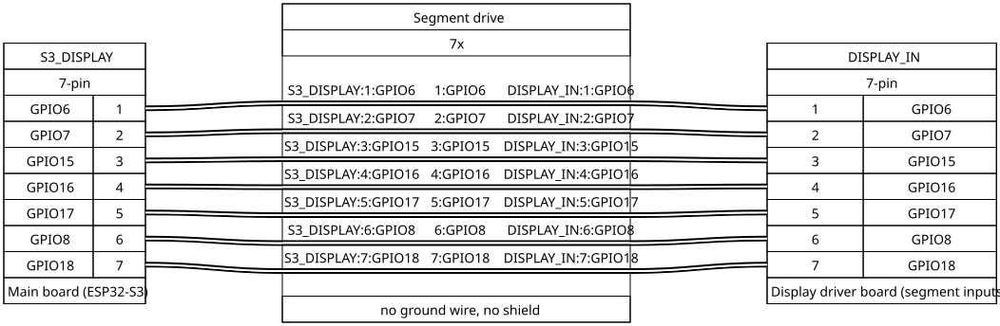

**Wire by wire.**

| Main board end, pin | Signal | What it is | Driver board end, pin |
|---|---|---|---|
| 1 | `GPIO6` | Segment A (driver input 1) | 1 |
| 2 | `GPIO7` | Segment B (driver input 2) | 2 |
| 3 | `GPIO15` | Segment C (driver input 3) | 3 |
| 4 | `GPIO16` | Segment D (driver input 4) | 4 |
| 5 | `GPIO17` | Segment E (driver input 5) | 5 |
| 6 | `GPIO8` | Segment F (driver input 6) | 6 |
| 7 | `GPIO18` | Segment G (driver input 7) | 7 |

**Shield:** none. There is no ground wire either: the driver board takes its ground from its own power
cable (section 10.26).

**If it fails:** a broken wire leaves one segment dark on all four digits.

## 10.6 Needle motor control — main board to needle motor driver

**Carries:** the four signals that step the needle motor. They enter the needle motor driver board, a
ULN2003A board, on its inputs IN1 to IN4, which drive the motor's four coils (section 10.32).

**Shape:** one 4-wire cable, `S3_STEPPER` at the main board, `STEPPER_IN` at the driver board. The pin
order runs opposite at the two ends.

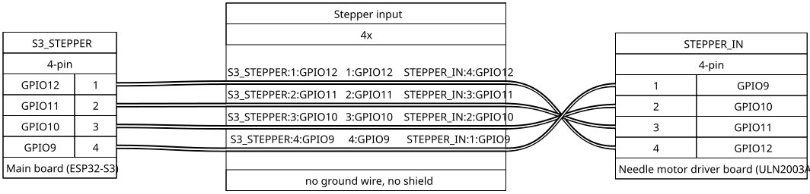

**Wire by wire.**

| Main board end, pin | Signal | What it is | Driver board end, pin |
|---|---|---|---|
| 1 | `GPIO12` | Driver input IN4 | 4 |
| 2 | `GPIO11` | Driver input IN3 | 3 |
| 3 | `GPIO10` | Driver input IN2 | 2 |
| 4 | `GPIO9` | Driver input IN1 | 1 |

**Shield:** none. There is no ground wire either: the driver board takes its ground from its own power
cable (section 10.24).

**If it fails:** one coil is no longer driven, so the needle cannot step properly.

## 10.7 Amplifier power sensor — main board to power sensor board

**Carries:** the "amplifier is on" signal. The sensor board holds an optocoupler (PC817): an LED and a
light-sensitive transistor in one package, so that a signal crosses by light with no wire between the
two sides. The LED is lit from the amplifier's +20 V supply. The transistor's collector is on `GPIO1`,
which has a 10 kΩ pull-up to `S3_3V3` on the main board; its emitter is on ground. While the amplifier
supply is on, the transistor conducts and pulls `GPIO1` low. Chapter 9 has the sensor.

**Shape:** one shielded 2-wire cable, `S3_PWR_DET` at the main board, `POWER_DET` at the sensor board.

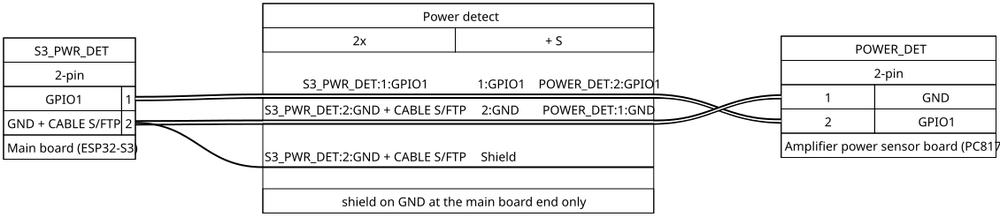

**Wire by wire.**

| Main board end, pin | Signal | What it is | Sensor end, pin |
|---|---|---|---|
| 1 | `GPIO1` | The optocoupler's collector | 2 |
| 2 | `GND + CABLE S/FTP` | Ground to the optocoupler's emitter; the shield and foil end here too | 1 |

**Shield:** joined to ground at the main board end only. The ground wire itself runs end to end.

**If it fails:** with either wire broken, nothing can pull `GPIO1` low, so the main board reads "amplifier
off" all the time.

## 10.8 Digit select — main board to display driver board

**Carries:** the four signals that choose which digit of the clock display lights. Digit 1 is the
rightmost digit (units of minutes); digits 2, 3 and 4 run leftwards from it. On the driver board each
signal goes through a ULN2003A channel and a 1 kΩ resistor to the gate of a P-channel MOSFET
(FQP27P06), which switches 5 V onto that digit (section 10.27). Chapter 7 has the circuit.

**Shape:** one 4-wire cable, `S3_DIGIT` at the main board, `DIGIT_IN` at the driver board. The pin
order runs opposite at the two ends.

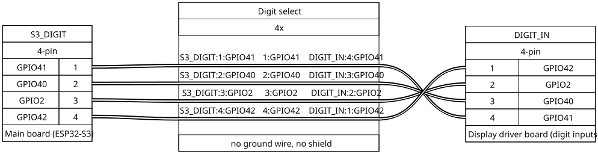

**Wire by wire.**

| Main board end, pin | Signal | What it is | Driver board end, pin |
|---|---|---|---|
| 1 | `GPIO41` | Selects digit 4 (leftmost) | 4 |
| 2 | `GPIO40` | Selects digit 3 | 3 |
| 3 | `GPIO2` | Selects digit 2 | 2 |
| 4 | `GPIO42` | Selects digit 1 (rightmost) | 1 |

**Shield:** none is recorded, and no ground wire: the cable has four wires only.

**If it fails:** a broken wire leaves one digit dark.

## 10.9 Needle index sensor — main board and 5 V bus to the index sensor

**Carries:** the index sensor's output, its ground and its 5 V. The sensor is an A3144 Hall switch (it
reacts to a magnet) on a small perfboard in its own PLA case. A small magnet on the needle mount passes
over it, and its output switches low when the magnet's field is strong enough. That gives the needle a
fixed reference point. The output is open-collector: on the main board, `GPIO5` has a 10 kΩ pull-up to
`S3_3V3` and 0.1 µF to ground.

**Shape:** a Y harness. A shielded 2-wire cable from `S3_LIMITS` at the main board, and a single 5 V
wire from a bus jack `5VDC_LIMIT`, meet in the sensor's 3-pin connector `LIMIT`. Which bus jack is not
recorded.

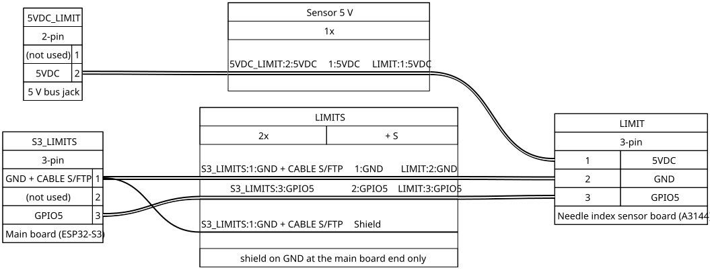

**Wire by wire.**

| Main board end, pin | Signal | What it is | Sensor end, pin |
|---|---|---|---|
| 1 | `GND + CABLE S/FTP` | Ground for the sensor; the shield and foil end here too | 2 |
| 2 | (not used) | — | — |
| 3 | `GPIO5` | The sensor's output | 3 |

| 5 V bus jack, pin | Signal | Sensor end, pin |
|---|---|---|
| 1 | (not used) | — |
| 2 | `5VDC` | 1 |

**Shield:** joined to ground at the main board end only.

**Not used:** pin 2 at the main board end, and the bus jack's ground pin. The sensor's ground comes
from the main board, its 5 V from the bus. At the main board, `GPIO4` is still wired to pin 2, with its
own 10 kΩ pull-up and 0.1 µF, but the cable carries nothing on that pin.

**If it fails:** if any of the three wires breaks, `GPIO5` stays high and the main board never sees the
index magnet, so the needle cannot find its reference point.

## 10.10 Tuning angle sensor — main board to the angle sensor

**Carries:** power and the control bus (I2C) for the tuning angle sensor, an AS5600 magnetic angle
sensor. It sits inside its own Faraday cage, its board perpendicular to the tuning capacitor's shaft,
with the shaft's axis through the centre of the chip. It reads the angle of a magnet glued to the end of
a PLA extension of that shaft. At the main board, each bus line has a 10 kΩ pull-up to `S3_3V3` at
the board's pin, then a 220 Ω resistor in series before the connector.

**Shape:** one shielded 4-wire cable from `S3_TUNER` at the main board. **Only the main board end is
drawn:** the connector at the sensor, and its pin order, are not recorded. The table gives the sensor pin
each wire reaches.

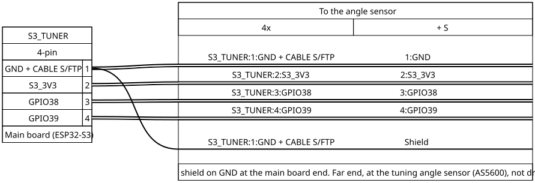

**Wire by wire.**

| Main board end, pin | Signal | What it is | Sensor pin it reaches |
|---|---|---|---|
| 1 | `GND + CABLE S/FTP` | Ground; the shield and foil end here too | GND |
| 2 | `S3_3V3` | The main board's 3.3 V output | VCC |
| 3 | `GPIO38` | Data line (SDA) | SDA |
| 4 | `GPIO39` | Clock line (SCL) | SCL |

**Shield:** joined to ground at the main board end.

**If it fails:** the main board can no longer read where the tube radio is tuned.

## 10.11 Panel-lamp control — main board and 5 V bus to the panel-lamp board

**Carries:** the brightness signal for the four FM panel lamps, and the lamp board's power. `GPIO21`
reaches the gate of a logic-level MOSFET (IRL540N) through 100 Ω; the gate also has 100 kΩ and 220 pF
to ground. The MOSFET sinks the four lamps' current. The main board dims the lamps by PWM (pulse-width
modulation: switching on and off fast, with a varying on-time). Chapter 9 has the circuit.

**Shape:** two cables into one 3-pin connector, `FM_LED_IN`, on the panel-lamp board: a shielded
1-wire cable from `S3_FM_LED` on the main board, and a 2-wire power cable from a 5 V bus jack
`5VDC_FM_LED`.

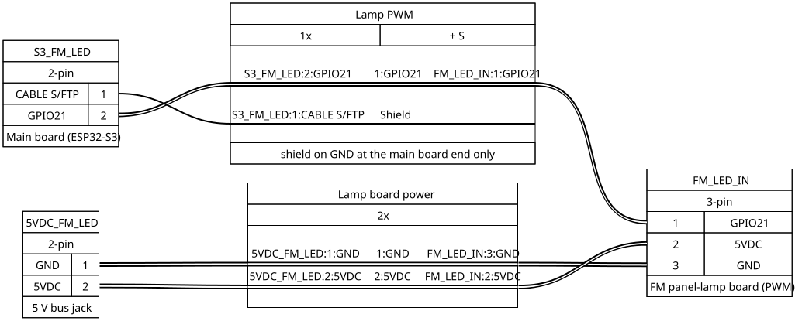

**Wire by wire.**

| Main board end, pin | Signal | What it is | Lamp board end, pin |
|---|---|---|---|
| 1 | `CABLE S/FTP` | Shield and foil | — |
| 2 | `GPIO21` | The lamp brightness signal (PWM) | 1 |

| 5 V bus jack, pin | Signal | Lamp board end, pin |
|---|---|---|
| 1 | `GND` | 3 |
| 2 | `5VDC` | 2 |

**Shield:** joined to ground at the main board end, left unconnected at the lamp board. There is no
ground wire from the main board: the lamp board takes its ground from the bus jack.

**If it fails:** if the `GPIO21` wire breaks, the gate's 100 kΩ holds the MOSFET off and the lamps stay
dark. A broken power wire also leaves them dark.

## 10.12 Board link — main board to audio board

**Carries:** the serial link (UART) between the two boards, one wire each way, and ground.
`S3_to_A32` runs from the main board's `GPIO13` to the audio board's `GPIO26`. `A32_to_S3` runs from
the audio board's `GPIO27` to the main board's `GPIO14`.

**Shape:** one shielded 3-wire cable, `S3_UART` at the main board, `A32_UART` at the audio board.

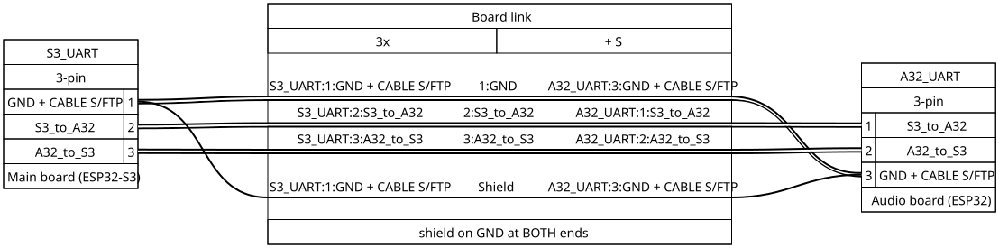

**Wire by wire.**

| Main board end, pin | Signal | What it is | Audio board end, pin |
|---|---|---|---|
| 1 | `GND + CABLE S/FTP` | Ground; the shield and foil end here too | 3 |
| 2 | `S3_to_A32` | Main board `GPIO13` → audio board `GPIO26` | 1 |
| 3 | `A32_to_S3` | Audio board `GPIO27` → main board `GPIO14` | 2 |

**Shield:** joined at both ends. Unlike the other shielded cables, this one has its shield and foil
joined to ground at **both** boards.

**If it fails:** the two boards can no longer talk to each other.

## 10.13 Front volume knob — audio board and 3.3 V to the volume knob

**Carries:** the front volume knob's position to the audio board. The knob turns a potentiometer
(RV4, drawn as B10K) whose two ends sit on 3.3 V and ground; its wiper goes to the audio board's `GPIO35`. This is the
audio board's own volume, set digitally. The amplifier's own volume control is a different pot, on the
amplifier's board, reached only from the back.

**Shape:** two cables into one 3-pin connector, `VOLUME`, at the knob. A shielded 1-wire cable from
`A32_VOL` on the audio board carries the wiper. A 2-wire cable from `A32_VDC_VOLUME` brings 3.3 V and
ground. `A32_VDC_VOLUME` is a jack on the audio side's 3.3 V (`A_VDC`); which jack is not recorded.

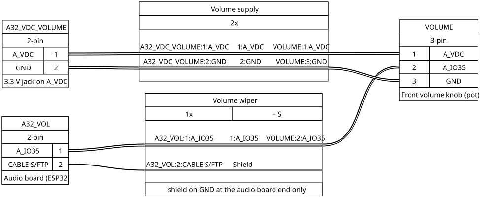

**Wire by wire.**

| Audio board end, pin | Signal | What it is | Knob end, pin |
|---|---|---|---|
| 1 | `A_IO35` | The pot's wiper | 2 |
| 2 | `CABLE S/FTP` | Shield and foil | — |

| 3.3 V jack `A32_VDC_VOLUME`, pin | Signal | What it is | Knob end, pin |
|---|---|---|---|
| 1 | `A_VDC` | 3.3 V, to the pot's top end | 1 |
| 2 | `GND` | Ground, to the pot's bottom end | 3 |

**Shield:** joined to ground at the audio board end, left unconnected at the knob.

**If it fails:** the knob no longer changes the volume.

## 10.14 Bluetooth button and LED — audio board to front panel

**Carries:** the front-panel Bluetooth LED and the Bluetooth pairing button. On the front panel the LED
is also the button. The LED's anode is on 3.3 V and its cathode on `GPIO33`: the audio board lights it
by pulling `GPIO33` low. No series resistor is drawn. The button connects `GPIO25` to ground when
pressed; `GPIO25` uses the chip's internal pull-up, so pressed reads low.

**Shape:** one 4-wire cable, `A32_BT_LED` at the audio board, `BT_LED` at the front panel. The pins
cross in pairs: 1 and 2 swap, 3 and 4 swap.

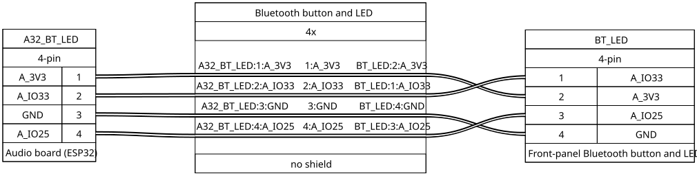

**Wire by wire.**

| Audio board end, pin | Signal | What it is | Front panel end, pin |
|---|---|---|---|
| 1 | `A_3V3` | 3.3 V to the LED's anode | 2 |
| 2 | `A_IO33` | The LED's cathode; low lights it | 1 |
| 3 | `GND` | The button's ground side | 4 |
| 4 | `A_IO25` | The button; pressed pulls it low | 3 |

**Shield:** none.

**If it fails:** a broken pin 1 or 2 wire leaves the LED dark; a broken pin 3 or 4 wire makes the button
do nothing.

## 10.15 The audio harness — audio board to ADC and DAC

**Carries:** the digital audio (I2S) between the audio board (ESP32, "A32") and its two converters: the
ADC that digitises the tube radio, and the DAC that feeds the amplifier. The DAC's 5 V power rides in
the same harness.

**Shape:** one shielded harness that starts at the audio board and splits in two: one branch to the ADC
board, one to the DAC board. A short power lead from the 5 V bus joins the DAC branch.

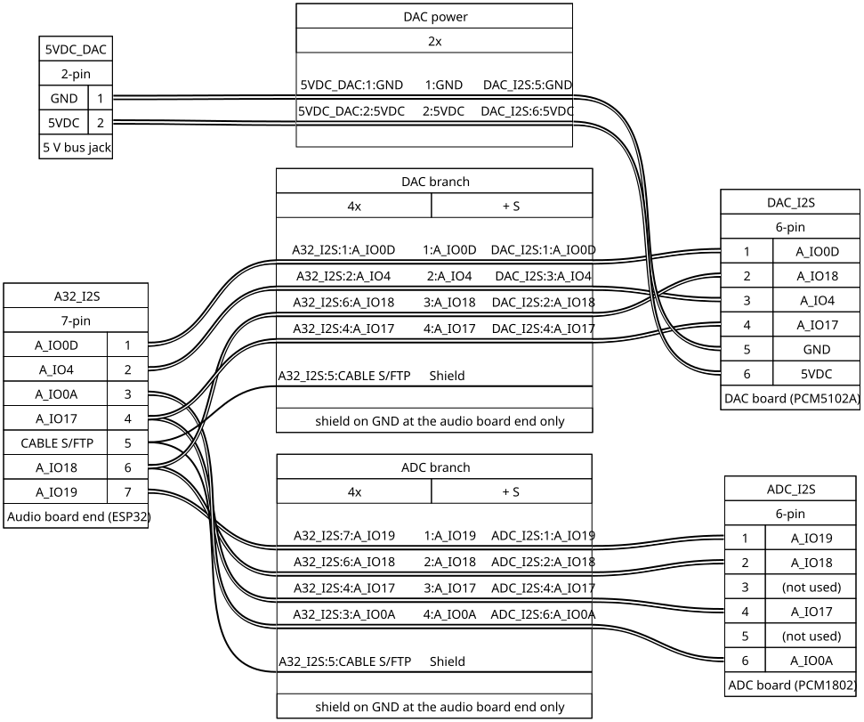

**Wire by wire.** Pin numbers are the cable sheet's.

| Audio board end, pin | Signal | What it is | ADC end, pin | DAC end, pin |
|---|---|---|---|---|
| 1 | `A_IO0D` | Master clock to the DAC: the audio board's GPIO0, through its own 33 Ω resistor at the board | — | 1 |
| 2 | `A_IO4` | Audio data **to** the DAC (GPIO4) | — | 3 |
| 3 | `A_IO0A` | Master clock to the ADC: the same GPIO0, through its other 33 Ω resistor | 6 | — |
| 4 | `A_IO17` | Word clock, left/right (LRCK), shared by both converters (GPIO17) | 4 | 4 |
| 5 | `CABLE S/FTP` | The harness's shield and foil, on ground at the audio board | — | — |
| 6 | `A_IO18` | Bit clock (BCK), shared by both converters (GPIO18) | 2 | 2 |
| 7 | `A_IO19` | Audio data **from** the ADC (GPIO19) | 1 | — |

| 5 V bus jack, pin | Signal | DAC end, pin |
|---|---|---|
| 1 | `GND` | 5 |
| 2 | `5VDC` | 6 |

**Shield:** the shield and foil are joined to ground at the **audio board end only**, and left
unconnected at both converter ends.

**Not used:** pins 3 and 5 at the ADC end carry nothing. The ADC takes its power from its own cable on
the 5 V bus, not from this harness.

**The two clock wires are the same signal.** `A_IO0A` and `A_IO0D` both come from the audio board's
GPIO0. They have two names only so that each converter's drawing reads clearly. Each has its own 33 Ω
series resistor, at the audio board's pin.

**If it fails:** no radio sound points to the ADC branch (pins 3, 4, 6, 7); no radio and no Bluetooth
sound, while AUX still plays, points to the DAC branch (pins 1, 2, 4, 6) or its power lead. AUX never
passes through this harness. Bluetooth plays through the DAC but not
the ADC, so it tells the two branches apart.

## 10.16 Clock module power — 3.3 V jack to the real-time clock module

**Carries:** 3.3 V and ground to the real-time clock module (a DS3231 module, chapter 4).

**Shape:** one 2-wire cable, from a 3.3 V jack the cable sheet names `A32_VDC`, on the audio side's 3.3 V
(`A_VDC`), to `RTC_3V3` on the clock module. Which jack is not recorded. A second jack has the same
name: the one that takes the audio board's 3.3 V cable (section 10.19).

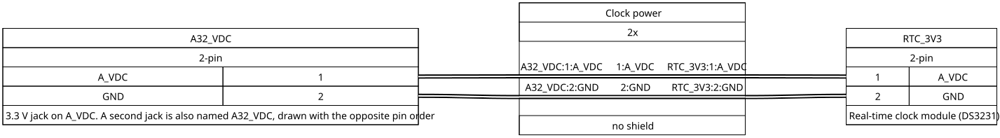

**Wire by wire.**

| 3.3 V jack, pin | Signal | Clock module end, pin |
|---|---|---|
| 1 | `A_VDC` | 1 |
| 2 | `GND` | 2 |

**Shield:** none.

> **Caution — two jacks named `A32_VDC`, with opposite pin orders.** As the cable sheet draws them, this
> jack has pin 1 on 3.3 V (`A_VDC`) and pin 2 on ground. The other `A32_VDC` jack, which takes the audio
> board's 3.3 V cable (section 10.19), has pin 1 on ground and pin 2 on 3.3 V (`A_3V3`, the same rail).
> The name alone does not tell you which jack you are holding, nor which way round its 3.3 V and ground
> are. These are the cable sheet's pin numbers; nothing more is recorded about the real connectors.

**If it fails:** the real-time clock module loses its 3.3 V supply.

## 10.17 Clock module control — audio board to the real-time clock module

**Carries:** the control bus (I2C) between the audio board and the real-time clock module: `A_IO22` is
the data line (SDA), `A_IO21` the clock line (SCL).

**Shape:** one shielded 2-wire cable, `A32_RTC` at the audio board (3 pins) and `RTC_I2C` at the clock
module (4 pins).

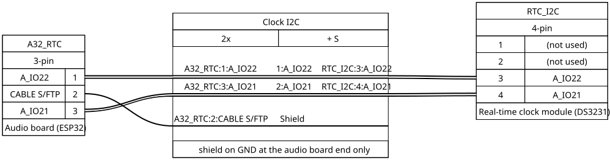

**Wire by wire.**

| Audio board end, pin | Signal | What it is | Clock module end, pin |
|---|---|---|---|
| 1 | `A_IO22` | Data line (SDA) | 3 |
| 2 | `CABLE S/FTP` | Shield and foil | — |
| 3 | `A_IO21` | Clock line (SCL) | 4 |

**Shield:** joined to ground at the audio board end, left unconnected at the module.

**Not used:** pins 1 and 2 at the clock module end. Only two of that connector's four positions carry
wires. **Which two, on the real connector, is not recorded.**

**If it fails:** the audio board can no longer talk to the real-time clock module.

## 10.18 Audio board 5 V — 5 V bus to audio board

**Carries:** 5 V and ground from the 5 V bus to the audio board's 5 V pin.

**Shape:** one 2-wire cable, from a 2-pin jack on the 5 V bus to `A32_5VIN` on the audio board. Which
bus jack is not recorded.

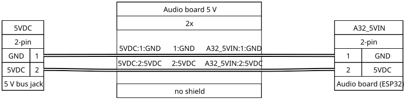

**Wire by wire.**

| 5 V bus jack, pin | Signal | Audio board end, pin |
|---|---|---|
| 1 | `GND` | 1 |
| 2 | `5VDC` | 2 |

**Shield:** none.

**If it fails:** the audio board goes dead, and with it the 3.3 V it makes (section 10.19). There is no
sound from any source but AUX.

## 10.19 Audio board 3.3 V — audio board to the 3.3 V supply

**Carries:** the audio board's own 3.3 V output (`A_3V3`) and ground out to the 3.3 V bus (chapter 5,
section 5.5). The bus's 3.3 V is one wire with the 3.3 V jacks that feed the real-time clock module,
the front volume knob and the source switch. Which of those jacks are bus positions, and which sit on
the audio board, is not recorded. The audio board decouples its 3.3 V pin with one 0.1 µF and two
10 µF capacitors.

**Shape:** one 2-wire cable, from `A32_3V3` on the audio board to a jack the cable sheet names
`A32_VDC`, on the 3.3 V supply. The pins cross in the cable sheet's numbering: pin 1 at one end is
pin 2 at the other.

**Two jacks are named `A32_VDC`, with opposite pin orders as drawn.** This one has pin 1 on ground and
pin 2 on 3.3 V. The other, which feeds the real-time clock module (section 10.16), has pin 1 on 3.3 V
and pin 2 on ground. Both are on the same 3.3 V rail and the same ground. The caution in section 10.16
applies to both.

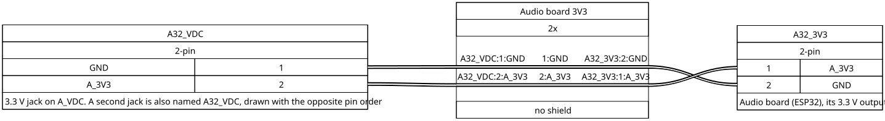

**Wire by wire.**

| `A32_VDC` end, pin | Signal | Audio board end, pin |
|---|---|---|
| 1 | `GND` | 2 |
| 2 | `A_3V3` | 1 |

**Shield:** none.

**If it fails:** the 3.3 V bus loses its supply, and every part fed from a bus position loses its
3.3 V. Which of the clock module, the volume knob and the source switch that includes is not recorded.

## 10.20 Source switch — audio board and 3.3 V to the source-switch board

**Carries:** the position of the front RADIO / BT / AUX switch, as a voltage on the audio board's
`GPIO36`. The switch puts 3.3 V on one of two legs: `A_IO36_H`, the ladder node itself, on RADIO
(3.3 V), or `A_IO36_L`, which reaches the node through 68 kΩ, on BT (about 0.81 V). On AUX it feeds
neither, and the node reads 0 V. The ladder's resistors are all on the audio board; chapter 9, section
9.3, has the circuit.

**Shape:** two cables into one 3-pin connector, `LISTENER`, on the source-switch board, a small
board in its own printed case that the drawings call the IN/LISTENER/OUT board. A shielded 2-wire cable from `A32_SWITCH` on the audio board carries the two
legs. A 1-wire cable from the 3.3 V jack `A32_VDC_LISTENER` brings 3.3 V; which jack is not recorded.
From the source-switch board, wires go on to the front switch. That last leg is not drawn as a cable; it
is given by signal at the end of *Wire by wire*.

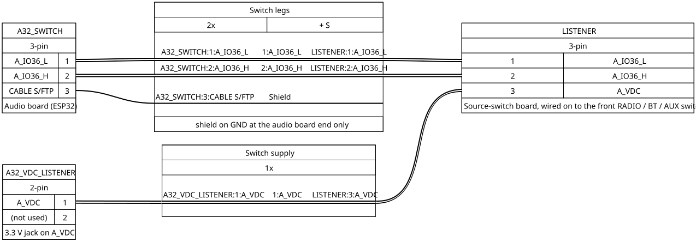

**Wire by wire.**

| Audio board end, pin | Signal | What it is | Switch board end, pin |
|---|---|---|---|
| 1 | `A_IO36_L` | The BT leg, through 68 kΩ | 1 |
| 2 | `A_IO36_H` | The RADIO leg, direct | 2 |
| 3 | `CABLE S/FTP` | Shield and foil | — |

| 3.3 V jack `A32_VDC_LISTENER`, pin | Signal | What it is | Switch board end, pin |
|---|---|---|---|
| 1 | `A_VDC` | 3.3 V for the switch | 3 |
| 2 | (not used) | — | — |

**The last leg, from the source-switch board to the front switch**, by signal. The pins of the
source-switch board's own connector on this leg are not recorded.

| Signal | Front switch pin |
|---|---|
| `A_VDC` | 2 and 5 |
| `A_IO36_H` | 1 |
| `A_IO36_L` | 6 |

**Shield:** joined to ground at the audio board end, left unconnected at the switch board.

**Not used:** the 3.3 V jack's ground pin (pin 2), so no ground goes to the switch; and the front
switch's pins 3 and 4.

**If it fails:** with the `A_IO36_H` wire broken, RADIO reads as AUX. With the `A_IO36_L` wire broken,
BT reads as AUX. With the 3.3 V wire broken, every position reads as AUX.

## 10.21 DAC to amplifier — DAC board to the amplifier's balanced input

**Carries:** the analogue audio from the DAC to the amplifier's balanced input (an input that takes each
channel as a + and a − wire). The DAC gives left, right and ground; the cable feeds each channel to a +
leg and ties each − leg to the DAC's ground through 470 Ω.

**Shape:** a 3-pole TRS plug, `DAC_OUT` (tip, ring, sleeve, like a headphone plug), goes into the DAC
board's output jack. At the other end, a 9-pin connector `AMP_IN` plugs into the amplifier's input
panel. The plug has three poles, and the amplifier end uses five pins. **The cable carries four 470 Ω
resistors**, one in each signal leg. The two on the + legs sit at the DAC end. The two on the − legs
share one end on `AMP_G`, at the plug's sleeve; where along the cable they sit is not recorded.

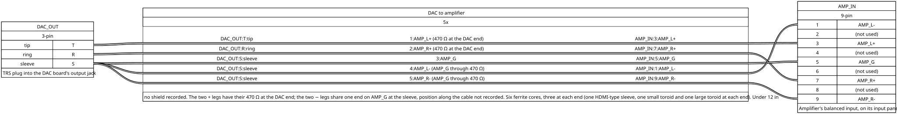

**Wire by wire.**

| Plug pole | DAC signal | Wire | In the cable | Amplifier end, pin |
|---|---|---|---|---|
| Tip | left out (OUTL) | `AMP_L+` | 470 Ω in series, at the DAC end | 3 |
| Ring | right out (OUTR) | `AMP_R+` | 470 Ω in series, at the DAC end | 7 |
| Sleeve | analogue ground (AGND) | `AMP_G` | direct | 5 |
| Sleeve | analogue ground | `AMP_L−` | through its own 470 Ω | 1 |
| Sleeve | analogue ground | `AMP_R−` | through its own 470 Ω | 9 |

**Shield:** none is recorded.

**Not used:** pins 2, 4, 6 and 8 at the amplifier end.

**Ferrite cores.** Six cores sit on this cable, three at each end: at each end, one HDMI-type sleeve,
one small toroid and one large toroid. The cable passes once through each; it is under 12 inches long,
so it makes no turns. The table gives the size of each kind of core:

| Core | Size |
|---|---|
| HDMI-type sleeve | 17.4 mm outside, 9.7 mm inside, 28.5 mm long (the same type as the antenna's feed-point cores, chapter 11) |
| Small toroid | 16 mm outside, 3 mm wall, 8 mm long |
| Large toroid | 22 mm outside, 4 mm wall, 8 mm long |

The toroids are salvaged and unidentified: no maker, part number, grade or magnetic data is recorded.
Their material is not that of the radio cable's clip-on cores (section 10.22). The four resistors and
the six cores are part of this cable.

**If it fails:** radio and Bluetooth go silent at the amplifier while AUX still plays. AUX reaches the
amplifier's input panel on its own path and never goes through this cable.

## 10.22 Radio to ADC — tube radio's output transformer to the ADC

**Carries:** the tube radio's audio, from the secondary of its output transformer (T1), to the ADC. A
7.5 Ω 5 W resistor (marked 5W7Ω5J) is wired across that secondary as its load. The feed is mono.

**Shape:** one shielded 2-wire cable. At the ADC end, a 3-pole TRS plug, `J50`, goes into the radio
input jack at the ADC (J51, `RADIO_TO_ADC`). At the radio end, the two wires come from the transformer
secondary; **how they end there, soldered or plugged, is not recorded.**

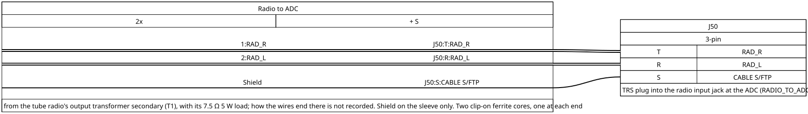

**Wire by wire.**

| Plug pole | Signal | What it is | Radio end |
|---|---|---|---|
| Tip | `RAD_R` | One side of the transformer secondary | T1 terminal SB |
| Ring | `RAD_L` | The other side | T1 terminal SA |
| Sleeve | `CABLE S/FTP` | Shield and foil | not connected |

**The jack at the ADC (J51).** Cable side: shield and foil on the sleeve, `RAD_L` on the ring, `RAD_R`
on the tip. Output side: sleeve and ring on ground, tip into the 4.7 kΩ of the input attenuator
(chapter 6, section 6.4).

**Shield:** on the plug's sleeve, which is ground at the ADC end. It is left unconnected at the radio end.

**Tip and ring can be swapped.** The feed is mono: at the ADC one side goes to ground, the other into
the input attenuator.

**Ferrite cores.** Two clip-on cores sit on this cable, one near the transformer end and one near the
ADC end. The cable passes once through each. Measured: 10 mm outside, 3.5 mm inside, 3.5 mm walls,
20 mm long. One of these figures is rounded: the hole and the two walls make 10.5 mm, against 10 mm
outside. No maker, part number or
grade is recorded. Their material, as supplied: rectangle ratio 20, coercivity 16 A/m, remanence
200 mT, Curie temperature 130 °C, density 4.9 g/cm³, "soft magnetic".

**If it fails:** the radio goes silent while Bluetooth still plays.

## 10.23 Colon 5 V — 5 V bus to the clock display's colon

**Carries:** 5 V and ground to the clock display's colon. At the colon, the 5 V goes through 33 Ω, the
colon LED and a variable resistor glued at 1.5 kΩ to ground (section 10.34).

**Shape:** one 2-wire cable, from a 2-pin jack on the 5 V bus to `COLON_IN` on the display bus board,
which feeds the colon. Which bus jack is not recorded.

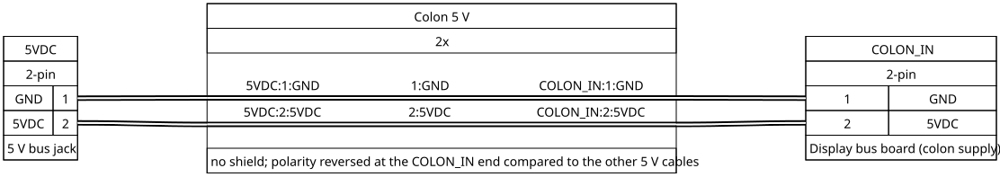

**Wire by wire.**

| 5 V bus jack, pin | Signal | `COLON_IN`, pin |
|---|---|---|
| 1 | `GND` | 1 |
| 2 | `5VDC` | 2 |

**Shield:** none.

> **Caution — this cable's polarity is reversed at `COLON_IN`.** The cable sheet marks this 5 V cable's
> polarity as reversed at the `COLON_IN` side, compared with the other 5 V cables. Where the reversal
> physically sits is not recorded.

**If it fails:** the colon stays dark while the digits light.

## 10.24 Motor driver 5 V — 5 V bus to the needle motor driver

**Carries:** 5 V and ground to the needle motor driver board. The 5 V feeds the ULN2003A's common pin
and the motor's common wire, with 0.1 µF and 47 µF to ground.

**Shape:** one 2-wire cable, from a 2-pin jack on the 5 V bus to `STEPPER_5VIN` on the driver board.
Which bus jack is not recorded.

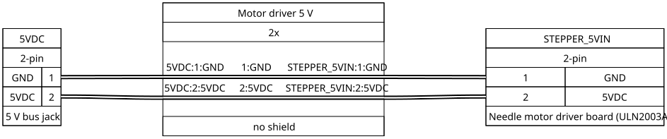

**Wire by wire.**

| 5 V bus jack, pin | Signal | Driver board end, pin |
|---|---|---|
| 1 | `GND` | 1 |
| 2 | `5VDC` | 2 |

**Shield:** none.

**If it fails:** the needle motor has no power and the needle does not move.

## 10.25 ADC 5 V — 5 V bus to the ADC board

**Carries:** 5 V and ground to the ADC board (PCM1802). The ADC module's 5 V pin has 100 µF and 0.1 µF
to ground.

**Shape:** one 2-wire cable, from a 2-pin jack on the 5 V bus to `ADC_5VIN` on the ADC board. Which bus
jack is not recorded. The pin numbers differ at the two ends in the cable sheet's numbering: at the ADC
end, pin 1 is 5 V and pin 2 is ground, reversed from the bus-jack end. This cable's pins do swap end to end,
but the cable sheet carries no caution note for it. The Colon 5 V cable is the other way round: its pin
numbers match end to end (section 10.23), yet the author's note on the sheet calls its polarity reversed.

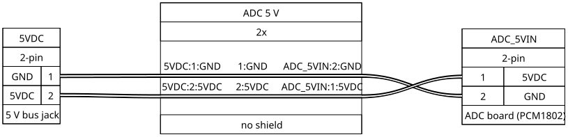

**Wire by wire.**

| 5 V bus jack, pin | Signal | ADC end, pin |
|---|---|---|
| 1 | `GND` | 2 |
| 2 | `5VDC` | 1 |

**Shield:** none.

**If it fails:** the radio goes silent while Bluetooth still plays.

## 10.26 Driver board 5 V — 5 V bus to the display driver board

**Carries:** 5 V and ground to the display driver board. The 5 V is what the four digit switches
deliver to the digits (section 10.27), and the ground is the return of both ULN2003A drivers.

**Shape:** one 2-wire cable, from a 2-pin jack on the 5 V bus to `DRIVERS_5VIN` on the driver board.
Which bus jack is not recorded.

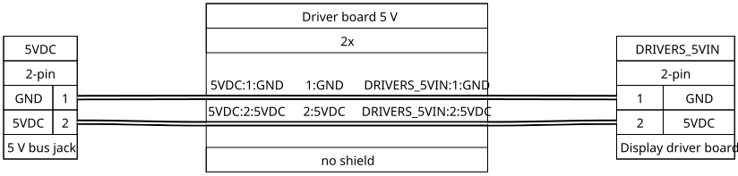

**Wire by wire.**

| 5 V bus jack, pin | Signal | Driver board end, pin |
|---|---|---|
| 1 | `GND` | 1 |
| 2 | `5VDC` | 2 |

**Shield:** none.

**If it fails:** the whole clock display goes dark; the colon has its own cable (section 10.23).

## 10.27 Digit rails — display driver board to the display bus board

**Carries:** each digit's switched 5 V. `D1` to `D4` are the drains of the four P-channel MOSFETs on the
driver board; each feeds the common anode of one digit, digit 1 being the rightmost.

**Shape:** one shielded 4-wire cable that ends in **two** connectors at the driver board: `DIGIT_OUT`
(4 pins) for the wires, and `DIGIT_OUT1` (2 pins) for the shield and the foil. At the display bus
board it ends in `DRIVER_IN`. The pin order runs opposite at the two ends.

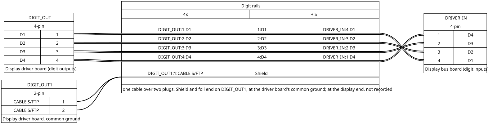

**Wire by wire.**

| Driver board end, pin | Signal | What it is | Display bus board end, pin |
|---|---|---|---|
| `DIGIT_OUT` 1 | `D1` | 5 V for digit 1 (rightmost) | 4 |
| `DIGIT_OUT` 2 | `D2` | 5 V for digit 2 | 3 |
| `DIGIT_OUT` 3 | `D3` | 5 V for digit 3 | 2 |
| `DIGIT_OUT` 4 | `D4` | 5 V for digit 4 (leftmost) | 1 |
| `DIGIT_OUT1` 1 and 2 | `CABLE S/FTP` | Shield and foil | — |

**Shield:** the shield and the foil end on the two pins of `DIGIT_OUT1`, at the driver board's common
ground. What they do at the display bus board end is not recorded.

**If it fails:** a broken wire leaves one digit dark.

## 10.28 Segment buses — display driver board to the display bus board

**Carries:** the seven segment lines, A to G. Each is the cathode line of one segment on all four
digits. The segment driver sinks it to ground through a 10 Ω and a 200 Ω resistor in series (chapter 7).

**Shape:** one 7-wire cable, pin for pin: `DISPLAY_OUT` at the driver board, `LEDITRON_IN` at the display bus
board.

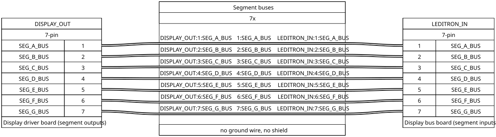

**Wire by wire.**

| Driver board end, pin | Signal | Display bus board end, pin |
|---|---|---|
| 1 | `SEG_A_BUS` | 1 |
| 2 | `SEG_B_BUS` | 2 |
| 3 | `SEG_C_BUS` | 3 |
| 4 | `SEG_D_BUS` | 4 |
| 5 | `SEG_E_BUS` | 5 |
| 6 | `SEG_F_BUS` | 6 |
| 7 | `SEG_G_BUS` | 7 |

**Shield:** none. There is no ground wire.

**If it fails:** a broken wire leaves one segment dark on all four digits, like a broken segment drive
wire (section 10.5).

## 10.29 Box-fan harness — amplifier supply to the box fan

This page and the ones after it describe wiring that is not on the cable sheet (section 10.1).

**Carries:** the amplifier supply's +20 V to the box fan's regulator, and the regulator's 12 V to the
box fan. The box fan runs on 12 V made from the amplifier supply's +20 V by an LM7812 regulator
(chapter 5, section 5.6).

**Shape:** two 2-pin connectors. `FAN_IN` carries +20 V and its return to the regulator's input.
`FAN_OUT` carries the regulator's 12 V output and its return to the fan. Which board each connector sits
on, and how the wires end at the supply and at the fan, are not recorded.

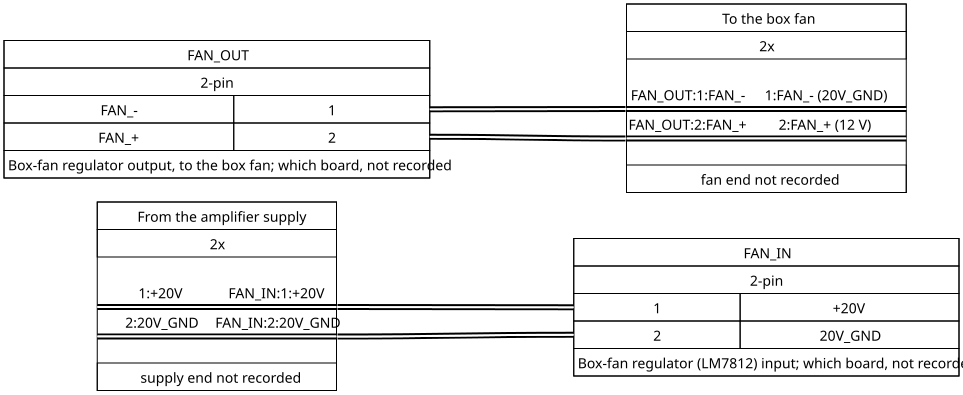

**Wire by wire.**

| Connector, pin | Signal | What it is |
|---|---|---|
| `FAN_IN` 1 | `+20V` | The regulator's input |
| `FAN_IN` 2 | `20V_GND` | The amplifier supply's return |
| `FAN_OUT` 1 | `FAN_-` | The fan's −, on `20V_GND` |
| `FAN_OUT` 2 | `FAN_+` | The fan's +, the regulator's 12 V output |

The fan runs only while the front power switch is on.

**If it fails:** the box fan stops while the radio plays (chapter 5, section 5.7).

## 10.30 Amplifier supply wires — amplifier supply to the amplifier

**Carries:** the amplifier's ±20 V supply, from the supply to the amplifier.

**Shape:** four wires. The connectors at both ends are not recorded.

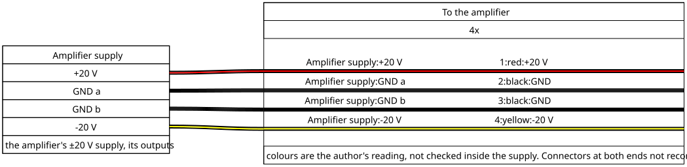

**Wire by wire.** The drawing gives each wire's colour and what it carries; chapter 5, section 5.6, has
the same as a table. These are the only wires in the machine whose colours are recorded. The colours
are the author's reading, not checked inside the supply.

## 10.31 USB — back panel to each board

**Carries:** USB, from the back panel to each board.

**Shape:** two USB-C connectors on the back panel lead to the two boards. `P2 (MAIN)` goes to the main
board's native USB port. `P1 (AUDIO)` goes to the audio board's USB-C. The cable type and length are not
recorded.

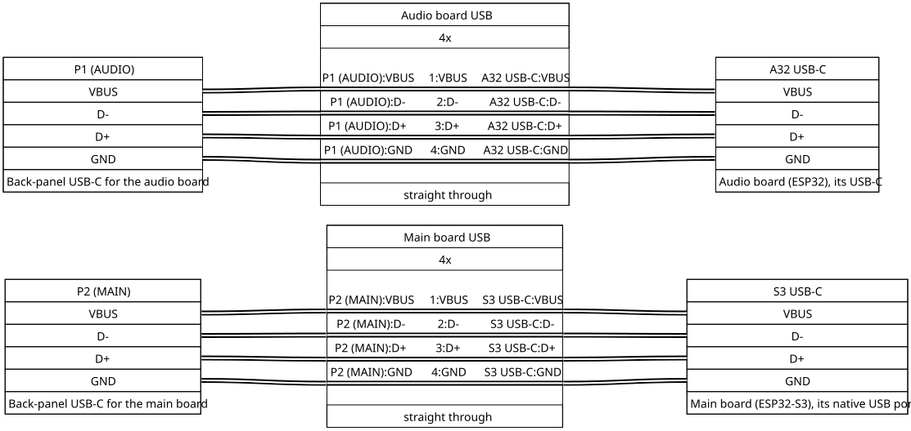

**Wire by wire.** Each connection carries all four lines straight through: `VBUS`, `D-`, `D+` and
`GND`. On each back-panel connector the other three ground pins (A12, B1 and B12) are joined together.
Nothing is recorded on the connectors' CC pins (the pins a USB-C host uses to detect a device).

> **Caution — USB power reaches the boards.** `VBUS` is carried through, so a computer plugged into the
> back panel feeds a board's USB power input while the 5 V bus feeds its 5V pin. Chapter 2, section 2.5,
> quotes Espressif's guides on this.

**If it fails:** that board can no longer be reached over USB from the back panel.

## 10.32 Needle motor lead — needle motor driver to the needle motor

**Carries:** the four coil drives of the needle motor, a 28BYJ-48 stepper, and the coils' common. The
driver outputs sink current to ground; the coils' common sits on 5 V.

**Shape:** the motor plugs into a 5-pin header on the needle motor driver board, marked "To 28BYJ-48"
(J9). It is the connector that comes with the common ULN2003A boards. The motor's own lead is not
recorded.

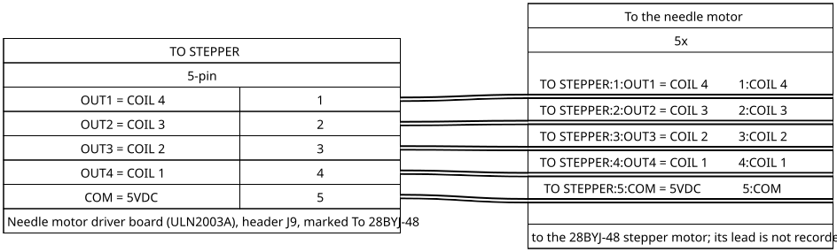

**Wire by wire.**

| Header pin | Signal | What it is |
|---|---|---|
| 1 | `OUT1` | Driver output 1, to coil 4 |
| 2 | `OUT2` | Driver output 2, to coil 3 |
| 3 | `OUT3` | Driver output 3, to coil 2 |
| 4 | `OUT4` | Driver output 4, to coil 1 |
| 5 | `COM` | The coils' common, on 5 V |

**If it fails:** the needle does not move, or moves erratically (chapter 8, section 8.7).

## 10.33 Panel-lamp leads — panel-lamp board to the four FM lamps

**Carries:** 5 V to the four FM panel lamps (LEDs), and each lamp's return to the panel-lamp board.

**Shape:** two connectors on the panel-lamp board. `5VOUT` (2 pins) carries 5 V to the four lamp
anodes. `LEDS RTN` (4 pins) brings each lamp's cathode back to its own 120 Ω resistor on the board. The
four resistors join on the MOSFET's drain (section 10.11). The wiring at the lamps is not recorded.

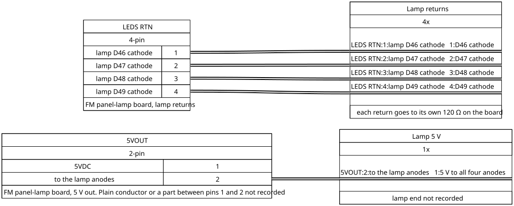

**Wire by wire.** On `5VOUT`, as drawn, pin 1 is on the board's 5 V and pin 2 goes to the four anodes.
Whether pin 1 and pin 2 are joined by a plain conductor or through a part is not recorded. On
`LEDS RTN`, each pin takes one lamp:

| `LEDS RTN` pin | What it is |
|---|---|
| 1 | Return from lamp D46's cathode |
| 2 | Return from lamp D47's cathode |
| 3 | Return from lamp D48's cathode |
| 4 | Return from lamp D49's cathode |

**If it fails:** a broken return leaves its one lamp dark; a broken 5 V lead leaves all four dark
(chapter 9, section 9.6).

## 10.34 Inside the clock display — colon and digits

**Carries:** the colon LED's two leads, and each digit's seven segment lines and its common anode.
The colon's chain is 5 V → 33 Ω → colon LED → variable resistor (glued at 1.5 kΩ) → ground; the
variable resistor sits at the colon module. Each digit is built of seven segment LEDs whose anodes join
on pin 8 of its 8-pin header, with each segment's cathode on pins 1 to 7.

**Shape — the colon.** On the display bus board, the colon output (U35) has two pins. How the wires run
to the colon is not recorded.

**Shape — the digits.** Each digit's header is drawn plugged into its own 8-pin socket, pin for pin; no
cable is drawn. The display bus board has four 8-pin digit outputs, which carry the same signals on the
same pin numbers. Whether those outputs are the sockets the digits plug into is not recorded.

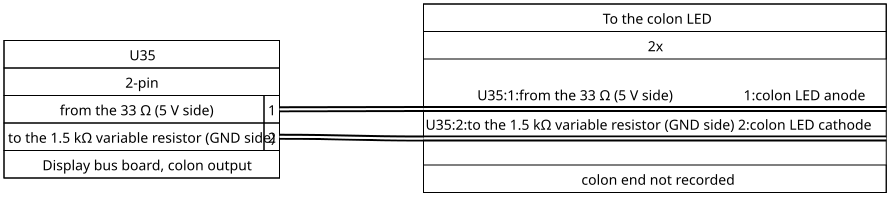

**Wire by wire — the colon.** Pin 1 of the colon output comes from the 33 Ω, and pin 2 goes to the
variable resistor. The colon LED sits between them, anode on pin 1.

**Wire by wire — the digits.** Pins 1 to 7 carry the same signal on every socket and every output;
pin 8 is each digit's own common:

| Pin | Signal on the socket and on the output | At the digit |
|---|---|---|
| 1 | `SEG_A_BUS` | Segment A cathode |
| 2 | `SEG_B_BUS` | Segment B cathode |
| 3 | `SEG_C_BUS` | Segment C cathode |
| 4 | `SEG_D_BUS` | Segment D cathode |
| 5 | `SEG_E_BUS` | Segment E cathode |
| 6 | `SEG_F_BUS` | Segment F cathode |
| 7 | `SEG_G_BUS` | Segment G cathode |
| 8 | `D1`, `D2`, `D3` or `D4` | Common anode |

Pin 8 is `D1` on output 1 (U18), `D2` on output 2 (U17), `D3` on output 3 (U19) and `D4` on output 4
(U32). Digit 1 is the rightmost.

**If it fails:** a broken colon lead leaves the colon dark. A bad contact on one pin of a digit's
header leaves that segment dark in that digit only; on pin 8, the whole digit goes dark (chapter 7,
section 7.8).

## 10.35 FM receiver antenna and the antenna coax

Neither of these is drawn as a cable, and no pins are recorded for them. So this page has no drawing
and no wire table.

**Carries:** two antenna signals: the FM calibration receiver's antenna wire, and the FM antenna's coax
into the machine.

**Shape — the receiver's antenna.** The FM calibration receiver's antenna is a 30 cm wire inside the tube radio's Faraday cage, bent in
a U over the radio's FM oscillator section. It reaches the receiver board through a 2×3 pin grid (U71),
so that you can unplug the receiver from its antenna during a repair. Which pins of the grid carry the
wire is not recorded.

**Shape — the antenna coax.** The antenna's coax arrives at a BNC male connector (J10) on the back panel: its
centre carries the antenna signal `ANT`, and its shell is on Earth. The tube radio's antenna input is a
second coax connector (J53); chapter 13, section 13.11, gives the radio's side of it. **No cable joining
J10 to J53 is drawn or recorded.** The antenna itself is in chapter 11; the earth path is in chapter 5,
section 5.4.

**If it fails:** if the receiver's antenna wire or its pin grid fails, the receiver still answers the
main board but finds no signal (chapter 8, section 8.7).

## 10.36 Mains and earth wiring

The mains wiring (inlet, front power switch, 5 V supply, amplifier supply, line filter and tube radio)
and the earth wiring (the inlet's earth, the amplifier's back plate, the three Faraday cages and the
antenna's earth) are described in chapter 5, sections 5.2 to 5.4. They are not drawn here. The mains
wires' gauges and colours are not recorded.

## 10.37 When something is wrong

Find what you see in the left column; the right column names the cable pages to check.

| You see | Check |
|---|---|
| A cable needs replacing | Each wire is identified by its signal name, not by its position (section 10.1). Each page says at which end the shield is joined to ground. |
| One segment dark on every digit | Segment drive (10.5), then segment buses (10.28) |
| One digit dark | Digit select (10.8), then digit rails (10.27) |
| Whole display dark, colon lit | Driver board 5 V (10.26) |
| Colon dark, digits lit | Colon 5 V (10.23), and its reversed polarity |
| Needle does not move | Needle motor control (10.6), motor driver 5 V (10.24), needle motor lead (10.32) |
| Needle never finds its reference point | Needle index sensor harness (10.9) |
| Main board reads "amplifier off" with the amplifier on | Amplifier power sensor cable (10.7) |
| Panel lamps dark | Panel-lamp control (10.11), then the lamp leads (10.33) |
| Radio silent, Bluetooth plays | Radio to ADC (10.22), ADC 5 V (10.25), the ADC branch of the audio harness (10.15) |
| Radio and Bluetooth silent, AUX plays | DAC to amplifier (10.21), the DAC branch of the audio harness and its power lead (10.15) |
| Source switch stuck on AUX in one or all positions | Source switch cables (10.20) |
| Volume knob does nothing | Front volume knob cables (10.13), audio board 3.3 V (10.19) |
| Bluetooth LED dark, or button dead | Bluetooth button and LED cable (10.14) |
| The two boards do not talk | Board link (10.12) |
