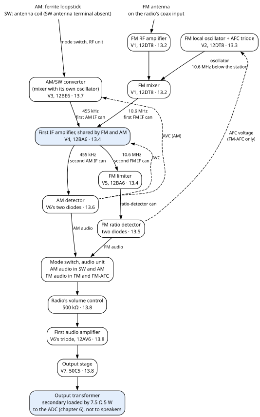
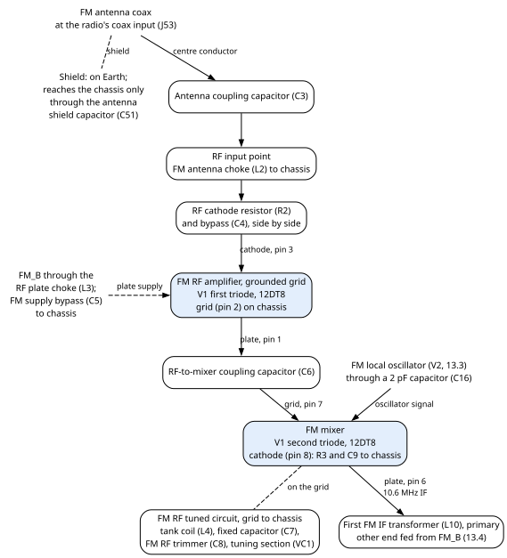
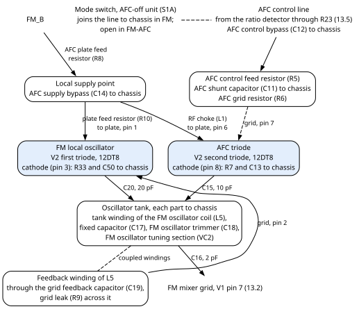
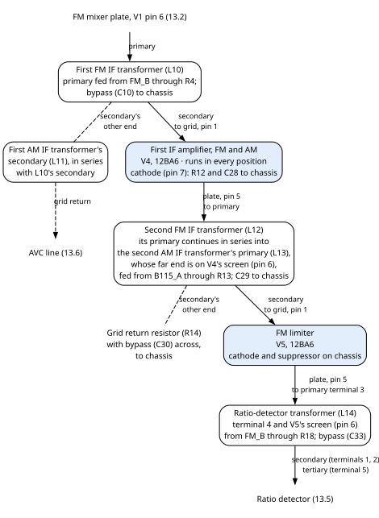
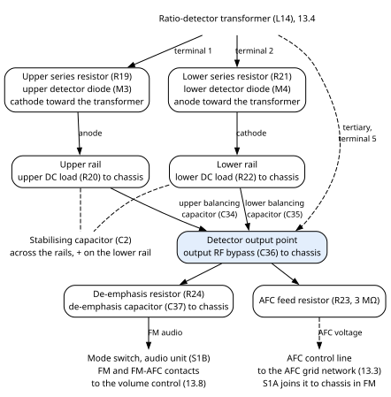

# 13. The tube radio (LLOYDS TM-838N)

The tube radio is the part of Ambersong that receives. It is a LLOYDS TM-838N, an AM, short-wave (SW)
and FM table set with seven tubes, kept on its own chassis inside the cabinet. When you listen to the
radio, every station is found, amplified and detected by these tubes; the rest of the machine only
digitises the result. This chapter describes the set stage by stage, as fitted in this machine, so that
you can check or repair it without its schematic.

This is one TM-838N as fitted and repaired. Another set of the same model will differ in details.

> **Danger — a radio with no mains transformer.** The radio's chassis sits on mains neutral, and its
> high-voltage supply (B+) is made straight from the mains. Read chapter 2 before you work on it, and
> unplug the cord first.

## 13.1 Overview

### 13.1.1 What the set is

The set receives three bands, chosen with its four-position **mode switch**: **SW**, **AM**, **FM**
and **FM-AFC**. FM-AFC is FM with **automatic frequency control (AFC)** switched on: a voltage from the
FM detector keeps the FM oscillator on the station (section 13.3).

It is a **superheterodyne**. A **mixer** combines the incoming station with the signal of a **local
oscillator** inside the set, and passes on the difference, the **intermediate frequency (IF)**. The IF
is the same for every station, so the stages after the mixer stay tuned to it and never move.

FM has its own **front end**, the stages that take the station at its own radio frequency (**RF**) and
mix it down to the IF. AM and SW share another front end, and use a different IF:

| Band | Front end | IF |
|---|---|---|
| FM | the FM RF amplifier and mixer (V1), with the FM local oscillator (V2) | **10.6 MHz** |
| AM and SW | the converter (V3), a mixer tube with its own oscillator | 455 kHz |

The two paths meet at the **first IF amplifier (V4)**, which amplifies both IFs. After it, the FM IF goes
to the **FM limiter (V5)** and the **ratio detector**. The AM IF goes to the **AM detector**, the two
diodes inside V6. The audio unit of the mode switch picks the audio of one of the two detectors. From
there the sound passes through the radio's **volume control**, the **first audio amplifier** (V6's
triode), the **output stage (V7)** and the **output transformer**.

**The FM IF is 10.6 MHz.** It was set when a professional, Radio Hosvep on Park Ave., tuned the FM
path. The readings of the FM calibration receiver, the single-chip FM receiver the main board uses to
calibrate the dial (chapter 8), agree: they find the FM local oscillator one IF below each station. 10.7 MHz, the figure
the SAMS service data gives (section 13.1.3), is the design value. Only the FM path was tuned: the three
FM IF transformers (L10, L12 and L14) and what touches them. The AM and SW path was not.

The set is built the old "AC/DC" way. It has no mains transformer: its seven tube heaters are wired in
series across the mains (section 13.9), and a single rectifier makes its B+ straight from the mains
(section 13.10).

### 13.1.2 How it sits in Ambersong

The radio is a unit of its own inside the cabinet. The table lists every place where it meets the rest of
the machine:

| Where the radio meets the machine | What happens there | More in |
|---|---|---|
| Mains | The radio is fed from the front power switch through the mains line filter. It has its own power switch and a 0.75 A fuse. | chapter 5; 13.10 |
| Chassis | The radio's circuit common, `CHASSIS`, is on mains neutral. It is never joined to Earth or to the Faraday cages. | chapter 2 |
| FM antenna | The antenna's coax arrives at the radio's coax input. Its shield is on Earth and reaches the chassis only through one safety capacitor. | 13.2; chapter 11 |
| Sound out | The output transformer's secondary, loaded by a 7.5 Ω 5 W resistor, feeds the ADC (the analogue-to-digital converter board) through a shielded cable. The feed is mono. | 13.11; chapter 6; chapter 10, section 10.22 |
| Speakers | SP1 and SP2 are the radio's original speakers as drawn by the factory. In this machine the radio's output feeds the 7.5 Ω load and the ADC, not speakers. | 13.8 |
| Volume | The radio's own volume control sits at about one eighth of its travel in normal use. Above that the sound is too loud further down the chain; it is not clipped. | 13.8; chapter 6 |
| Tuning | A printed front knob, on a printed shaft extension, turns the radio's original tuning knob, which drives the dial cord and the four-section tuning capacitor. A magnetic angle sensor reads its shaft; a motor, not the dial cord, moves the needle. | chapter 8 |
| FM calibration receiver | Its antenna is a 30 cm wire inside the radio's cage, bent in a U over the FM oscillator section. | 13.3; chapter 8 |
| Cage and fan | The radio sits under its own earthed Faraday cage, with a 5 V fan blowing air into it. | chapters 3 and 5 |

### 13.1.3 Fitted values and original specifications

Each stage has a parts table with two value columns:

- **Fitted** is the part in this radio now.
- **Original** is what the two original documents give: the **factory drawing** and the **SAMS** service
  data. "Same" means both give the fitted value. Where they differ, the table gives both; the fitted
  value is what is in the radio. Where neither gives a value, the table says so.

Unless a table says otherwise, neither original gives a resistor's wattage or tolerance or a capacitor's
voltage rating, and none is recorded for the fitted parts.

**Substitutes and selection notes.** The original specifications come with notes on catalogue
substitutes and on choosing a replacement, from a component list the author compiled and has not
published. That list is not in this book. A "listed substitute" in a parts table is one named in that
list, and a note on what to match when you replace a part is that list's selection note. They describe
the original part, though a few notes mention the fitted one.

**Three-lead capacitors.** Four ceramic capacitors have three leads: the FM supply bypass (C5), the AFC
shunt (C11), the AFC supply bypass (C14) and one heater-string bypass (C48). The middle lead is wired to
the chassis, and the two outer leads have 0 Ω between them.

**Terminal numbers are logical.** The numbers and letters given here for coil terminals and mode-switch
contacts identify connections on the drawing and in the SAMS data. They are not the numbers on the parts'
lugs, and which lug is which has not been recorded.

**IF transformers.** Each IF transformer sits in a shielded metal **can**, together with its own tuning
capacitors. Neither original gives the values of those capacitors.

**Trimmers and padders.** Two kinds of small capacitor recur in the tuned circuits. A **trimmer** is a
small adjustable capacitor set once, during alignment. A **padder** is a fixed capacitor in series with
an oscillator coil; it makes the oscillator track the station across the dial.

### 13.1.4 Tube line-up

The set has seven tubes. "New old stock" means a tube that was made in the period and never used. The
three new-old-stock tubes (V1, V2 and V6) were fitted by Radio Hosvep on Park Ave.; their types and
connections are the original ones.

| Tube | Type | What it does | Section |
|---|---|---|---|
| V1 | 12DT8 twin triode, new old stock | first triode: FM RF amplifier; second triode: FM mixer | 13.2 |
| V2 | 12DT8 twin triode, new old stock | first triode: FM local oscillator; second triode: AFC triode | 13.3 |
| V3 | 12BE6 pentagrid converter | AM and SW mixer with its own oscillator | 13.7 |
| V4 | 12BA6 pentode | first IF amplifier, for FM and AM | 13.4, 13.6 |
| V5 | 12BA6 pentode | FM limiter | 13.4 |
| V6 | 12AV6 duplex-diode triode, new old stock | its two diodes: AM detector; its triode: first audio amplifier | 13.6, 13.8 |
| V7 | 50C5 beam power tube | audio output | 13.8 |

The tube pin assignments and the order of the heater string given in this chapter were checked on the
chassis. The tubes' published ratings:

| Type | Base | Heater |
|---|---|---|
| 12DT8 | 9-pin miniature (noval, B9A), EIA basing 9DE | 12.6 V, 0.15 A |
| 12BE6 | 7-pin miniature (B7G), EIA basing 7CH | 12.6 V, 0.15 A |
| 12BA6 | 7-pin miniature (B7G), basing 7BK | 12.6 V, 0.15 A |
| 12AV6 | 7-pin miniature (B7G) | 12.6 V, 0.15 A |
| 50C5 | 7-pin miniature (B7G), EIA basing 7CV | 50 V, 0.15 A, for series heater strings |

> **Caution — a 12DT8 is not a 12AT7.** The two are alike except for their heater and heater-to-cathode
> ratings, their capacitances and their **basing**. Do not assume a 12AT7 pinout when you wire or test a
> 12DT8 socket. The 12DT8's two triodes are separated by an internal shield on its own pin (pin 9).

### 13.1.5 Block diagram

Dashed lines are control voltages, not signal. **AVC** (automatic volume control) is a voltage from the
AM detector that sets the gain of the first IF amplifier, and in AM of the converter, so that strong and
weak stations come out at similar levels (section 13.6).

### 13.1.6 The mode switch

The mode switch is one rotary switch with four positions. The factory drawing calls it a set of
mechanically linked band, supply, audio, AFC and neon contacts; SAMS (its part M5) gives four positions
and three physical sections. The drawing splits it into seven units, S1A to S1G. They are seven
functions of one switch, not seven switches, and they all turn together.

The table gives, for each unit, where its common goes and what the common is joined to in each position:

| Unit, and its job | Its common goes to | SW | AM | FM | FM-AFC | Contacts (common; SW, AM, FM, FM-AFC) |
|---|---|---|---|---|---|---|
| **S1A**, AFC off | chassis | not connected | not connected | the AFC control line: **AFC off** | not connected: **AFC on** | 13; 1, 2, 3, 4 |
| **S1B**, audio | top of the radio's volume control | AM audio | AM audio | FM audio | FM audio | 14; 5, 6, 7, 8 |
| **S1C**, RF selection | the converter's signal grid (V3 pin 7) and the AM/SW RF tuning section (VC3) | SW antenna coil and its trimmer | AM loopstick and its trimmer | not connected | not connected | 15; 9, 10, 11, 12 |
| **S1D**, B+ | the last point of the B+ filter (`B115_A`) | AM supply, `AM_B` | `AM_B` | FM supply, `FM_B` | `FM_B` | 14; 5, 6, 7, 8 |
| **S1E**, mode lamps | the neon feed, from the fused live through a 50 kΩ resistor (R32) | SW lamp (NE1) | AM lamp (NE2) | FM lamp (NE3) | FM lamp (NE3) | 15; 9, 10, 11, 12 |
| **S1F**, oscillator tank | the AM/SW oscillator tuning section (VC4) and feedback capacitor (C25) | SW padder (C26, 0.003 µF) | AM padder (C27, 350 pF) and AM oscillator trimmer (C23B) | not connected | not connected | 15; 9, 10, 11, 12 |
| **S1G**, oscillator feedback | the converter's cathode (V3 pin 2) | tap of the SW oscillator coil (L9) | tap of the AM oscillator coil (L8) | not connected | not connected | 13; 1, 2, 3, 4 |

The contact numbers are logical (section 13.1.3), and **the same number on two units is not the same
contact**. SAMS describes the switch as three physical sections, or wafers, and the numbers repeat from
one to another. S1A's common 13 is on the chassis, for example, while S1G's common 13 is on the
converter's cathode. S1C's numbers are SAMS's markings for the switch's second section; S1F's and
S1G's are its markings for the third.

**What the B+ unit decides.** `AM_B` feeds the converter (V3), whose plate supply passes through the
primary of the first AM IF transformer. `FM_B` feeds the FM RF amplifier and mixer (V1), the FM oscillator
and AFC triode (V2), the limiter (V5) and the first FM IF transformer's primary. So V1, V2 and V5 run only
in FM and FM-AFC, and V3 only in SW and AM. The first IF amplifier (V4), the first audio amplifier (V6)
and the output stage (V7) are fed from the B+ filter directly, in every position. Their supply is
`B115_A`, and, through the output transformer, `B130`, the first filtered B+ point.

**The mode lamps are not fitted.** The neon bulbs NE1, NE2 and NE3 are absent from this radio. Their
resistor (R32) and the S1E contacts are fitted.

> **Caution — replacing the mode switch.** No commercial substitute is listed. A replacement must match
> this whole truth table, the shaft and detents, and the insulation and current ratings.

### 13.1.7 How parts are named in this chapter

Every part is named by what it does, with its reference from the radio's drawing in brackets: "the FM
RF trimmer (C8)". **Always read the two together.** Many of the radio's references are also used for
different parts elsewhere in the machine: C13 to C30, J2 to J4 and R17 exist on the main drawing too, and
M1 is both the radio's fuse and the box fan. Where a reference stands alone in this chapter, it is the
radio's part.

The first letters of the radio's references mean:

| Letter | In the radio |
|---|---|
| V | a tube |
| R, C, L | resistor, capacitor, coil or transformer |
| VC | a section of the four-section tuning capacitor (VC1 to VC4, one assembly, SAMS part M2) |
| S | a switch: S1 is the mode switch, S2 the power and tone switch (SAMS part M6) |
| M | a part numbered from the SAMS list: the fuse (M1), the FM detector diodes (M3, M4) |
| J | a terminal or connector |
| NE, SP, T, X | neon lamp, speaker, transformer, rectifier |

The output transformer (T1) carries the same reference in the radio and in the rest of the machine: it is
one part.

Signal names in `code font` are the drawing's names for a connection, such as `FM_B` for the FM B+
supply. They are used where a connection reaches beyond one stage.

## 13.2 FM RF amplifier and mixer (V1, 12DT8)

V1 holds two triodes. The first is the **FM RF amplifier**: it lifts the weak signal from the antenna.
Its grid is held at the chassis and the signal enters at its cathode, a **grounded-grid** amplifier. The
second triode is the **FM mixer**. It takes the amplified station and the FM local oscillator's signal
from V2. It sends their difference, the 10.6 MHz IF, to the first FM IF transformer. Both triodes take
their B+ from `FM_B`, so they work only in FM and FM-AFC.

### 13.2.1 How it is joined

**Antenna input.** The FM antenna's coax arrives at the radio's coax input (J53). Its centre conductor
goes through the antenna coupling capacitor (C3) to the **RF input point**. From that point the FM
antenna choke (L2) goes to the chassis. The RF cathode resistor (R2) and the RF cathode bypass capacitor
(C4), side by side, go from the same point to the RF triode's cathode. The coax shield is on Earth and
reaches the chassis only through the antenna shield capacitor (C51). The radio first had a simple wire
antenna; the coax input replaced it.

**RF triode.** The grid (pin 2) is on the chassis. The plate (pin 1) is fed from `FM_B` through the RF
plate choke (L3), and `FM_B` is bypassed to the chassis there by the FM supply bypass capacitor (C5). The
plate's signal goes to the mixer grid through the RF-to-mixer coupling capacitor (C6).

**Mixer grid.** The mixer grid (pin 7) sits on the **FM RF tuned circuit**, or **tank**. It is four
parts, each joined from the grid to the chassis: the FM RF tank coil (L4), the tank's fixed capacitor
(C7), the FM RF trimmer (C8) and the FM RF tuning section (VC1). The FM oscillator's signal arrives on the same grid through a 2 pF
capacitor (C16, section 13.3).

**Mixer cathode and plate.** The cathode (pin 8) goes to the chassis through the mixer cathode resistor
(R3) and its bypass capacitor (C9), side by side. The plate (pin 6) goes to the primary of the first FM
IF transformer (L10). The plate's B+ comes through that primary, whose other end is fed from `FM_B`
(section 13.4).

**Heater and shield.** The heater is on pins 4 and 5, in the series string (section 13.9). The internal
shield, pin 9, is on the chassis.

### 13.2.2 V1's pins

The table gives each of V1's pins and what it is joined to.

| Pin | What it is | Joined to |
|---|---|---|
| 1 | RF triode plate | RF plate choke (L3) to `FM_B`; coupling capacitor (C6) to the mixer grid |
| 2 | RF triode grid | chassis |
| 3 | RF triode cathode | RF cathode resistor (R2) and bypass (C4), to the RF input point |
| 4 | heater | heater string, toward the FM oscillator tube's heater through a heater choke (L15) |
| 5 | heater | heater string, from the converter's heater through a heater choke (L16) |
| 6 | mixer plate | primary of the first FM IF transformer (L10) |
| 7 | mixer grid | FM RF tuned circuit (L4, C7, C8, VC1); oscillator injection (C16) |
| 8 | mixer cathode | mixer cathode resistor (R3) and bypass (C9), to chassis |
| 9 | internal shield | chassis |

### 13.2.3 Parts

The stage's parts, with their fitted and original values (section 13.1.3):

| Part | Fitted | Original | Notes |
|---|---|---|---|
| FM RF amplifier and mixer tube (V1) | 12DT8, new old stock | 12DT8 | |
| Radio's FM coax input (J53) | coax connector, RG179 coax | a simple wire antenna | centre to the antenna coupling capacitor (C3); shield to Earth |
| Antenna coupling capacitor (C3) | 100 pF, safety class X1Y1 | 100 pF (factory and SAMS) | A safety-rated part (chapter 2, section 2.4); no voltage rating recorded. The substitutes listed for the original are DC-rated and do not establish a modern safety class or insulation design. |
| FM antenna choke (L2) | 1 µH, 23 turns | factory 1 µH; SAMS adds 23 turns | |
| RF cathode resistor (R2) | 70 Ω | factory 70 Ω; SAMS 68 Ω, with 70 Ω as an alternate | |
| RF cathode bypass capacitor (C4) | 0.002 µF | same | |
| Antenna shield capacitor (C51) | 0.001 µF, safety class X1Y2 | not recorded | The coax shield's only path to the chassis. A safety-rated part (chapter 2, section 2.4); no voltage rating recorded. Where it came from is not recorded. |
| RF plate choke (L3) | 3 µH | same | SAMS: DCR about 0.9 Ω. |
| FM supply bypass capacitor (C5) | 0.002 µF, three-lead ceramic | factory 0.002 µF; SAMS schematic 0.01 µF (0.002 µF alternate); SAMS parts table 0.002 µF | Middle lead to chassis (section 13.1.3). |
| RF-to-mixer coupling capacitor (C6) | 100 pF | same | |
| FM RF tank coil (L4) | tuned coil | no inductance in either original | |
| Tank's fixed capacitor (C7) | 5 pF | same | |
| FM RF trimmer (C8) | trimmer | no value in either original | Range and dielectric not specified. Belongs with the tuning capacitor assembly. |
| FM RF tuning section (VC1) | section of the four-section tuning capacitor | part of SAMS's tuning assembly M2; no range given | Turns with the other three sections of the tuning capacitor. A replacement must match the minimum and maximum capacitance, tracking, shaft and gang geometry, and trimmers. |
| Mixer cathode resistor (R3) | 1 kΩ | same | |
| Mixer cathode bypass capacitor (C9) | 0.01 µF | same | |

### 13.2.4 How to check it

- **Coil resistance.** SAMS gives a DCR (DC resistance) of about 0.9 Ω for the RF plate choke (L3). A DCR
  is a check for an open winding, not a measure of inductance.
- **The three-lead bypass (C5).** Its two outer leads read 0 Ω to each other, and the middle lead goes to
  the chassis.
- **The antenna side.** The coax shield reaches the chassis only through the antenna shield capacitor
  (C51). Nothing else joins them.
- **Tube pins.** Use the table in section 13.2.2, not a 12AT7 pinout.

## 13.3 FM local oscillator and AFC (V2, 12DT8)

V2 also holds two triodes. The first is the **FM local oscillator**. It runs **one IF below the
station**: oscillator frequency = station − 10.6 MHz. For a station at 100.0 MHz it runs at 89.4 MHz. Its
tuning section (VC2) turns with the FM RF tuning section (VC1), so the oscillator follows the dial. The
second triode is the **AFC triode**. Its plate is coupled into the oscillator's tuned circuit, and its
grid takes the AFC control voltage from the ratio detector. In FM-AFC that voltage nudges the oscillator
so the station stays tuned. In FM the mode switch holds it at the chassis, and AFC is off. Both triodes
work only in FM and FM-AFC.

### 13.3.1 How it is joined

**Supply.** `FM_B` reaches this stage only through the AFC plate feed resistor (R8). After it, a local
supply point is bypassed to the chassis by the AFC supply bypass capacitor (C14). This point feeds both
triodes: the AFC plate through an RF choke (L1), and the oscillator plate through the oscillator plate
feed resistor (R10).

**Oscillator tuned circuit.** The oscillator's tank is four parts, each joined from the tank to the
chassis: the tank winding of the FM oscillator coil (L5), the tank's fixed capacitor (C17), the FM
oscillator trimmer (C18) and the FM oscillator tuning section (VC2). Three capacitors meet the tank: the
oscillator plate's (C20, 20 pF), the AFC plate's (C15, 10 pF), and the one that carries the oscillator's
signal out to the FM mixer grid, V1 pin 7 (C16, 2 pF).

**Oscillator feedback.** The FM oscillator coil (L5) has two coupled windings: the tank winding and a
**feedback winding**. One end of each is on the chassis. The feedback winding's other end goes to the
oscillator grid (pin 2) through the grid feedback capacitor (C19), with the grid leak resistor (R9)
across it. A **grid leak** is the resistor that gives a grid its DC path to the chassis. The oscillator
cathode (pin 3) goes to the chassis through the oscillator cathode resistor
(R33) and its bypass capacitor (C50), side by side.

**AFC triode.** The AFC control line arrives from the ratio detector through a 3 MΩ resistor (R23,
section 13.5) and is bypassed to the chassis by the AFC control bypass capacitor (C12). From there the
AFC control feed resistor (R5) leads to a point that the AFC shunt capacitor (C11) joins to the chassis.
From that point the AFC grid resistor (R6) leads on to the AFC grid (pin 7). The grid has no other
connection. The
AFC cathode (pin 8) goes to the chassis through the AFC cathode resistor (R7) and its bypass capacitor
(C13), side by side. The AFC plate (pin 6) is fed through the RF choke (L1) and coupled to the
oscillator tank through its coupling capacitor (C15).

**In FM**, the AFC-off unit of the mode switch (S1A) joins the AFC control line to the chassis. In
FM-AFC that contact is open (section 13.1.6).

**Heater and shield.** The heater is on pins 5 and 4. Pin 5 comes from the FM RF tube's heater through a
heater choke (L15). **Pin 4 is the chassis end of the whole heater string**: V2 is the last tube in it
(section 13.9). The internal shield, pin 9, is on the chassis.

**Near this stage.** The FM calibration receiver's antenna, a 30 cm wire, lies over this section, bent in
a U, inside the radio's cage. It is not connected to the radio (chapter 8).

### 13.3.2 V2's pins

The table gives each of V2's pins and what it is joined to.

| Pin | What it is | Joined to |
|---|---|---|
| 1 | oscillator plate | plate feed resistor (R10) to the local supply; plate coupling capacitor (C20) to the tank |
| 2 | oscillator grid | grid feedback capacitor (C19) with grid leak (R9) across it, to the feedback winding |
| 3 | oscillator cathode | oscillator cathode resistor (R33) and bypass (C50), to chassis |
| 4 | heater | chassis: the end of the heater string |
| 5 | heater | heater string, from the FM RF tube through a heater choke (L15) |
| 6 | AFC plate | RF choke (L1) to the local supply; coupling capacitor (C15) to the tank |
| 7 | AFC grid | AFC grid resistor (R6) only |
| 8 | AFC cathode | AFC cathode resistor (R7) and bypass (C13), to chassis |
| 9 | internal shield | chassis |

### 13.3.3 Parts

The stage's parts, with their fitted and original values (section 13.1.3):

| Part | Fitted | Original | Notes |
|---|---|---|---|
| FM oscillator and AFC tube (V2) | 12DT8, new old stock | 12DT8 | |
| AFC control feed resistor (R5) | 250 kΩ | same | |
| AFC shunt capacitor (C11) | 0.002 µF, three-lead ceramic, from the AFC grid network to chassis | factory 0.002 µF; SAMS 0.001 µF | The fitted C11 is a shunt from the AFC line (`AFC_C`, the point between the AFC control feed resistor R5 and the AFC grid resistor R6) to chassis. SAMS's substitute list is for its 0.001 µF part. Middle lead to chassis (section 13.1.3). |
| AFC grid resistor (R6) | 100 Ω | same | |
| AFC control bypass capacitor (C12) | 0.01 µF | factory 0.01 µF; SAMS 0.001 µF | |
| Oscillator cathode resistor (R33) | 600 Ω | not recorded | |
| Oscillator cathode bypass capacitor (C50) | 0.01 µF | not recorded | |
| AFC cathode resistor (R7) | 600 Ω | same | |
| AFC cathode bypass capacitor (C13) | 0.01 µF | factory 0.01 µF; SAMS schematic 0.002 µF (0.01 µF alternate); SAMS parts table 0.01 µF | |
| AFC RF choke (L1) | 3 µH | same | SAMS: DCR about 0.9 Ω. |
| AFC plate feed resistor (R8) | 1 kΩ | same | |
| AFC supply bypass capacitor (C14) | 0.002 µF, three-lead ceramic | same | Middle lead to chassis (section 13.1.3). |
| AFC-to-oscillator coupling capacitor (C15) | 10 pF | same | |
| Oscillator-to-mixer coupling capacitor (C16) | 2 pF | same | Several listed substitutes, Sprague among them, are 2.2 pF. Prefer a low-loss NP0 part of exactly 2 pF. |
| Oscillator tank's fixed capacitor (C17) | 5 pF | same | |
| FM oscillator trimmer (C18) | trimmer | no value in either original | Range and dielectric not specified. Belongs with the tuning capacitor assembly. |
| FM oscillator tuning section (VC2) | section of the four-section tuning capacitor | part of SAMS's tuning assembly M2; no range given | Turns with the other three sections of the tuning capacitor. |
| FM oscillator coil (L5) | two coupled windings, tank and feedback | factory: two coupled windings; SAMS: one tapped winding; no inductance in either | **Do not replace it with a tapped oscillator coil** on the strength of its name. |
| Grid feedback capacitor (C19) | 50 pF | same | |
| Grid leak resistor (R9) | 20 kΩ | same | |
| Oscillator plate feed resistor (R10) | 30 kΩ | factory 30 kΩ, with a different supply connection; SAMS 10 kΩ | |
| Oscillator plate coupling capacitor (C20) | 20 pF, from the oscillator plate to the tank | factory 20 pF | SAMS's C20 is a different part, a 0.002 µF bypass; its substitutes do not apply here. The factory part's dielectric, tolerance and voltage rating are unknown. |

### 13.3.4 How to check it

- **The oscillator's frequency.** The FM calibration receiver hears this oscillator: its readings put the
  oscillator one IF, 10.6 MHz, below each station (chapter 8).
- **AFC off in FM.** With the cord out, the mode switch's AFC-off unit (S1A) joins the AFC control line to
  the chassis on FM, and that contact is open on FM-AFC.
- **Coil resistance.** SAMS gives a DCR of about 0.9 Ω for the AFC RF choke (L1).
- **The three-lead capacitors (C11, C14).** The two outer leads read 0 Ω to each other, and the middle
  lead goes to the chassis.

## 13.4 The FM IF path (V4, V5, 12BA6)

The **IF amplifiers** raise the 10.6 MHz IF from the mixer to a level the detector can use. The first,
V4, is shared with AM. Its grid circuit holds the secondaries of the first FM and the first AM IF
transformers in series. Its plate circuit holds the primaries of the second FM and the second AM IF
transformers in series. So the one tube amplifies both IFs. The second, V5, is the **FM limiter**: it
clips the IF to a steady level, so that the detector answers to changes of frequency rather than of
strength. V5 feeds the ratio-detector transformer.

### 13.4.1 How it is joined

**First FM IF transformer (L10).** Its primary runs from terminal P, on the FM mixer plate (V1 pin 6),
to terminal B, on a supply point. The first FM IF supply resistor (R4) feeds that point from `FM_B`, and
the first FM IF supply bypass capacitor (C10) joins it to the chassis. Terminal G of L10's secondary
drives V4's control grid (pin 1). Terminal E, the other end, is in series with the secondary of the
first AM IF transformer (L11), joining L11's terminal G; L11's far end is on the AVC line. The letters
are logical (section 13.1.3). **V4's grid therefore returns to the AVC
line through both secondaries.**

**V4.** The cathode (pin 7) goes to the chassis through the first IF cathode resistor (R12) and its
bypass capacitor (C28), side by side. The suppressor grid (pin 2) is on the chassis. The plate (pin 5)
feeds the primary of the second FM IF transformer (L12), and that primary continues in series into the
primary of the second AM IF transformer (L13). The far end of that AM primary shares a point with V4's
screen grid (pin 6). The AM IF screen supply resistor (R13, 1 kΩ) feeds that point from `B115_A`, and its
bypass capacitor (C29, 0.01 µF) joins it to the chassis (section 13.6). **None of V4's supply comes from
`FM_B`**, so V4 runs in every position.

**V5.** One end of the second FM IF transformer's secondary (L12) drives V5's control grid (pin 1). The
other end goes to the chassis through the limiter grid return resistor (R14), with the limiter grid
bypass capacitor (C30) across it. V5's cathode (pin 7) and suppressor grid (pin 2) are both straight on
the chassis. The plate (pin 5) feeds terminal 3 of the ratio-detector transformer's primary (L14). The
primary's other end, terminal 4, and V5's screen grid (pin 6) share a supply point. The ratio-detector
supply resistor (R18) feeds it from `FM_B`, and the ratio-detector supply bypass capacitor (C33) joins it
to the chassis.

**Ratio-detector transformer (L14).** Besides its primary it has a secondary (terminals 1 and 2) and a
third winding, the **tertiary** (terminal 5). They feed the ratio detector (section 13.5). Where the
tertiary's other end goes is not recorded.

**Cans and heaters.** The cans of L10, L12 and L14 are on the chassis. V4's and V5's heaters are in the
series string (section 13.9).

### 13.4.2 V4's and V5's pins

Both tubes are 12BA6 pentodes with the same basing. The table gives each pin for both tubes.

| Pin | What it is | V4, first IF | V5, limiter |
|---|---|---|---|
| 1 | control grid | first FM IF transformer's secondary (L10), then first AM IF transformer's secondary (L11), to the AVC line | second FM IF transformer's secondary (L12), then the grid return resistor (R14) with its bypass (C30), to chassis |
| 2 | suppressor grid and internal shield | chassis | chassis |
| 3, 4 | heater | heater string | heater string |
| 5 | plate | second FM IF transformer's primary (L12), then second AM IF transformer's primary (L13) | ratio-detector transformer's primary (L14), terminal 3 |
| 6 | screen grid | far end of the second AM IF transformer's primary (L13); screen supply resistor (R13) from `B115_A`; bypass (C29) | ratio-detector transformer's primary (L14), terminal 4; supply resistor (R18) from `FM_B`; bypass (C33) |
| 7 | cathode | cathode resistor (R12) with its bypass (C28), to chassis | chassis |

### 13.4.3 Parts

The stage's parts, with their fitted and original values (section 13.1.3):

| Part | Fitted | Original | Notes |
|---|---|---|---|
| First IF tube (V4) | 12BA6 | 12BA6 | |
| Limiter tube (V5) | 12BA6 | 12BA6 | |
| First FM IF transformer (L10) | IF can, tuned to 10.6 MHz | factory: FM IF (A); SAMS: 10.7 MHz | SAMS DCR: primary 0.8 Ω, secondary 0.8 Ω. |
| Second FM IF transformer (L12) | IF can, tuned to 10.6 MHz | factory: FM IF (B); SAMS: 10.7 MHz | SAMS DCR: primary 0.6 Ω, secondary 0.4 Ω. |
| Ratio-detector transformer (L14) | IF can with tertiary winding, tuned to 10.6 MHz | factory: ratio detector with tertiary winding; SAMS: 10.7 MHz | SAMS DCR: primary 1.2 Ω, secondary halves 0.4 Ω each, tertiary 0.5 Ω. |
| First FM IF supply resistor (R4) | 1 kΩ | same | |
| First FM IF supply bypass capacitor (C10) | 0.01 µF | same | |
| First IF cathode resistor (R12) | 70 Ω | factory 70 Ω; SAMS 68 Ω, with 70 Ω as an alternate | |
| First IF cathode bypass capacitor (C28) | 0.002 µF | factory 0.002 µF; SAMS 0.01 µF | |
| Limiter grid return resistor (R14) | 250 kΩ | same | |
| Limiter grid bypass capacitor (C30) | 50 pF | same | SAMS prints Centralab DD-501 as the replacement here, but DD-500 for the other 50 pF part (C19), so the DD-501 number is not approved. |
| Ratio-detector supply resistor (R18) | 1 kΩ | same | |
| Ratio-detector supply bypass capacitor (C33) | 0.01 µF | same | |

For a replacement IF transformer, neither original gives what you need to choose one: the tuned frequency
as fitted is 10.6 MHz, but the windings' coupling and impedance, the pinout, the internal capacitor
values, the bandwidth and the mechanical fit are all unrecorded.

### 13.4.4 How to check it

- **Coil resistance.** The parts table gives the SAMS DCR figures, which describe the original parts. A
  DCR is a check for an open winding, not a measure of inductance or tuning.
- **Shared with AM.** V4's grid returns through the secondaries of both first IF transformers, FM and AM,
  and its plate is fed through the primaries of both second IF transformers. An open winding in any of
  these four stops V4 on both bands.
- **Tuning.** The FM IF transformers (L10, L12 and L14) were tuned to 10.6 MHz by a professional, Radio
  Hosvep on Park Ave. The AM IF transformers were not retuned.

## 13.5 The FM ratio detector and AFC control

The **ratio detector** turns the frequency swings of the FM IF into audio. It uses two diodes fed from
the ratio-detector transformer (L14), a stabilising capacitor across their outputs, and a capacitor
divider whose midpoint is the output. That output gives two things. One is the FM audio, through a
**de-emphasis** filter that takes back the treble boost FM stations transmit. The other, through a 3 MΩ
resistor, is the AFC control voltage for the FM oscillator (section 13.3).

### 13.5.1 How it is joined

**Diodes.** One end of the ratio-detector transformer's secondary (L14, terminal 1) goes through the
upper series resistor (R19) to the **cathode** of the upper detector diode (M3). M3's anode is on the
**upper rail**. The other end (terminal 2) goes through the lower series resistor (R21) to the **anode**
of the lower detector diode (M4). M4's cathode is on the **lower rail**.

**Rails.** The upper DC load resistor (R20) runs from the upper rail to the chassis, and the lower DC load
resistor (R22) from the chassis to the lower rail, so the chassis is at their midpoint. The stabilising
capacitor (C2), an electrolytic, sits across the two rails with its **+ on the lower rail**.

**Output.** The upper balancing capacitor (C34) runs from the upper rail to the **detector output point**,
and the lower balancing capacitor (C35) from that point to the lower rail. The transformer's tertiary
winding (terminal 5) is on the same point. From it:

- the output RF bypass capacitor (C36) goes to the chassis;
- the de-emphasis resistor (R24) leads to the **FM audio**, with the de-emphasis capacitor (C37) from
  there to the chassis. The FM audio goes to the FM and FM-AFC contacts of the mode switch's audio unit
  (S1B), whose common feeds the top of the radio's volume control (section 13.8). In SW and AM, that unit
  takes the AM audio instead;
- the AFC feed resistor (R23) leads to the **AFC control line**, which goes to the AFC triode's grid
  network (section 13.3).

**AFC control.** The AFC-off unit of the mode switch (S1A) has its common on the chassis and its FM
contact on the AFC control line. In **FM** it joins the line to the chassis, and AFC is off. In
**FM-AFC**, and in SW and AM, the contact is open.

### 13.5.2 Which way round the diodes and the stabilising capacitor go

The diodes are fitted in the **factory orientation, which is the opposite of the SAMS drawing's**. The
table gives which way each one faces:

| Part | Cathode | Anode |
|---|---|---|
| Upper detector diode (M3) | toward the transformer, through the upper series resistor (R19) | upper rail |
| Lower detector diode (M4) | lower rail | toward the transformer, through the lower series resistor (R21) |

The stabilising capacitor (C2) has its **+ on the lower rail** and its − on the upper rail. SAMS shows
its + on the upper rail; this radio does not follow SAMS here.

> **Caution — do not fit from SAMS.** A detector diode or the stabilising capacitor fitted to the SAMS
> drawing is backwards in this radio. Note the orientation before you remove a part, and confirm it on the
> circuit before you fit the new one.

### 13.5.3 Parts

The stage's parts, with their fitted and original values (section 13.1.3):

| Part | Fitted | Original | Notes |
|---|---|---|---|
| Stabilising capacitor (C2) | 10 µF electrolytic, + on the lower rail | 10 µF (factory and SAMS); factory polarity not resolved; SAMS: at least 50 V, + on the upper rail | No fitted voltage rating recorded. |
| Upper balancing capacitor (C34) | 200 pF | same | Fitted dielectric not recorded. |
| Lower balancing capacitor (C35) | 200 pF | same | Fitted dielectric not recorded. |
| Output RF bypass capacitor (C36) | 200 pF | same | Fitted dielectric not recorded. |
| De-emphasis capacitor (C37) | 0.001 µF | same | 1 nF, **not 10 nF**. Fitted dielectric not recorded. |
| Upper detector diode (M3) | a diode, type not recorded | a diode, type unmarked (factory); no part number (SAMS) | No evidence for any particular replacement type, such as a 1N34 or 1N60. |
| Lower detector diode (M4) | a diode, type not recorded | a diode, type unmarked (factory); no part number (SAMS) | As the upper diode. |
| Upper series resistor (R19) | 1 kΩ | same | |
| Upper DC load resistor (R20) | 10 kΩ | same | |
| Lower series resistor (R21) | 1 kΩ | same | |
| Lower DC load resistor (R22) | 10 kΩ | same | |
| AFC feed resistor (R23) | 3 MΩ | same | |
| De-emphasis resistor (R24) | 50 kΩ | same | |
| Mode switch, AFC-off unit (S1A) | one unit of the mode switch | SAMS part M5 | Section 13.1.6. |
| Mode switch, audio unit (S1B) | one unit of the mode switch | SAMS part M5 | Section 13.1.6. |

### 13.5.4 How to check it

- **Orientation.** Check both detector diodes and the stabilising capacitor against section 13.5.2.
- **The rails.** Each DC load resistor (R20, R22) runs from one rail to the chassis.
- **AFC off in FM.** See section 13.3.4.
- **Transformer.** The SAMS DCR figures for the ratio-detector transformer (L14) are in section 13.4.3.
