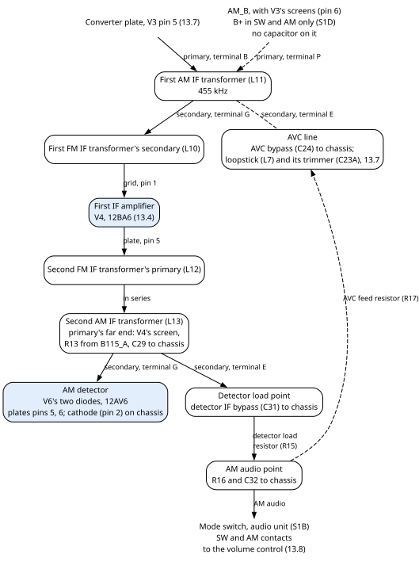
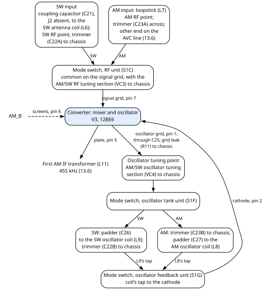
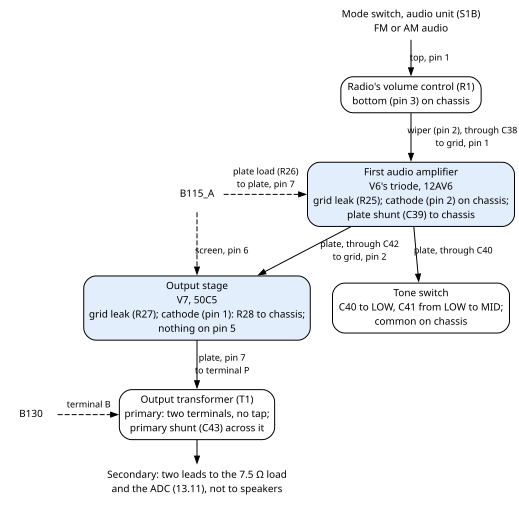
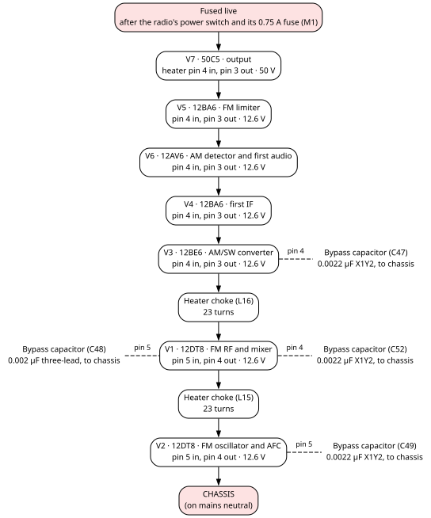
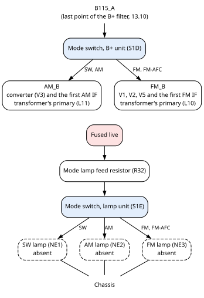
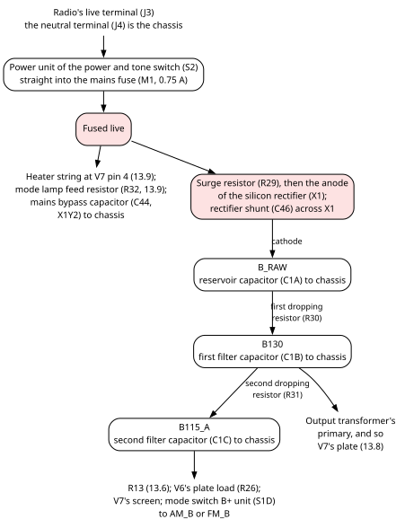

## 13.6 The 455 kHz AM IF and AM detector

In SW and AM, the converter (V3, section 13.7) sends its 455 kHz IF through the **first AM IF
transformer** (L11) to the first IF amplifier (V4), the tube the FM path also uses (section 13.4). From
V4 the IF goes through the **second AM IF transformer** (L13) to the **AM detector**: the two diodes
inside V6, a 12AV6. The detector recovers the audio from the IF and also makes the **AVC** voltage, which
sets the gain of V4 and, in AM, of the converter (section 13.1.5).

### 13.6.1 How it is joined

**First AM IF transformer (L11).** One end of its primary (terminal B) is on the converter's plate (V3
pin 5). The other end (terminal P) is on the AM supply, `AM_B`, together with the converter's screen
grids (V3 pin 6). The mode switch's B+ unit (S1D) puts B+ on `AM_B` in SW and AM only (section 13.1.6).
**No capacitor is on `AM_B`.** SAMS shows a 0.002 µF bypass there; this radio has none.

**Into V4.** The secondary of L11 is in series with the secondary of the first FM IF transformer (L10):
one end (terminal G) joins L10's secondary, and the other end (terminal E) is on the **AVC line**. V4's
control grid (pin 1) is at the far end of L10's secondary, so it returns to the AVC line through both
secondaries (section 13.4.1).

**Out of V4.** V4's plate feeds the primary of the second FM IF transformer (L12), then, in series, the
primary of the second AM IF transformer (L13). The far end of L13's primary shares a point with V4's
screen grid (pin 6). The **AM IF screen supply resistor** (R13, 1 kΩ) feeds that point from the B+
filter (`B115_A`, section 13.10), and its bypass capacitor (C29, 0.01 µF) joins it to the chassis. So
L13 and V4 have B+ in every position of the mode switch.

**Detector.** One end of L13's secondary (terminal G) goes to **both diode plates** of V6, pins 5 and 6.
The diodes' cathode is pin 2, which V6's triode shares, and it is on the chassis. The other end of the
secondary (terminal E) is the **detector load point**. From there:

- the detector IF bypass capacitor (C31, 100 pF) goes to the chassis;
- the detector load resistor (R15, 50 kΩ) leads to the **AM audio point**.

**AM audio point.** Three parts leave it: the detector DC return resistor (R16, 1 MΩ) and the audio IF
bypass capacitor (C32, 100 pF), both to the chassis, and the **AVC feed resistor** (R17, 2 MΩ) to the
AVC line. The AM audio goes to the SW and AM contacts of the mode switch's audio unit (S1B), whose common
feeds the top of the radio's volume control (section 13.8).

**AVC line.** It joins five things: the far end of the AVC feed resistor (R17), terminal E of L11's
secondary, one end of the AM loopstick (L7), one side of the AM antenna trimmer (C23A), and the **AVC
bypass capacitor** (C24, 0.05 µF), whose other side is on the chassis. In AM the converter's signal grid
returns to this line through the loopstick (section 13.7).

**Cans.** The cans of L11 and L13 are on the chassis.

### 13.6.2 Parts

The stage's parts, with their fitted and original values (section 13.1.3):

| Part | Fitted | Original | Notes |
|---|---|---|---|
| First AM IF transformer (L11) | IF can, 455 kHz | factory: AM IF (A); SAMS: 455 kHz | SAMS DCR: primary 22 Ω, secondary 22 Ω. Not retuned. |
| Second AM IF transformer (L13) | IF can, 455 kHz | factory: AM IF (B); SAMS: 455 kHz | SAMS DCR: primary 22 Ω, secondary 20 Ω. Not retuned. Its secondary feeds V6's diodes. |
| AM IF screen supply resistor (R13) | 1 kΩ | same | Feeds the far end of L13's primary and V4's screen. |
| AM IF screen supply bypass capacitor (C29) | 0.01 µF | same | |
| Detector IF bypass capacitor (C31) | 100 pF | same | |
| Detector load resistor (R15) | 50 kΩ | same | |
| Detector DC return resistor (R16) | 1 MΩ | same | |
| Audio IF bypass capacitor (C32) | 100 pF | same | |
| AVC feed resistor (R17) | 2 MΩ | same | |
| AVC bypass capacitor (C24) | 0.05 µF | 0.05 µF (factory and SAMS); SAMS: 50 V | No fitted voltage rating recorded. |
| AM detector (V6's two diodes) | 12AV6, new old stock | 12AV6 | The whole tube is in section 13.8. |
| Mode switch, audio unit (S1B) | one unit of the mode switch | SAMS part M5 | Section 13.1.6. |

For a replacement AM IF transformer, neither original gives what you need: the windings' coupling and
impedance, the pinout, the internal capacitor values, the bandwidth and the mechanical fit are all
unrecorded. The tuned frequency is 455 kHz.

### 13.6.3 How to check it

- **Coil resistance.** The parts table gives the SAMS DCR figures for L11 and L13, which describe the
  original parts. A DCR is a check for an open winding, not a measure of inductance or tuning.
- **Shared with FM.** An open secondary in L11, or an open primary in L13, also stops V4 on FM
  (section 13.4.4).
- **Tuning.** The AM IF transformers were not retuned when the FM path was tuned (section 13.1.1).
- **Detector.** V6's diode plates are pins 5 and 6, both on the same end of L13's secondary; the cathode,
  pin 2, is on the chassis.

## 13.7 AM and SW input, converter (V3, 12BE6) and the SW and AM local oscillator

V3 is a **pentagrid converter**: one tube with five grids that is both the mixer and the local oscillator
for AM and SW. Its oscillator section runs on its first grid and cathode. The station enters on its third
grid, the **signal grid**. The IF, 455 kHz, leaves from its plate into the first AM IF transformer (L11).
The mode switch picks the input coil and the oscillator coil for each band. The input coil is the
ferrite **loopstick** (a ferrite rod carrying an antenna winding) in AM, and the SW antenna coil in SW.
V3 takes its B+ from `AM_B`, so it works only in SW and AM.

**The external SW antenna terminal (J2) is not fitted; the internal loopstick antenna (L7) is.** Every
other input part is fitted too: the SW coupling capacitor (C21), the SW antenna coil (L6) and its trimmer
(C22A), and the loopstick's trimmer (C23A).

SAMS gives the bands as 540 to 1620 kHz for AM (the loopstick) and 3.5 to 9 MHz for SW (the SW antenna
coil).

The stage has its own **trimmers** and **padders**, the small capacitors that set its alignment and
tracking (section 13.1.3).

### 13.7.1 How it is joined

**SW input.** The SW antenna coupling capacitor (C21) has one lead where the SW antenna terminal (J2)
would be; nothing else is on that lead. Its other lead goes to one end of the primary of the SW antenna
coil (L6); the other end of that primary is on the chassis. One end of L6's secondary is the **SW RF
point**, which the SW antenna trimmer (C22A) joins to the chassis, and which goes to the SW contact of the
mode switch's RF unit (S1C). The other end of the secondary is on the chassis.

**AM input.** One end of the loopstick (L7) is the **AM RF point**, which goes to the AM contact of S1C.
The other end is on the AVC line (section 13.6). The AM antenna trimmer (C23A) sits across the loopstick,
from the AVC line to the AM RF point.

**Signal grid.** The common of S1C, the AM/SW RF tuning section (VC3, whose other side is on the
chassis) and V3's signal grid (pin 7) are one point. In SW, S1C puts the SW RF point on it; in AM, the AM
RF point; in FM and FM-AFC, nothing. So in AM the grid returns to the AVC line through the loopstick,
and in SW it returns to the chassis through the SW coil's secondary.

**Plate and screens.** The plate (pin 5) goes to the primary of the first AM IF transformer (L11). The
screen grids (pin 6) are on `AM_B` with the other end of that primary. No capacitor is on `AM_B`
(section 13.6.1).

**Oscillator grid.** The oscillator grid (pin 1) goes to the chassis through the oscillator grid leak
resistor (R11, 20 kΩ; grid leak: section 13.3.1). The grid also goes through the oscillator feedback
capacitor (C25, 100 pF) to the **oscillator tuning point**.

**Oscillator tuning point.** It joins C25, the AM/SW oscillator tuning section (VC4, whose other side is
on the chassis) and the common of the mode switch's oscillator tank unit (S1F).

- **In SW**, S1F goes through the SW oscillator padder (C26, 0.003 µF) to the top of the SW oscillator
  coil (L9). The SW oscillator trimmer (C22B) joins that top to the chassis.
- **In AM**, S1F goes to a point that the AM oscillator trimmer (C23B) joins to the chassis. From there
  the AM oscillator padder (C27, 350 pF) leads to the top of the AM oscillator coil (L8).

The bottoms of both oscillator coils are on the chassis.

**Cathode.** The cathode (pin 2) goes only to the common of the mode switch's oscillator feedback unit
(S1G). In SW, S1G puts it on the tap of the SW oscillator coil (L9); in AM, on the tap of the AM
oscillator coil (L8). In FM and FM-AFC the cathode is connected to nothing, and the tube has no B+.

**Heater.** The heater is on pins 3 and 4, in the series string (section 13.9).

### 13.7.2 V3's pins

The table gives each of V3's pins and what it is joined to.

| Pin | What it is | Joined to |
|---|---|---|
| 1 | oscillator grid (grid 1) | grid leak (R11) to chassis; feedback capacitor (C25) to the oscillator tuning point |
| 2 | cathode | oscillator feedback unit (S1G) only: SW oscillator coil's tap in SW, AM oscillator coil's tap in AM |
| 3 | heater | heater string, toward the FM RF tube's heater through a heater choke (L16) |
| 4 | heater | heater string, from the first IF tube's heater; bypass capacitor (C47) to chassis |
| 5 | plate | primary of the first AM IF transformer (L11) |
| 6 | screen grids (grids 2 and 4) | `AM_B`, with the other end of L11's primary |
| 7 | signal grid (grid 3) | RF unit's common (S1C) and the AM/SW RF tuning section (VC3) |

### 13.7.3 Parts

The stage's parts, with their fitted and original values (section 13.1.3):

| Part | Fitted | Original | Notes |
|---|---|---|---|
| Converter tube (V3) | 12BE6 | 12BE6 | |
| SW antenna terminal (J2) | **absent** | factory: antenna terminal with a series coupling capacitor; SAMS: a terminal, no rating | The external SW antenna terminal (J2) is not fitted; the internal loopstick antenna (L7) is. |
| SW antenna coupling capacitor (C21) | 450 pF | same | Several listed substitutes, Sprague among them, are 470 pF. The listed substitutes are DC-rated and give no safety class for an antenna input on a mains-connected chassis. |
| SW antenna coil (L6) | two-winding coil | factory: two-winding SW matching coil; SAMS: DCR 0.3 Ω each winding, band 3.5–9 MHz | Inductance not given. |
| SW antenna trimmer (C22A) | trimmer | no value in either original | Range and dielectric not specified. Part of the band alignment: do not choose one by appearance. |
| AM loopstick (L7) | loopstick | factory: ferrite bar with antenna winding; SAMS: DCR 0.6 Ω, band 540–1620 kHz | Inductance not given. |
| AM antenna trimmer (C23A) | trimmer | no value in either original | As the SW antenna trimmer. |
| AM/SW RF tuning section (VC3) | section of the four-section tuning capacitor | part of SAMS's tuning assembly M2; no range given | Serves both SW and AM. Turns with the other three sections of the tuning capacitor. |
| Mode switch, RF unit (S1C) | one unit of the mode switch | SAMS part M5 | Section 13.1.6. |
| Oscillator grid leak resistor (R11) | 20 kΩ | same | |
| Oscillator feedback capacitor (C25) | 100 pF | same | |
| AM/SW oscillator tuning section (VC4) | section of the four-section tuning capacitor | part of SAMS's tuning assembly M2; no range given | Serves both SW and AM. |
| Mode switch, oscillator tank unit (S1F) | one unit of the mode switch | SAMS part M5 | Section 13.1.6. |
| SW oscillator padder (C26) | 0.003 µF | 0.003 µF (3000 pF), SAMS: ±5 % | A stable, low-loss RF capacitor. The listed substitute is silvered mica, 500 V. The fitted part's type and rating are not recorded. |
| SW oscillator trimmer (C22B) | trimmer | no value in either original | As the SW antenna trimmer. |
| SW oscillator coil (L9) | tapped coil | factory: tapped oscillator coil; SAMS: DCR 0.3 Ω and 0.1 Ω sections | |
| AM oscillator padder (C27) | 350 pF | same | **Do not round it to 330 pF**: the padder sets the tracking. Sprague 5GA-T35 is 350 pF; Aerovox DI-330 and other listed substitutes are not. |
| AM oscillator trimmer (C23B) | trimmer | no value in either original | As the SW antenna trimmer. |
| AM oscillator coil (L8) | tapped coil | factory: tapped oscillator coil; SAMS: DCR 4.6 Ω and 0.9 Ω sections | SAMS: on the listed Merit, Miller and Stancor substitutes, ignore the extra tap. |
| Mode switch, oscillator feedback unit (S1G) | one unit of the mode switch | SAMS part M5 | Section 13.1.6. |

The AVC bypass capacitor (C24) is in section 13.6.

### 13.7.4 How to check it

- **Coil resistance.** SAMS gives these DCRs for the original coils: the SW antenna coil (L6) 0.3 Ω each
  winding; the loopstick (L7) 0.6 Ω; the AM oscillator coil (L8) 4.6 Ω and 0.9 Ω for its two sections;
  the SW oscillator coil (L9) 0.3 Ω and 0.1 Ω. A DCR finds an open winding; it does not measure
  inductance.
- **The mode switch.** With the cord out, the mode switch's RF, oscillator tank and oscillator feedback
  units (S1C, S1F, S1G) each join their common to their SW contact in SW and their AM contact in AM.
  In FM and FM-AFC they join it to nothing (section 13.1.6).
- **Alignment.** The AM and SW path was not retuned when the FM path was (section 13.1.1). No alignment
  figures for the trimmers are recorded.

## 13.8 The audio amplifier (V6, 12AV6, and V7, 50C5), tone switch and output transformer

The audio picked by the mode switch's audio unit (S1B) reaches the top of the radio's **volume
control** (R1). Its wiper drives the triode inside V6, the **first audio amplifier**, which raises the
audio's voltage. V7, a 50C5 **beam power tube** (a tube built to deliver power to a load), is the
**output stage**: it drives the primary of the **output transformer** (T1). A **tone switch** can join one
or two small capacitors from V6's plate to the chassis, which takes some of the treble away. V6 and V7
have B+ in every position of the mode switch.

### 13.8.1 How it is joined

**Volume control (R1).** Its top (pin 1) comes from the common of the audio unit (S1B). Its bottom
(pin 3) is on the chassis. Its wiper (pin 2) goes through the grid coupling capacitor (C38, 0.01 µF) to
V6's triode grid (pin 1). The audio grid leak resistor (R25, 2 MΩ) joins that grid to the chassis.

**V6's triode.** The cathode (pin 2), shared with the AM detector diodes, is on the chassis. The plate
(pin 7) is fed from the B+ filter (`B115_A`) through the audio plate load resistor (R26, 250 kΩ). Three
more parts leave the plate: the audio plate shunt capacitor (C39, 100 pF) to the chassis, the output
coupling capacitor (C42, 0.01 µF) to V7's grid, and the first tone capacitor (C40).

**Tone switch.** The first tone capacitor (C40, 0.002 µF) runs from V6's plate to a point the tone switch
calls LOW. The second tone capacitor (C41, 0.002 µF) runs from LOW to a point called MID. The tone
unit's common is on the chassis. The table shows what each tone position switches in:

| Tone position | What it switches in, from V6's plate to the chassis |
|---|---|
| H (high) | nothing: the H contact is connected to nothing |
| M (medium) | C40 and C41 in series: 0.001 µF |
| L (low) | C40 alone: 0.002 µF |

The factory drawing and SAMS agree on this. SAMS numbers the switch's lugs 13 for the common, 2 for OFF,
3 for H, 4 for M and 5 for L. The letters H, M and L above are the drawing's; no record maps them to the
physical lugs.

**V7.** The control grid (pin 2) takes the audio from C42 and returns to the chassis through the output
grid leak resistor (R27, 500 kΩ). The cathode (pin 1) goes to the chassis through the output cathode
resistor (R28, 150 Ω 1 W); nothing else is on the cathode. The screen grid (pin 6) is on the B+ filter
(`B115_A`). The plate (pin 7) goes to one end of the output transformer's primary (terminal P) and to the
primary shunt capacitor (C43, 0.0047 µF). **Nothing is wired to pin 5.**

**Output transformer (T1).** Its primary has **two terminals and no tap**. Terminal P is on V7's plate.
Terminal B is on `B130`, the first filtered point of the B+ supply (section 13.10), and C43 sits across
the two. The secondary's two leads leave the radio for the ADC (section 13.11).

**SP1 and SP2** are the radio's original speakers as drawn by the factory, in series across the
secondary. In this machine the radio's output feeds the 7.5 Ω load and the ADC, not speakers.

**Heaters.** V6's heater is on pins 3 and 4, V7's on pins 3 and 4, both in the series string
(section 13.9).

### 13.8.2 V6's and V7's pins

The table gives each pin of both tubes and what it is joined to.

| Pin | V6, 12AV6 | Joined to | V7, 50C5 | Joined to |
|---|---|---|---|---|
| 1 | triode grid | grid coupling capacitor (C38) from the volume wiper; grid leak (R25) to chassis | cathode | output cathode resistor (R28) to chassis |
| 2 | cathode, shared by the triode and both diodes | chassis | control grid | output coupling capacitor (C42); grid leak (R27) to chassis |
| 3 | heater | heater string, toward the first IF tube's heater | heater | heater string, toward the limiter's heater |
| 4 | heater | heater string, from the limiter's heater | heater | the fused live: the start of the heater string |
| 5 | diode plate | second AM IF transformer's secondary (L13), terminal G | second control-grid pin | nothing |
| 6 | diode plate | the same point as pin 5 | screen grid | B+ filter (`B115_A`) |
| 7 | triode plate | plate load (R26) from `B115_A`; C39, C42, C40 | plate | output transformer primary, terminal P; C43 |

The 50C5's published ratings: plate at most 150 V, screen at most 130 V, plate dissipation 7 W, screen
dissipation 1.4 W.

### 13.8.3 Parts

The stage's parts, with their fitted and original values (section 13.1.3):

| Part | Fitted | Original | Notes |
|---|---|---|---|
| AM detector and first audio tube (V6) | 12AV6, new old stock | 12AV6 | |
| Output tube (V7) | 50C5 | 50C5 | |
| Radio's volume control (R1) | 500 kΩ potentiometer | 500 kΩ (factory and SAMS); SAMS: ½ W or less | Audio taper, as the original specification infers from its listed substitutes. No power switch is drawn on it. Sits at about one eighth of its travel in normal use (section 13.1.2). For a replacement, measure the shaft, flat, bushing and rotation. |
| Grid coupling capacitor (C38) | 0.01 µF | 0.01 µF; SAMS: at least 450 V | A low-leakage coupling capacitor. The listed film substitute is 600 V, ±10 %. |
| Audio grid leak resistor (R25) | 2 MΩ | same | |
| Audio plate load resistor (R26) | 250 kΩ | same | |
| Audio plate shunt capacitor (C39) | 100 pF | same | |
| Output coupling capacitor (C42) | 0.01 µF | 0.01 µF; SAMS: at least 450 V | As the grid coupling capacitor. |
| Output grid leak resistor (R27) | 500 kΩ | same | |
| Output cathode resistor (R28) | 150 Ω, 1 W | same; SAMS: 1 W | Use at least 1 W, with room around it for the heat. |
| First tone capacitor (C40) | 0.002 µF | same | |
| Second tone capacitor (C41) | 0.002 µF | same | |
| Power and tone switch (S2) | one switch: a tone unit and a power unit | SAMS part M6; factory: OFF, H, M, L, with a linked power contact | No part number or contact rating is listed. A replacement needs mains-rated contacts and insulation, the same contact sequence, shaft and mounting. The power unit is in section 13.10. |
| Output transformer (T1) | output transformer, two-terminal primary, no tap | factory: single-ended, two-terminal primary, two speakers in series; SAMS: part 38.11.1, 7000 Ω primary tapped at 2500 Ω, 6–8 Ω secondary | The fitted transformer has the factory form. Its impedances and DCRs are not recorded. SAMS's DCRs (active primary 176 Ω, unused section 146 Ω, secondary 0.9 Ω) describe SAMS's tapped version, not the fitted part. Do not apply SAMS's full-primary 7000 Ω to its active tap. |
| Primary shunt capacitor (C43) | 0.0047 µF | 0.005 µF (factory and SAMS); SAMS: at least 450 V | No fitted voltage rating recorded. For a replacement, also consider its pulse and transient rating. |
| Speakers (SP1, SP2) | not on the output: it feeds the 7.5 Ω load and the ADC | factory: two speakers in series; SAMS: 4 × 6 inch, permanent magnet, 3–4 Ω each, 6–8 Ω the pair | The radio's original speakers as drawn by the factory. |

### 13.8.4 How to check it

- **Tone switch.** With the cord out: in L, 0.002 µF (C40) is between V6's plate and the chassis; in M,
  0.001 µF (C40 and C41 in series); in H, neither.
- **The output transformer.** Its primary has two terminals only. SAMS's DCR figures do not describe it.
- **V7, pin 5.** Nothing is wired to it.
- **Volume.** The radio's own volume control belongs at about one eighth of its travel. Higher settings
  make the sound too loud further down the chain (chapter 6, section 6.8).

## 13.9 The series heater string, the mode supply and the indicator lamps

The seven tube heaters are wired **in series**, one after the other, from the fused live to the
chassis, so one current flows through all of them. Every tube here has a 0.15 A heater, the usual heater
current of AC/DC sets. The 50C5 has a 50 V heater, the six others 12.6 V each (section 13.1.4).
Because the string is one chain, **one open heater or choke stops all seven heaters**. The same switch
unit that sends B+ to the AM or the FM stages (S1D) and the unit that would light a mode lamp (S1E) are
also described here.

### 13.9.1 The heater string

The order was checked on the chassis:

| Order | Tube or part | In | Out | At the junction after it |
|---|---|---|---|---|
| 1 | output tube V7, 50C5 | pin 4, on the fused live | pin 3 | |
| 2 | limiter V5, 12BA6 | pin 4 | pin 3 | |
| 3 | detector and first audio tube V6, 12AV6 | pin 4 | pin 3 | |
| 4 | first IF tube V4, 12BA6 | pin 4 | pin 3 | the heater-string bypass capacitor (C47) to chassis |
| 5 | converter V3, 12BE6 | pin 4 | pin 3 | |
| 6 | heater choke (L16) | | | the three-lead heater bypass capacitor (C48) to chassis |
| 7 | FM RF and mixer tube V1, 12DT8 | pin 5 | pin 4 | a heater bypass capacitor (C52) to chassis |
| 8 | heater choke (L15) | | | a heater bypass capacitor (C49) to chassis |
| 9 | FM oscillator and AFC tube V2, 12DT8 | pin 5 | pin 4, **on the chassis** | |

The two **heater chokes** (L15, L16) are RF chokes: coils that pass the heater current but block radio
frequencies. The choke between V1 and V2 (L15) has a bypass capacitor to the chassis on each side (C52
and C49). The choke between V3 and V1 (L16) has one, on V1's side (C48); its V3 side has none. With the
heater-string bypass capacitor at V3's pin 4 (C47), the string has four bypass capacitors. V1 sits
between the two chokes, and V2 is the last tube: its pin 4 is the chassis end of the whole string. The
internal shields of both 12DT8s (pin 9) are on the chassis.

### 13.9.2 Mode supply

The mode switch's B+ unit (S1D) has its common on the B+ filter (`B115_A`). It puts B+ on `AM_B` in SW
and AM, and on `FM_B` in FM and FM-AFC. Section 13.1.6 lists what each supply feeds.

### 13.9.3 Indicator lamps

The mode lamp feed resistor (R32, 50 kΩ) runs from the fused live to the common of the mode switch's
lamp unit (S1E). S1E sends that feed to the SW lamp (NE1) in SW, the AM lamp (NE2) in AM, and the FM lamp
(NE3) in FM and FM-AFC. Each lamp's other side goes to the chassis.

**The neon bulbs NE1, NE2 and NE3 are absent from this radio.** R32 and the S1E contacts are fitted.

### 13.9.4 Parts

The stage's parts, with their fitted and original values (section 13.1.3):

| Part | Fitted | Original | Notes |
|---|---|---|---|
| Heater choke between V3 and V1 (L16) | RF heater choke | factory: series heater RF choke; SAMS: 23 turns | 23 turns alone does not define a replacement: the winding's diameter, length, wire gauge, core, current and insulation rating are not recorded. |
| Heater choke between V1 and V2 (L15) | RF heater choke | factory: series heater RF choke; SAMS: 23 turns | As the choke between V3 and V1. |
| Heater-string bypass capacitor (C47), at V3's pin 4 | 0.0022 µF, safety class X1Y2 | 0.002 µF (factory and SAMS) | Replaced the original. A safety-rated part (chapter 2, section 2.4); no voltage rating recorded. |
| Heater bypass capacitor (C48), at V1's pin 5 | 0.002 µF, three-lead ceramic, the original part | 0.002 µF (factory and SAMS) | Middle lead to chassis (section 13.1.3). |
| Heater bypass capacitor (C52), at V1's pin 4 | 0.0022 µF, safety class X1Y2 | not recorded | Replaced the original part, whose value is not recorded. A safety-rated part (chapter 2, section 2.4); no voltage rating recorded. |
| Heater bypass capacitor (C49), at V2's pin 5 | 0.0022 µF, safety class X1Y2 | 0.002 µF (factory and SAMS) | Replaced the original. A safety-rated part (chapter 2, section 2.4); no voltage rating recorded. |
| Mode switch, B+ unit (S1D) | one unit of the mode switch | SAMS part M5 | Section 13.1.6. |
| Mode switch, lamp unit (S1E) | one unit of the mode switch, contacts fitted | SAMS part M5 | Section 13.1.6. |
| Mode lamp feed resistor (R32) | 50 kΩ | same | Original wattage not printed. Work out the lamp's voltage and current, and the resistor's dissipation, before you buy one. |
| SW lamp (NE1) | **absent** | a neon lamp, sharing the 50 kΩ feed resistor | Neither original gives a lamp model, striking or running voltage, current, size or brightness. |
| AM lamp (NE2) | **absent** | as the SW lamp | |
| FM lamp (NE3) | **absent** | as the SW lamp | Lit in FM and FM-AFC. |

A safety marking alone does not make a part equivalent at RF: match its construction and its place on
the chassis.

### 13.9.5 How to check it

- **All heaters cold.** With the cord out, check the string end to end, in the order of the table in
  section 13.9.1: each heater, then each choke. One open part breaks the whole chain.
- **The string's ends.** V7's pin 4 is on the fused live; V2's pin 4 is on the chassis.
- **The two 12DT8s.** V1 is the tube between the two chokes; V2 is the tube whose heater returns to the
  chassis.
- **The three-lead capacitor (C48).** Its two outer leads read 0 Ω to each other, and the middle lead
  goes to the chassis.

## 13.10 The original transformerless AC supply and B+

"Original" here means the radio's own supply, not part of Ambersong; this section describes it as
fitted now. The set has no mains transformer. Its live terminal goes through the radio's power switch
and fuse to the **fused live**, which feeds the heater string (section 13.9) and the B+ supply. The
neutral terminal **is** the chassis.

The **B+** is made by one silicon diode used as a **half-wave rectifier**: it passes only one half of
each mains cycle. Three electrolytic capacitors then smooth it, with two **dropping resistors** between
them (series resistors that lower and filter the supply).

Everything in this section is connected to the mains: read chapter 2, section 2.1, first.

### 13.10.1 How it is joined

**Mains in.** The radio's live terminal (J3) goes to the input of the power unit of the power and tone
switch (S2). That unit's output goes straight into the mains fuse (M1, 0.75 A), with no wire between
them. The fuse's output is the **fused live**. The radio's neutral terminal (J4) is the chassis itself.
Which lug of S2 carries the power contact is not recorded.

**From the fused live**, four things leave:

- the heater string, at V7's pin 4 (section 13.9);
- the mode lamp feed resistor (R32, section 13.9);
- the **mains bypass capacitor** (C44, 0.01 µF, safety class X1Y2), to the chassis;
- the **surge resistor** (R29, 28 Ω 3 W), to the rectifier.

**Rectifier.** R29 goes to the anode of the silicon rectifier (X1). Its cathode is the raw B+ point,
`B_RAW`. The rectifier shunt capacitor (C46, 0.0047 µF) sits across the rectifier.

**Filter.** Each B+ point has its own 47 µF capacitor, + to the point and − to the chassis:

| Point | Its capacitor | Reached through | Feeds |
|---|---|---|---|
| `B_RAW` | reservoir capacitor (C1A) | the rectifier (X1) | the first dropping resistor only |
| `B130` | first filter capacitor (C1B) | first dropping resistor (R30, 150 Ω 5 W) | the output transformer's primary, and so V7's plate (section 13.8); the second dropping resistor |
| `B115_A` | second filter capacitor (C1C) | second dropping resistor (R31, 300 Ω 1 W) | the AM IF screen supply resistor (R13, section 13.6); V6's plate load (R26); V7's screen grid; the mode switch's B+ unit (S1D), which feeds `AM_B` or `FM_B` (section 13.1.6) |

The **reservoir capacitor** is the first one after the rectifier: it holds the B+ up between the
rectifier's pulses.

**The names are not voltages.** The numbers in `B130` and `B115_A` are the SAMS data's nominal names.
No B+ voltage of this radio is recorded.

**Two coils are gone.** Two of the radio's original coils, L17 and L18, were removed by accident. The
external mains line filter took their place (chapter 5, section 5.2). What they were is not recorded.

### 13.10.2 Parts

The stage's parts, with their fitted and original values (section 13.1.3):

| Part | Fitted | Original | Notes |
|---|---|---|---|
| Radio's live terminal (J3) | fitted | no original specification recorded | Takes the switched live through the line filter (section 13.11). |
| Radio's neutral terminal (J4) | fitted | no original specification recorded | It is the chassis. Takes neutral through the line filter. |
| Power and tone switch, power unit (S2) | one switch with the tone unit (section 13.8) | SAMS part M6: a separate AC power pole and tone contacts | Which lug carries the power contact is not recorded. |
| Mains fuse (M1) | 0.75 A; type and voltage not recorded | factory: no fuse drawn; SAMS: 0.75 A, type GJV, in a different position, omitted in some versions | Here it sits between the power switch and the fused live. The original specification's selection note: use a matching speed, voltage, breaking capacity and package. |
| Mains bypass capacitor (C44) | 0.01 µF, safety class X1Y2 | factory: 0.01 µF, no voltage, tolerance or safety class given | SAMS numbers its version of this bypass C45; SAMS's 400 V for it does not set this part's rating. This radio has no C45. A safety-rated part (chapter 2, section 2.4). |
| Surge resistor (R29) | 28 Ω, 3 W | same; SAMS: 3 W | Use at least 3 W, with room for the heat. SAMS's listed substitute, IRC MR 2, is a configurable 10 W wirewound assembly, not a fixed 28 Ω part. |
| Rectifier (X1) | silicon rectifier; part number and rating not recorded | factory: silicon rectifier; SAMS: rating not printed, output current measured at 0.090 A | Choose at least the 400 V, 0.5 A class of the period, with suitable surge, heat and leakage ratings. A higher rating alone does not give the same B+. One listed substitute, the RCA 1N2861, carries a conflicting 105 V AC capacitor-input rating. |
| Rectifier shunt capacitor (C46) | 0.0047 µF | 0.005 µF (factory and SAMS); SAMS: at least 450 V | No fitted voltage rating recorded. Consider its pulse and transient rating. |
| Reservoir capacitor (C1A) | 47 µF, Rubycon, 315 V, a separate capacitor | 40 µF, 150 V, one section of a common-negative can (factory and SAMS) | Match polarity, ripple current, temperature and start-up voltage. |
| First dropping resistor (R30) | 150 Ω, 5 W | 150 Ω; SAMS: 2 W | |
| First filter capacitor (C1B) | 47 µF, Rubycon, 315 V, a separate capacitor | 40 µF, 150 V, one section of the same can | As the reservoir capacitor. |
| Second dropping resistor (R31) | 300 Ω, 1 W | same; SAMS: 1 W | |
| Second filter capacitor (C1C) | 47 µF, Rubycon, 315 V, a separate capacitor | 40 µF, 150 V, one section of the same can | As the reservoir capacitor. |

### 13.10.3 How to check it

All with the cord out.

- **Fuse.** 0.75 A, between the power switch and the fused live.
- **Rectifier direction.** Anode toward the surge resistor (R29), cathode toward the reservoir
  capacitor (C1A).
- **Capacitor polarity.** The reservoir and the two filter capacitors (C1A, C1B, C1C) each have + on
  their B+ point and − on the chassis.
- **Safety parts.** The mains bypass capacitor (C44) is X1Y2 rated (chapter 2, section 2.4).

## 13.11 Where the tube radio meets Ambersong

Section 13.1.2 lists the meeting points. This section gives the radio's side of each.

**Mains.** The radio's live terminal (J3) takes the **switched live**, after the front power switch,
through the external mains line filter; its neutral terminal (J4) takes **neutral** through the same
filter. The filter sits under its own earthed Faraday cage. There is no isolation transformer. So the
radio needs both the front power switch and its own power switch (S2) on to run (chapter 5, section 5.2).
S2 is not on the front panel; where it sits, and which of its positions have power on, are not recorded.
No fuse is recorded on the machine's mains side; the tube radio has its own 0.75 A fuse (M1, section
13.10).

**Chassis.** Because J4 is the chassis, `CHASSIS` is on mains neutral. It is never joined to Earth, to
the Faraday cages or to the DC ground (chapter 2, section 2.3; chapter 5, section 5.3).

**Antenna.** The radio's FM input is a coax connector (J53, RG179 coax). It replaced the radio's original
simple wire antenna. Its centre goes through the antenna coupling capacitor (C3, X1Y1) to the FM RF
stage (section 13.2). Its shield is on Earth and reaches the chassis only through the antenna shield
capacitor (C51, 0.001 µF, X1Y2). The machine's antenna connector is J10, a BNC on the back panel. No
cable joining J10 to J53 is recorded (chapter 10, section 10.35). The antenna itself is in chapter 11;
the earth path is in chapter 5, section 5.4. On the AM and SW side, the external SW antenna terminal (J2) is not fitted; the
internal loopstick antenna (L7) is (section 13.7).

**Sound out.** The output transformer (T1) is one part: its primary is the radio's (section 13.8), its
secondary feeds Ambersong. The secondary's two leads carry `RAD_L` and `RAD_R`. A **7.5 Ω 5 W resistor**
(marked 5W7Ω5J) sits across them as the transformer's load. A shielded cable
takes them to the radio input jack at the ADC (J51). Which lead goes to which contact does not matter.
On the cable side of that jack the shield and foil are on the sleeve, `RAD_L` on the ring and `RAD_R` on
the tip. On its output side the sleeve and ring are on ground, and the tip goes into the 4.7 kΩ resistor
of the input attenuator. So the feed is mono: `RAD_L` goes to ground with the cable's shield and foil,
and `RAD_R` goes through the 4.7 kΩ (chapter 6, section 6.4; chapter 10, section 10.22).

**Volume.** Of the three volume controls in the chain, the radio's own (R1) is the first. It is not on
the front panel, and sits at about one eighth of its travel in normal use (chapter 6, section 6.8).

**FM calibration receiver.** Its antenna, a 30 cm wire bent in a U, lies over the FM oscillator section
inside the radio's cage. It is not connected to the radio (section 13.3; chapter 8, section 8.5).

## 13.12 When something is wrong

Find what you see in the left column; the right column says where to look first.

| You see | Where to look |
|---|---|
| Radio silent on every band; no heater warms up | The radio's own power switch (S2) and its fuse (M1). Then the heater string, end to end (section 13.9.5): one open heater or choke stops all seven. |
| Radio silent on every band; heaters warm | Parts every band shares: the B+ chain (section 13.10), the first IF tube (V4), V6 and V7, the volume control and the output transformer. |
| FM silent, SW and AM work | What runs only in FM and FM-AFC: the mode switch's B+ unit on `FM_B`, V1, V2, V5, and the FM windings of the IF transformers (sections 13.2 to 13.5). |
| SW and AM silent, FM works | What runs only in SW and AM: `AM_B`, the converter (V3), the AM windings of the IF transformers and V6's diodes (sections 13.6, 13.7). |
| FM works in FM but not in FM-AFC | The only difference between the two positions is the AFC-off unit (S1A). Look at the AFC path: the AFC feed from the ratio detector (section 13.5), the AFC triode and its grid network (section 13.3). |
| Radio too loud further down the chain | The radio's own volume control: it belongs at about one eighth of its travel (section 13.8). |
| Treble missing | The tone switch: L and M shunt treble to the chassis; H switches nothing in (section 13.8). |
